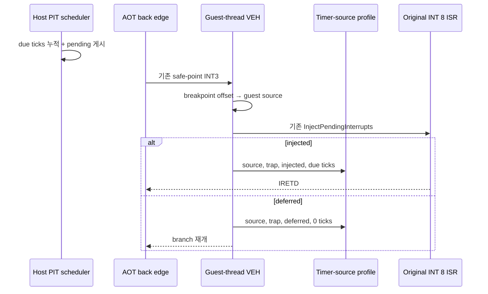

# 20260729-351 AOT timer source 귀속 / AOT timer-source attribution

## 한국어

### 1. 배경과 폐기한 접근

Task 347은 Release 60초 3회에서 `guest-run`의 `unaccounted`에서 보정한 예외
전이 비용을 빼고 AOT cache guest 실행을 중앙값 `60.72%`로 유도했습니다.
다음 질문은 이 값에서 원본 게임의 active work와 240Hz timer pacing이 각각
얼마인지였습니다.

처음에는 `SuspendThread`/`GetThreadContext`로 guest EIP를 7ms 및 19ms 간격으로
샘플링하는 프로토타입을 만들었습니다. 이 접근은 다음 검증에서 기각했습니다.

| 10초 dry run | cycle 기반 cache 유도 | cache EIP 표본 | capture 정지 비중 |
|---|---:|---:|---:|
| host poll loop, 7ms | 49.90% | 15.53% | 0.833% |
| 독립 sampler thread, 7ms | 56.04% | 22.37% | 1.385% |
| 독립 sampler thread, 19ms | 55.04% | 21.58% | 0.604% |

독립 thread 표본의 host EIP 50.0%가 정확히
`ntdll!NtWaitForSingleObject+0xC`였고 다른 syscall stub도 반복됐습니다.
이는 cross-thread suspend가 임의의 user instruction을 균일하게 포착하지 못하고
kernel 전이 지점에 편향되며, 빈번한 suspend가 게임 처리량도 교란한다는 증거입니다.
따라서 이 프로토타입은 코드에 남기지 않습니다.

### 2. 목표

1. guest thread를 정지시키지 않습니다.
2. 이미 240Hz IRQ0 전달을 위해 발생하는 timer safe-point trap에서 원본 back-edge
   source를 정확히 집계합니다.
3. 각 source가 실제로 소비한 PIT 만료 tick 수를 기록합니다.
4. 정적 디스어셈블리로 timer wait임이 확인된 source만 pacing으로 분류합니다.
5. `attributed_ticks × divisor / 1,193,280`으로 pacing wall time의 보수적 추정값을
   계산합니다.
6. 원본 실행 파일, timer ISR, IRETD, 게임 tick을 변경하지 않습니다.

### 3. 구조

### 4. 데이터 구조와 동시성

`Win32AotCodeCachePlacement`은 기존 breakpoint-offset set 옆에
`breakpoint_offset → guest_source` map을 유지합니다. 초기 image와 dynamic append가
같은 map을 갱신합니다. handler는 이미 정확한 safe-point breakpoint를 식별한 뒤 이
map으로 source를 찾습니다.

프로파일은 `REPIU_AOT_TIMER_SOURCE_PROFILE=1`에서만 활성화합니다. guest VEH에서 heap
할당이나 lock을 하지 않도록 1024-entry 고정 배열을 사용합니다. entry는 source,
trap/injected/deferred count, attributed tick count, first/last global tick을
기록합니다. 1024개를 넘는 새 source는 overflow count만 올립니다.

host scheduler는 만료 tick 수를 두 atomic에 포화 누적합니다.

- `last_timer_injection_ticks`: 기존 누적 진단값
- `timer_interrupt_due_ticks`: 아직 source에 귀속되지 않은 tick

공용 `InjectPendingInterrupts`는 모든 주입 성공에서
`timer_interrupt_due_ticks.exchange(0)`을 수행하고 소비 tick 수를 반환합니다.
natural VEH 주입은 원장만 정리하며 source에 귀속하지 않고, safe-point handler는
자기 호출이 반환한 tick만 source에 귀속합니다. 주입 보류 시에는 소비하지 않습니다. exchange와
동시에 새 host tick이 도착해도 이전 값은 현재 source, 이후 값은 다음 source에
남으므로 tick을 잃지 않습니다.

### 5. 해석

safe-point source는 back-edge라는 구조적 사실이지 자동으로 pacing을 뜻하지
않습니다. 다음을 모두 만족할 때만 timer pacing으로 확정합니다.

1. source가 반복적으로 injected tick을 소비합니다.
2. source basic block의 원본 디스어셈블리가 tick reader/global을 읽습니다.
3. tick 값 또는 그 차이를 한계값과 비교해 같은 loop로 돌아갑니다.

confirmed pacing time은 해당 source들의 attributed tick 합에 실제 PIT divisor를
곱해 계산합니다. 이는 그 tick interval 전체를 source의 wait에 귀속하므로, loop에
진입하기 전 interval 일부가 active work였다면 상한입니다. 반대로 coalesced tick도
모두 보존하므로 poll 지연 때문에 pacing 시간을 누락하지 않습니다.

이 계측은 `unaccounted` 전체를 직접 샘플링하지 않습니다. 따라서 pacing을 뺀 나머지를
곧바로 active guest code라고 단정하지 않고, Task 347 유도값에서 확인된 pacing
상한을 분리한 값으로만 표현합니다.

### 6. 출력과 검증

종료 summary는 profile enabled, entry/overflow, attributed tick total, 그리고 tick
상위 source별 trap/injected/deferred/attributed-ticks/first-tick/last-tick을 출력합니다.

1. 합성 probe로 enable 정책, source 병합, tick 귀속, deferred 비소비, overflow,
   count 정렬을 검증합니다.
2. Win32 x86 Release loader와 AOT probe를 빌드합니다.
3. Release 60초 3회를 같은 semantic invariant로 실행합니다.
4. 상위 source를 `repiu_aot_probe PIU.EXE <address>`로 디스어셈블합니다.
5. confirmed pacing source의 tick/time 비중과 Task 347 guest-cache 유도값의 잔여를
   `current-execution-frontier.md`에 기록합니다.
6. profile ON의 프레임을 Task 347 범위와 비교해 계측 교란이 작은지 확인합니다.

### 7. 구현 결과

구현은 설계대로 fixed 1,024-entry profile과 공용 injector의 소비 tick 반환을
사용합니다. 종료 시에는 일부 top-N이 아니라 기록된 source 전체를 정렬 출력해 낮은
빈도의 wait source도 정적 분류할 수 있게 했습니다.

60초 Release 세 번에서 overflow는 0, entry는 99/94/106개였습니다. 전체 safe-point
delivery의 주기 환산 중앙값 23.575초는 pacing으로 사용하지 않았습니다. 정적 조건을
모두 만족한 `0x0303DE89`만 confirmed pacing으로 분류했고, 중앙값 1,416 tick은
5.900초, wall-clock 9.83%의 상한입니다. profile-on 프레임 중앙값 1,114는 Task 347
1,124보다 0.89% 낮고 기존 1,112~1,141 범위 안에 있습니다.

---

## English

### 1. Background and rejected approach

Task 347 derived a median `60.72%` AOT-cache guest-execution share by
subtracting calibrated exception-transition cost from the `guest-run`
unaccounted bucket. Task 351 first prototyped 7ms/19ms
`SuspendThread`/`GetThreadContext` sampling. It was rejected: three 10-second
dry runs derived roughly 50--56% cache time but sampled only 15.53--22.37%
inside the cache, while capture pauses consumed 0.604--1.385% of wall time and
materially disturbed frame throughput. Half of the independent-thread host
samples landed exactly at `ntdll!NtWaitForSingleObject+0xC`, with other syscall
stubs recurring. Cross-thread suspension is therefore kernel-boundary-biased,
not a uniform instruction sampler, and the prototype is not retained.

### 2. Design

Attribute the already-existing 240Hz timer-safe-point events instead. Initial
placement and every dynamic append maintain an exact
`breakpoint_offset -> guest_source` map beside the existing breakpoint set.
The guest-thread VEH handler identifies the source, runs the unchanged common
interrupt injector, and records whether the trap injected or deferred.

The host scheduler saturating-adds expired PIT ticks to an atomic pending-tick
counter. The common injector exchanges that counter to zero on every
successful injection and returns the consumed count. Natural VEH injections
clear the ledger without source attribution; a safe-point handler attributes
only the count returned by its own injector call. Deferred traps consume none.
A concurrent host add after the exchange remains for the next injection, so no
expiration is lost.

`REPIU_AOT_TIMER_SOURCE_PROFILE=1` enables a fixed 1024-entry, allocation-free
profile containing source, trap/injected/deferred counts, attributed ticks,
and first/last global tick. New sources beyond capacity increment overflow.
The original executable, ISR, IRETD path, and tick values remain unchanged.

### 3. Interpretation and verification

A safe-point source is merely a back edge. It becomes confirmed timer pacing
only when original disassembly also shows a tick reader/global, comparison
limit, and loop-back dependency. Confirmed pacing time is
`attributed_ticks * divisor / 1,193,280`; this preserves coalesced ticks but is
an upper bound when useful work occupied part of the interval before the wait.
The remaining Task 347 derived bucket is not automatically relabeled as active
guest code.

Verify enable policy, merging, deferred non-consumption, overflow, and ranking
with a synthetic probe; build the Win32 x86 Release targets; collect three
60-second runs under the normal semantic invariants; disassemble the leading
sources; and report confirmed pacing time plus the remaining derived-cache
bound. Compare profile-on frames with Task 347 to ensure low observer impact.

### 4. Implementation result

The implementation follows the fixed 1,024-entry profile and common-injector
consumed-tick return described above. Final reporting sorts every recorded
source rather than only a top-N subset so lower-frequency wait candidates
remain available for static classification.

Three 60-second Release runs had zero overflow and 99/94/106 entries. The
23.575-second median period conversion of all safe-point delivery contexts was
not treated as pacing. Only `0x0303DE89` satisfied every static condition; its
median 1,416 ticks give a 5.900-second, 9.83%-of-wall upper bound. Median
profile-on frames were 1,114, 0.89% below Task 347's 1,124 and still inside
its 1,112--1,141 run range.
