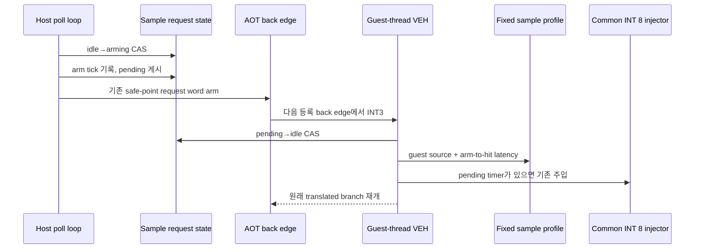

# 20260729-352 협력형 AOT back-edge 표본화 / Cooperative AOT back-edge sampling

## 한국어

### 1. 배경

Task 351은 Task 347의 guest 실행 유도값 60.72%에서 정적으로 확인된 240Hz timer
pacing 상한 9.83%p를 분리했습니다. 남은 50.89%p는 active/unresolved guest
실행이지만 주소와 phase별 분포는 아직 모릅니다.

7ms/19ms `SuspendThread`/`GetThreadContext` 표본화는 syscall 경계에 편향되고
처리량을 교란해 기각했습니다. 반대로 Task 351의 timer-source profile은 실제 interrupt
delivery source를 정확히 기록하지만 240Hz cadence와 timer 전달 여부에 결합되어
active guest의 독립 표본으로 사용할 수 없습니다.

이번 작업은 Task 348이 이미 생성한 flag 보존 back-edge guard를 재사용해 guest thread가
자기 VEH 문맥에서 source를 기록하는 협력형 표본화를 추가합니다.

### 2. 목표

1. guest thread를 suspend하거나 context를 읽고 쓰지 않습니다.
2. wall-clock과 독립적으로 jitter된 시점에 표본 요청을 게시합니다.
3. 요청 뒤 처음 만나는 등록 back edge의 원본 guest source를 기록합니다.
4. 요청부터 source 도달까지의 지연을 측정해 시간적 국소성을 검증합니다.
5. timer interrupt 계수와 timer-source profile을 sample-only trap으로 오염시키지 않습니다.
6. 원본 executable, 분기 의미, GPR, ESP, EFLAGS와 timer cadence를 변경하지 않습니다.

### 3. 구조

`REPIU_AOT_BACKEDGE_SAMPLE_PROFILE=1`에서만 활성화합니다. host poll loop는 첫 1초의
warm-up 뒤 xorshift32로 7~23ms 간격을 결정합니다. 고정 seed는 실행을 재현 가능하게
하고, 세 실행의 서로 다른 시작 phase가 cadence alias를 교차 검증합니다.



### 4. 요청 handshake와 timer 상호작용

`ThreadContext`의 sample request state는 다음 세 값만 사용합니다.

| 상태 | 의미 |
|---|---|
| 0 `idle` | 미처리 요청 없음 |
| 1 `arming` | host가 timestamp와 계수를 게시 중 |
| 2 `pending` | guest handler가 소비할 수 있음 |

host는 `0→1` CAS에 성공한 경우에만 arm tick과 arm count를 기록하고 release store로
2를 게시합니다. 이미 1 또는 2이면 coalesced count만 올립니다.

생성된 guard는 여전히 placement 소유 32-bit word가 0인지 한 번만 비교하지만, word의
bit 0은 timer, bit 1은 sample request로 분리합니다. 각 경로는 `InterlockedAnd`로
자기 bit만 지웁니다. pending 동안 host는 poll iteration마다 sample bit를 다시 arm한
뒤 request state를 재확인합니다. guest가 그 사이 2→0으로 소비했다면 host가 sample
bit를 다시 지워 stale request를 남기지 않습니다. 이 bit 분리는 natural timer
delivery가 sample request를 지우는 문제도 제거합니다.

safe-point handler는 `2→0` CAS에 성공할 때만 sample hit를 기록합니다. handler가
arming 상태를 본 경우 host가 게시를 끝내고 request를 다시 arm하므로 부분 게시값을
읽지 않습니다.

sample 요청과 timer 요청은 생성된 하나의 request guard를 공유하지만 profile은
분리합니다. handler 진입 전후의 `timer_interrupt_pending`과 실제 injector 결과로
timer event 여부를 판정합니다. sample-only trap은 back-edge sample profile에만
기록하고 기존 timer trap/deferred 계수와 Task 351 timer-source profile에는 넣지
않습니다.

### 5. profile

VEH hot path에서 할당과 lock을 피하기 위해 1,024-entry 고정 배열을 사용합니다.

source entry:

- guest source
- sample count
- latency total/max milliseconds
- first/last sample sequence

전체 profile:

- enabled, entry/overflow, hit count
- latency total/max
- latency histogram: `0`, `1`, `2`, `3~4`, `5~8`, `9~16`, `17~32`, `33+ ms`

host가 소유하는 arm/coalesced/request-state 계수는 `ThreadContext` atomic에 두고 종료
attempt에서 profile과 함께 snapshot합니다. 종료 시에만 전체 source를 sample count
순으로 정렬합니다.

### 6. 해석 제한과 판정 gate

이 표본은 임의 시점의 정확한 instruction pointer가 아니라 **임의 요청 뒤 처음 만난
등록 direct/conditional/fallthrough back edge**입니다. 따라서 return/indirect-only
구간과 긴 straight-line block은 다음 eligible back edge에 귀속됩니다. source share를
곧바로 wall-clock 비중으로 환산하지 않습니다.

다음 gate를 모두 통과할 때 주소 순위를 active guest의 phase anchor로 사용합니다.

| gate | 조건 | 의미 |
|---|---|---|
| S1 | `(arms - hits) <= 1`, overflow 0 | 요청 손실 없음 |
| S2 | latency p95 bucket `<=4ms` | 요청 시점과 source의 시간적 국소성 |
| S3 | profile-on frames가 Task 347 범위 또는 -5% 이내 | observer impact 제한 |
| S4 | 3회 상위 source/phase 순위가 반복 | cadence alias가 결론을 지배하지 않음 |

S2가 실패하면 결과는 back-edge rendezvous 분포로만 보고 active time 분해에는 사용하지
않습니다. 통과해도 50.89%p를 sample share로 기계적으로 나누지 않고, 정적
디스어셈블리로 source의 함수/phase를 확인해 다음 분석 대상을 고릅니다.

### 7. 검증

1. 합성 probe로 enable 정책, jitter 범위, 병합, 정렬, overflow, latency histogram을
   검증합니다.
2. Win32 x86 Release loader와 AOT probe를 빌드합니다.
3. 10초 smoke에서 arm/hit handshake와 sample-only timer 계수 분리를 확인합니다.
4. `REPIU_NATIVE_SAMPLING=0`으로 legacy suspend sampler를 끄고 Release 60초 3회를
   Task 347 semantic invariant로 실행합니다.
5. 상위 source를 원본 디스어셈블리로 분류하고 실행 간 안정성, latency gate,
   observer impact를 기록합니다.

### 8. 프로토타입 결과와 기각

프로토타입은 S1~S4의 수치 조건을 통과했습니다. 최종 bit 분리 구현의 Release 60초
세 번은 arm/hit 중앙값 2,599/2,599, overflow 0, p95 latency 0ms였습니다. 그러나
정적 source 검증에서 해석 계약이 성립하지 않았습니다.

세 실행 모두 1위인 `0x030F5F41`은 평균 20.19%의 sample을 받았지만 원본 코드는
다음 4-byte alignment prefix입니다.

```text
0x030F5F36  test al, 3
0x030F5F38  jz   0x030F5F43
0x030F5F3A  mov  [eax], dl
0x030F5F3C  inc  eax
0x030F5F3D  ror  edx, 8
0x030F5F40  dec  ecx
0x030F5F41  jnz  0x030F5F36
```

정렬될 때까지 최대 세 번만 반복하므로 active instruction residency의 20%를 차지할
수 없습니다. 표본은 임의 시점의 실행 위치가 아니라 host/guest 복귀 뒤 처음 만난
eligible back edge의 **topology와 호출 빈도**에 편향됐습니다. timer/sample bit를
분리하기 전에는 1위가 `0x0305C227`로 달라졌다는 사실도 request clear timing이 순위를
바꿀 수 있음을 보여줍니다.

최종 profile-on 프레임 중앙값은 1,221, 같은 바이너리·legacy sampler OFF control은
1,159로 +5.35%였습니다. 처리량 저하는 없었지만 추가 rendezvous가 실행 phase를
관찰 가능한 정도로 움직였습니다.

따라서 S1~S4만으로는 충분하지 않으며 “정적 loop work가 표본 비중과 양립 가능한가”라는
S5가 필요합니다. S5가 실패했으므로 이 방법은 active guest hotspot 계측으로
기각합니다. prototype 코드는 유지하지 않고 측정 증거와 설계만 남깁니다.

---

## English

### 1. Background and goals

Task 351 separated a statically confirmed 9.83-percentage-point upper bound
for 240 Hz timer pacing from Task 347's derived 60.72% guest share. The
remaining 50.89 percentage points are active/unresolved guest execution, but
their address and phase distribution is unknown.

Cross-thread 7/19 ms `SuspendThread` sampling was rejected for syscall-boundary
bias and throughput disturbance. Task 351's exact timer-delivery sources are
instead coupled to the 240 Hz interrupt cadence. This task reuses Task 348's
flag-preserving back-edge guard so the guest thread records its own source in
VEH without suspension or context access.

With `REPIU_AOT_BACKEDGE_SAMPLE_PROFILE=1`, the host posts requests after a
one-second warm-up at deterministic xorshift32-jittered 7--23 ms intervals.
The next registered direct, conditional, or fallthrough back edge enters the
existing sentinel and records its exact original guest source plus arm-to-hit
latency. The original executable, branch semantics, registers, flags, stack,
and timer cadence remain unchanged.

### 2. Handshake and timer interaction

The atomic request state is `idle`, `arming`, or `pending`. A host `0->1` CAS
owns publication of the arm timestamp and count, followed by a release store
to `pending`. A busy state increments only the coalesced count.

The emitted guard still compares one 32-bit placement word with zero, but bit
0 now represents timer work and bit 1 sample work. Each path clears only its
own bit with `InterlockedAnd`. While pending, the host rearms the sample bit
each poll iteration and then rechecks state; if the guest consumed `2->0`
concurrently, the host clears the stale sample bit. Timer delivery can no
longer erase a sample request.

The guest handler records a sample only after a successful `pending->idle`
CAS. Seeing `arming` is harmless because the host completes publication and
rearms the guard. Timer and sample requests share the generated guard, but
their accounting is separate: the handler uses pending state and the actual
injector result to keep sample-only traps out of existing timer counters and
the Task 351 timer-source profile.

### 3. Profile and interpretation

A fixed 1,024-entry allocation-free profile stores source, sample count,
latency total/max, and first/last sequence. Global latency uses buckets for
0, 1, 2, 3--4, 5--8, 9--16, 17--32, and 33+ ms. Arm, coalesced, and request
state remain atomic host/guest coordination fields and are copied into the
final attempt. Sorting occurs only during final reporting.

This is not an exact arbitrary-instruction sample. It observes the first
eligible back edge after an independent request, so return/indirect-only
regions and long straight-line blocks are attributed to a later anchor.
Source shares are not directly converted to wall-clock shares.

Use rankings as active-phase anchors only when arms exceed hits by at most one,
overflow is zero, the p95 latency bucket is at most 4 ms, profile-on frames
remain within Task 347's range or within 5%, and leading source/phase rankings
repeat across three runs. Otherwise retain the result only as a back-edge
rendezvous distribution.

### 4. Verification

Add synthetic coverage for enable policy, jitter bounds, aggregation, ranking,
overflow, and latency buckets; build Win32 x86 Release targets; verify the
handshake and sample-only timer separation in a ten-second smoke; then run
three 60-second Release measurements with the legacy suspend sampler disabled.
Disassemble and classify leading sources, and report latency, stability, and
observer impact before selecting the next implementation target.

### 5. Prototype result and rejection

The prototype passed the numeric S1--S4 gates. In the final bit-separated
three-run Release measurement, median arms/hits were 2,599/2,599, overflow was
zero, and p95 latency was 0 ms. Static source validation nevertheless broke
the interpretation contract.

`0x030F5F41` ranked first in all runs with a mean 20.19% share, but it is only
the byte prefix of a 4-byte alignment loop. It tests `AL & 3`, stores one byte,
increments the pointer, rotates the fill value, decrements the remaining
count, and repeats at most three times. It cannot plausibly own 20% of active
instruction residency. The sampler therefore observes topology and call
frequency at the first eligible back edge after host/guest return, not the
execution location at the randomized request time. Before timer/sample bits
were separated, `0x0305C227` ranked first instead, further showing sensitivity
to request-clear timing.

Median profile-on frames were 1,221 versus 1,159 in a same-binary,
legacy-sampler-off control, a +5.35% phase perturbation. S1--S4 are therefore
insufficient; a static plausibility gate S5 fails. Cooperative first-backedge
sampling is rejected for active-hotspot attribution, and no prototype code is
retained. Only the design and measurement evidence remain.
