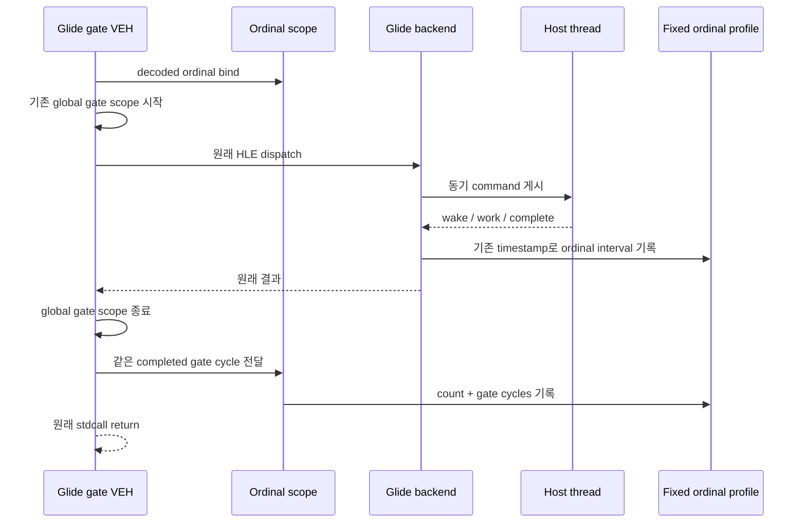

# 20260729-353 Glide ordinal 시간 귀속 / Glide ordinal time attribution

## 한국어

### 1. 배경

Task 352는 active guest hotspot을 찾기 위한 협력형 first-backedge 표본화가 topology에
편향됨을 확인하고 기각했습니다. 따라서 현재 첫 실행 가능 HLE 축은 Task 347에서
wall-clock 21.73%, Task 352 동일 바이너리 control에서 중앙값 22.74%인 Glide
gate입니다.

기존 Task 333 계측은 control 세 실행에서 gate rendezvous를 다음처럼 안정적으로
분해합니다.

| run | gate share | wake | host work | complete | mean rendezvous |
|---|---:|---:|---:|---:|---:|
| 1 | 22.67% | 31.19% | 39.94% | 28.44% | 365,132 cycle |
| 2 | 22.95% | 30.62% | 41.18% | 27.79% | 371,910 cycle |
| 3 | 22.74% | 30.46% | 41.28% | 27.84% | 368,310 cycle |

호출 횟수도 ordinal별로 존재하지만 시간은 전체 합계뿐입니다. 예를 들어 한 실행에서
`grDrawTriangle`은 14,560회, 여러 state setter는 각각 5천~7천 회 호출됩니다. count만
보고 합치거나 생략할 API를 고르면 host work와 thread handoff 비용을 구분할 수 없고,
원본 Glide 호출 의미를 훼손할 위험이 있습니다.

### 2. 목표

1. 각 Glide ordinal의 전체 gate cycle, 호출 수, 최대 cycle을 정확히 누적합니다.
2. 같은 ordinal에 속한 기존 queue/wake/work/complete/total rendezvous delta를 함께
   귀속합니다.
3. gate 전체 계측과 ordinal 합의 coverage를 검사해 누락을 드러냅니다.
4. 기본 실행에서는 완전히 꺼지고, 원본 executable과 Glide ABI·상태·호출 순서를
   변경하지 않습니다.
5. 세 번의 Release 측정에서 안정된 시간 상위 ordinal과 다음 최적화 축을 확정합니다.

### 3. 구조

`REPIU_GLIDE_ORDINAL_TIME_PROFILE=1`에서만 profile을 켭니다.
`Win32GlideOrdinalTimeProfile`은 ordinal 0~255를 직접 index하는 고정 배열을
사용합니다. VEH hot path에서 allocation, lock, 정렬을 하지 않습니다.

ordinal finalizer는 global `ExecutionTimeScope`보다 먼저 만들고
`DecodeGlideGate` 성공 뒤 ordinal을 bind합니다. 소멸 순서상 global scope가 먼저
끝나며, 기존 두 TSC read로 구한 completed cycle을 finalizer에 그대로 전달합니다.
따라서 ordinal profile은 timestamp를 추가로 읽지 않습니다. backend는 Task 333이
이미 보유한 enter/publish/host-start/host-finish/resume timestamp를 완료 시점에
현재 ordinal entry에도 직접 누적합니다. 한 번에 command 하나만 동기 처리된다는
기존 rendezvous 계약 때문에 이 interval은 해당 ordinal에 속합니다.

### 4. profile 항목

ordinal별 entry:

* `count`, `gate_cycles`, `max_gate_cycles`
* `rendezvous_count`
* `queue_cycles`, `wake_cycles`, `work_cycles`, `complete_cycles`
* backend `residual_cycles`, `total_cycles`
* `direct_count`, `direct_work_cycles`

전체 profile:

* enabled
* 기록 count 합
* 범위 밖 ordinal overflow
* 역행한 backend timestamp clamp count

종료 snapshot에서만 활성 entry를 `gate_cycles` 내림차순으로 정렬하고 이름을
결합합니다. loader는 모든 활성 ordinal을 한 줄씩 출력합니다. 측정 wrapper는
run별 CSV와 세 실행 합산 CSV를 만듭니다.

### 5. 측정 계약과 gate

Task 347의 Release wrapper를 재사용합니다. 같은 EEPROM seed 복사, `aot-dbt`,
60초 timeout, `REPIU_EXECUTION_TIME_PROFILE=1`, legacy suspend sampler OFF를
유지하고 새 profile만 추가로 켭니다.

| gate | 조건 | 의미 |
|---|---|---|
| G1 | overflow/clamp 0 | profile 완전성 |
| G2 | ordinal count 합 = Glide handled count, entry-handled 0~1 | 모든 완료 gate 회수, timeout 중 열린 gate 허용 |
| G3 | ordinal gate cycle 합 / global Glide gate cycle >= 99% | decode 전 구간 외 누락 제한 |
| G4 | 완료 interval의 backend ordinal delta 합 = global 합 | rendezvous 귀속 보존 |
| G5 | profile-on 프레임 중앙값이 동일 바이너리 control의 ±5% | observer 영향 제한 |
| G6 | 상위 ordinal의 순위와 gate share가 세 실행에서 반복 | 다음 대상 안정성 |

global Glide gate scope는 cheap reject 뒤, ordinal scope는 decode 성공 뒤 시작하므로
G3의 차이는 decode와 scope 생성 비용입니다. 이를 residual로 숨기지 않고 coverage로
보고합니다. backend ordinal 집계는 기존 timestamp를 재사용하므로 G4는 각 named
interval과 total을 모두 검사합니다. timeout 순간 command 하나가 publish 뒤 아직 완료되지 않았다면
global queue에만 마지막 부분값이 남고 RAII destructor는 실행되지 않을 수 있습니다.
이때만 entry-handled 1과 함께 nonnegative queue gap 하나를 허용하며 wake/work/complete/
total과 완료 rendezvous 수는 정확히 같아야 합니다.

### 6. 다음 결정

* 한 ordinal이 gate cycle의 30% 이상이면 그 API의 guest-side marshal,
  rendezvous, host work를 다시 분해합니다.
* 여러 state setter의 wake+complete가 합계 30% 이상이면 원본 호출 순서를 보존하는
  state-command batching/coalescing 가능성을 설계합니다. 값이 달라지는 호출을
  임의로 제거하지 않습니다.
* `grDrawTriangle` host work가 30% 이상이면 vertex 변환·OpenGL submit 경계를
  분해합니다.
* `grBufferSwap`이 20% 이상이면 swap/vsync pacing을 별도로 검증합니다.
* 어떤 축도 문턱을 넘지 않으면 상위 ordinal 집합을 누적 coverage 70%까지 묶어
  공통 handoff 비용을 우선 검토합니다.

---

## English

### 1. Background and goal

Task 352 rejected cooperative first-backedge sampling because it measured
topology rather than active guest residency. The first actionable HLE axis is
therefore the Glide gate: 21.73% of wall time in Task 347 and a median 22.74%
in Task 352's same-binary control.

Existing Task 333 telemetry stably splits that control's rendezvous into about
30.6% wake latency, 41.2% host work, and 27.8% completion latency, but ordinal
telemetry has counts only. One run contains 14,560 `grDrawTriangle` calls and
five to seven thousand calls for several state setters. Counts cannot decide
whether time belongs to rendering work or thread handoff, and optimizing from
counts risks changing original Glide semantics.

This task attributes total gate cycles and the existing rendezvous deltas to
each exact ordinal, checks coverage against global timing, and identifies a
stable next target without changing the original executable, Glide ABI,
state, or call order.

### 2. Structure

`REPIU_GLIDE_ORDINAL_TIME_PROFILE=1` enables a fixed direct-indexed 256-entry
`Win32GlideOrdinalTimeProfile`. The VEH path performs no allocation, locking,
or sorting.

An ordinal finalizer is constructed before the existing global
`ExecutionTimeScope` and binds its ordinal after successful gate decoding.
Destruction order lets the global scope finish first and pass its already
measured completed cycle count to the finalizer, so the ordinal profile adds
no timestamp reads. The backend also attributes Task 333's existing
enter/publish/host-start/host-finish/resume timestamps directly to the bound
ordinal. The synchronous one-command-in-flight contract makes those intervals
belong to that ordinal.

Only final reporting gathers active entries, attaches names, sorts by total
gate cycles, and emits all rows. A wrapper reuses Task 347's isolated
three-run Release contract and exports per-run and aggregate CSV.

### 3. Acceptance and interpretation

The profile must have zero overflow/clamps, its count sum must equal handled
Glide gates, ordinal gate cycles must cover at least 99% of the global Glide
bucket, and summed ordinal backend deltas must exactly match completed global
backend timing fields. A timeout may leave one published but incomplete
command: only then may global queue exceed the ordinal sum, together with an
entry-minus-handled count of one; wake, work, complete, total, and completed
rendezvous counts must still match exactly. Profile-on median frames must
remain within 5% of the same-binary control median, and leading ordinal ranks
and shares must repeat across three runs.

A single ordinal above 30% selects API-specific marshal/rendezvous/host-work
decomposition. State-setter wake plus completion above 30% selects a design
for semantics-preserving batching or coalescing; changing-value calls are not
silently dropped. `grDrawTriangle` host work above 30% selects vertex and
OpenGL-submit decomposition. `grBufferSwap` above 20% selects swap/vsync
pacing validation. Otherwise, the leading ordinal set through 70% cumulative
coverage selects common handoff cost.
