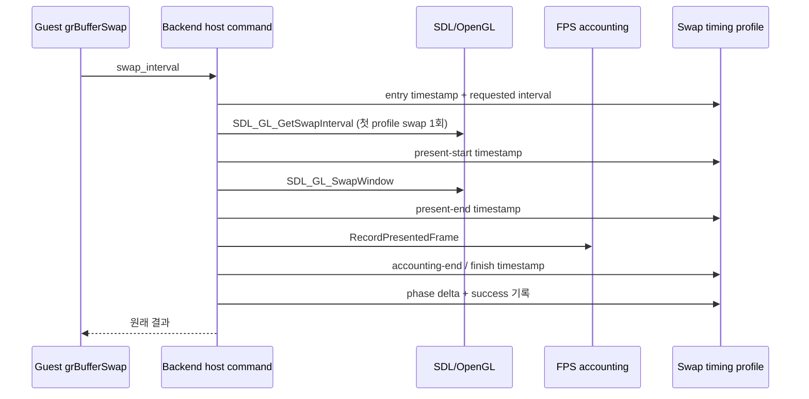

# 20260729-354 Glide buffer swap 시간 분해 / Glide buffer-swap time decomposition

## 한국어

### 1. 배경과 목표

Task 353은 ordinal 85 `_GRBUFFERSWAP@4`가 Glide gate cycle의 평균 50.21%,
현재 wall-clock의 약 17.32%를 차지하고, 해당 backend interval의 99.09%가 host
work임을 확인했습니다. 현재 Win32 backend는 guest가 전달한 `swap_interval`을
받지만 사용하지 않고 `SDL_GL_SwapWindow`를 호출한 뒤 FPS 계수를 갱신합니다.

이 작업은 원본 Glide 호출 순서와 화면 제시 의미를 바꾸지 않은 채 host work를
다음 네 구간으로 분해합니다.

1. host-side `BufferSwap` 진입부터 SDL present 직전까지의 setup
2. `SDL_GL_SwapWindow`
3. `RecordPresentedFrame`
4. 메시지와 반환 결과를 확정하는 finalize

동시에 전달된 Glide interval의 분포와 현재 OpenGL context의 실제 SDL swap
interval을 관측합니다. 이 작업에서는 `SDL_GL_SetSwapInterval`을 호출하거나 프레임을
생략·병합하지 않습니다.

### 2. 구조

기본 OFF인 `REPIU_GLIDE_SWAP_TIME_PROFILE=1`이
`Win32GlideBufferSwapTimingProfile`을 활성화합니다. profile은 backend가 소유하고,
guest 실행 종료 후 quiescent snapshot으로 읽습니다.

profile은 다음 값을 누적합니다.

* call, success, failure, timestamp clamp count
* setup, present, accounting, finalize, total cycle과 최대 present cycle
* 요청 interval의 0/1/기타 count, 최소/최대/마지막 값
* SDL interval query의 시도/성공/실패 count와 관측값

profile이 꺼져 있으면 기존 경로는 환경 설정을 한 번 해석한 뒤 call마다 branch 하나만
추가합니다. profile이 켜졌을 때만 host-side swap마다 timestamp 다섯 개를 읽습니다.
pixel diagnostic은 측정 계약에서 OFF로 유지하므로 setup 구간에 `glReadPixels`가
섞이지 않습니다.

### 3. 측정 계약

Task 347의 isolated Release 실행을 같은 바이너리로 control/profile 각각 3회 수행합니다.
profile 실행에는 Task 353 ordinal profile도 함께 켜 ordinal 85 host work와 내부
swap 분해를 직접 대조합니다.

| gate | 조건 |
|---|---|
| G1 | failure와 timestamp clamp가 0 |
| G2 | phase 합이 total cycle과 정확히 일치 |
| G3 | swap call/success count가 ordinal 85 완료 rendezvous와 일치 |
| G4 | 내부 total cycle이 ordinal 85 host-work의 98~101%를 덮음 |
| G5 | SDL interval query가 성공하고 요청 interval 분포와 관측값을 보고 |
| G6 | 60초 profile-on 프레임 중앙값이 control의 ±5% 이내 |
| G7 | 세 실행에서 지배 phase가 동일 |

G4의 미세한 차이는 host command lambda의 호출·반환과 timestamp 경계 차이입니다.
범위를 벗어나면 누락 구간 또는 observer 간섭으로 보고 결론을 내리지 않습니다.

### 4. 판정

* present가 내부 total의 90% 이상이면 병목은 `SDL_GL_SwapWindow` 경계 안에 있습니다.
  실제 SDL interval이 0이면 vsync로 단정하지 않고 GPU/driver present stall로
  기록합니다.
* accounting이 10% 이상이면 FPS title 갱신을 별도로 분해합니다.
* setup 또는 finalize가 10% 이상이면 해당 구간의 진단·문자열·adapter 비용을
  추가로 분해합니다.
* 실제 interval이 guest 요청과 다르더라도 이 작업에서는 즉시 변경하지 않습니다.
  원본 Glide interval 의미와 현재 실행 cadence를 별도 설계·A/B로 검증한 뒤에만
  적용 여부를 결정합니다.

---

## English

### 1. Background and goal

Task 353 established that ordinal 85 `_GRBUFFERSWAP@4` owns 50.21% of Glide
gate cycles and about 17.32% of current wall time, with 99.09% of its backend
interval classified as host work. The current Win32 backend receives the
guest `swap_interval` but does not apply it; it calls `SDL_GL_SwapWindow` and
then updates FPS accounting.

This task decomposes that host work into setup, `SDL_GL_SwapWindow`,
`RecordPresentedFrame`, and finalize phases while observing both the requested
Glide interval distribution and the actual SDL OpenGL-context swap interval.
It does not call `SDL_GL_SetSwapInterval`, drop or merge frames, or change the
original call order.

### 2. Structure and contract

Disabled-by-default `REPIU_GLIDE_SWAP_TIME_PROFILE=1` enables a backend-owned
fixed profile. The enabled host-side path reads five timestamps per swap and
records phase cycles, success, requested intervals, and a one-time
`SDL_GL_GetSwapInterval` result. Pixel diagnostics remain disabled in the
measurement contract.

The same-binary three-run Release control/profile comparison also enables the
Task 353 ordinal profile. Phase sums must equal internal totals exactly,
failures and clamps must be zero, completed swap counts must equal ordinal 85
rendezvous counts, internal totals must cover 98--101% of ordinal 85 host
work, the SDL interval query must succeed, profile observer impact must stay
within 5%, and the leading phase must repeat across all runs.

If present exceeds 90%, the confirmed boundary is `SDL_GL_SwapWindow`. An
observed SDL interval of zero does not by itself prove that the driver never
blocks; it distinguishes explicit vsync pacing from other GPU/driver present
stalls. Any change that applies the guest interval requires a separate
semantics design and A/B validation.
