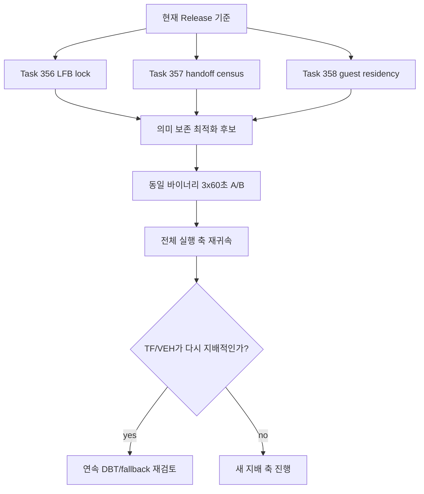

# 20260729-355 현재 성능 다음 작업 / Current performance next actions

## 한국어

### 1. 최신 기준

Task 354의 동일 바이너리 Release 60초 control 3회를 다시 합산하면 현재 실행 축의
중앙값은 guest 실행 54.32%, Glide gate 30.63%, VEH-exclusive 7.49%, 커널 예외
전이 6.98%입니다. 현재 성능 조사는 큰 미확정 축과 즉시 분해 가능한 HLE 축을
구분해야 합니다.

Task 354 profile의 최신 Glide ordinal 합계에서는 다음 비용이 확인됩니다.

| 대상 | 최신 비중 | 성격 |
|---|---:|---|
| `grBufferSwap` | Glide 31.66%, wall 약 8.94% | 요청/실제 interval 1인 present |
| `grLfbLock` | Glide 18.37%, wall 약 5.19% | backend 98.14% host work |
| handoff 지배 API 17개 | Glide 42.85%, wall 약 12.10% | wake+complete 92.88% |
| guest 실행 | wall 54.32% | active work와 pacing이 아직 혼합 |

wall 비중은 같은 profile 세 실행의 Glide 중앙값 28.24%를 사용한 추정입니다.
과거 Task 353 비중과 섞지 않습니다.

### 2. 작업 순서

#### Task 356 — `grLfbLock` phase 귀속

WRITE_ONLY lock에서도 현재 전체 framebuffer를 읽어 staging surface를 seed합니다.
다음 구간을 기본 OFF profile로 분리합니다.

1. surface resize/lock 준비
2. OpenGL `glReadPixels`
3. drawable→logical 크기 변환과 방향 변환
4. RGBA8→RGB565 encode
5. guest `GrLfbInfo` 기록과 finalize

동시에 seed된 RGB565와 unlock 시점 RGB565의 차이를 tile 단위로 관측하여 guest가
실제로 덮어쓴 범위를 구합니다. 전체 덮어쓰기가 반복적으로 증명되기 전에는 WRITE_ONLY
readback을 제거하지 않습니다.

#### Task 357 — Glide command handoff census

handoff 지배 API 17개의 frame-local 순서, 인자 변화, queue/wake/work/complete를
고정 크기 census로 기록합니다. 다음을 구분합니다.

* 같은 값의 반복 setter
* 값이 바뀌는 setter
* draw 전 반드시 적용되어야 하는 상태
* frame 경계를 넘길 수 없는 상태

이 작업은 batching/coalescing을 구현하지 않고 가능성만 판정합니다. 값과 순서가
달라지는 호출을 count만 보고 제거하지 않습니다.

#### Task 358 — guest 실행 residency 귀속

현재 가장 큰 54.32%를 active calculation, timer/busy wait, memory loop로 나눕니다.
기존 정지 표본과 first-backedge 표본은 각각 syscall/topology 편향으로 기각됐으므로
재사용하지 않습니다.

우선순위는 외부 PMU/CPU sampling으로 cache IP를 수집하고 기존 cache→guest
주소 mapping으로 역귀속하는 방법입니다. 사용할 수 없으면 translated block의
시간 기반 저빈도 표본 또는 실행 count를 설계하되 block instruction 수와 표본
확률을 함께 기록하고 observer impact ±5%를 통과해야 합니다.

### 3. 재판정 규칙

각 최적화는 frame/gate/get-proc, malformed/fatal, Glide issue 0, EEPROM 격리,
동일 PIT 경로를 유지해야 합니다. TF/VEH는 회귀 계측을 유지하되 위 세 작업 뒤
전체 실행 축에서 다시 지배적으로 나타날 때만 성능 대상으로 복귀합니다.

---

## English

### Current baseline

Re-aggregating Task 354's same-binary three-run 60-second Release control gives
median shares of 54.32% guest execution, 30.63% Glide gate, 7.49%
VEH-exclusive work, and 6.98% kernel exception transitions. The matching
profile places `grBufferSwap` at about 8.94% of wall time, `grLfbLock` at
about 5.19%, and seventeen handoff-dominated APIs at about 12.10%. The latter
spend 92.88% of backend time in wake plus completion.

### Ordered work

Task 356 decomposes `grLfbLock` into surface preparation, `glReadPixels`,
drawable-to-logical conversion, RGBA8-to-RGB565 encoding, and guest-info
finalization. A tile-level seed-versus-unlock difference census must prove
actual guest overwrite coverage before any WRITE_ONLY readback is removed.

Task 357 records fixed-size frame-local command order, argument changes, and
handoff phases for the seventeen handoff-dominated APIs. It classifies
identical setters, changing setters, draw dependencies, and frame barriers
without yet batching or coalescing calls.

Task 358 attributes the 54.32% guest-residency bucket. Previously rejected
stop and first-backedge sampling are not reused. External PMU/CPU sampling
with cache-IP-to-guest mapping is preferred; any translated-block fallback
must record sampling probability and block instruction count and remain within
a ±5% observer gate.

Every optimization retains the existing semantic invariants and ends with a
same-binary three-run 60-second A/B plus full-axis re-attribution. TF/VEH
telemetry remains for regression detection and returns as a performance target
only if it becomes dominant after these three tasks.
