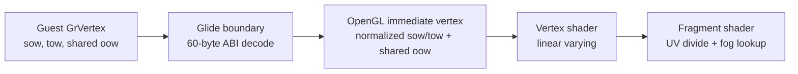

# 20260730-359 Glide 배경 렌더링 정확성 / Glide background rendering accuracy

## 한국어

### 1. 배경과 확인된 증거

현재 실행 화면은 UI 텍스처를 정상적으로 표시하지만 원본의 원근감 있는 체크무늬
배경 대신 단색 녹색과 검은 도형을 표시합니다. 최신 진단 로그에서는 다음 사실을
확인했습니다.

* 전체 화면 크기의 삼각형이 유효한 TMU 주소와 256×256 텍스처를 선택한 상태로
  제출됩니다. 따라서 배경 자산 부재나 `grTexSource` 실패가 주원인은 아닙니다.
* `GrVertex`의 TMU0 `sow`, `tow`는 읽지만 공용 `oow`는 버립니다. 백엔드는
  `sow`, `tow`를 이미 나눗셈이 끝난 일반 UV로 사용합니다.
* 게임이 사용하는 `GR_FOG_WITH_TABLE` 값 2는 백엔드에서 거부되며 반복적인
  backend failure로 기록됩니다.
* LFB staging surface에는 비영(非零) 픽셀이 있지만, 기존 fragment combine과
  alpha/scissor/color-mask 상태를 상속하는 전체 화면 blit 뒤의 back buffer는
  검은색으로 남는 표본이 있습니다.

3Dfx Glide 2.4 Programming Guide는 `GrVertex`가 `s/w`, `t/w`, `1/w`를 전달하고
하드웨어가 픽셀 단위로 보간한 뒤 텍스처 좌표를 복원한다고 명시합니다. 또한
table fog는 보간된 `1/w`로 64-entry table을 조회하고 fog color와 incoming
color를 혼합합니다.

### 2. 목표와 비목표

목표는 원본 실행 파일이나 게임 로직을 바꾸지 않고 Glide HLE 경계와 OpenGL
백엔드의 의미를 원본 API에 맞추는 것입니다.

1. 공용 `oow`와 TMU0 `sow/tow`를 보존하고 fragment 단계에서 `(s/w)/(1/w)`,
   `(t/w)/(1/w)`를 복원합니다.
2. 관측된 `GR_FOG_DISABLE`(0)과 `GR_FOG_WITH_TABLE`(2)을 구현합니다.
3. LFB blit가 geometry combine, fog, alpha test, scissor, color mask에 영향받지
   않게 하고 모든 변경 상태를 복원합니다.
4. material 또는 fixed-function light를 새로 만들지 않습니다. Glide는 응용
   프로그램이 iterated color를 제공하는 API이며 현재 백엔드는 GLSL combine을
   사용하므로 이 화면의 수정 지점은 조명 재구성이 아닙니다.

이번 작업은 미관을 맞추기 위한 자산 교체, 게임 코드 패치, 임의의 배경 그림
합성, 미관측 fog mode 구현을 포함하지 않습니다.

### 3. 정점과 셰이더 계약

60-byte 2-TMU `GrVertex`에서 다음 값을 별도로 전달합니다.

| dword | 의미 | 사용 |
|---:|---|---|
| 8 | 공용 `oow` | table fog와 비투영 texture의 분모 |
| 9 | TMU0 `sow` | 텍스처 좌표 분자 |
| 10 | TMU0 `tow` | 텍스처 좌표 분자 |
| 11..14 | 가변·미확정 | 현재 경로에서 사용하지 않음 |

CPU 백엔드는 `sow/tow`만 Glide coordinate extent로 정규화합니다. 공용 `oow`는
나누지 않고 함께 보간합니다. fragment shader는 유효한 `oow`에서만 perspective
divide를 수행합니다. 0, NaN, infinity처럼 사용할 수 없는 값은 1로 대체하여
기존 2D UI 경로가 무한 좌표를 만들지 않게 합니다.

PIU의 확인된 60-byte producer layout에서 dword 11..14는 표본마다 가변이며 유효한
TMU reciprocal-w로 확인되지 않았습니다. 현재 관측된 non-projected texture는 Glide
사양대로 공용 dword 8의 `oow`를 공유합니다. projected texture가 별도로 관측되기
전에는 미확정 필드를 분모로 추정하지 않습니다.



### 4. table fog 계약

논리 상태는 guest pointer만 보관하지 않고 `grFogTable` 호출 시 64 bytes를 즉시
복사합니다. 백엔드는 정규화한 64개 factor와 변환된 ARGB fog color를 shader
uniform으로 소유합니다. guest memory가 이후 바뀌거나 해제되어도 제출된 fog
상태는 안정적이어야 합니다.

공식 table의 index별 world-space 위치는 다음 식을 따릅니다.

```text
W(i) = 2^(3 + (i >> 2)) / (8 - (i & 3))
```

fragment shader는 보간된 vertex `oow`에서 `w = 1/oow`를 구하고 인접한 두
table entry 사이를 선형 보간합니다. factor 0은 incoming color, factor 1은
fog color입니다. 관측되지 않은 iterated-alpha/add/multiply fog flag는 지원으로
가장하지 않고 계속 명시적으로 거부합니다.

### 5. LFB blit 상태 격리

LFB blit는 같은 GLSL program의 전용 bypass uniform을 켜서 texture sample을
그대로 출력하고 geometry combine과 fog 계산을 건너뜁니다.
blit 동안 depth, blend, cull, alpha test, scissor를 끄고 color mask를 RGBA true로
강제합니다. draw buffer와 각 enable, color mask, texture binding은 blit 뒤
복원합니다. fog와 color/alpha combine은 bypass되므로
게임의 geometry 상태 값 자체를 덮어쓰지 않습니다.

### 6. 검증

* 합성 probe: fog table의 64개 knot에서 정확한 index를 선택하고 중간값을 선형
  보간하며 경계 밖 값을 clamp하는지 검사합니다.
* 정적 검증: boundary가 dword 8과 9/10을 전달하고 shader가 `sow/oow`를
  fragment 단계에서 계산하는지 확인합니다.
* Win32 x86 빌드: loader와 probe를 빌드하고 전체 probe를 통과시킵니다.
* 런타임 smoke: fog mode 2 backend failure가 사라지는지, LFB unlock 뒤 nonblack
  pixel이 남는지, 원본과 같은 원근 배경이 나타나는지 캡처로 확인합니다.

### 7. 근거

* [3Dfx Glide 2.4 Programming Guide](https://www.bitsavers.org/components/3dfx/Glide_Programming_Guide_2.4_199707.pdf)
  — `GrVertex`의 `oow/sow/tow`, perspective correction, 64-entry table fog와
  `W(i)` 식

---

## English

### Background and goal

The current build renders UI textures but replaces the original perspective
checkerboard background with a green clear and a black polygon. Diagnostics
confirm that full-screen triangles are submitted with valid 256×256 textures,
so missing assets or `grTexSource` are not the primary fault. The boundary
currently discards both relevant reciprocal-w semantics: it reads TMU0
`sow/tow` as final UVs and ignores TMU0 `oow`, while table fog mode 2 is
rejected. LFB staging also contains nonzero pixels that can be suppressed by
inherited combine and fragment state.

This task preserves the original executable and fixes the Glide HLE contract:

1. carry shared `oow` and TMU0 `sow/tow` through the boundary;
2. perform `(s/w)/(1/w)` and `(t/w)/(1/w)` per fragment;
3. implement observed fog modes 0 and 2 with a copied 64-entry table and
   converted fog color; and
4. give LFB presentation a shader bypass and complete temporary state
   isolation.

No fixed-function material or light reconstruction is added. Glide receives
iterated vertex color from the application, and this backend implements its
combine pipeline in GLSL. Asset replacement, executable patching, synthetic
background compositing, and unobserved fog modes are out of scope.

### Contracts

In the confirmed 60-byte vertex, dword 8 is shared `oow` and dwords 9 and 10
are TMU0 `sow/tow`. Dwords 11--14 remain variable and unconfirmed in captured
producer data. The observed non-projected texture path therefore shares dword
8 for fog and texture perspective correction. Only `sow/tow` are normalized
by the Glide coordinate extent; the shader divides those interpolated
numerators by the shared `oow` per fragment.

`grFogTable` copies 64 guest bytes immediately. For table index `i`, the world
distance knot is `W(i) = 2^(3 + (i >> 2)) / (8 - (i & 3))`. The fragment shader
derives `w = 1/oow`, linearly interpolates adjacent normalized entries, and
mixes incoming RGB with fog RGB. Modes other than observed disable and
with-table remain explicit unsupported cases.

The LFB path enables a dedicated bypass uniform in the GLSL program and emits
the bound LFB texture sample without evaluating geometry combine or fog. It
temporarily disables depth, blend, cull, alpha test, and scissor, forces a full
RGBA color mask, and restores those enables, the draw buffer, color mask, and
texture binding.

### Verification

Add synthetic coverage for all table knots, interpolation, and clamps; inspect
the ABI-to-shader data path; build the Win32 x86 loader and probes; then run a
game smoke test. Acceptance requires no mode-2 fog backend failures, nonblack
LFB output after unlock, and a perspective background matching the original
composition.
