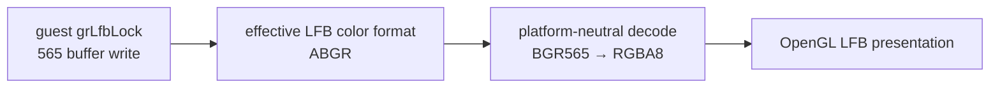

# 20260730-360 Glide LFB 565 색 채널 순서 / Glide LFB 565 Color Order

## 한국어

### 문제와 근거

PIU의 일반 Glide 텍스처는 정상이나 `grLfbLock`으로 작성하는 장면만 원본의
파랑·청록 계열이 노랑 계열로 표시됩니다. 이는 전역 텍스처 디코더나 material/light
문제가 아니라 LFB의 Red/Blue 교환 증상입니다.

3Dfx Glide 2.4 Programming Guide의 Table 11.2는
`GR_LFBWRITEMODE_565`의 물리 배치를 `grSstWinOpen()`의 `cFormat`으로 결정합니다.

| `cFormat` | bits 15..11 | bits 10..5 | bits 4..0 |
|---|---|---|---|
| ARGB/RGBA | Red | Green | Blue |
| ABGR/BGRA | Blue | Green | Red |

PIU는 `grSstWinOpen(..., GR_COLORFORMAT_ABGR, ...)`와
`grLfbWriteColorFormat(GR_COLORFORMAT_ABGR)`를 호출합니다. 현재 HLE는 두 상태를
보존하지만 LFB 변환 함수가 항상 RGB565로 해석합니다. 따라서 원본이 BGR565로 기록한
Blue 상위 비트가 Red로 복원되어 청록색이 노란색이 됩니다.

### 설계

1. 플랫폼 공용 565 encode/decode 함수에 `GrColorFormat_t` 값을 전달합니다.
2. ARGB/RGBA는 기존 RGB565 배치를 유지하고 ABGR/BGRA는 Red와 Blue 비트 위치를
   교환합니다.
3. `grSstWinOpen` 시 LFB write color format의 초기값도 `cFormat`으로 맞춥니다.
   이후 `grLfbWriteColorFormat`이 호출되면 해당 값이 write lock의 유효 형식입니다.
4. framebuffer에서 lock staging을 채우는 encode와 write lock unlock의 decode에
   같은 유효 형식을 사용하여 왕복 대칭을 보장합니다.
5. `grLfbWriteRegion(GR_LFB_SRC_FMT_565)`은 사양상 명시적인 RGB565 source image이므로
   이 경로는 RGB 순서를 유지합니다.

게임 실행 파일, 텍스처 디코더, shader, material, light는 변경하지 않습니다.

### 검증

합성 probe에서 RGB와 BGR 각각의 pure red/blue, cyan encode 값, encode/decode
왕복을 검사합니다. 이후 Win32 x86 loader와 render probe를 빌드하고 실제 게임
smoke에서 LFB 장면의 Blue 채널이 Red 채널로 뒤바뀌지 않는지 확인합니다.

### 근거

* [3Dfx Glide 2.4 Programming Guide](https://www.bitsavers.org/components/3dfx/Glide_Programming_Guide_2.4_199707.pdf)
  — Chapter 11, Table 11.1/11.2/11.5

---

## English

### Problem and evidence

Regular Glide textures render correctly, while only the scene written through
`grLfbLock` changes the original blue/cyan palette into yellow. This isolates
the defect from global texture decoding, materials, and lighting and matches a
red/blue exchange in the LFB path.

Glide 2.4 Programming Guide Table 11.2 defines 565 LFB component packing from
the `cFormat` passed to `grSstWinOpen()`: ARGB/RGBA uses RGB565, while
ABGR/BGRA uses BGR565. PIU selects ABGR both at window creation and through
`grLfbWriteColorFormat`. The HLE retains those values but currently always
decodes and encodes RGB565, turning the guest's high Blue bits into Red.

### Design and verification

Pass `GrColorFormat_t` into the platform-neutral 565 conversion helpers. Keep
RGB order for ARGB/RGBA and exchange the outer five-bit channels for
ABGR/BGRA. Initialize the LFB write format from the window format, allow
`grLfbWriteColorFormat` to override it, and use the same effective format for
lock seeding and write-unlock decode. Keep `grLfbWriteRegion` RGB565 because
its source format explicitly describes an RGB565 image.

Add synthetic red/blue, cyan packing, and round-trip checks, then build the
Win32 x86 loader and render probe and perform a game smoke test. No executable,
texture decoder, shader, material, or light changes are part of this task.
