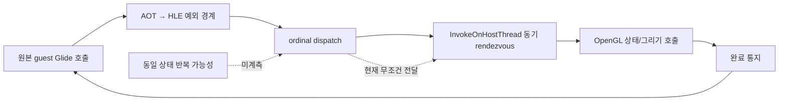
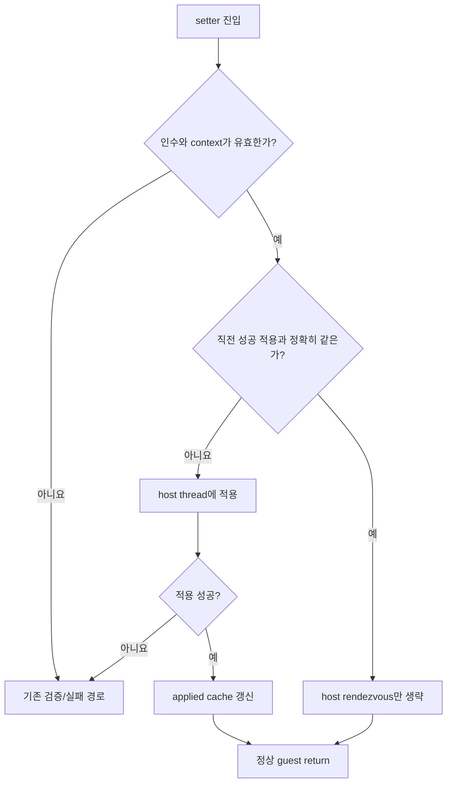

# 20260730-363 Glide 호출 증가 성능 개선 계획 / Glide call-volume performance plan

## 한국어

### 1. 목적

Release 실행에서 Glide API 호출량이 증가할 때 FPS가 급격히 떨어지는 원인을 최신
실행 로그로 고정하고, 원본 게임의 호출 순서와 렌더링 의미를 보존하면서 후속 작업을
재개할 수 있는 단계별 계획을 정의합니다.

이번 Task는 구현하지 않습니다. 진단 결과, 구현 순서, 계측 항목, 의미 보존 조건과
완료 gate를 문서로 남기는 작업입니다.

### 2. 기준 실행과 확인된 사실

기준 산출물은 로컬 Release 로그
`repiu_glide_profile_release_20260730_030212.txt`입니다. 로그는 약 47.5초 동안
다음을 기록했습니다.

| 항목 | 값 |
|---|---:|
| 완료 Glide ordinal | 403,904 |
| `grBufferSwap` / 관측 프레임 | 1,287 |
| Glide 호출/프레임 | 약 313.8 |
| Glide 호출/초 | 약 8,509 |
| 전체 wall-clock 대비 Glide gate | 24.14% |
| 주요 상태 설정 18종 호출/프레임 | 약 235.7 |
| 전체 wall-clock 대비 주요 상태 설정 18종 | 20.59% |
| Glide gate 대비 주요 상태 설정 18종 | 85.33% |

주요 ordinal은 다음과 같습니다.

| ordinal | 호출/프레임 | Glide gate 대비 | wall-clock 대비 | backend 성격 |
|---|---:|---:|---:|---|
| `grDepthMask` | 16.08 | 34.40% | 8.30% | backend의 94.3%가 host work |
| `grDrawTriangle` | 71.31 | 11.23% | 2.71% | backend의 94.1%가 handoff |
| `grAlphaBlendFunction` | 14.39 | 9.26% | 2.24% | backend의 78.9%가 host work |
| `grColorMask` | 16.40 | 4.77% | 1.15% | work/handoff가 절반씩 |
| `grFogMode` | 15.58 | 4.13% | 1.00% | work/handoff가 절반씩 |
| `grClipWindow` | 14.39 | 3.45% | 0.83% | work/handoff가 절반씩 |

선택한 18개 상태 설정 ordinal의 합은 약 303,399회이며 전체 wall-clock의
20.59%입니다. 그 안에서 host work는 12.88%p, queue/wake/complete 동기화는
7.02%p입니다. 나머지는 gate 자체의 작은 잔여 비용입니다.

이번 실행에서 `grBufferSwap`은 wall-clock의 0.24%, 그 안의
`SDL_GL_SwapWindow`는 0.17%뿐입니다. 평균 present는 약 64us, 최대 present는
약 0.71ms이고 요청 및 관측 swap interval은 모두 1입니다. `grLfbLock` 호출은
없으며 texture download 63회의 wall 비중은 약 0.07%입니다.

따라서 이 실행에서는 다음 결론이 확인됩니다.

1. `BufferSwap`, VSync, LFB readback, texture upload는 현재 급격한 FPS 저하의
   우선 원인이 아닙니다.
2. 상태 설정 호출이 값의 동일 여부와 무관하게 host thread로 동기 전달되고 OpenGL
   상태 호출을 반복하는 것이 첫 번째 병목입니다.
3. `grDrawTriangle`은 OpenGL 작업 자체보다 삼각형마다 발생하는 동기 handoff가
   지배합니다.
4. 각 Glide 진입은 AOT→HLE 예외 경계를 유지하므로 동일 상태 생략 뒤에도 gate
   비용은 남습니다. 현재 검증되지 않은 exception-free superblock 경로를 성급히
   다시 켜지 않습니다.

### 3. 병목 구조

최적화는 원본 guest 호출을 삭제하거나 EXE를 수정하는 방식이 아닙니다. HLE가 호출을
정상적으로 처리하되, 이미 성공적으로 적용된 것과 정확히 같은 상태라면 host 작업을
생략하는 방향을 우선합니다.

### 4. 단계별 후속 작업

#### Task 364 — 상태 반복률과 host-work 세부 귀속

구현 전에 다음 기본 OFF 계측을 추가합니다.

1. `grDepthMask`
   * 인수 `0/1`, 직전 성공 상태와 동일/변경 횟수
   * `glDepthMask` 호출과 후속 `glGetError`를 분리한 cycle
   * frame별 호출 수, 변경 수, 최대 연속 반복 수
2. `grAlphaBlendFunction`
   * 네 인수 tuple의 고유값, 동일/변경 횟수
   * 선행 error drain, `glEnable/glDisable`, `glBlendFunc`, 최종
     `glGetError`의 분리 cycle
3. 나머지 상태 setter
   * 유효 인수의 고정 크기 key
   * 동일/변경/실패 횟수와 draw 전 마지막 변경 위치
4. texture 상태
   * TMU, texture address, texture generation을 key에 포함
   * download/source 변경에 따른 무효화 사건 기록

hot path에서는 allocation, 문자열 생성, 정렬을 하지 않습니다. 고정 크기 counter와
기존 gate timestamp를 재사용하고 종료 시에만 정렬·출력합니다.

Task 364는 최적화를 구현하지 않습니다. 다음 질문에 답하면 완료입니다.

* `grDepthMask` 20,693회 중 실제 상태 변경은 몇 회인가?
* 13.63B host-work cycle은 `glDepthMask`와 `glGetError` 중 어디에 있는가?
* 각 setter의 동일 상태 반복을 제거할 때 절감 가능한 rendezvous와 host-work의
  실측 상한은 얼마인가?

#### Task 365 — 성공한 동일 상태의 보수적 생략

Task 364에서 반복률과 의미가 확인된 setter만 대상으로 합니다.

필수 조건은 다음과 같습니다.

* cache는 “요청됨”이 아니라 **host에서 성공적으로 적용됨**을 나타냅니다.
* invalid/unsupported 입력과 backend 실패는 기존 경로를 그대로 통과합니다.
* window open/close, context 재생성, `grGlideSetState`, render-buffer 변경 등 상태
  복원을 보장할 수 없는 사건에서 관련 cache를 무효화합니다.
* texture clamp/filter/source는 texture object와 generation을 고려합니다.
  texture download나 object 교체를 가로질러 잘못 생략하지 않습니다.
* 원본 gate 진입, ABI stack 처리, 반환 주소, 호출 순서는 유지합니다. 생략 대상은
  host rendezvous와 중복 OpenGL 적용뿐입니다.
* 서로 다른 상태를 합치거나 draw를 넘어 상태 변경을 이동하지 않습니다.

먼저 `grDepthMask`, `grAlphaBlendFunction`처럼 wall 비중과 반복률이 모두 높은
항목을 작은 묶음으로 적용합니다. 이후 color/depth/fog/cull/clip, 마지막으로
texture 상태를 진행합니다. 각 묶음은 독립적인 A/B와 visual regression gate를
통과해야 합니다.

#### Task 366 — 순서 보존 triangle 제출 batching 타당성 및 구현

상태 생략 뒤에도 `grDrawTriangle`의 handoff가 지배적일 때만 진행합니다.

* 인접한 triangle 호출 사이에 상태 변경, buffer clear/swap, LFB, texture download,
  query 또는 다른 동기화 barrier가 없을 때만 같은 batch 후보로 봅니다.
* guest vertex pointer는 즉시 deep-copy하여 이후 guest 메모리 변경에 영향받지 않게
  합니다.
* triangle 순서와 winding, blend/depth/fog/texture 상태는 원본 순서 그대로 유지합니다.
* barrier와 최대 batch 크기에서 반드시 flush합니다.
* 예외가 발생하면 미완료 batch와 guest 반환 상태가 모호해지지 않도록 fail-closed
  정책을 설계합니다.

Task 364의 frame-local 순서 자료로 평균 batch 가능 크기와 이론상 handoff 절감률을
먼저 계산합니다. 이득이 작거나 barrier가 지나치게 많으면 구현하지 않습니다.

#### Task 367 — 전체 축 재귀속과 다음 frontier 결정

최종 최적화 뒤 동일 바이너리 Release control/profile 3회 이상을 수행합니다.
전체 실행 축, Glide ordinal, exception census와 host rendezvous를 다시 합산해
다음 병목을 결정합니다. 과거 Task 354/355의 LFB 우선순위는 현재 장면에 자동 적용하지
않고, LFB가 실제 호출되는 별도 장면에서 다시 측정될 때만 복귀시킵니다.

### 5. 검증 계약

모든 구현 Task는 다음을 만족해야 합니다.

| gate | 기준 |
|---|---|
| observer | 동일 바이너리 control/profile 3회 중앙값 차이 ±5% 이내 |
| ABI | completed ordinal = handled gate, 열린 gate는 종료 시 명시 |
| 안정성 | malformed/fatal/implementation issue/overflow/clamp = 0 |
| 렌더링 | 고정 capture의 pixel diff와 주요 화면 육안 비교 |
| 호출 의미 | 상태 변경 순서, draw 순서, frame barrier 유지 |
| 입력/타이머 | 같은 PIT, JAMMA 입력, EEPROM 격리 조건 |
| 성능 | FPS뿐 아니라 wall 축과 ordinal cycle을 함께 보고 |

단일 실행의 FPS만으로 채택하지 않습니다. 최적화 전후의 호출 수가 달라지므로
gate당 비용, frame당 비용, 전체 wall 비중을 함께 기록합니다.

### 6. 금지 사항

* VSync를 끄거나 원본 frame을 drop하여 수치를 높이지 않습니다.
* 값과 순서를 관측하기 전에 setter를 합치지 않습니다.
* `glGetError` 비용이 확인되기 전에 전역적으로 제거하지 않습니다.
* texture generation과 context invalidation 없이 texture state를 cache하지 않습니다.
* 현재 렌더링이 멈추는 `REPIU_AOT_DBT_SUPERBLOCK=1`을 성능 해결책으로 사용하지
  않습니다.
* 원본 EXE나 게임 로직을 수정하지 않습니다.

---

## English

### Objective and baseline

This task records a resumable plan for the sharp FPS loss observed when Glide
call volume rises. It does not implement an optimization.

The local Release artifact
`repiu_glide_profile_release_20260730_030212.txt` completed 403,904 Glide
ordinals and 1,287 swaps in roughly 47.5 seconds: about 313.8 Glide calls per
frame and 8,509 per second. The Glide gate occupied 24.14% of wall time.
Eighteen major state-setting ordinals issued about 235.7 calls per frame and
held 20.59% of wall time, or 85.33% of the Glide gate.

`grDepthMask` alone held 34.40% of Glide and 8.30% of wall time, with 94.3%
of its backend interval in host work. `grDrawTriangle` held 11.23% of Glide
and 2.71% of wall time, but 94.1% of its backend interval was handoff rather
than drawing work. `grAlphaBlendFunction` held another 9.26% of Glide and
2.24% of wall time.

In contrast, `grBufferSwap` occupied only 0.24% of wall time and SDL present
only 0.17%; mean present was about 64us and maximum present about 0.71ms.
Requested and observed swap interval were both one. This run made no
`grLfbLock` calls, and its 63 texture downloads occupied about 0.07% of wall
time. Buffer swap, LFB, and texture upload are therefore not the first causes
for this captured scene.

### Ordered work

Task 364 adds disabled-by-default, fixed-size attribution without optimizing.
It records exact repeated-versus-changing setter values, separates
`glDepthMask` from its trailing `glGetError`, separates alpha-blend error
drain/state/error phases, and includes texture object generations in texture
state keys. It must quantify the safe elimination ceiling and remain within
the observer gate.

Task 365 elides only an exact duplicate of a state that was previously
applied successfully to the same valid context. Invalid input and backend
failure retain the existing path. Context recreation, state restore, render
buffer changes, and texture generation changes conservatively invalidate
affected caches. Guest gate entry, ABI handling, call order, and returns stay
unchanged; only the redundant host rendezvous and OpenGL application may be
skipped.

Task 366 proceeds only if triangle handoff remains dominant. It first uses
Task 364's frame-local order to estimate a benefit. Any implementation
deep-copies guest vertices, preserves triangle order and render state, and
flushes at every state, buffer, LFB, texture, query, or bounded-size barrier.

Task 367 reruns at least three same-binary Release control/profile samples and
re-attributes the complete execution axis. The older LFB-first priority is
not carried into this scene; LFB work returns only when a separately captured
scene actually calls it.

### Validation and prohibitions

Every implementation retains completed-versus-handled ordinal equality, zero
malformed/fatal/implementation issues and profiler overflow/clamps, the same
PIT/input/EEPROM isolation contract, draw and state order, and fixed-capture
visual equivalence. Performance decisions use three-run medians and report
wall, per-frame, per-gate, and ordinal cycles.

The work does not disable VSync, drop original frames, globally remove
`glGetError` before attribution, cache texture state without generation and
context invalidation, enable the currently rendering-breaking superblock
path, or modify the original executable/game logic.
