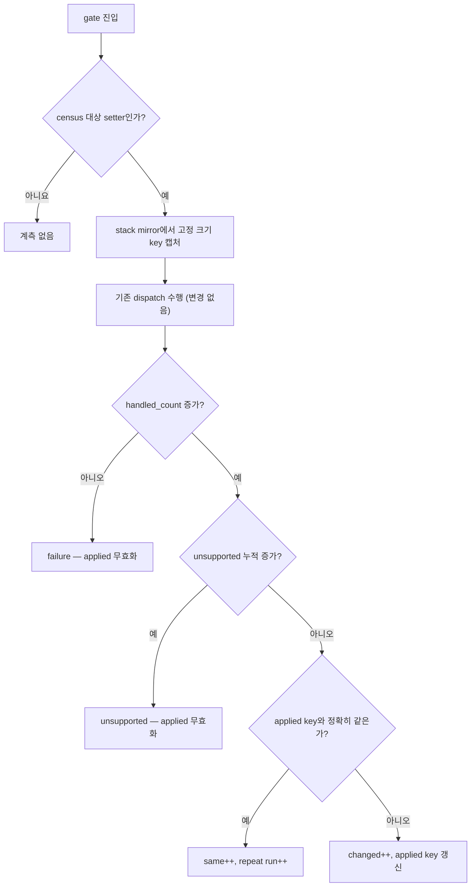

# 20260730-364 Glide setter 반복률과 host-work phase 귀속 설계 / Glide setter repetition census and host-work phase attribution

## 한국어

### 1. 목적

[Task 363 계획](20260730-363-glide-call-performance-plan.md)의 1단계입니다. Release
실게임에서 Glide 상태 설정 호출이 프레임당 약 235.7회 발생하며 wall-clock의 20.59%,
Glide gate의 85.33%를 차지합니다. 이 설계는 **최적화를 구현하지 않고** 다음 세 질문에
수치로 답할 기본 OFF 계측을 정의합니다.

1. `grDepthMask` 호출 중 직전에 성공적으로 적용된 상태와 **정확히 같은** 호출은 몇
   회인가?
2. `grDepthMask`의 host-work cycle은 `glDepthMask`에 있는가, 후속 `glGetError`에
   있는가?
3. 각 setter의 동일 상태 반복을 제거할 때 절감 가능한 rendezvous와 host-work의
   **실측 상한**은 얼마인가?

Task 365의 생략 구현은 이 수치가 나온 뒤에만 진행합니다. 이번 작업은 관측만 합니다.

### 2. 왜 계측을 두 개로 나누는가

두 질문은 서로 다른 스레드에서 서로 다른 비용 구조를 가집니다.

| 항목 | 실행 스레드 | 추가 clock read | 관측자 위험 |
|---|---|---:|---|
| 반복률 census | guest thread (gate boundary) | 0 | 낮음 |
| GL phase 분해 | host thread (OpenGL backend) | 호출당 3~4 | 높음 |

Task 353의 방법 규칙은 "같은 cycle을 재사용할 수 있으면 새 clock read를 만들지
않는다"입니다. 반복률은 clock을 전혀 쓰지 않으므로 규칙을 그대로 만족합니다. 반면
`glDepthMask`와 `glGetError`를 분리하려면 그 사이에 새 timestamp가 반드시 필요합니다.
따라서 두 계측을 **독립 환경 변수**로 분리하여, 값비싼 쪽만 따로 켜고 관측자 영향을
따로 판정할 수 있게 합니다.

* `REPIU_GLIDE_SETTER_CENSUS=1` — 반복률 census (clock read 0회)
* `REPIU_GLIDE_SETTER_PHASE=1` — `grDepthMask`/`grAlphaBlendFunction` GL phase 분해

둘 다 기본 OFF이며, 켜지 않으면 기존 실행 경로와 동일합니다.

### 3. 반복률 census 설계

#### 3.1 관측 지점

`HandleGlideGateBoundary` 한 곳에만 hook합니다. 각 setter case를 개별 수정하지
않습니다. 이미 mirror된 `context->glide_gate_stack`과 `argument_byte_count`가 있으므로
gate 진입 시점에 고정 크기 key를 만들 수 있고, 처리 결과는 dispatch 전후의
`glide_gate_handled_count`와 unsupported-argument 누적치 차이로 판정할 수 있습니다.

이 구조의 이점은 dispatch 로직을 한 줄도 바꾸지 않는다는 점입니다. census는 결과를
**관측**만 하며, 어떤 호출도 생략하거나 순서를 바꾸지 않습니다.

#### 3.2 대상 setter 집합

Task 363이 집계한 상태 설정 ordinal을 명시적 목록으로 고정합니다. draw, LFB, swap,
texture download, query 계열은 인수에 포인터나 좌표가 들어가 "동일 상태" 개념이
성립하지 않으므로 census 대상이 아닙니다.

`grColorMask`, `grDepthMask`, `grDepthBufferMode`, `grDepthBufferFunction`,
`grDepthBiasLevel`, `grRenderBuffer`, `grAlphaBlendFunction`, `grAlphaTestFunction`,
`grAlphaTestReferenceValue`, `grAlphaCombine`, `grColorCombine`, `grConstantColorValue`,
`grConstantColorValue4`, `grFogMode`, `grFogColorValue`, `grClipWindow`, `grCullMode`,
`grDitherMode`, `grChromaKeyMode`, `grChromaKeyValue`, `grTexCombine`,
`grTexCombineFunction`, `grTexClampMode`, `grTexFilterMode`, `grTexMipMapMode`,
`grTexLodBiasValue`, `grTexSource`, `grLfbWriteColorFormat`,
`grLfbWriteColorSwizzle`, `grLfbConstantAlpha`, `grLfbConstantDepth`

texture 계열(`grTexSource`, `grTexCombine`, clamp/filter/mipmap)은 인수만으로는 상태를
결정하지 못합니다. texture download가 같은 주소의 내용을 바꾸면 같은 인수라도 다른
상태입니다. 따라서 key에 **texture generation**을 포함하고, texture download가 발생할
때마다 generation을 올립니다. 이 값은 census 안에서만 유지하는 monotonic counter이며
렌더링 경로에 영향을 주지 않습니다.

#### 3.3 key와 무효화

key는 return address를 제외한 인수 dword를 그대로 담는 고정 크기 배열입니다. gate
stack mirror가 8 dword(반환 주소 + 인수 7개)이므로 인수 7개까지 담고, 그보다 많은
setter는 `key_overflow`로 세고 census에서 제외합니다. 현재 대상 집합은 최대 5개
인수를 쓰므로 overflow는 0이어야 하며, 0이 아니면 목록이 잘못됐다는 신호입니다.

다음 사건에서 모든 applied key를 무효화합니다. host GL 상태가 보존된다고 보장할 수
없는 경계이기 때문입니다.

* `grSstWinOpen`, `grSstWinClose` — context 생성/파괴
* `grGlideSetState`, `grGlideInit`, `grGlideShutdown` — 상태 일괄 복원
* `grRenderBuffer` — draw buffer 전환

이 무효화 규칙은 Task 365의 생략 규칙과 **동일**해야 합니다. 그래야 census가 재는
상한이 Task 365가 실제로 얻을 수 있는 값의 상한이 됩니다. 이 설계에서 먼저 규칙을
고정하는 이유가 그것입니다.

#### 3.4 수집 항목

ordinal별 고정 크기 entry에 다음을 누적합니다. 정렬과 출력은 종료 시에만 합니다.

* `call_count`, `first_count`, `same_count`, `changed_count`, `failure_count`,
  `unsupported_count`
* `max_repeat_run` — 같은 상태가 연속으로 재적용된 최대 길이
* `distinct_key_count`(상한 8) 와 `distinct_overflow_count`
* frame별 `max_frame_call_count`, `max_frame_change_count` (`grBufferSwap`을 frame
  경계로 사용)
* 전역 `invalidation_count`, `texture_generation`

`same_count / call_count`가 질문 1의 답이고, Task 353의 ordinal별 backend cycle을
곱한 값이 질문 3의 답입니다. 두 수치는 같은 실행에서 함께 얻습니다.

### 4. GL phase 분해 설계

`grDepthMask`와 `grAlphaBlendFunction`의 host thread 본문만 대상으로 하며, 네 개의
timestamp로 세 구간을 정확히 분할합니다.

| 구간 | `grDepthMask` | `grAlphaBlendFunction` |
|---|---|---|
| `drain` | 없음 (길이 0) | 선행 `glGetError` 배수 loop |
| `apply` | `glDepthMask` | `glDisable` 또는 `glEnable`+`glBlendFunc` |
| `error` | 후속 `glGetError` | 최종 `glGetError` |

`total`은 `entry → finish`이므로 `drain + apply + error == total`이 항등식으로
성립하며, 이를 probe와 측정 script에서 gate로 검사합니다.

clock은 새로 만들지 않고 backend가 이미 쓰는 `ReadGlideGateTimingCycles()`를
공유합니다. `message_` 문자열 대입은 timestamp 구간 밖으로 옮겨, GL 호출 비용에
문자열 비용이 섞이지 않게 합니다. 대입 순서를 옮겨도 `message_`는 반환 후에만
읽히므로 의미는 바뀌지 않습니다.

`total`은 GL 구간만 덮으므로 Task 353의 ordinal `work_cycles`보다 작습니다. 그 차이가
`is_open` 검사, `message_` 대입, lambda·dispatch 비용이며, 질문 2의 답은 이 세 값의
비율로 나옵니다.

### 5. 검증 계약

Task 363 §5의 gate를 그대로 적용하며, 이번 작업에 특화된 gate를 추가합니다.

| gate | 기준 |
|---|---|
| C1 관측자 | 동일 바이너리 control/profile 3회 프레임 중앙값 차이 ±5% 이내 |
| C2 보존성 | census/phase OFF와 ON에서 `completed ordinal == handled gate` |
| C3 안정성 | malformed/fatal/implementation issue/overflow/clamp = 0 |
| C4 항등식 | `first + same + changed + failure + unsupported == call_count` |
| C5 항등식 | `drain + apply + error == total` (두 setter 모두) |
| C6 key 건전성 | `key_overflow == 0`, `distinct_overflow`는 기록만 하고 실패 아님 |
| C7 대표성 | census 대상 setter 합계 호출 수가 같은 실행의 ordinal count 합과 일치 |
| C8 EEPROM | 격리된 seed 사본, 실행 후 hash 일치 |

C4와 C5는 분해 경계가 옳음을 구조적으로 보장하는 항등식입니다. Task 325의 residual
방식과 같은 목적이며, 여기서는 residual이 0이어야 합니다.

### 6. 판정 기준 (사전 등록)

측정 후 다음을 판정합니다. 결과가 어느 쪽이든 문서에 남깁니다.

* **G1:** 상위 setter의 `same_count / call_count >= 50%` — 성립하면 Task 365를
  진행합니다. 미달이면 상태 생략은 이번 장면의 답이 아니며 Task 366(triangle
  batching)으로 순서를 바꿉니다.
* **G2:** `grDepthMask`의 GL 구간 중 `error >= 50%` — 성립하면 `glGetError` 정책이
  독립적인 후속 대상이 됩니다. 미달이면 `glDepthMask` 자체 또는 GL 밖의 dispatch
  비용입니다.
* **G3:** census 대상 전체의 절감 상한(`same` 비율 × backend cycle)이 wall-clock의
  5% 이상 — 미달이면 Task 365의 기대 이득을 축소해 재계획합니다.

### 7. 금지 사항

Task 363 §6을 그대로 유지합니다. 추가로 이번 작업에서는 어떤 호출도 생략하지 않고,
어떤 상태도 합치지 않으며, `glGetError`를 제거하지 않습니다. census가 dispatch
결과를 바꾸지 않는다는 것은 hook 위치로 구조적으로 보장합니다.

---

## English

### Objective

This is stage one of the [Task 363 plan](20260730-363-glide-call-performance-plan.md).
Glide state setters issue about 235.7 calls per frame and hold 20.59% of wall
time and 85.33% of the Glide gate in the current Release scene. This design
adds disabled-by-default attribution — and no optimization — to answer three
questions numerically: how many setter calls exactly repeat the previously
applied state, whether the depth-mask host work lives in `glDepthMask` or in
its trailing `glGetError`, and what measured ceiling an exact-duplicate
elision could reach.

### Two instruments, two gates

The repetition census runs on the guest thread at the gate boundary and adds
no clock reads at all. The GL phase split runs on the host thread and requires
three or four new timestamps per call, because separating `glDepthMask` from
`glGetError` cannot reuse an existing timestamp. Task 353's method rule keeps
those apart, so each has its own opt-in: `REPIU_GLIDE_SETTER_CENSUS` and
`REPIU_GLIDE_SETTER_PHASE`. Both are off by default and the execution path is
unchanged when they are off.

### Census

The census hooks `HandleGlideGateBoundary` alone rather than editing each
setter case. It captures a fixed-size key from the already-mirrored gate stack
on entry and classifies the outcome after the unmodified dispatch by comparing
`glide_gate_handled_count` and the unsupported-argument total across the call.
A declined gate or a newly recorded unsupported argument invalidates the
applied key, an exact match increments the repeat counters, and any other
handled call becomes the new applied key.

The target set is an explicit list of state setters; draw, LFB, swap, texture
download, and query gates take pointers or coordinates and have no
"same state" notion. Texture-state setters cannot be decided by arguments
alone, because a texture download can change the contents behind an unchanged
address, so their keys include a census-local monotonic texture generation
that every download increments.

Keys hold up to seven argument dwords, the width of the existing gate-stack
mirror; a wider setter is counted as `key_overflow` and excluded, so a nonzero
overflow means the target list is wrong. Window open/close, Glide init,
shutdown, set-state, and render-buffer changes invalidate every applied key.
Those invalidation rules are deliberately fixed here so they are identical to
the rules Task 365 must obey, which is what makes the measured ceiling a real
ceiling.

Per ordinal the census accumulates call, first, same, changed, failure, and
unsupported counts, the longest run of consecutive identical reapplications,
a bounded distinct-key count with its own overflow counter, and per-frame
maxima using `grBufferSwap` as the frame boundary. Sorting and formatting
happen only at exit.

### GL phase split

Four timestamps partition the host-thread body of each of the two setters into
`drain` (the leading `glGetError` loop, empty for depth mask), `apply`
(`glDepthMask`, or `glDisable`/`glEnable` plus `glBlendFunc`), and `error`
(the trailing `glGetError`). Because `total` spans entry to finish, the
identity `drain + apply + error == total` holds by construction and is checked
as a gate. The clock is the backend's existing `ReadGlideGateTimingCycles()`,
and the `message_` assignment moves outside the timed region so string cost is
not attributed to OpenGL; `message_` is only read after the call returns, so
the reordering is semantically inert. The difference between this total and
Task 353's ordinal `work_cycles` is the non-GL remainder — the open check, the
message, and the dispatch — which is itself part of the answer.

### Validation and pre-registered gates

Task 363's contract applies, plus: an observer gate of ±5% on three-run median
frames; equal completed and handled ordinal counts with the instruments both
off and on; zero malformed, fatal, implementation-issue, overflow, and clamp
counts; the identity `first + same + changed + failure + unsupported == calls`;
the identity `drain + apply + error == total`; zero `key_overflow`; agreement
between census call totals and the same run's ordinal counts; and an isolated
EEPROM seed whose hash matches after the run.

Three decisions are registered before measuring. G1: Task 365 proceeds only if
the leading setters repeat at 50% or more, otherwise the order changes to
triangle batching. G2: a trailing `glGetError` at 50% or more of the depth-mask
GL interval makes error-check policy an independent follow-up. G3: a total
elision ceiling below 5% of wall time forces Task 365 to be rescoped. Either
outcome is recorded.

### Prohibitions

Task 363's prohibitions hold unchanged. This task additionally elides no call,
merges no state, and removes no `glGetError`; the hook position structurally
guarantees the census cannot change a dispatch result.
