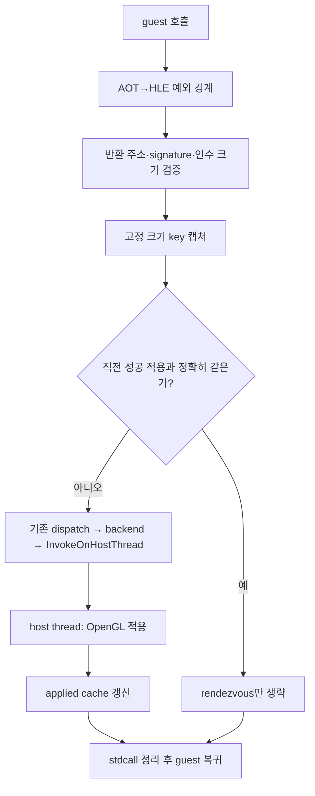

# 20260730-365 성공한 동일 Glide 상태의 보수적 생략 설계 / Conservative elision of already-applied Glide state

## 한국어

### 1. 목적과 근거

[Task 363 계획](20260730-363-glide-call-performance-plan.md)의 2단계이며
[Task 364 측정](20260730-364-glide-setter-state-census.md)이 근거입니다. Task 364는
상태 setter 호출의 **90.71%가 직전 성공 적용과 정확히 같은 상태**임을 확인하고, 생략
상한을 **wall의 4.55%, Glide gate의 25.11%** 로 측정했습니다.

이 작업은 그중 반복률과 상태 공간이 모두 유리한 **7종만** 대상으로 host rendezvous를
생략합니다. 원본 게임 호출은 삭제하지 않고, EXE도 수정하지 않습니다.

### 2. 무엇을 생략하고 무엇을 유지하는가

현재 setter 한 번의 경로와 생략 지점입니다.

**유지되는 것:** 예외 경계 진입, 반환 주소 검증, signature 검증, 인수 크기 검증,
gate 진입 계수, `glide_gate_handled_count`, stdcall 프레임 정리(`Esp += 4 + 인수
바이트`), 반환 주소 복귀, 호출 순서. guest가 실행하는 명령은 하나도 바뀌지 않습니다.

**생략되는 것:** `InvokeOnHostThread` 왕복(mutex, command 게시, condition variable
왕복)과 중복 OpenGL 적용뿐입니다.

Task 364가 확인한 대로 그 왕복 안에 **rendezvous 기상 직후 첫 GL 접촉** 비용이
들어 있으므로 생략은 그 비용을 함께 제거합니다. `glGetError` 자체를 제거하는 방향은
Task 364에서 기각됐고 여기서도 하지 않습니다.

### 3. 생략이 관측 불가능한 이유

#### 3.1 GL 상태 결합 감사 (선행 조건, 완료)

캐시 방식의 유일한 실제 위험은 **setter를 거치지 않고 GL 상태를 바꾸는 경로**입니다.
`glide_opengl_backend.cpp`의 모든 GL 상태 변경 지점을 감사했습니다.

| 경로 | 캐시 대상 상태 | 판정 |
|---|---|---|
| LFB blit (`grLfbUnlock`) | depth test/blend/cull/alpha test/scissor test/color mask/draw buffer를 강제 변경 | **`glIsEnabled`·`glGetBooleanv`로 실제 상태를 조회해 저장하고 그대로 복원** — 안전 |
| LFB blit | `glDepthMask`, `glBlendFunc`, `glDepthFunc`, fog, dither, scissor **box**는 미변경 | 안전 |
| `grBufferClear`의 `glClear` | mask를 읽지만 바꾸지 않음 | 안전 |
| window open의 `glScissor` | window open은 무효화 gate | 안전 |
| shader 경로 (`SetBlitMode`/`SetTextureEnabled`) | blit이 바꾼 뒤 즉시 복원 | 안전 (단 combine setter는 이번 대상 아님) |

**확인됨: 캐시 상태를 몰래 바꾸는 경로는 없습니다.** LFB blit은 캐시를 재생하는 방식이
아니라 진짜 GL 상태를 조회해 되돌리므로 blit 전후 상태가 동일합니다.

#### 3.2 `glide_state` mirror의 멱등성

7종 각 case는 backend 호출 뒤 `context->glide_state`에 값을 복사합니다
(`clip_min_x`, `cull_mode`, `fog_mode`, `alpha_blend`, `alpha_test_function` 등).
이 mirror는 `grGlideGetState`가 `BuildGlideStateImage`로 guest에 돌려주므로 실제로
읽힙니다.

생략해도 안전한 이유는 **멱등성**입니다. 캐시가 "직전 성공 적용 == 현재 인수"라고
말하는 순간, 그 직전 적용이 이미 동일한 값을 mirror에 썼습니다. key가 인수 dword
전체를 담으므로 인수가 같으면 mirror도 같습니다. 따라서 쓰기를 건너뛰어도 mirror는
동일한 값을 유지하며 `grGlideGetState`가 돌려주는 이미지도 바뀌지 않습니다.

#### 3.3 캐시가 "요청됨"이 아니라 "성공 적용됨"을 뜻함

Task 364의 census가 이미 쓰는 규칙을 그대로 씁니다. 규칙을 두 번 정의하지 않도록
**공유 rule 모듈로 추출**하고 census(관측자)와 cache(행위자)가 같은 함수를 씁니다.

* backend 실패, retain된 unsupported 인수는 기록을 **무효화**합니다.
* `grSstWinOpen`/`grSstWinClose`/`grGlideInit`/`grGlideShutdown`/`grGlideSetState`/
  `grRenderBuffer`는 **전체 캐시를 무효화**합니다.
* texture 상태 key는 census 내부 monotonic generation을 포함하고 texture download마다
  증가합니다(이번 batch에는 texture setter가 없지만 배선은 유지합니다).
* ABI 검증(반환 주소·signature·인수 크기)이 **실패할 gate는 생략 대상이 아닙니다.**
  생략 판정은 세 검증을 모두 통과한 뒤에만 적용합니다.

#### 3.4 `message_` 경합 회피

현재 `backend.message_`는 host thread가 쓰고 guest는 rendezvous로 차단되어 상호
배타적입니다. 생략 시 guest thread가 그 host 소유 문자열을 쓰면 경합이 됩니다.
따라서 **생략 경로는 `backend.message_`를 건드리지 않습니다.**
`context->glide_backend_message`(guest 소유 진단 mirror)도 갱신하지 않습니다. 생략된
상태는 정의상 직전에 성공 적용된 상태이므로 그때의 메시지가 여전히 정확합니다.

### 4. 1차 대상 (batch 1)

Task 364 측정에서 반복률 99.9% 이상이고 고유 인수가 1~2종인 7종만 선정했습니다.
고유 인수가 적다는 것은 상태 공간이 사실상 상수여서 캐시가 헛돌 여지가 없다는 뜻입니다.
7종 모두 `GlideReturnKind::kVoid`이므로 생략 시 반환값 계약도 균일합니다.

| ordinal | API | 호출(중앙값) | 반복률 | 고유 인수 | wall 절감 상한 |
|---:|---|---:|---:|---:|---:|
| 91 | `grColorMask` | 6,161 | 99.95% | 1 | 0.519% |
| 79 | `grAlphaBlendFunction` | 4,674 | 99.94% | 2 | 0.397% |
| 89 | `grClipWindow` | 4,674 | 99.96% | 1 | 0.379% |
| 82 | `grAlphaTestFunction` | 4,674 | 99.96% | 1 | 0.347% |
| 101 | `grFogMode` | 4,679 | 99.96% | 1 | 0.344% |
| 94 | `grCullMode` | 4,674 | 99.96% | 1 | 0.343% |
| 96 | `grDepthBufferFunction` | 4,674 | 99.96% | 1 | 0.317% |
| | **합계** | | | | **2.65%** |

전체 20종 상한 4.55% 중 **58%를 7종으로** 얻습니다. Glide gate 기준 14.6%입니다.

**제외 대상과 이유**

* `grTexSource` — 반복률 32.24%, 최대 연속 3회. 생략 이득이 거의 없습니다.
* `grDepthMask`(72.63%), `grConstantColorValue`(77.67%) — 반복률이 낮고 실제 변경이
  많아 별도 batch에서 판정합니다.
* `grAlphaCombine`/`grColorCombine`(99.54%) — 반복률은 좋지만 shader 객체 상태를
  경유하고 LFB blit이 `SetBlitMode`/`SetTextureEnabled`를 만지므로 후속 batch입니다.
* `grTexClampMode`/`FilterMode`/`MipMapMode`(99.73%) — texture generation 의미를
  batch 1에서 함께 검증하지 않기 위해 후속 batch입니다.

### 5. 기본값과 A/B 스위치

Task 335의 `REPIU_GLIDE_GATE_PUMP` 선례를 따라 **기본 ON**, `REPIU_GLIDE_SETTER_ELIDE=0`
으로 기존 rendezvous를 복원합니다. A/B가 실제 배포 구성을 측정하고 시각 gate가
배포되는 것을 검증하도록 하기 위해서입니다.

### 6. 검증 계약

Task 363 §5를 유지하고 이번 작업에 특화된 gate를 추가합니다.

| gate | 기준 |
|---|---|
| E1 구조적 교차검증 | census `same_count`(순수 관측자) == cache `elided_count`(실제 생략). **확인된 중복만 생략했음을 증명** |
| E2 호출 보존 | 7종의 gate 진입 수와 census `call_count`가 OFF/ON에서 동일 범위 |
| E3 ABI | `completed ordinal <= handled gate`, get-proc/gate/frame liveness 유지 |
| E4 안정성 | malformed/fatal/implementation issue/overflow/clamp = 0 |
| E5 성능 | 프레임 **3회 중앙값** 개선, Glide gate 비중 감소 |
| E6 시각 | `REPIU_GLIDE_PIXEL_DIAG` back-buffer 통계(non-black 비율, 평균 RGB)가 OFF/ON에서 동등 |
| E7 시퀀스 동일성 | swap별 통계를 phase offset을 두고 대응시켜 렌더 시퀀스가 동일함을 확인 |
| E8 EEPROM | 격리 seed, 실행 후 hash 일치 |

**E1이 이번 작업의 핵심 gate입니다.** census는 동작을 바꾸지 않는 순수 관측자이므로,
그것이 "중복"이라고 센 횟수와 실제로 생략한 횟수가 정확히 같다면 생략 판정이 관측과
일치한다는 뜻입니다. 두 값이 다르면 즉시 실패로 처리합니다.

**E6의 한계와 E7의 정정.** 실행 간 진행도가 다르므로(Task 335: 프레임 편차 18%) 같은
swap index가 같은 게임 시각이 아니고, 전체 back buffer의 cross-run byte diff는 이
harness로 불가능합니다.

초기 설계는 E7을 `REPIU_GLIDE_FRAME_DUMP` BMP 육안 비교로 잡았으나 **그 변수는
back buffer 이미지가 아니라 draw-call 추적입니다.** back buffer 스크린샷 기능은
현재 없습니다. 따라서 E7을 **시퀀스 동일성 검사**로 대체합니다. `PIXEL_DIAG`는 swap
번호별로 non-black 픽셀 수와 채널별 평균을 남기므로, OFF/ON을 phase offset을 주고
대응시켜 통계가 정확히 일치하는 비율을 셉니다. 생략이 옳다면 같은 내용을 더 빨리
그리므로 **어떤 offset에서 대응이 급격히 좋아져야** 하고, mask/blend가 깨졌다면 어떤
offset에서도 일치하지 않습니다. 이는 집계 평균 비교보다 훨씬 강한 검사입니다.

### 7. 사전 등록 판정

* **P1:** 프레임 3회 중앙값이 개선되고 E1·E4·E6이 성립 → batch 1 채택, batch 2
  (`grDepthMask`, `grConstantColorValue`, texture 3종)로 진행합니다.
* **P2:** E1 실패 → 즉시 되돌립니다. 생략 판정과 관측이 어긋난다는 뜻이므로 규칙
  자체를 재검토합니다.
* **P3:** 프레임 개선이 관측 편차(±5%) 안에 묻힘 → 기능은 남기되 기본값을 재검토하고,
  이득이 큰 장면(LFB 없는 gameplay)에서 재측정할 때까지 batch 2를 보류합니다.
* **P4:** E6/E7에서 시각 차이 → 되돌리고 §3.1 감사에서 놓친 경로를 찾습니다.

### 8. 금지 사항

Task 363 §6을 유지합니다. 추가로 이번 작업에서는 서로 다른 상태를 합치지 않고,
draw를 넘어 상태 변경을 이동하지 않고, `glGetError`를 제거하지 않고, 인수가 다른
호출을 생략하지 않습니다. 생략은 **정확한 동일 인수 + 직전 성공 적용**에만 적용합니다.

---

## English

### Objective

This is stage two of the [Task 363 plan](20260730-363-glide-call-performance-plan.md),
justified by [Task 364](20260730-364-glide-setter-state-census.md), which measured
that 90.71% of state-setter calls exactly repeat the previously applied state and
put the elision ceiling at 4.55% of wall time and 25.11% of the Glide gate. This
task elides the host rendezvous for the seven setters whose repetition rate and
state space are both favourable. No original game call is removed and the
executable is untouched.

### What is elided

Only the `InvokeOnHostThread` round trip — the mutex, the command publication,
the condition-variable handoff — and the redundant OpenGL application. Exception
boundary entry, return-address validation, signature validation, argument-size
validation, gate counting, `glide_gate_handled_count`, the stdcall frame cleanup,
the return, and call order all stay exactly as they are, so the guest executes
identical instructions. Because Task 364 showed the dominant host cost is the
first GL touch after the rendezvous wake, eliding removes that cost with it;
removing `glGetError` itself was rejected in Task 364 and is not done here.

### Why the elision is unobservable

**GL state coupling was audited first**, because a path that mutates cached
state without going through a setter is the only real hazard. The LFB blit does
force depth test, blend, cull, alpha test, scissor test, color mask, and draw
buffer, but it saves them by querying real GL state with `glIsEnabled` and
`glGetBooleanv` and restores them afterwards, so state is identical across the
blit; it never touches `glDepthMask`, `glBlendFunc`, `glDepthFunc`, fog, dither,
or the scissor box. `glClear` reads masks without changing them, and the window
open's `glScissor` precedes an invalidating gate. No path mutates cached state
silently.

**The `glide_state` mirror is idempotent.** Each case copies its arguments into
`context->glide_state`, which `grGlideGetState` really does read back through
`BuildGlideStateImage`. But the moment the cache says the current arguments equal
the last successful application, that application already wrote the same values,
and the key holds every argument dword — so skipping the write leaves the mirror
and the returned state image unchanged.

**The cache means applied, not requested.** It reuses Task 364's rules through a
shared rule module so they are not defined twice: backend failures and retained
unsupported arguments void the record; window open/close, Glide init/shutdown,
set-state, and render-buffer changes void everything; texture keys carry the
download generation. The elision decision is applied only after return-address,
signature, and argument-size validation all pass, so a gate that would have been
rejected is never elided.

**`message_` is left alone.** It is host-owned and currently mutually exclusive
with the guest through the rendezvous, so writing it from the guest thread on the
elided path would be a race. The elided state is by definition the state that was
last applied successfully, so the message from that application is still accurate.

### Batch one

Seven setters with repetition at or above 99.9% and one or two distinct argument
values: `grColorMask`, `grAlphaBlendFunction`, `grClipWindow`,
`grAlphaTestFunction`, `grFogMode`, `grCullMode`, and `grDepthBufferFunction`.
All seven return void, so the elided return contract is uniform. Together they
hold 2.65% of wall time in the Task 364 scene — 58% of the whole 4.55% ceiling
from seven of twenty setters, or 14.6% of the Glide gate.

Excluded: `grTexSource` at 32.24% repetition is not worth eliding;
`grDepthMask` (72.63%) and `grConstantColorValue` (77.67%) change often enough to
deserve their own batch; the combine setters route through shader object state
the blit also touches; and the texture clamp/filter/mipmap setters are deferred
so texture-generation semantics are not validated in the same batch.

Following the Task 335 precedent, elision is on by default with
`REPIU_GLIDE_SETTER_ELIDE=0` restoring the rendezvous, so the A/B measures the
shipping configuration.

### Gates and pre-registered decisions

Task 363's contract holds, plus: **E1**, the structural cross-check that the pure
observer's `same_count` equals the actor's `elided_count`, proving only confirmed
duplicates were skipped; E2 call preservation; E3 ABI and liveness; E4 zero
malformed/fatal/issue/overflow/clamp; E5 a three-run median frame improvement
with a falling Glide share; E6 equivalent back-buffer pixel statistics; E7 human
comparison of frame dumps; E8 EEPROM isolation.

E6's limit is stated deliberately: run progress differs between runs, so the same
swap index is not the same game instant and **cross-run byte-exact pixel diffing
is not possible with this harness**. E6 is therefore an aggregate over many
frames, backed by E7, which together detect a broken mask or blend because the
aggregate would move sharply.

P1 adopts batch one and proceeds to batch two if frames improve with E1, E4, and
E6 holding. P2 reverts immediately on an E1 failure, because a disagreement
between the decision and the observation invalidates the rules. P3 keeps the
feature but revisits the default if the gain hides inside run variance, deferring
batch two until a scene with a larger share is measured. P4 reverts on any visual
difference and finds the path the audit missed.

### Prohibitions

Task 363's prohibitions hold. Additionally this task merges no distinct states,
moves no state change across a draw, removes no `glGetError`, and never elides a
call whose arguments differ. Elision applies only to an exact argument match
against a previously successful application.
