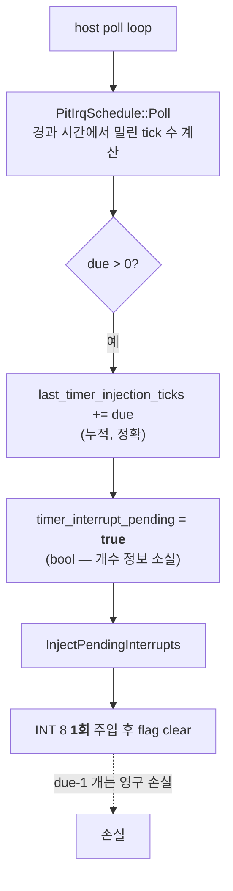
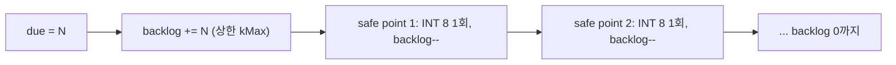

# 20260730-366 Timer tick 전달과 프레임 pacing 귀속 설계 / Timer tick delivery and frame pacing

## 한국어

### 1. 왜 이 작업인가

[Task 365](20260730-365-glide-setter-state-elision.md)는 Glide gate 비용을 5.13%p
줄였는데 프레임이 변하지 않았습니다. Task 335도 같은 형태였습니다. **비용을 줄여도
처리량으로 환산되지 않는 신호가 두 번 나왔으므로, 다음 비용을 줄이기 전에 무엇이
pacing하는지 확정해야 합니다.**

Task 365의 같은 실행에서 세 가지가 함께 관측됐습니다.

1. 해방된 약 3.1초가 프레임이 아니라 **guest busy-wait**로 갔습니다. timer safe-point
   trap이 프레임당 `4.80 → 5.25`(+9.4%)로 늘었습니다.
2. `INT 8` 전달률은 **198.5~208.5Hz**인데 guest가 프로그램한 divisor 4972는
   **240Hz**입니다.
3. 프레임당 tick은 6회 중 5회가 **9.88~10.25**로 좁고, tick rate가 가장 높은
   실행(208.5Hz)이 프레임도 가장 많았습니다(1,384).

즉 **게임이 tick 약 10개마다 한 프레임을 그리고, 우리가 tick을 프로그램된 만큼 주지
못하고 있을 가능성**이 있습니다. 이 설계는 그것을 측정하고 인과를 판정합니다.

### 2. 코드 감사로 확인된 손실 기전

전달 경로를 읽어 손실 지점을 특정했습니다.

**확인됨:** `PitIrqSchedule::Poll`은 catch-up 방식이라 밀린 tick 수를 정확히
돌려줍니다(`due`). 그러나 `timer_interrupt_pending`은 **`std::atomic<bool>`** 이므로
`due`가 3이든 10이든 guest는 `INT 8`을 **한 번만** 받고 나머지는 사라집니다.
`InjectPendingInterrupts`는 flag를 clear하고 한 번만 주입합니다.

`port_io_emulator.cpp`의 주석 "IRQ0 delivery is already coalesced by
`timer_interrupt_pending`"이 이 설계가 의도적이었음을 확인해 줍니다.

**미확정:** 실제 손실률. `last_timer_injection_ticks`가 누적 due를 갖고 있지만
**종료 요약에 보고되지 않아** 지금까지 비교된 적이 없습니다.

### 3. 이 손실이 왜 성능만의 문제가 아닌가

PIU는 리듬 게임입니다. guest의 내부 시계는 `INT 8` **횟수**로 진행하는데, CD 오디오는
실시간으로 흐릅니다(Task 350이 실제 재생 위치를 guest에 전달합니다). tick을 7% 잃으면
guest 시계가 7% 느려지고 **스텝이 음악에 대해 밀립니다.**

따라서 이 항목은 처리량 최적화이자 **정확성 항목**입니다.

**단, 실기 충실도 논점을 분명히 합니다.** 실제 8259 PIC는 IRQ 라인당 pending 비트가
하나뿐이라 서비스 전에 도착한 IRQ0는 실기에서도 사라집니다. 즉 coalescing 자체는
하드웨어적으로 틀리지 않습니다. 다른 것은 **원인**입니다. 실기에서는 게임이 충분히
빨라 coalescing이 드물었고, 우리 쪽에서는 느려서 상시 발생합니다. 그러므로 목표는
"8259를 무시하고 tick을 밀어넣는 것"이 아니라 **밀린 tick을 버리지 않고 이후 safe
point에서 차례로 전달해 guest가 프로그램한 시간 기준을 회복하는 것**입니다.

### 4. 측정 (1단계)

항상 켜지는 고정 크기 counter를 추가합니다. poll loop는 초당 약 1,500회, 주입은 초당
약 200회이므로 counter 비용은 무시할 수 있습니다. 별도 clock read는 만들지 않습니다.

| counter | 의미 |
|---|---|
| `timer_tick_due_total` | `Poll`이 돌려준 due의 누적 (프로그램된 기준) |
| `timer_tick_injected_total` | 실제 주입된 `INT 8` 횟수 |
| `timer_tick_coalesced_total` | pending이 이미 서 있을 때 도착해 합쳐진 tick 수 |
| `timer_tick_max_backlog` | 한 번에 밀린 최대 tick 수 |
| `timer_tick_deferred_poll_count` | 주입 시도가 IF=0 또는 비-guest EIP로 미뤄진 횟수 |

**핵심 항등식:**
`due_total == injected_total + coalesced_total + dropped_total + backlog`
입니다. `backlog`는 종료 시점 미전달 잔여이고, `dropped_total`은 상한 초과와 vector
미등록으로 포기된 분입니다. 이 항등식이 성립해야 분해 경계가 옳습니다. Task 325/364와
같은 방식입니다.

이 단계만으로 답할 질문은 다음과 같습니다.

* 프로그램된 tick 대비 실제 전달률은 몇 %인가?
* 손실은 균일한가, 특정 구간(로딩·LFB)에 몰리는가?
* 최대 backlog는 얼마이고 큐 상한 설계에 필요한 값은 무엇인가?

### 5. 실험 (2단계) — 밀린 tick의 보존 전달

기본 OFF opt-in `REPIU_TIMER_TICK_BACKLOG=1`로 **bool을 상한 있는 counter로** 바꿉니다.

**의도적으로 burst 주입을 하지 않습니다.** 한 번에 N개를 연속 주입하면 guest 스택에
12N 바이트를 밀어 넣고 main loop를 굶길 수 있습니다. 대신 safe point마다 하나씩
빼내어 **자연스러운 pacing으로 backlog를 소진**합니다. 주입 기회는 초당 약 200회
이상이므로 240Hz 기준 backlog는 정상 상태에서 곧 0으로 수렴해야 합니다.

상한 `kMax`(초기값 64)를 두고 초과분은 `timer_tick_dropped_total`로 셉니다. 상한이
없으면 따라잡지 못하는 구간에서 backlog가 무한히 자라 guest가 과거 시간에 갇힙니다.
상한 초과가 관측되면 그 자체가 "따라잡을 수 없다"는 결론입니다.

기존 경로(기본값)는 한 줄도 바뀌지 않습니다.

### 6. 사전 등록 판정

* **T1 (인과 확정):** backlog ON에서 `injected_total`이 `due_total`의 98% 이상으로
  올라가고 **프레임 3회 중앙값이 5% 이상 증가** → 프레임은 tick 전달에 gated됨이
  확정됩니다. 기본값 전환을 검토합니다.
* **T2 (인과 기각):** 전달률은 올라갔는데 프레임이 5% 미만 변화 → 프레임은 tick 전달에
  gated되지 않습니다. tick 손실은 **리듬 정확성 항목으로만** 남기고 성능 축은 다시
  엽니다.
* **T3 (따라잡기 불가):** backlog가 상한에 계속 부딪히고 `dropped_total`이 큼 → 호스트가
  240Hz를 감당하지 못한다는 뜻이므로, 전달 방식이 아니라 실행 속도가 근본 원인입니다.
* **T4 (손실 없음):** 1단계에서 전달률이 이미 98% 이상 → 전제가 틀렸으므로 2단계를
  하지 않고 pacing 후보를 다시 세웁니다.

판정에 쓰는 프레임 수치는 **3회 중앙값**입니다(Task 335 규칙, 실행 간 편차 18%).

### 7. 검증 계약

| gate | 기준 |
|---|---|
| M1 항등식 | `due == injected + coalesced + dropped + backlog` |
| M2 관측자 | counter만 켠 구성과 기존 구성의 프레임 중앙값 차이 ±5% 이내 |
| M3 안정성 | malformed/fatal/implementation issue = 0 |
| M4 ABI | backlog ON에서도 `INT 8` 주입 프레임(EFLAGS/CS/EIP push)과 IF/TF 처리 동일 |
| M5 리듬 | CD 재생 위치와 guest tick 진행의 상대 오차를 OFF/ON에서 기록 |
| M6 EEPROM | 격리 seed, 실행 후 hash 일치 |

M4가 중요합니다. backlog 소진은 **주입 횟수만** 바꾸고 주입 1회의 의미는 바꾸지
않아야 합니다. IF=0이거나 비-guest EIP일 때 미루는 기존 조건은 그대로 둡니다.

### 8. 금지 사항

* guest가 프로그램한 것보다 **빠른** tick을 주지 않습니다. backlog는 이미 밀린 것만
  전달하며, 상한을 넘겨 미래 tick을 앞당기지 않습니다.
* burst 주입으로 guest 스택을 압박하지 않습니다.
* 프레임 수치를 위해 divisor를 바꾸거나 PIT 주파수를 조작하지 않습니다.
* 기존 safe-point 조건(IF, guest EIP)을 완화하지 않습니다.

---

## English

### Why now

Task 365 cut the Glide gate by 5.13 points and frames did not move; Task 335 had
the same shape. Two independent results now show cost removal not converting into
throughput, so what paces the run must be settled before cutting more cost.

Three things were observed together in Task 365's runs: the freed ~3.1 seconds
went into guest busy-waiting, with timer safe-point traps rising from 4.80 to
5.25 per frame; `INT 8` was delivered at 198.5-208.5 Hz while the guest had
programmed divisor 4972, which is 240 Hz; and ticks per frame sat in a tight
9.88-10.25 band with the highest-tick-rate run producing the most frames. The
game appears to draw roughly one frame per ten ticks while receiving fewer ticks
than it asked for.

### The loss mechanism, from code audit

`PitIrqSchedule::Poll` is a catch-up scheduler and returns the exact number of
ticks owed. But `timer_interrupt_pending` is an `std::atomic<bool>`, so whether
`due` is 3 or 10 the guest receives exactly one `INT 8` and the remainder is
gone; `InjectPendingInterrupts` clears the flag after a single injection. The
comment in `port_io_emulator.cpp` — "IRQ0 delivery is already coalesced by
`timer_interrupt_pending`" — confirms this was deliberate. The actual loss rate
is unknown, because `last_timer_injection_ticks` accumulates the owed count but
is never reported at exit, so the two have never been compared.

### Why this is a fidelity item, not only performance

PIU is a rhythm game whose internal clock advances on `INT 8` *count* while CD
audio runs in real time, and Task 350 already feeds the guest a real playback
position. Losing 7% of ticks runs the guest clock 7% slow and drifts steps
against the music.

The hardware argument is stated deliberately: a real 8259 has one pending bit per
IRQ line, so an IRQ0 arriving before service is lost on real hardware too, and
coalescing is not itself wrong. What differs is the cause — on original hardware
the game was fast enough that coalescing was rare, while here it is constant. The
goal is therefore not to bypass the 8259 but to stop discarding owed ticks and
deliver them at subsequent safe points, restoring the time base the guest
programmed.

### Stage one: measurement

Always-on fixed-size counters, adding no clock reads, record ticks owed, ticks
injected, ticks coalesced away, the maximum backlog, and deferred injection
attempts. The partition identity `due == injected + coalesced + remainder` must
hold, on the Task 325 and 364 pattern. This alone answers what fraction of
programmed ticks the guest actually receives, whether the loss is uniform or
concentrated, and what queue bound a fix would need.

### Stage two: preserving owed ticks

Behind opt-in `REPIU_TIMER_TICK_BACKLOG=1`, the boolean becomes a bounded
counter. Injection deliberately stays one interrupt per safe point rather than a
burst, because injecting N back to back pushes 12N bytes onto the guest stack and
can starve its main loop; the backlog drains naturally across the roughly 200
injection opportunities per second. A cap of 64 bounds it, with the excess
counted as dropped — without a cap the guest would fall permanently into the
past, and hitting the cap is itself the finding that catching up is impossible.
The default path is unchanged.

### Pre-registered decisions

**T1** confirms causation if delivery reaches 98% of owed ticks and three-run
median frames rise by 5% or more, which puts the default up for review. **T2**
rejects it if delivery improves without frames moving, leaving tick loss as a
rhythm-accuracy item and reopening the performance question. **T3** covers the
backlog pinning at the cap with large drops, which would mean the host cannot
sustain 240 Hz and the root cause is execution speed rather than delivery. **T4**
covers stage one already showing 98% delivery, which would refute the premise
before stage two runs. All frame verdicts use three-run medians.

### Gates and prohibitions

M1 the partition identity; M2 a ±5% observer gate for the counters alone; M3 zero
malformed, fatal, and implementation issues; M4 that an injection's meaning is
unchanged — same pushed frame, same IF and TF handling, same deferral conditions
for IF=0 and non-guest EIP, with only the *number* of injections differing; M5 a
recorded relative error between CD playback position and guest tick progress in
both configurations; M6 EEPROM isolation.

The work never delivers ticks faster than the guest programmed, never bursts
injections into the guest stack, never alters the divisor or PIT frequency to
improve a number, and never relaxes the existing safe-point conditions.
