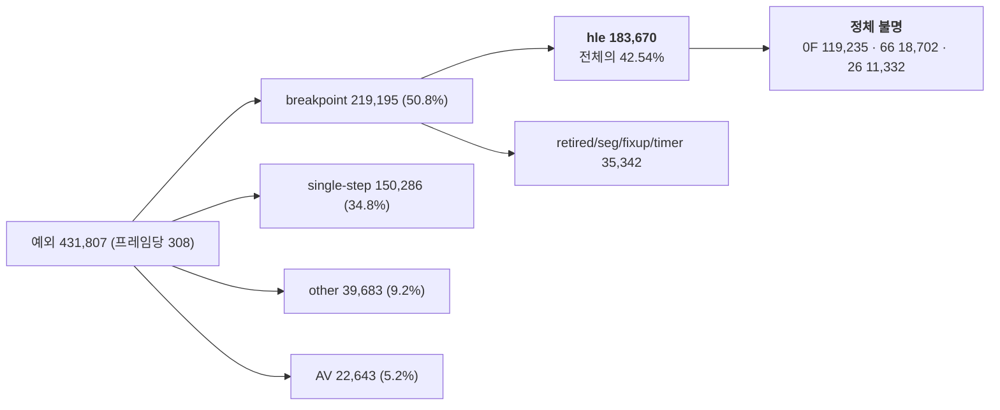

# 20260730-367 HLE boundary 예외 인구의 실제 명령 귀속 설계 / Attributing the HLE boundary exception population to real instructions

## 한국어

### 1. 왜 예외 축인가

세 결과가 같은 방향을 가리킵니다.

| Task | 관측 |
|---|---|
| 335 | Glide 비용 -3.53%p → 프레임 +5.5% |
| 365 | Glide 비용 -5.13%p → **프레임 변화 없음** |
| 366 | 프레임당 예외 **+6.8%** → 프레임 **-16.4%** |

비용 절감은 두 번 연속 처리량으로 환산되지 않았는데, 예외를 늘리자 프레임이 즉시
줄었습니다. **예외 횟수는 현재 처리량과 직접 연동된 것으로 확인된 유일한 축입니다.**
Task 336의 TF/`INT3` 제거 상한 1.38~1.44배도 여기에 걸려 있습니다.

### 2. 이미 확보된 분해 — 새 계측 없이 확인됨

Task 366의 Release 60초 실행 로그를 재합산했더니 breakpoint 인구가 **이미 완전히
귀속돼 있었습니다.** 지금까지 이 합을 맞춰본 적이 없을 뿐입니다.

현재 예외 구성(60초, 프레임 1,400):

| 종류 | 횟수 | 전체 대비 |
|---|---:|---:|
| **breakpoint (`INT3`)** | **219,195** | **50.8%** |
| single-step (TF) | 150,286 | 34.8% |
| other | 39,683 | 9.2% |
| access violation | 22,643 | 5.2% |
| 합계 | 431,807 | 프레임당 308.4 |

**확인됨: 단일 step run은 전부 길이 1입니다**(bucket 1 = 150,286, 2 이상 = 0). Task
337의 5~8 mode와 33+ 꼬리는 없습니다.

breakpoint 219,195의 provenance 분해와 **항등식이 정확히 성립합니다.**

| provenance | 횟수 | breakpoint 대비 | 전체 예외 대비 |
|---|---:|---:|---:|
| **`hle`** | **183,670** | **83.79%** | **42.54%** |
| `retired` | 12,115 | 5.53% | 2.81% |
| `seg` | 11,467 | 5.23% | 2.66% |
| `fixup` | 6,207 | 2.83% | 1.44% |
| timer safe point | 5,553 | 2.53% | 1.29% |
| `inline` | 183 | 0.08% | 0.04% |
| `jtable`/`probe`/`unknown` | 0 | 0% | 0% |

`213,642 + 5,553 = 219,195`으로 breakpoint 총계와 정확히 일치합니다.

**따라서 단일 최대 인구는 `hle` provenance breakpoint이며 전체 예외의 42.54%입니다.**

### 3. 무엇이 막고 있는가 — 계측 공백

그 인구가 **어떤 명령**인지는 모릅니다. boundary opcode census가 있지만
`RecordAotOtherBoundarySample`이 **`bytes[0]`만** 기록하기 때문입니다.

관측된 상위 8개(합 199,448 / other boundary 201,344 = 99.1% coverage):

| byte | 횟수 | 정체 |
|---|---:|---|
| **`0F`** | **119,235** | **두 바이트 opcode escape — 실제 명령 불명** |
| `66` | 18,702 | operand-size **prefix** — 실제 명령 불명 |
| `8C` | 18,603 | `MOV r/m16, Sreg` |
| `8E` | 17,652 | `MOV Sreg, r/m16` |
| `26` | 11,332 | ES segment **prefix** — 실제 명령 불명 |
| `EE` | 6,171 | `OUT DX, AL` |
| `CF` | 6,167 | `IRET` |
| `1F` | 1,586 | `POP DS` |

**상위 인구의 59%(`0F`)와 추가 15%(`66`/`26` prefix)가 정체 불명입니다.** escape
바이트와 prefix를 명령으로 세고 있기 때문입니다. 이 상태로는 어떤 명령을 예외 없이
처리할 수 있는지 판단할 수 없습니다.

### 4. 이번 작업의 범위

**계측만 추가하고 동작은 바꾸지 않습니다.** `RecordAotOtherBoundarySample`은 이미
전체 바이트와 길이를 받으므로, 세는 대상만 늘리면 됩니다.

1. **legacy prefix를 건너뛴 실효 opcode** histogram(256).
   건너뛸 prefix: `26 2E 36 3E 64 65`(segment), `66`(operand size),
   `67`(address size), `F0`(lock), `F2 F3`(rep). 최대 4개까지만 건너뛰고 초과 시
   `prefix_overflow`로 셉니다.
2. **`0F` escape의 두 번째 바이트** histogram(256). 이것이 119,235건의 정체입니다.
3. prefix 유무별 카운트(어떤 명령이 segment override와 함께 오는지).

기존 `bytes[0]` histogram은 **그대로 유지**합니다. 연속성을 잃지 않기 위해서이며, 새
관점을 추가하는 것이지 대체하는 것이 아닙니다.

hot path에서 allocation·문자열·정렬을 하지 않습니다. 고정 크기 배열만 쓰고 정렬과
출력은 종료 시에만 합니다. 새 clock read도 만들지 않습니다(횟수만 셉니다).

### 5. 이 작업이 답할 질문

* `0F` 119,235건은 어떤 명령인가? `MOV CR`(`0F 20/22`), `LSS/LFS/LGS`
  (`0F B2/B4/B5`), `CPUID`(`0F A2`), `RDTSC`(`0F 31`) 중 무엇이 지배하는가?
* prefix 뒤의 실효 opcode 분포는 raw `bytes[0]` 분포와 얼마나 다른가?
* 상위 명령 클래스를 예외 없이 처리할 때 제거 가능한 예외의 **실측 상한**은 몇 %인가?

### 6. 사전 등록 판정

* **A1:** 단일 명령 클래스가 `hle` 인구의 50% 이상 → 그 클래스 하나를 exception-free로
  처리하는 설계를 다음 작업으로 확정합니다.
* **A2:** 상위 3개 클래스 합이 80% 이상 → 세 클래스를 묶어 진행합니다.
* **A3:** 상위 8개로도 80% 미만 → 인구가 분산돼 있으므로 명령별 접근을 버리고 경계
  기계 자체(Task 348 safe-point arming 비용 포함)로 방향을 바꿉니다.
* 어느 경우든 **제거 상한을 프레임 기준으로 환산해 기록합니다.** Task 336의
  전이 가격(`INT3` 34,521 tick)을 쓰되, 세션마다 재측정되고 최대 46% 흔들린다는 Task
  365의 방법 규칙을 명시합니다.

### 7. 검증 계약

| gate | 기준 |
|---|---|
| N1 항등식 | 실효 opcode histogram 합 == 기존 `bytes[0]` histogram 합 |
| N2 항등식 | breakpoint provenance 합 + timer trap == breakpoint 총계 |
| N3 관측자 | 동일 바이너리 3회 프레임 중앙값 차이 ±5% 이내 |
| N4 안정성 | malformed/fatal/implementation issue/overflow = 0 |
| N5 무변경 | 계측 외 동작 변경 없음이 diff로 확인됨 |

N1이 중요합니다. 같은 표본을 두 방식으로 세므로 합이 반드시 같아야 하며, 다르면
prefix 건너뛰기가 표본을 잃고 있다는 뜻입니다.

### 8. 금지 사항

* 명령 의미를 바꾸지 않습니다. 이번 작업은 세기만 합니다.
* 예외를 줄이기 위해 HLE 경계를 임의로 옮기지 않습니다.
* 현재 렌더링을 중단시키는 `REPIU_AOT_DBT_SUPERBLOCK`을 켜지 않습니다.
* 상위 클래스가 확정되기 전에 exception-free 경로를 구현하지 않습니다.

---

## English

### Why the exception axis

Three results point the same way: Task 335 cut Glide cost 3.53 points for 5.5%
more frames, Task 365 cut it 5.13 points for none, and Task 366 raised exceptions
per frame 6.8% and lost 16.4% of frames. Cost reduction stopped converting into
throughput, while adding exceptions removed frames immediately, making exception
count the only axis demonstrably coupled to throughput today — and the one Task
336's 1.38-1.44x TF/`INT3` bound rests on.

### What re-summing the existing logs already shows

The breakpoint population turns out to be **fully attributed already**; the sum had
simply never been checked. In a 60-second Release run at 1,400 frames there are
431,807 exceptions, 308.4 per frame: 219,195 breakpoints (50.8%), 150,286
single-steps (34.8%), 39,683 other (9.2%), and 22,643 access violations (5.2%).
Every single-step run has length one, so Task 337's five-to-eight mode and long
tail are gone.

Breakpoint provenance decomposes as `hle` 183,670, `retired` 12,115, `seg` 11,467,
`fixup` 6,207, timer safe points 5,553, `inline` 183, and zero elsewhere — and
`213,642 + 5,553 = 219,195` matches the breakpoint total exactly. **The single
largest population is `hle`-provenance breakpoints at 42.54% of all exceptions.**

### The instrumentation gap

What instructions those are is unknown, because `RecordAotOtherBoundarySample`
records only `bytes[0]`. The top eight cover 99.1% of the boundary population, but
`0F` at 119,235 is the two-byte opcode escape and `66` at 18,702 and `26` at 11,332
are prefixes — so 59% of the population plus another 15% is unidentified, counted
by escape byte and prefix rather than by instruction. Nothing can be decided about
exception-free handling from that.

### Scope

Instrumentation only, no behaviour change. The sampler already receives the full
bytes and length, so only the counting widens: a histogram of the effective opcode
after skipping legacy prefixes (`26 2E 36 3E 64 65`, `66`, `67`, `F0`, `F2 F3`, up
to four, with an overflow counter), a histogram of the second byte for `0F`-escaped
instructions, and per-prefix presence counts. The existing `bytes[0]` histogram is
kept rather than replaced, so continuity is preserved and this is an added view.
Fixed-size arrays only, no allocation or sorting on the hot path, and no new clock
reads since only counts are needed.

### Questions and pre-registered decisions

The work must say what the 119,235 `0F` instructions are — `MOV CR`, `LSS`/`LFS`/
`LGS`, `CPUID`, `RDTSC` — how far the effective-opcode distribution differs from the
raw one, and what measured ceiling of exception removal the top classes represent.
**A1**: a single class at 50% or more of the `hle` population makes an
exception-free design for that class the next task. **A2**: a top three summing to
80% or more takes all three. **A3**: a top eight below 80% means the population is
too dispersed for a per-instruction approach and the direction shifts to the
boundary machinery itself, including what continuous safe-point arming costs. In
every case the removal ceiling is converted to frames and recorded, using Task
336's transition price while stating Task 365's method rule that the price is
recalibrated per session and varies by up to 46%.

### Gates and prohibitions

N1, that the effective-opcode histogram sums to the same total as the existing
`bytes[0]` histogram, matters most: the same samples are counted two ways, so a
mismatch means prefix skipping is losing samples. N2 re-checks the provenance
identity, N3 is a ±5% observer gate on three-run median frames, N4 requires zero
malformed, fatal, implementation-issue, and overflow counts, and N5 requires the
diff to show no change beyond instrumentation. The work changes no instruction
semantics, moves no HLE boundary, does not enable the rendering-breaking superblock
path, and implements no exception-free path before the leading classes are known.
