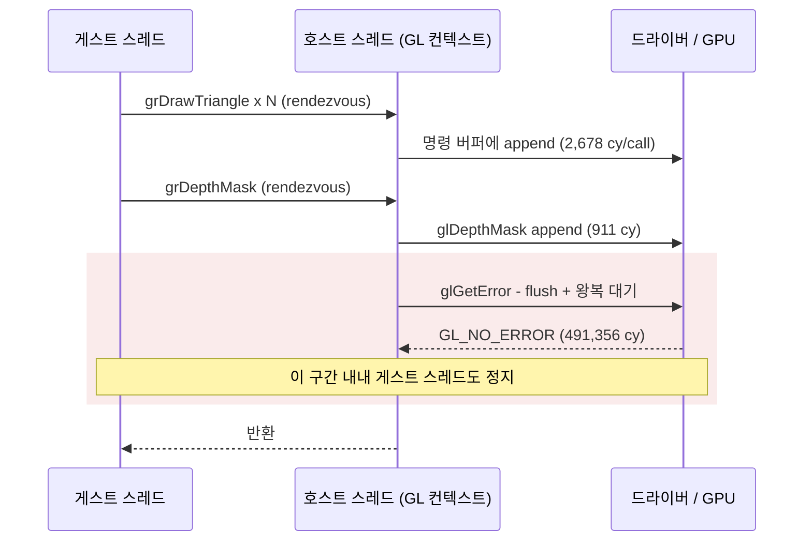
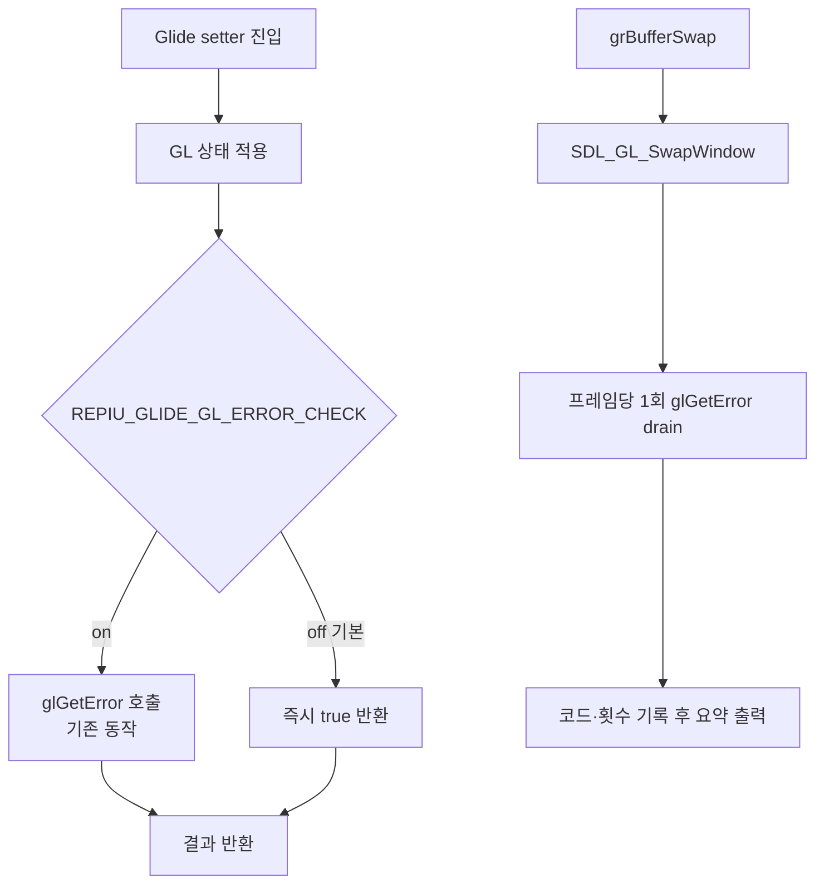

# Glide setter 경로 GL 에러 체크 정책 / GL error-check policy on the Glide setter path

Task 369. Task 364가 만든 setter phase 계측이 실제 gameplay 장면에서 답을 냈고,
그 답이 다음 최적화 대상을 바꿨습니다. 이 문서는 그 근거와 설계를 남깁니다.

* 선행: [20260730-363](20260730-363-glide-call-performance-plan.md),
  [20260730-364](20260730-364-glide-setter-state-census.md),
  [20260730-365](20260730-365-glide-setter-state-elision.md)
* 측정 근거: [docs/analysis/glide-gate-cost-attribution.md](../analysis/glide-gate-cost-attribution.md)
* 캡처 절차: [docs/guides/gameplay-scene-capture.md](../guides/gameplay-scene-capture.md)

## 한국어

### 1. 문제

사용자가 `REPIU_GLIDE_SETTER_PHASE=1`로 실제 플레이 장면을 캡처한 결과,
`grDepthMask` 비용의 구성이 확정됐습니다.

| 구간 | 총 cycles | 호출당 | 비율 |
|---|---:|---:|---:|
| `glDepthMask()` (apply) | 22,576,956 | 911 | 0.19% |
| `glGetError()` (error) | 12,172,660,110 | **491,356** | **99.81%** |

24,774회 호출, `errors=0`, `max-error=53,722,433` cycle(14.55 ms). 같은 실행에서
독립 계측인 ordinal timing의 `work`(12,222,557,126)와 99.78% 일치합니다.

`glGetError`만으로 **wall의 6.24%, Glide gate의 38.1%**입니다.

### 2. 왜 비싼가

OpenGL은 비동기 명령 스트림입니다. `glDepthMask`는 프로세스 내 클라이언트측 명령
버퍼에 토큰을 append하고 리턴합니다(911 cycle). 반면 `glGetError`는 사양상
**이전에 발행된 모든 명령이 에러 여부를 확정할 지점까지 진행되도록 강제**해야
하므로, Windows ICD에서 명령 버퍼 flush와 드라이버 왕복을 유발합니다.
`glFinish`, `glReadPixels`와 같은 동기화 지점 부류입니다.

비용은 `glGetError` 자체가 아니라 **앞에 쌓인 양에 비례**합니다. 평균 491,356
cycle 대비 최대 53,722,433 cycle(110배)이 그 증거입니다.

### 3. 이 구조에서 특히 나쁜 이유

1. **게스트 스레드가 함께 멈춥니다.** GL 컨텍스트는 호스트 스레드 소유이고 게스트는
   rendezvous로 건너옵니다. flush 동안 에뮬레이트되는 CPU가 133 µs 정지합니다.
2. **프레임당 18.7회 강제 배수합니다** (24,774 / 1,326 프레임). 정상적인 앱은
   present에서 프레임당 한 번 동기화합니다.
3. **CPU/GPU 중첩이 사라집니다.** 프레임당 삼각형이 86개뿐이라 GPU는 놀고 있는데도
   드라이버는 배치를 모으지 못합니다.

### 4. 얻는 정보가 없습니다

* 3회 캡처 24,774회 호출 중 `errors=0`. 한 번도 에러가 없었습니다.
* `glGetError`는 **컨텍스트 단위** 플래그를 반환합니다. `grDepthMask`가 낸 에러가
  아니라 아직 실행되지 않았던 임의의 선행 명령이 낸 에러입니다. 따라서 값이 0이
  아니었더라도 `linexe_glide_boundary.cpp`의
  `decline_gate("depth-mask-backend-failure")`는 **남의 에러를 `grDepthMask` 탓으로
  귀속**하게 됩니다. 비싸기만 한 것이 아니라 귀속도 부정확합니다.

### 5. 설계

**핵심: 호출당 에러 체크를 기본 OFF로 내리고, 프레임당 1회 체크로 대체합니다.**

| 항목 | 결정 |
|---|---|
| 정책 게이트 | `REPIU_GLIDE_GL_ERROR_CHECK`, 기본 **OFF** |
| OFF일 때 setter 반환 | 상태 적용이 성공하면 `true` (에러 체크 생략) |
| ON일 때 | 기존 동작과 완전히 동일 (회귀 비교용) |
| 대체 안전망 | `BufferSwapOnHostThread`에서 **present 직후** 1회 drain·기록 |
| 관측 | 프레임 체크 횟수 / 에러 횟수 / 최초 에러 코드 / drain 반복수 |

안전망을 present **직후**에 두는 이유: swap 자체가 이미 동기화 지점이므로 그 뒤의
`glGetError`는 추가 flush를 유발하지 않습니다. 에러 플래그는 조회될 때까지 유지되므로
해당 프레임의 에러를 놓치지 않습니다.

> **[Task 370에서 반증됨]** 앞 문단의 전제가 틀렸습니다. `SDL_GL_SwapWindow`는 flip을
> 큐에 넣고 44 µs 만에 돌아오며 명령 스트림을 배수하지 않습니다. 그 결과 이 검사가
> 프레임의 **유일한 동기화 지점**이 되어 호출당 3.64 ms, wall의 10.71%가 됐습니다.
> Task 370이 이 검사를 제거하고 `glDebugMessageCallback`으로 대체했습니다. 상세:
> [설계 370](20260731-370-glide-gl-debug-output.md)

### 6. 적용 범위

**게이트 적용 (setter 핫 경로, 13개소):** `SetColorMask`, `SetRenderBuffer`,
`SetDepthMask`, `SetDepthBufferMode`, `SetAlphaBlend`(선행 drain 루프 + 후행 체크),
`SetAlphaTestFunction`, `SetAlphaTestReferenceValue`, `SetDepthBufferFunction`,
`SetFogMode`, `SetClipWindow`, `SetCullMode`, `SetDitherMode`.

**제외 (3개소):** `StoreTexture`(텍스처 업로드 실패는 실제로 의미가 있고 62회뿐),
`PresentLfbSurface`, `ReadbackFramebuffer`(`glReadPixels`로 이미 동기화 지점).

Task 364의 phase 계측은 **그대로 둡니다.** OFF 상태에서 `error` 구간이 0에
수렴하는 것이 이 변경이 실제로 적용됐다는 증거가 됩니다.

### 7. 기대치와 검증

| 지표 | 현재 | 기대 |
|---|---:|---|
| `grDepthMask` 호출당 gate | 542,835 cy | 약 45,000 cy (rendezvous 왕복분만) |
| `glGetError` wall 비중 | 6.24% | 0% |
| `grDitherMode` work/call | 89,577 cy | 크게 감소(상한 0.35%p) |
| 총 회수 | — | **wall의 6.2 ~ 6.6%** |

정직한 한계: 133 µs 중 일부가 드라이버가 미뤄둔 실제 작업(셰이더 검증, 상태
validation)이라면 그 부분은 다음 flush 지점으로 **이동**합니다. ordinal별 `work`를
이미 전량 계측하고 있으므로 재캡처 한 번으로 어디로 갔는지 드러납니다. 이동이
확인되면 회수분은 줄지만, **게스트 스레드가 rendezvous에 묶여 정지하던 시간이
present 시점으로 옮겨간다는 것만으로도 이득**입니다.

### 8. 우선순위 변경

Task 365 batch 2(`grDepthMask`를 생략 집합에 추가)는 **이 작업 뒤로 미룹니다.**
본 변경 후 `grDepthMask` 단가가 542,835 → 약 45,000 cycle로 떨어지면 생략의 상한도
wall 6.89% → 약 0.55%로 붕괴합니다. 두 조치는 같은 비용을 두고 경쟁하며 본 변경이
압도적입니다.

### 9. 위험

| 위험 | 완화 |
|---|---|
| 실제 GL 에러를 놓침 | 프레임당 1회 체크가 코드·횟수를 요약에 남김 |
| `decline_gate` 경로가 죽음 | 3회 캡처에서 한 번도 타지 않음(`errors=0`, gate handled 489,095/489,096). ON으로 되돌리면 복원 |
| 프레임당 체크가 비쌈 | present 직후라 추가 flush 없음. `grBufferSwap` work로 즉시 확인 가능 |
| 변경이 적용 안 됨 | phase 계측의 `error` 구간이 0인지로 확인 |

---

## English

### Problem

With `REPIU_GLIDE_SETTER_PHASE=1` on a real gameplay capture, the composition of
`grDepthMask` cost is settled: `glDepthMask` itself is 911 cycles per call (0.19%)
while the trailing `glGetError` is 491,356 cycles per call (**99.81%**), across
24,774 calls with `errors=0` and a worst case of 53,722,433 cycles (14.55 ms). An
independent instrument — the per-ordinal `work` counter — agrees to 99.78%. The
error check alone is **6.24% of wall time and 38.1% of the Glide gate**.

### Why it costs that much

OpenGL is an asynchronous command stream: `glDepthMask` appends a token to an
in-process command buffer and returns. `glGetError` must, by specification, make
every previously issued command reach the point where its error status is known,
which on a Windows ICD means flushing the command buffer and waiting for the
driver — the same class of synchronisation point as `glFinish` and `glReadPixels`.
The cost is therefore proportional to what is queued ahead of it, not to the call
itself; the 110x spread between the mean and the maximum is the evidence.

This structure is hit three times harder than a normal GL application: the GL
context is owned by the host thread and the guest reaches it through a rendezvous,
so the flush stalls the emulated CPU too; it happens 18.7 times per frame instead
of once at present; and it prevents the driver from batching even though only 86
triangles per frame are submitted.

The check also buys nothing. It never once reported an error, and because
`glGetError` returns a context-wide flag rather than a per-call result, a nonzero
value would have been attributed to `grDepthMask` regardless of which earlier
command actually failed — so the existing `decline_gate("depth-mask-backend-failure")`
path is imprecise as well as expensive.

### Design

Move the per-call check behind `REPIU_GLIDE_GL_ERROR_CHECK`, defaulting to **off**,
and replace it with a single check per frame issued immediately after
`SDL_GL_SwapWindow`. Placing it after the present matters: the swap is already a
synchronisation point, so the check adds no further flush, and the GL error flag
persists until queried, so no error from that frame is lost.

> **[Disproved by Task 370]** This premise was wrong. `SDL_GL_SwapWindow` queues
> the flip and returns in 44 µs without draining the command stream, so the check
> became the frame's only synchronisation point at 3.64 ms per call, 10.71% of
> wall. Task 370 removed it in favour of `glDebugMessageCallback`. When the variable is
on, behaviour is identical to today, which keeps a regression baseline available.

Thirteen setter call sites are gated. Three are deliberately left alone —
`StoreTexture`, `PresentLfbSurface`, and `ReadbackFramebuffer` — because texture
upload failure is genuinely actionable and the readback path is already a
synchronisation point by nature. Task 364's phase instrument stays exactly as it
is: the `error` interval collapsing to zero is what proves the change took effect.

### Expectation, honesty, and sequencing

`grDepthMask` should fall from 542,835 cycles per call to roughly the rendezvous
round trip (~45,000), recovering **6.2 to 6.6% of wall time**. If part of the
133 µs is deferred driver work rather than round-trip cost, that part *moves* to
the next flush instead of disappearing; per-ordinal `work` is already measured
everywhere, so one re-capture shows where it landed. Even in that case, time the
guest thread spent frozen inside a rendezvous moves to present time, which is a
win on its own.

Task 365 batch two (adding `grDepthMask` to the elision set) is deferred behind
this change: once the per-call cost drops, the elision ceiling for that ordinal
collapses from 6.89% of wall to roughly 0.55%, so the two compete for the same
cost and this one is far larger.
