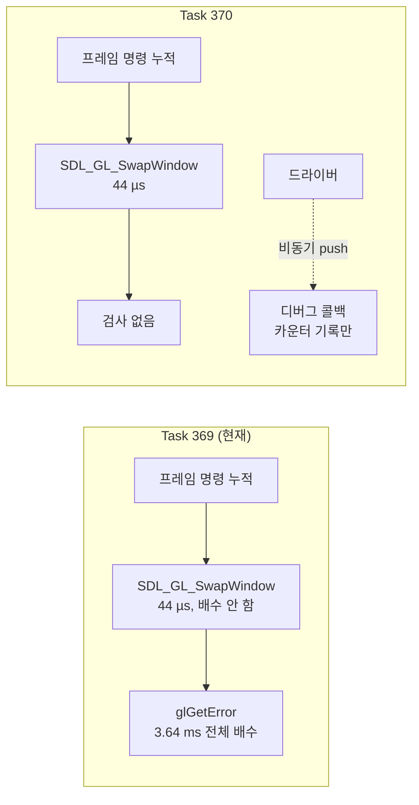

# 폴링 대신 push: GL 디버그 출력 / Push instead of polling: GL debug output

Task 370. Task 369가 만든 프레임당 `glGetError`를 제거하고, 동기화 없는
`glDebugMessageCallback`으로 대체합니다.

* 선행: [20260731-369](20260731-369-glide-gl-error-check-policy.md)
* 측정 근거: [docs/analysis/glide-gate-cost-attribution.md](../analysis/glide-gate-cost-attribution.md)

## 한국어

### 1. Task 369의 판단 오류

369 설계는 이렇게 적었습니다 — "swap이 이미 동기화 지점이므로 그 뒤의 `glGetError`는
추가 flush를 유발하지 않습니다."

**틀렸습니다.** `REPIU_GLIDE_SWAP_TIME_PROFILE=1` 캡처가 `grBufferSwap`을 분해한
결과입니다(1,876 프레임).

| 구간 | 호출당 | swap 대비 |
|---|---:|---:|
| setup | 264 | 0.00% |
| **present** (`SDL_GL_SwapWindow`) | **162,694** (44 µs) | 1.20% |
| **accounting** (369의 프레임 검사) | **13,445,145** (3.64 ms) | **98.80%** |
| finalize | 660 | 0.00% |

`SDL_GL_SwapWindow`는 flip을 큐에 넣고 44 µs 만에 돌아옵니다(`max-present`도 0.23 ms
뿐이라 vsync 블로킹조차 아닙니다). 즉 **명령 스트림을 배수하지 않습니다.** 그래서 그
직후의 `glGetError`가 그 프레임 누적 명령 전체의 유일한 동기화 지점이 됐습니다.

프레임당 19번의 작은 flush를 1번의 큰 flush로 바꾼 것이고, **그 1번이 wall의
10.71%**입니다.

`RecordPresentedFrame()`는 범인이 아닙니다. 같은 accounting 구간에 있지만 369 이전에도
있었고, 그때 `grBufferSwap` work는 호출당 212,582 cycle뿐이었습니다.

### 2. `glGetError`는 애초에 부를 필요가 없다

| 근거 | 관측 |
|---|---|
| 아무것도 반환한 적 없음 | 6회 실행, setter 수십만 회 + 프레임 검사 약 1만 회에서 `errors=0` |
| 귀속 불가 | 컨텍스트 단위 플래그라 실패한 호출을 지목하지 못함 |
| 소비자가 죽어 있음 | `decline_gate`는 gate 616,072회 중 1회만 미처리 |

폴링 자체가 잘못된 도구입니다.

### 3. 설계: push 방식으로 교체

`GL_KHR_debug`의 `glDebugMessageCallback`은 드라이버가 에러를 **콜백으로
밀어줍니다.** 폴링이 아니므로 **동기화가 없고**, `glGetError`보다 정보가 많습니다
(source, type, severity, id, 메시지, 그리고 실제 실패 지점).

| 항목 | 결정 |
|---|---|
| 프레임당 `glGetError` | 디버그 출력이 설치되면 **완전 제거** |
| 상시 보고 | `glDebugMessageCallback`, 콜백에서 카운터와 첫 메시지만 기록 |
| 폴백 | 콜백 미지원 시 **N프레임 주기** `glGetError` (기본 64) |
| 주기 조정 | `REPIU_GLIDE_GL_ERROR_FRAME_INTERVAL` (0이면 비활성) |
| 진단용 | `REPIU_GLIDE_GL_ERROR_CHECK=1`은 369대로 매 호출 검사 유지 |

### 4. 반드시 지킬 것

* **`GL_DEBUG_OUTPUT_SYNCHRONOUS`를 켜면 안 됩니다.** 그것이 바로 제거하려는 동기화를
  되살립니다. `GL_DEBUG_OUTPUT`만 켭니다.
* 콜백은 호스트 스레드에서 임의의 GL 호출 도중 실행되므로 **락·할당·I/O를 넣지
  않습니다.** 기존 profile 구조체(호스트 스레드 전용)에 기록만 하며, 첫 메시지는
  고정 크기 버퍼에 복사합니다.
* `NOTIFICATION` 등급은 드라이버 잡담이 많으므로 카운트만 하고 첫 메시지 후보에서
  제외합니다.
* 가용성은 **가정하지 않습니다.** 컨텍스트를 버전·프로파일 지정 없이 만들고 있어
  (`glide_opengl_backend.cpp`) 드라이버 기본 compatibility 컨텍스트를 받으므로 KHR_debug
  가용성이 높지만, `SDL_GL_GetProcAddress` 결과를 확인하고 실패하면 폴백합니다.

### 5. 기대치와 검증

| 지표 | 현재 | 기대 |
|---|---:|---|
| 프레임 검사 wall 비중 | 10.71% | **0%** (콜백) 또는 0.17% (폴백 N=64) |
| `grBufferSwap` work/call | 13,611,237 | present 수준(약 162,694)으로 하락 |

검증은 `REPIU_GLIDE_SWAP_TIME_PROFILE=1` 재캡처로 accounting 구간이 무시할 수준으로
떨어지는지 보면 됩니다. 같은 계측이 원인을 짚었으므로 같은 계측이 판정합니다.

**정직한 한계:** 동기화가 완전히 사라지면 드라이버가 미뤄둔 작업이 다른 지점으로 갈
수 있습니다. 다만 이번에는 근거가 있습니다 — present가 44 µs라는 것은 **GPU가 밀려
있지 않다**는 뜻이고(한 프레임치 실제 작업이 쌓였다면 flip이 블로킹됨), 프레임당
삼각형이 75개뿐입니다. 따라서 3.64 ms는 CPU측 왕복이지 실제 작업이 아닙니다.

---

## English

### The Task 369 misjudgement

Task 369 reasoned that a `glGetError` placed after the present would add no flush
because the swap had already synchronised. That was wrong. Decomposing
`grBufferSwap` with the existing swap instrument over 1,876 frames shows the
present itself at 162,694 cycles (44 µs, with a 0.23 ms maximum, so not even
vsync-blocked) against 13,445,145 cycles (3.64 ms) for the accounting interval that
contains the frame check — **98.80% of the swap and 10.71% of wall**.
`SDL_GL_SwapWindow` queues the flip without draining the command stream, so the
check became the only synchronisation point for the whole frame. Nineteen small
flushes per frame were replaced by one large one, and the one is more expensive.
`RecordPresentedFrame()` is not the cause: it sat in the same interval before
Task 369, when `grBufferSwap` work was 212,582 cycles per call.

### Polling is the wrong tool

The check has never returned anything across six runs, cannot attribute a failure
because the flag is context-wide, and feeds a `decline_gate` path that fired once
in 616,072 gate entries.

### Design

`glDebugMessageCallback` (GL_KHR_debug) has the driver push errors to a callback:
no polling, therefore no synchronisation, and strictly more information than
`glGetError` — source, type, severity, id, a readable message, and delivery at the
failing call. When it installs, the per-frame `glGetError` is removed entirely;
when it does not, the frame check falls back to sampling every N frames (default
64, `REPIU_GLIDE_GL_ERROR_FRAME_INTERVAL`, zero disabling it).
`REPIU_GLIDE_GL_ERROR_CHECK=1` keeps Task 369's per-call checking for diagnosis.

Three rules are non-negotiable. `GL_DEBUG_OUTPUT_SYNCHRONOUS` stays off, since it
would reinstate exactly the synchronisation being removed. The callback runs on the
host thread inside arbitrary GL calls, so it takes no locks, allocates nothing, and
performs no I/O — it records counters and copies the first message into a
fixed-size buffer. Availability is queried rather than assumed: the context is
created without version or profile attributes and so takes the driver's default
compatibility context, which makes KHR_debug likely but not certain.

### Expectation and honesty

The frame-check share should fall from 10.71% of wall to zero with the callback, or
0.17% on the sampled fallback, and `grBufferSwap` work per call should drop toward
the present's own 162,694 cycles. The same swap instrument that found the problem
decides the result. Removing all synchronisation could in principle push deferred
driver work elsewhere, but the evidence says otherwise here: a 44 µs present means
the GPU is not backed up — a frame's worth of real work would have blocked the flip
— and only 75 triangles are submitted per frame, so the 3.64 ms is a CPU-side round
trip rather than work waiting to happen.
