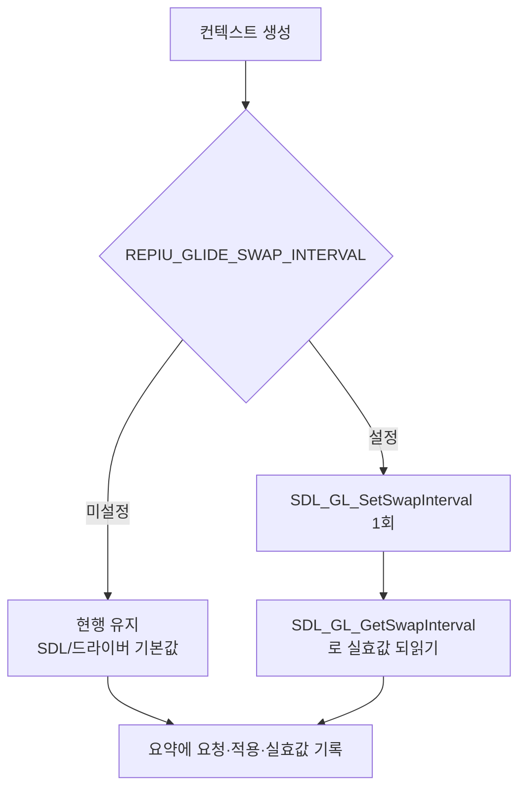

# swap interval 강제와 디스플레이 제한 판정 / Forcing the swap interval to test the display limit

Task 371. Task 370이 연 질문 — **이 실행이 디스플레이에 제한되는가** — 을 판정하기
위한 최소 장치입니다.

* 선행: [20260731-370](20260731-370-glide-gl-debug-output.md)
* 측정 근거: [docs/analysis/glide-gate-cost-attribution.md](../analysis/glide-gate-cost-attribution.md)

## 한국어

### 1. 질문

Task 370이 프레임당 `glGetError`를 제거하자 대기가 사라지지 않고 `present`로
옮겨갔습니다.

| swap 구간(호출당) | Task 369 | Task 370 |
|---|---:|---:|
| present | 162,694 | **13,240,331** |
| max-present | 836,051 | **59,737,352 (16.18 ms)** |

`max-present`가 60 Hz 리프레시 한 주기와 정확히 일치합니다. 그렇다면 Glide gate
시간의 상당 부분은 **비용이 아니라 유휴 대기**이고, 그 슬랙 안에서 CPU 작업을 줄여도
프레임은 늘지 않습니다. 지금까지의 gate 분해 해석 전체가 여기에 걸려 있습니다.

### 2. 확인된 사실: 게스트 요청은 적용된 적이 없다 — **확인됨**

`grBufferSwap`의 첫 인자를 boundary가 `BufferSwap(swap_interval)`로 넘기지만
([linexe_glide_boundary.cpp:2173](../../src/platform/win32/boundary/linexe_glide_boundary.cpp#L2173)),
backend는 그 값을 **텔레메트리에만 기록**하고 `SDL_GL_SetSwapInterval`을 **한 번도
호출하지 않습니다.** 현재의 vsync는 게스트 요청이 반영된 결과가 아니라 SDL/드라이버
기본값입니다.

Glide에서 `grBufferSwap(1)`은 "수직 귀선 1회 대기"이므로 결과적으로 동작이
일치했지만, 그건 우연입니다. `SDL_GL_GetSwapInterval`이 1을 반환한 것도 기본값을
읽은 것입니다.

### 3. 설계

판정에 필요한 것은 interval을 **강제로 바꿔 보는 능력**뿐입니다.

| 항목 | 결정 |
|---|---|
| env | `REPIU_GLIDE_SWAP_INTERVAL` |
| 미설정 | **현행 유지** (SDL/드라이버 기본값, 동작 변화 없음) |
| 설정 | 컨텍스트 생성 직후 `SDL_GL_SetSwapInterval(값)` 1회 |
| 수용 값 | `-1`(adaptive), `0`(즉시), `1`~`4`(귀선 N회 대기) |
| 관측 | 요청값 / 적용 성공 여부 / 되읽은 실효값 |

게스트 요청을 자동으로 적용하지는 **않습니다.** 이번 작업의 목적은 측정이고, 게스트
요청 반영은 동작 변경이므로 판정 결과를 보고 별도로 결정합니다.

### 4. 판정 방법

같은 장면·같은 길이로 두 번 실행합니다.

| 관측 | 해석 | 다음 |
|---|---|---|
| interval 0에서 프레임이 크게 증가 | **디스플레이 제한 확인** | Glide gate의 present 몫은 비용이 아님. gate 분해 해석을 재작성하고, 실제 CPU 병목을 interval 0 기준으로 다시 측정 |
| 프레임이 거의 그대로 | **CPU 제한** | present 대기는 부수적. Glide 축을 닫고 미계측 커널 예외 전달 비용으로 이동 |

두 경우 모두 결론이 명확하다는 점이 이 실험의 가치입니다.

### 5. 위험

| 위험 | 완화 |
|---|---|
| interval 0에서 티어링 | 측정용 opt-in이며 기본값은 현행 유지 |
| 드라이버가 설정을 거부 | 되읽은 실효값을 요약에 남겨 실패를 숨기지 않음 |
| 게스트 타이밍이 프레임에 결합돼 있으면 게임 로직이 빨라짐 | 판정은 프레임 수뿐 아니라 `INT 8` tick 전달률과 함께 읽음 |

마지막 항목은 실제로 중요합니다. 이 게임은 리듬 게임이고 INT 8 기반 타이밍을 쓰므로,
프레임이 늘어도 게임 속도가 같이 변하면 단순 비교가 성립하지 않습니다. 그래서 요약의
`timer tick delivery`를 함께 봅니다.

---

## English

### The question

Removing the per-frame `glGetError` in Task 370 did not remove the wait; it moved
into the present, which rose to 13,240,331 cycles per call with a maximum of
59,737,352 — exactly one 60 Hz refresh period. If this run is display-limited then
much of the Glide gate is idle waiting rather than cost, and reducing CPU work
inside that slack cannot move frames, which would rewrite the gate attribution this
project has been building on.

### A confirmed fact along the way

The guest's requested interval has never been applied. The boundary forwards
`grBufferSwap`'s first argument into `BufferSwap(swap_interval)`, but the backend
only records it in telemetry and never calls `SDL_GL_SetSwapInterval`. The vsync
currently in effect is SDL's or the driver's default, and the `SDL_GL_GetSwapInterval`
value of 1 was simply reading that default back. Glide's `grBufferSwap(1)` means
"wait one vertical retrace", so behaviour happened to coincide — by accident.

### Design

`REPIU_GLIDE_SWAP_INTERVAL` applies `SDL_GL_SetSwapInterval` once after context
creation, accepting -1 for adaptive, 0 for immediate, and 1 through 4 for retrace
waits. Leaving it unset changes nothing. The summary records the requested value,
whether the call succeeded, and the effective interval read back, so a driver that
refuses the setting cannot hide it. Applying the guest's own request automatically
is deliberately out of scope: this task measures, and honouring the request is a
behaviour change to decide after the measurement.

### How it decides

Two runs over the same scene and duration. A large frame increase at interval 0
confirms the display limit, which makes the present share of the Glide gate idle
rather than costly and forces the gate attribution to be rebuilt against an
interval-0 baseline. Frames staying flat means the run is CPU-limited, the present
wait is incidental, and the Glide axis closes in favour of the unmeasured kernel
exception-delivery cost. Both outcomes are conclusive, which is the point.

One risk deserves naming: this is a rhythm game driven by INT 8 timing, so if
frames rise while game speed changes with them, a plain frame comparison would not
be valid. The `timer tick delivery` line is read alongside the frame count for that
reason.
