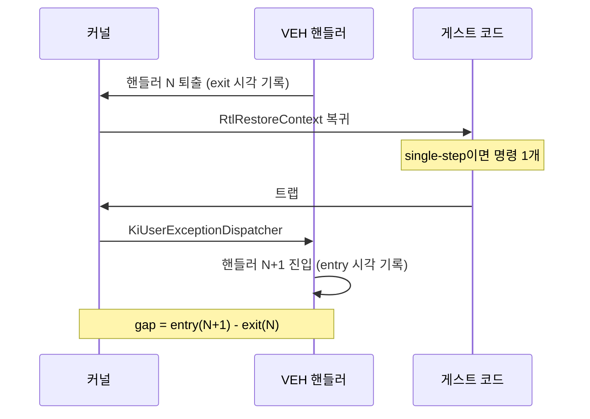

# 커널 예외 전달 비용 계측 / Measuring kernel exception-delivery cost

Task 372. `unaccounted` 안에 숨어 있는 마지막 큰 미지수를 실측으로 끌어냅니다.

* 선행: [20260731-371](20260731-371-glide-swap-interval-override.md)
* 측정 근거: [docs/analysis/glide-gate-cost-attribution.md](../analysis/glide-gate-cost-attribution.md)

## 한국어

### 1. 문제: 계측 창이 왕복을 놓친다

`ExecutionTimeScope`의 `kVehTotal`은 **핸들러 진입~퇴출**만 잽니다
([execution_time_profile.cpp](../../src/platform/win32/telemetry/execution_time_profile.cpp)).
커널이 예외를 전달하는 구간 — 트랩 진입, `KiUserExceptionDispatcher` 도달까지,
그리고 `RtlRestoreContext`로 게스트에 복귀하는 경로 — 은 그 창 **밖**입니다.

Task 371이 swap interval 0으로 유휴 대기를 걷어낸 뒤 축이 이렇게 남았습니다.

| 버킷 | 비중 |
|---|---:|
| VEH 핸들러 본체 | 23.07% |
| Glide gate | 12.52% |
| port-io / DOS | 0.55% |
| **unaccounted** | **76.93%** |

프레임당 예외가 861~972건입니다. 이 왕복이 어느 버킷에도 없으므로 `unaccounted`는
"게스트 실행"이 아니라 **게스트 실행 + 커널 예외 전달**입니다. 그 비율을 모르면
다음 대상을 고를 수 없습니다.

### 2. 이미 있는 것: 합성 캘리브레이션

Task 340대의 `exception_transition_calibration_probe`가 최소 핸들러로 왕복 단가를
잽니다.

| 전이 | cycles | 시간(3.69 GHz) |
|---|---:|---:|
| INT3 | 21,347 | 5.8 µs |
| single-step | 25,855 | 7.0 µs |

최근 gameplay 캡처(예외 1,598,556건)에 곱하면 약 **37.3e9 cycle = wall의 15.6%**가
나옵니다. 그러나 이것은 **합성 환경의 단가를 실행 횟수에 곱한 추정**이며, 실제
프로세스는 핸들러가 무겁고 캐시 상태가 다릅니다. **실측이 필요합니다.**

### 3. 설계: 이미 찍고 있는 두 타임스탬프의 간격

새 클럭 읽기를 추가하지 않습니다. VEH scope는 이미 진입 시각과 퇴출 시각을
찍습니다. 그 사이가 아니라 **바깥**을 재면 됩니다.

```
핸들러 N 퇴출 ──┐                        ┌── 핸들러 N+1 진입
                │  커널 복귀 + 게스트 실행 + 커널 전달  │
                └────────── gap ─────────┘
```



**핵심: 연속된 두 single-step 예외 사이에서 게스트는 정확히 명령 1개만
실행합니다.** 따라서 그 gap은 사실상 **순수 커널 왕복**입니다. 이것이 이 설계가
성립하는 이유입니다.

breakpoint나 access violation의 gap은 게스트 실행을 포함하므로 순수 왕복이 아니고,
**분류해서 따로 봅니다.**

### 4. 측정 항목

| 항목 | 의미 |
|---|---|
| `veh_gap_cycles[single-step]` | 왕복 + 명령 1개 → **왕복 추정치** |
| `veh_gap_cycles[breakpoint]` | 왕복 + 직전 게스트 구간 |
| `veh_gap_cycles[other]` | 나머지 |
| `veh_gap_min_cycles` | 관측된 최소 gap → **왕복의 하한** |
| `veh_gap_clamped_count` | 역전 관측 수(스레드 전환·TSC 이상) |

최소값이 중요합니다. 1백만 건 넘는 표본에서 관측된 최소 gap보다 왕복이 쌀 수는
없으므로, 평균이 게스트 실행에 오염되더라도 **하한은 오염되지 않습니다.**

### 5. 관측자 비용

새 clock 읽기 **0회**입니다. scope 생성자에서 뺄셈 1회와 누적 1회, 소멸자에서 대입
1회뿐입니다. Task 353이 세운 관측자 규칙 — 계측이 계측 대상을 바꾸면 안 된다 — 을
지키기 위해 의도적으로 이렇게 설계했습니다.

분류는 `RecordVehExceptionCensus`에서 합니다. 그 지점은 exception code가 이미
검증된 뒤이므로(Task 296의 malformed record 문제를 피함) 안전합니다.

### 6. 판정

| 관측 | 해석 | 다음 |
|---|---|---|
| 왕복이 wall의 30%+ | 예외 축이 최대 병목 | Task 368 종결 판정 철회, exception-free dispatch 재개 |
| 10~30% | 유의하나 단독으로는 부족 | 게스트 실행 내부와 병행 |
| 10% 미만 | 왕복은 부차적 | `unaccounted`는 진짜 게스트 실행. 번역 품질로 이동 |

목표 기준선도 함께 둡니다. Task 371이 잰 프레임당 CPU 20.3 ms를 **16.7 ms 아래로**
내리면 배포 구성(vsync)이 30 → 60 fps로 넘어갑니다. 필요한 단축은 약 **18%**이며,
왕복이 그보다 크면 이 축 하나로 목표에 도달할 수 있습니다.

**모든 측정은 `REPIU_GLIDE_SWAP_INTERVAL=0`으로 고정합니다.** interval 1에서는 유휴
대기가 `unaccounted`에 섞여 비율이 왜곡됩니다.

---

## English

### The gap in the instrument

`ExecutionTimeScope`'s `kVehTotal` times handler entry to exit only, so the kernel's
delivery path — the trap, the walk to `KiUserExceptionDispatcher`, and the
`RtlRestoreContext` return — falls outside every bucket. After Task 371 removed the
idle present wait, the axis reads VEH bodies 23.07%, Glide gate 12.52%, and
unaccounted 76.93%, at 861 to 972 exceptions per frame. That unaccounted figure is
therefore guest execution *plus* kernel exception delivery, and the split decides
what to work on next.

The synthetic calibration probe from the 340s already prices a minimal handler's
round trip at 21,347 cycles for INT3 and 25,855 for single step. Multiplied against
1,598,556 live exceptions that suggests roughly 15.6% of wall, but it is an estimate
from a synthetic environment applied to a process whose handler is heavy and whose
cache state differs. It needs measuring in situ.

### Measuring the interval already bracketed

No new clock reads. The VEH scope already timestamps entry and exit; this measures
the interval *between* one exit and the next entry — kernel return, guest execution,
kernel delivery. The design rests on one fact: **between two consecutive single-step
exceptions the guest executes exactly one instruction**, so that gap is effectively
the pure kernel round trip. Breakpoint and access-violation gaps include real guest
work and are classified separately rather than averaged in.

The minimum observed gap matters most: across more than a million samples nothing
can make the round trip cheaper than the smallest gap seen, so even if the mean is
contaminated by guest execution, the floor is not.

Observer cost is one subtraction and one accumulation in the constructor and one
assignment in the destructor — zero additional clock reads, deliberately, to respect
the rule Task 353 established that an instrument must not change what it measures.
Classification happens in `RecordVehExceptionCensus`, which runs after the exception
code has been validated and so avoids the malformed-record hazard Task 296 found.

### How it decides

A round trip above 30% of wall makes the exception axis the dominant bottleneck and
reopens the closure Task 368 declared; between 10 and 30% it is significant but not
sufficient alone; below 10% the unaccounted time really is guest execution and the
work moves to translation quality. There is a concrete target alongside: Task 371
measured 20.3 ms of CPU per frame, and crossing below 16.7 ms flips the shipped
vsync configuration from 30 to 60 fps — about 18%, so a round trip larger than that
could reach the goal on this axis alone. Every measurement pins
`REPIU_GLIDE_SWAP_INTERVAL=0`, since idle present wait would otherwise contaminate
the unaccounted share being split.
