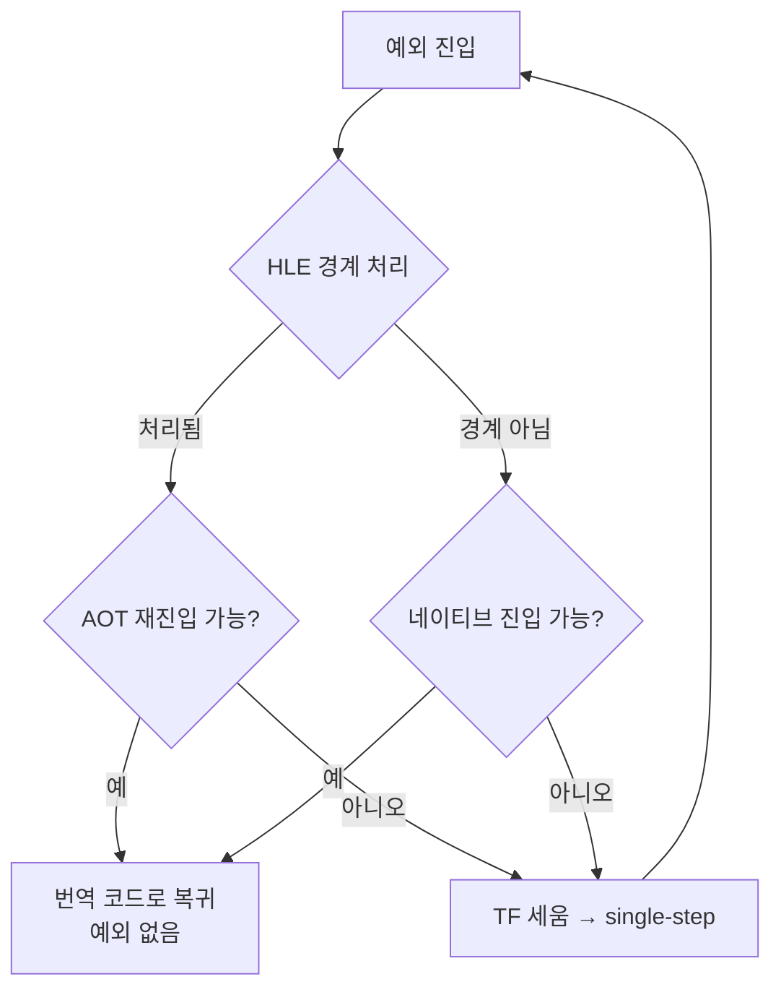

# single-step 모집단 제거 조사 / Investigating elimination of the single-step population

Task 373. **아직 구현 전, 조사 단계 설계입니다.** Tasks 363~372의 측정이 수렴한
지점을 정리하고, 다음에 무엇을 왜 조사하는지 확정합니다.

* 선행: [372](20260731-372-kernel-exception-delivery-cost.md),
  [371](20260731-371-glide-swap-interval-override.md),
  [368](20260730-368-exception-free-glide-gate-dispatch.md)
* 누적 사실: [docs/analysis/glide-gate-cost-attribution.md](../analysis/glide-gate-cost-attribution.md)

## 한국어

### 1. 지금까지의 결론 — 축이 어디로 좁혀졌는가

**측정 기준선은 `REPIU_GLIDE_SWAP_INTERVAL=0`입니다.** vsync에서는 present 유휴
대기가 섞여 모든 비율이 왜곡됩니다(Task 371).

| 항목 | wall 비중 | 출처 |
|---|---:|---|
| VEH 핸들러 본체 | 23.18% | 372 |
| 커널 예외 왕복(추정) | 17.3 ~ 25.5% | 372 |
| **예외 기구 총계** | **40.5 ~ 48.7%** | 372 |
| Glide gate (VEH 본체의 부분집합) | 12.71% | 371 |
| 실제 게스트 실행 | 약 51 ~ 60% | 372 |

닫힌 것과 열린 것을 명확히 합니다.

| 축 | 상태 | 근거 |
|---|---|---|
| Glide setter `glGetError` | **해결** | 369: gameplay에서 6.89% → 0.76% |
| Glide 프레임 검사 | **해결** | 370: push 방식 대체 |
| 디스플레이 대기 | **측정 축에서 제거** | 371: interval 0 고정 |
| Glide gate 예외 제거 | **닫힘** | 368: 본체 235,000 cycle이 남아 3.25% |
| Glide setter 생략 batch 2 | **가치 붕괴** | 369 이후 상한 6.89% → 약 0.55% |
| rendezvous 왕복 | 열림, 6.66% | 372 이전 측정 |
| **single-step 모집단** | **열림, 다음 대상** | 372 |

### 2. 왜 single-step인가 — 본체 비용이 다르다

Task 372의 핵심은 왕복 단가(31,769 cycle)가 아니라, **모집단마다 그 왕복 뒤에 있는
본체 비용이 다르다**는 것입니다.

| 모집단 | 건수 | 비중 | 예외당 본체 | 예외 제거 시 |
|---|---:|---:|---|---|
| Glide gate | 233,754 | 37.5% | 약 235,000 cycle | 본체가 남음 → **작음** |
| 그 외 breakpoint | 97,849 | 15.7% | 미측정 | 미확정 |
| **single-step** | **264,561** | **42.5%** | **명령 1개** | **거의 전부 사라짐** |
| AV / 기타 | 26,892 | 4.3% | 미측정 | 미확정 |

(사용자 gameplay 캡처 623,056건 기준)

Glide gate는 예외가 **비싼 본체 위의 얇은 층**이라 없애도 이득이 작습니다 —
Task 368이 정확히 이것을 측정해 3.25%로 닫았습니다. **single-step은 정반대입니다.**
본체가 게스트 명령 1개 처리이므로, 31,003~31,769 cycle 왕복이 **비용의 거의 전부**
입니다.

single-step gap만으로 **wall의 9.06%**이고, 여기에 해당 예외의 핸들러 본체가
더해집니다.

### 3. single-step은 어디서 발생하는가 — 조사 대상

trap flag를 다시 세우는 지점이 코드에 여럿 있습니다
([execution_trampoline.cpp](../../src/platform/win32/execution/execution_trampoline.cpp)).
확인된 두 곳:

* HLE 경계 처리 후 **AOT 재진입에 실패**하면 single-step으로 폴백(1314행 부근)
* **네이티브 실행에 진입하지 못하면** single-step 유지(1365행 부근)

즉 single-step은 독립 기능이 아니라 **다른 경로가 실패했을 때의 폴백**입니다. 따라서
질문은 "single-step을 어떻게 빠르게 만들까"가 아니라 **"왜 폴백하는가, 그 사유를
없앨 수 있는가"** 입니다.

**이 도식의 `E` 경로 횟수가 프레임당 수백 건이고, 각 건이 31,769 cycle입니다.**

### 4. 조사 질문 (구현 아님)

1. **폴백 사유 분포.** `E`에 도달하는 경로별 횟수. 재진입 실패인가, 네이티브 진입
   실패인가, 각각 어떤 하위 사유인가. `AotDbtDispatchFallbackReason`이 이미 사유
   열거를 갖고 있으므로 그 계수와 single-step 발생을 연결할 수 있는지 확인합니다.
2. **연속 길이 분포.** `veh_single_step_run_length`가 이미 있습니다. single-step이
   1회로 끝나는지 수십 회 이어지는지에 따라 대책이 갈립니다. 긴 연속은 번역
   불가능한 구간을, 짧은 연속은 재진입 실패를 시사합니다.
3. **선행 기록과의 연결.** Task 266은 민감 명령이 동적 1.88%뿐이고 98.1%가 네이티브화
   가능하다고 기록했으며, `native_fast_path`·`native_linear_span`·
   `REPIU_NATIVE_REGION`이 이미 존재합니다. **이미 있는 경로가 왜 이 모집단을
   못 잡고 있는지**가 핵심 질문입니다. 새 기구를 만들기 전에 확인합니다.
4. **Task 282의 전례.** indirect host-dispatch는 구현·probe를 통과하고도 실구동에서
   결정적으로 크래시했고 opt-in 비활성으로 남아 있습니다. 같은 실패를 반복하지
   않도록, 이번에는 **계측으로 사유를 확정한 뒤** 설계합니다.

### 5. 성공 기준을 미리 등록합니다

Task 368의 방식을 따릅니다 — **구현 전에 gate를 등록하고, 1단계 측정이 미달하면
구현하지 않습니다.**

| 등급 | 기준 | 행동 |
|---|---|---|
| A | single-step 제거 상한이 wall 10% 이상 | 구현 진행 |
| B | 5 ~ 10% | 폴백 사유 상위 1~2개만 표적 |
| C | 5% 미만 | 구현하지 않고 축을 닫음 |

목표 맥락: 프레임당 CPU 20.3 ms를 **16.7 ms 아래**로 내리면 배포 구성(vsync)이
30 → 60 fps로 넘어갑니다. 필요한 것은 **1.22배(약 18%)** 입니다. single-step
모집단만으로 9.06%+ 이므로 **단독으로는 부족하고**, rendezvous 왕복(6.66%)과 합치면
사정권입니다.

### 6. 측정 원칙 (이번 세션에서 확립됨)

* **`REPIU_GLIDE_SWAP_INTERVAL=0` 고정.** vsync는 프레임을 30으로 양자화해 CPU
  개선을 완전히 가립니다(371).
* **A/B는 프레임 수만으로 비교하지 않습니다.** `PollThreadUntilExit`에 1초 무진행
  watchdog이 있어 조기 종료하고도 `timed_out=true`로 보고합니다. **wall cycle을 함께
  확인**합니다(372).
* **hot path에 clock read를 추가하지 않습니다.** 기존 timestamp의 차이를 쓰는 방식이
  368·372에서 모두 통했습니다(353 관측자 규칙).
* **장면이 결론을 바꿉니다.** 자동 부팅 장면과 실제 gameplay 장면은 setter 비중이
  4배 다릅니다. 판정은 gameplay 캡처로 합니다(364~369).
* **추정과 실측을 구분해 적습니다.** 368의 사전 추정은 실측 대비 10.6배 과대였고,
  372의 초기 해석("368 철회")은 근거 문서를 끝까지 읽지 않아 틀렸습니다.

---

## English

### Where the axis has narrowed to

All shares below are measured with `REPIU_GLIDE_SWAP_INTERVAL=0`, since vsync mixes
idle present wait into everything (Task 371). Handler bodies hold 23.18% of wall and
the kernel round trip 17.3 to 25.5%, putting exception machinery at **40.5 to 48.7%**
against roughly 51 to 60% for real guest execution.

Closed: the Glide setter `glGetError` (Task 369, 6.89% to 0.76% in gameplay), the
per-frame check (Task 370), display wait as a measurement contaminant (Task 371),
exception-free Glide gate dispatch (Task 368, only 3.25% because the gate body
survives), and Task 365 batch two, whose ceiling collapsed from 6.89% to about 0.55%
once Task 369 landed. Open: the rendezvous round trip at 6.66%, and the single-step
population.

### Why single step

Task 372's real finding is not the 31,769-cycle round trip but that the **body cost
behind it differs by population**. In a 623,056-exception gameplay capture the Glide
gate is 233,754 (37.5%) with roughly 235,000 cycles of body behind each — a thin
exception layer over expensive work, which is exactly why Task 368 closed it at
3.25%. Single steps are 264,561 (42.5%) and their body is emulating one instruction,
so the round trip is essentially the whole cost. Those gaps alone are 9.06% of wall
before handler bodies.

### What to investigate

Single stepping is not a feature but a fallback: the trap flag is re-armed when AOT
re-entry after an HLE boundary fails, and when native execution cannot be entered.
The question is therefore not how to make single stepping faster but **why the
fallback is taken and whether those reasons can be removed**. Four things to
establish before designing anything: the distribution of fallback reasons reaching
that path, the run-length distribution (already tracked as
`veh_single_step_run_length`, and short versus long runs point at different causes),
why the existing `native_fast_path`, `native_linear_span`, and `REPIU_NATIVE_REGION`
machinery is not already covering this population given Task 266 recorded only 1.88%
of dynamic instructions as sensitive, and what Task 282's outcome teaches — its
indirect host dispatch passed implementation and probes yet crashed deterministically
in a live run and remains disabled, so this time the reasons get measured before a
design is committed.

### Pre-registered gates

Following Task 368's discipline, the gate is registered before implementing and the
work stops if stage one misses it: above 10% of wall available, implement; between 5
and 10%, target only the top one or two fallback reasons; below 5%, close the axis
without implementing. For context, moving CPU frame time from 20.3 ms below 16.7 ms
flips the shipped vsync configuration from 30 to 60 fps, which needs 1.22x — so this
population alone is not sufficient but together with the rendezvous round trip it is
within reach.

### Measurement rules established this session

Pin swap interval 0, because vsync quantises to 30 fps and hides CPU progress
entirely. Never compare runs by frame count alone: `PollThreadUntilExit` has a
one-second no-progress watchdog independent of the configured timeout that still
reports `timed_out`, so wall cycles must be checked too. Add no clock read to the hot
path; differencing timestamps that already exist worked for both Task 368 and
Task 372. Judge on gameplay captures rather than the automated boot scene, where the
same setter set differs fourfold. And keep estimates and measurements clearly
separated — Task 368's pre-estimate was 10.6x high, and Task 372's first reading of
it was wrong because the source document was not read to the end.
