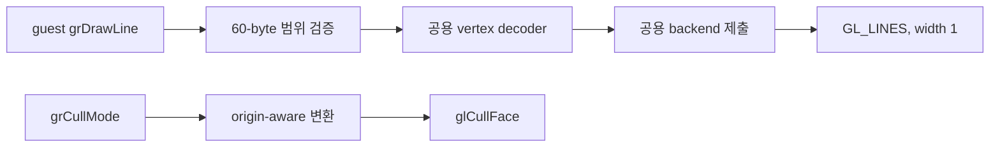

# Glide 선 그리기와 양방향 cull 구현 / Glide line drawing and bidirectional culling

Task 374. 입력 증거는 저장소 루트의 `gameplay-capture.log`입니다.

## 한국어

### 범위와 근거

캡처에는 `grDrawLine` 네 고유 인자 조합이 각 2,756회, 합계 11,024회 호출되었고
`grCullMode(1)`이 한 번 거부되었습니다. line의 네 정점 포인터는 정확히 60바이트
간격이고 기존 `grDrawTriangle`이 해석하는 Glide 2 producer ABI와 같습니다. 네 호출은
정점을 순환해 사각형 테두리를 그립니다. 이전 자동 장면에서 line이 호출되지 않았다는
결론은 이 gameplay 장면에는 적용되지 않습니다.

Glide 2.4에서 `grDrawLine`은 현재 상태가 모두 적용되는 1픽셀 선입니다. cull 값
0/1/2는 disable/negative/positive이며 선택한 부호와 삼각형 면적 부호가 같으면
삼각형을 버립니다. cull은 line과 point에는 적용되지 않습니다.

* [3Dfx Glide 2.4 Reference Manual](https://bitsavers.computerhistory.org/components/3dfx/Glide_Reference_Manual_2.4_199707.pdf)
* [3Dfx Glide 2.4 Programming Guide](https://www.bitsavers.org/components/3dfx/Glide_Programming_Guide_2.4_199707.pdf)

### 구조

60바이트 정점 해석을 Win32 triangle case에서 플랫폼 공용 GlideDrawVertex decoder로
옮깁니다. boundary는 guest 범위 검증과 stdcall 정리만 담당하고, decoder는 복사된
15 dword를 위치, 색, TMU0 좌표, reciprocal-w로 변환합니다. backend의 line과
triangle은 하나의 primitive 제출 경로를 공유합니다.

OpenGL front face는 `GL_CCW`로 명시합니다.

| Glide origin | negative(1)를 버림 | positive(2)를 버림 |
|---|---|---|
| lower-left | `GL_BACK` | `GL_FRONT` |
| upper-left | `GL_FRONT` | `GL_BACK` |

mode 0은 cull을 끄고 0~2 밖의 값만 거부합니다. 실패는 기존 safe decline을 유지하고
정상 line은 더 이상 `record_unimplemented`를 호출하지 않습니다.

### 검증

render probe에서 정점 해석과 origin×mode 변환표를 검증하고 Win32 x86 Debug/Release를
빌드합니다. gameplay 장면을 자동 재현할 수 없으면 live 검증 제한을 작업 로그에
기록합니다.

## English

The capture contains four unique `grDrawLine` endpoint pairs repeated 2,756
times each (11,024 calls) and one rejected `grCullMode(1)`. The four pointers
form a closed outline at exact 60-byte intervals, matching the producer ABI
already decoded by `grDrawTriangle`. The earlier automated-scene finding that
lines were absent does not apply to this gameplay scene.

Glide 2.4 defines `grDrawLine` as a one-pixel line affected by all current
attributes. Cull modes 0, 1, and 2 disable culling, reject negative signed area,
and reject positive signed area; culling does not affect lines or points.

Extract the 60-byte decoder and `GlideDrawVertex` into shared HLE code. Keep
guest validation and stdcall cleanup at the boundary, and share one backend
submission path between lines and triangles. With OpenGL front face fixed to
`GL_CCW`, lower-left negative/positive map to `GL_BACK`/`GL_FRONT`; upper-left
reverses the mapping. Add deterministic decoder and cull-table probes, then
build both Win32 x86 configurations.
