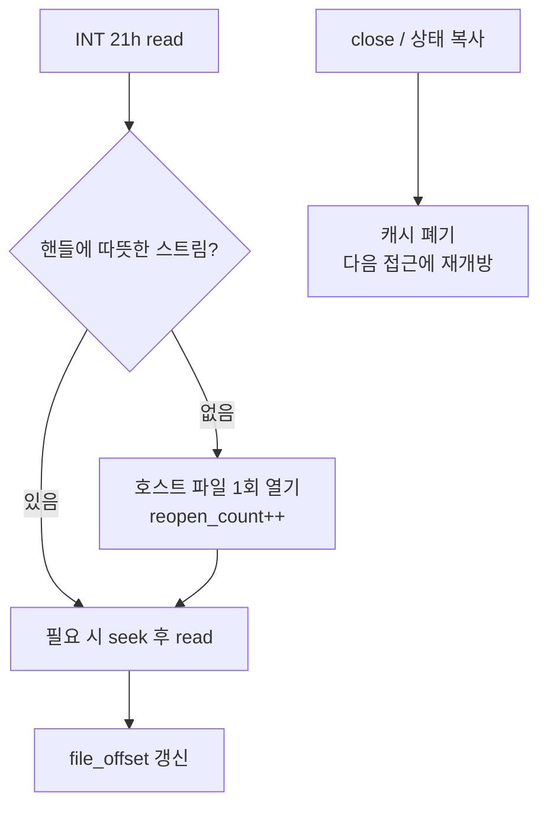

# DOS 파일 핸들 지속화 / Persistent DOS file handles

Task 374. 음악 선택 화면 조사에서 나온 실측 결함을 고칩니다.

* 조사 근거: [372](20260731-372-kernel-exception-delivery-cost.md) 계측으로 확보한
  single-step hotspot
* 관련: [docs/analysis/dos-file-io-and-int3.md](../analysis/dos-file-io-and-int3.md)

## 한국어

### 1. 관측

음악 선택 화면 캡처(31.3초)에서 `REPIU_SINGLE_STEP_HOTSPOT_PROFILE=1`이 단일 주소를
지목했습니다.

```
cycle hotspot #1  address=0x030F87B7  count=77  cycles=1,976,177,812  max=308,199,787
                  stage: prologue 86,457 / hle 1,974,030,543 / aot-resume 2,036,184
```

| 지표 | 값 |
|---|---:|
| 호출당 평균 | **25.7M cycle = 7.0 ms** |
| 단일 최대 | **308,199,787 cycle = 83.5 ms** |
| `hle` 단계 비중 | **99.9%** |
| wall 비중 | 1.71% |

증거 사슬로 이 주소를 특정했습니다.

| 단계 | 근거 |
|---|---|
| 명령 종류 | opcode `0xCD` → `HandleTracedDosInterrupt21` |
| 서비스 | I/O 트레이스 `op=read eip=0x030F87B7 path=...\DATAS\MODEL\T14.3DM` |
| 교차확인 | DOS 버킷 2.216e9 중 이 주소가 1.974e9 (**89%**) |

읽는 파일은 호스트에 실재하는 3.5 KB짜리 3D 모델이고 요청은 4096바이트입니다.
**따뜻한 캐시에서 4 KB 읽기가 6~83 ms일 수 없습니다.**

### 2. 원인

[dos_file_system.cpp](../../src/hle/dos_file_system.cpp)의 `ReadDosFile`이 읽기
**한 번마다** 호스트 파일을 처음부터 다시 엽니다.

```cpp
const std::uint64_t file_size = std::filesystem::file_size(host_path, error);  // stat
std::ifstream stream(host_path, std::ios::binary);                             // open
stream.seekg(file_offset, std::ios::beg);                                      // seek
stream.read(..., clamped_request);                                             // read
                                                                               // dtor: close
```

핸들 구조체에 지속 스트림이 없기 때문입니다.

```cpp
struct DosOpenFileHandle {
    bool open; std::uint16_t handle; std::uint8_t access_mode;
    std::uint64_t file_offset;        // 오프셋만
    std::string guest_path;
    std::filesystem::path host_path;  // 경로만
    std::string dos_path;
};
```

즉 **DOS 핸들이 "경로 + 오프셋"일 뿐**이고 모든 read가 경로에서 다시 시작합니다.
`SeekDosFile`도 SEEK_END에서 `file_size()`를 또 호출합니다.

Windows에서 `CreateFile`은 필터 드라이버 스택(실시간 검사 포함)을 통과하므로 열기
비용이 밀리초 단위가 될 수 있습니다. 평균 6 ms와 최악 83.5 ms가 이것으로
설명됩니다. **원본 DOS는 핸들을 열어둔 채 읽습니다** — 이 구현은 그 계약을 지키지
않고 있습니다.

### 3. 제약: 상태가 복사된다

`execution_trampoline.cpp`가 게스트 스레드 준비 중 상태를 **복사 대입**합니다.

```cpp
context.dos_file_system = *dos_file_system;
```

따라서 `DosVirtualFileSystemState`와 `DosOpenFileHandle`은 **복사 가능해야
합니다.** `std::unique_ptr<std::ifstream>`를 그냥 넣으면 이 줄이 깨집니다.

### 4. 설계

**스트림을 상태가 아니라 캐시로 취급합니다.**



복사 의미론을 한 곳에 가둔 전용 타입을 둡니다.

| 항목 | 결정 |
|---|---|
| 캐시 타입 | `DosHostFileCache` — 복사 시 **차갑게 시작**, 이동은 그대로 |
| 왜 복사가 공유가 아닌가 | 두 핸들이 한 스트림을 공유하면 **파일 위치를 공유**하게 됨 |
| 파일 크기 | 열 때 1회 캐시(`cached_file_size`). 이 API는 **읽기 전용**이라 안전 |
| seek | 캐시된 크기를 쓰고 stat 하지 않음 |
| close | 캐시 폐기 |
| 관측 | `file_read_count` / `host_file_open_count` |

마지막 항목이 검증 수단입니다. 수정 전에는 읽기 수와 열기 수가 **같고**, 수정 후에는
열기 수가 **파일 수 수준으로 떨어져야** 합니다.

### 5. 기대치

| 지표 | 현재 | 기대 |
|---|---:|---|
| read 호출당 | 25.7M cycle | 수만 cycle (read 시스템콜만) |
| 최대 스톨 | 83.5 ms | 소멸 |
| DOS wall 비중 (음악 선택) | 1.92% | 0.1% 미만 |
| host open / read 비 | 1.00 | 파일당 1회 |

**정직한 범위:** 이것은 평균 fps의 주범이 아닙니다. 음악 선택이 느린 주된 이유는
게스트 계산량 +29%와 예외 기구 약 41%입니다. 이 수정이 없애는 것은 **약 1.9%의
wall과 13프레임마다 오는 다중 프레임 끊김**이며, 끊김 쪽이 체감에서 더 큽니다.
로딩 전환처럼 I/O가 몰리는 구간에서는 비중이 훨씬 커집니다.

### 6. 위험

| 위험 | 완화 |
|---|---|
| 핸들 수명 누수 | `CloseDosFile`에서 폐기, 상태 소멸 시 자동 |
| 두 핸들이 같은 파일 | 핸들별 독립 스트림이므로 위치 독립 |
| 핸들 번호 재사용 규칙 파손 | Task 227/228의 lowest-free 할당은 건드리지 않음 |
| 캐시된 크기가 낡음 | 읽기 전용 API이므로 변할 수 없음. 쓰기 API가 생기면 무효화 필요 |
| 열기 실패 | 기존과 동일하게 DOS 오류 0x0002 반환 |

---

## English

### Observation

On a music-select capture the single-step hotspot profiler named one address:
`0x030F87B7`, hit 77 times for 1,976,177,812 cycles — **25.7M per call (7.0 ms)**
with a worst case of **308,199,787 (83.5 ms)** — and 99.9% of that sits in the
`hle` stage. The evidence chain identifies it precisely: opcode `0xCD` routes to
`HandleTracedDosInterrupt21`, the I/O trace shows `op=read eip=0x030F87B7
path=...\DATAS\MODEL\T14.3DM`, and this one address holds 89% of the whole DOS
bucket. The file is a real 3.5 KB host file and the request is 4096 bytes, so a
6-to-83 ms read is not explainable by the read itself.

### Cause

`ReadDosFile` reopens the host file from scratch on **every** read: a
`std::filesystem::file_size` stat, an `std::ifstream` construction, a seek, the
read, and a close in the destructor. The handle struct explains why — it stores a
path and an offset but no stream, so a DOS handle is only a path plus a position
and every read starts over. `SeekDosFile` repeats the stat for SEEK_END. On Windows
`CreateFile` traverses the filter driver stack including real-time scanning, which
is where milliseconds per open come from. Real DOS keeps the handle open across
reads; this implementation does not honour that contract.

### Constraint

`execution_trampoline.cpp` copy-assigns the state into the guest thread context, so
`DosVirtualFileSystemState` and `DosOpenFileHandle` must stay copyable. Dropping a
`std::unique_ptr<std::ifstream>` into the struct would break that line.

### Design

Treat the stream as a cache rather than state. A dedicated `DosHostFileCache` type
confines the unusual copy semantics: copying starts cold and reopens on first use,
because letting two handles share one stream would make them share a file position.
The file size is cached once at open — safe because this API is read-only — and seek
uses it instead of stating again. Close discards the cache. Two counters,
`file_read_count` and `host_file_open_count`, make the fix verifiable: today they
are equal, and afterwards opens should fall to roughly one per file.

### Expectation and honest scope

Per-read cost should fall from 25.7M cycles to the read syscall alone, the 83.5 ms
stall should disappear, and the DOS share of wall in music select should drop from
1.92% to under 0.1%. This is not the main cause of the frame rate there — guest
computation is 29% higher and exception machinery is about 41% — so what this
removes is roughly 1.9% of wall plus a multi-frame hitch every thirteen frames. The
hitch matters more perceptually than the average, and the share grows sharply
wherever I/O concentrates, such as loading transitions.
