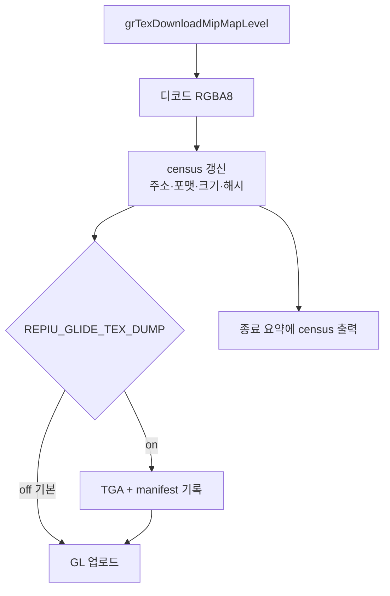

# Glide 텍스처 census와 픽셀 덤프 / Glide texture census and pixel dump

Task 375. music select 화면의 텍스처를 속성과 실제 픽셀 수준에서 검사할 수 있게
합니다.

* 선행: [374](20260801-374-dos-persistent-file-handles.md)
* 관련: [docs/analysis/glide2x-ovl-and-opengl-hle.md](../analysis/glide2x-ovl-and-opengl-hle.md),
  [docs/analysis/res-ptx-resource-loading.md](../analysis/res-ptx-resource-loading.md)

## 한국어

### 1. 왜 필요한가 — 지금은 볼 수 있는 것이 거의 없다

텍스처에 대해 로그가 알려주는 것은 이 정도가 전부입니다.

| 현재 관측 | 한계 |
|---|---|
| `_GRTEXDOWNLOADMIPMAPLEVEL@32` 호출 수와 시간 | 무엇을 올렸는지는 모름 |
| `REPIU_GLIDE_TEX_DIAG` | **앞 16건**, 텍셀 **1개**의 RGBA만 |
| `Glide virtual texture bytes/max address` | 총량만 |
| `missing_texture_source_count_` | 요약에 출력되지 않음 |

**속성도 픽셀도 확인할 수 없습니다.** 텍스처가 의심스러울 때 확인할 방법이 사실상
없는 상태입니다.

music select에서 관측된 비대칭도 설명되지 않았습니다 — `grTexSource`가 프레임당
12.7회인데 `grTexDownloadMipMapLevel`은 41초에 **56회**뿐입니다. 즉 바인딩은 잦고
업로드는 드문데, 그 56개가 무엇이고 올바르게 디코드되는지 알 수 없습니다.

### 2. 설계

두 층으로 나눕니다. **census는 항상 켜고**(싸다), **픽셀 덤프는 opt-in**입니다(비싸고
디스크를 씁니다).

#### census (항상)

| 항목 | 답하는 질문 |
|---|---|
| upload 총수 / 고유 주소 수 | 같은 주소를 몇 번 다시 올리는가 |
| **동일 내용 재업로드 수** | 낭비되는 업로드가 있는가 (내용 해시 비교) |
| 포맷 히스토그램 | 예상 밖 포맷이 오는가 |
| 크기 히스토그램 | 비정상 치수가 있는가 |
| 디코드 실패 수 / 마지막 실패 포맷 | 조용히 버려지는 텍스처가 있는가 |
| **s/t extent ≠ 픽셀 크기 건수** | Task 332의 좌표 확장 문제가 재발하는가 |
| 총 디코드 바이트 | 대역폭 |

**동일 내용 재업로드**가 핵심 지표입니다. 있으면 Task 374와 같은 성격의 낭비이고,
없으면 텍스처 경로는 결백합니다.

#### 픽셀 덤프 (opt-in)

* `REPIU_GLIDE_TEX_DUMP` — 값이 경로면 그 디렉터리, `1`이면
  `build/texture_dumps/`.
* 업로드마다 **TGA 32비트 무압축** 1개. 외부 의존이 없고 어떤 뷰어로든 열립니다.
* 파일명에 속성을 담습니다:
  `tex_<seq>_<addr>_<w>x<h>_fmt<F>_lod<L>_ar<A>.tga`
* `manifest.csv` 1줄/업로드 — 파일명, 순번, 주소, 포맷, large_lod, aspect_ratio,
  픽셀 w/h, s/t extent, source_size, 팔레트 유무, 내용 해시.
* **상한 512건**(env로 조정). 무제한이면 디스크를 채웁니다.

### 3. 관측자 비용

census는 업로드당 해시 1회입니다. 업로드는 41초에 56회이므로 **hot path가
아닙니다** — Task 353 규칙 위반이 아닙니다. 픽셀 덤프는 명백히 비싸므로 기본
off이며, 켠 실행의 타이밍 수치는 성능 판정에 쓰지 않습니다.

### 4. 판정에 쓸 관측

| 관측 | 해석 |
|---|---|
| 동일 내용 재업로드가 많음 | 업로드 캐시(내용 해시 기반)로 제거 가능 |
| 디코드 실패 > 0 | 포맷 미구현. 화면에 빠진 그림이 있다는 뜻 |
| extent ≠ 픽셀 크기 다수 | 좌표 스케일 문제. 잘못된 크기로 그려짐 |
| 덤프 픽셀이 눈으로 틀림 | 디코드 오류. 포맷별로 좁힐 수 있음 |
| 전부 정상 | 텍스처 축을 닫고 예외 축으로 복귀 |

마지막 줄이 중요합니다. **이 작업은 텍스처가 범인이라는 전제가 아니라, 범인인지
아닌지를 가르기 위한 것**입니다. 결백으로 나오면 그것도 결론입니다.

### 5. 위험

| 위험 | 완화 |
|---|---|
| 덤프가 디스크를 채움 | 기본 off, 상한 512건 |
| 덤프가 타이밍을 왜곡 | 켠 실행은 성능 판정에 쓰지 않음을 문서에 명시 |
| 해시 비용 | 업로드당 1회, 초당 1.4회 수준 |
| TGA 방향 | Glide는 상단 원점이므로 TGA origin 비트를 상단으로 기록 |

---

## English

### Why

The log currently says almost nothing about textures: upload counts and timing, the
first sixteen uploads reduced to a single texel each under `REPIU_GLIDE_TEX_DIAG`, a
byte total, and a missing-source counter that is never printed. Neither attributes
nor pixels can be inspected, so a suspicion about textures cannot be settled either
way. Music select also shows an unexplained asymmetry — `grTexSource` runs 12.7 times
per frame while `grTexDownloadMipMapLevel` ran only 56 times in 41 seconds — and
nothing identifies what those 56 uploads are or whether they decode correctly.

### Design

Two layers. A census runs always, because it costs one hash per upload on a path that
sees roughly 1.4 uploads per second and is therefore not hot. It records uploads
against distinct addresses, **repeat uploads whose content hash is unchanged**, a
format histogram, a dimension histogram, decode failures with the last failing
format, how often the s/t extent differs from the pixel size (the Task 332 hazard),
and total decoded bytes. The repeat-with-identical-content count is the key number:
if it is large the texture path wastes work in the same way the DOS path did, and if
it is zero the path is exonerated.

The pixel dump is opt-in through `REPIU_GLIDE_TEX_DUMP`, writing one uncompressed
32-bit TGA per upload plus a `manifest.csv` row carrying every attribute, capped at
512 files. TGA needs no external dependency and opens anywhere; the origin bit is set
to top-left because Glide addresses textures that way.

### What it decides

Many identical repeats point at a content-hash upload cache; decode failures mean
missing artwork on screen; extents differing from pixel sizes mean geometry drawn at
the wrong scale; visibly wrong dumped pixels localise a decode bug by format. And if
everything is clean, that closes the texture axis and sends the work back to the
exception axis — this task exists to decide the question, not to assume the answer.
