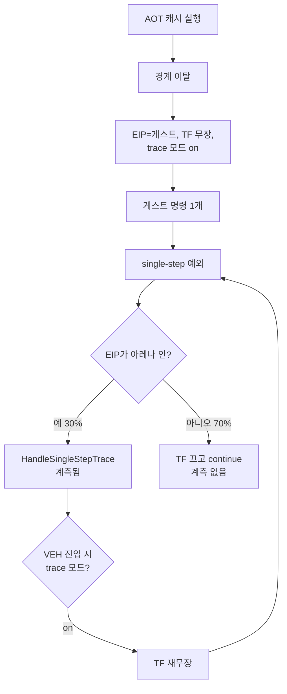

# 아레나 밖 single-step 귀속 / Attributing out-of-arena single steps

Task 376. Task 373이 드러낸 계측 사각지대 — single-step의 70%가 세지지도 프로파일
되지도 않는다 — 를 메웁니다.

* 선행: [20260731-373](20260731-373-single-step-population-elimination.md),
  [20260731-372](20260731-372-kernel-exception-delivery-cost.md)

## 한국어

### 1. 사각지대

music select 캡처에서 수치가 맞지 않습니다.

| 지표 | 값 | 비중 |
|---|---:|---:|
| single-step 예외 총계 | **266,879** | 100% |
| `single_step_trace_count` | 79,866 | 29.9% |
| HLE 재진입 시도 | 61,601 | 23.1% |
| **어디에도 안 잡히는 나머지** | **187,013** | **70.1%** |

두 계측 모두 `IsGuestInstructionPointer(eip)` 안에서만 동작합니다
([execution_trampoline.cpp:1212](../../src/platform/win32/execution/execution_trampoline.cpp#L1212)).
그래서 **게스트 아레나 밖 single-step은 계측을 통과하지 못합니다.**

그 예외들은 여기서 조용히 버려집니다
([execution_trampoline.cpp:3135](../../src/platform/win32/execution/execution_trampoline.cpp#L3135)).

```cpp
if (code == EXCEPTION_SINGLE_STEP &&
    !IsGuestInstructionPointer(context, win32_context->Eip))
{
    win32_context->EFlags &= ~0x00000100U;   // TF만 끄고
    return EXCEPTION_CONTINUE_EXECUTION;     // 계속 — 카운터 없음
}
```

**프레임당 236회, 커널 왕복만 wall의 6.5%** 인 모집단이 이름 없이 사라지고 있습니다.

### 2. 발생 구조 (가설)

AOT 경계 이탈이 "one-step bridge"를 세웁니다
([aot_runtime_dispatch.cpp:1739](../../src/platform/win32/aot/aot_runtime_dispatch.cpp#L1739)).

```cpp
win32_context->Eip = guest_address;
win32_context->EFlags |= 0x00000100U;      // TF 무장
context->aot_reentry_pending = true;
context->enable_single_step_trace = true;  // 추적 모드 on
```

그리고 추적 모드가 켜져 있는 동안 **VEH 진입마다 TF를 재무장합니다**
([execution_trampoline.cpp:3208](../../src/platform/win32/execution/execution_trampoline.cpp#L3208)).



**어느 무장 지점이 아레나 밖 착지를 만드는지는 추측입니다.** 그래서 이 작업은
추측을 세우는 것이 아니라 **귀속을 측정**합니다.

### 3. 설계 — 계측만

버리는 지점에서 분류해 셉니다. **clock read는 추가하지 않습니다**(Task 353 규칙);
카운터 증가뿐입니다.

| 분류 축 | 값 |
|---|---|
| EIP 위치 | AOT 코드 캐시 / 호스트 이미지 / 그 외 |
| `enable_single_step_trace` | on / off |
| `aot_reentry_pending` | true / false |
| 증거 | 최초·최후 버려진 EIP, 최다 관측 EIP 상위 몇 개 |

`enable_single_step_trace`가 off인데도 발생한다면 무장 주체가 다른 곳이라는
뜻이므로, 그 조합이 가설을 가릅니다.

### 4. 사전 등록 게이트

| 등급 | 기준 | 행동 |
|---|---|---|
| A | 단일 무장 지점이 이 모집단의 70% 이상을 설명 | 2단계로 억제 구현 |
| B | 상위 두 지점이 70% 이상 | 그 둘만 표적 |
| C | 분산돼 지배적 원인이 없음 | 축을 닫고 기록만 |

상한은 이미 알려져 있습니다 — 이 모집단 전체가 **wall의 6.5%**(커널 왕복 기준)이며,
프레임당 CPU 30.3 ms를 16.7 ms 아래로 내리는 데 필요한 45% 중 상당 부분입니다.
따라서 A/B면 후속 작업의 가치가 충분합니다.

### 5. 정직한 한계

이 작업은 **아무것도 빠르게 만들지 않습니다.** 계측만 추가합니다. Task 373이 설계
전제가 틀렸는데도 구현을 강행했다면 낭비했을 것이므로, 같은 실수를 반복하지 않기
위해 측정을 먼저 합니다.

또한 이 사각지대는 **이 세션에서 인용한 모든 stage·outcome 분해의 모집단이 30%였다**는
뜻이므로, 이 작업의 결과에 따라 그 수치들의 해석도 갱신해야 합니다.

---

## English

### The blind spot

Music select shows 266,879 single-step exceptions but only 79,866 counted and
61,601 reaching the re-entry funnel, because both instruments are gated on
`IsGuestInstructionPointer`. The remaining 187,013 — 70.1%, or 236 per frame and
6.5% of wall in kernel round trips alone — are discarded without a name at
`execution_trampoline.cpp:3135`, which clears the trap flag and continues.

### How they are probably produced

An AOT boundary exit sets EIP to the guest address, arms the trap flag, and turns on
`enable_single_step_trace` to establish a one-step bridge; while that mode is on, VEH
entry re-arms the trap flag on every exception. Which arming site lands outside the
arena is a guess, which is exactly why this task measures attribution rather than
acting on the guess.

### Design

Classify at the discard site by EIP location (AOT code cache, host image, other),
by `enable_single_step_trace`, and by `aot_reentry_pending`, plus the first, last,
and most frequent discarded EIPs as evidence. Counter increments only — no clock
read enters the hot path. If the population appears with trace mode off, the arming
subject is elsewhere, and that combination is what separates the hypotheses.

### Pre-registered gate

Implement suppression in a second stage only if a single arming site explains 70% or
more of the population; target the top two if together they reach 70%; otherwise
close the axis with the measurement recorded. The ceiling is already known — the
whole population is 6.5% of wall — so A or B justifies the follow-up.

### Honest limit

This makes nothing faster; it adds instrumentation. Task 373 would have wasted
implementation effort on a premise the measurement disproved, and this avoids
repeating that. It also means every stage and outcome breakdown quoted this session
covered 30% of the population, so their interpretation is revisited once this lands.
