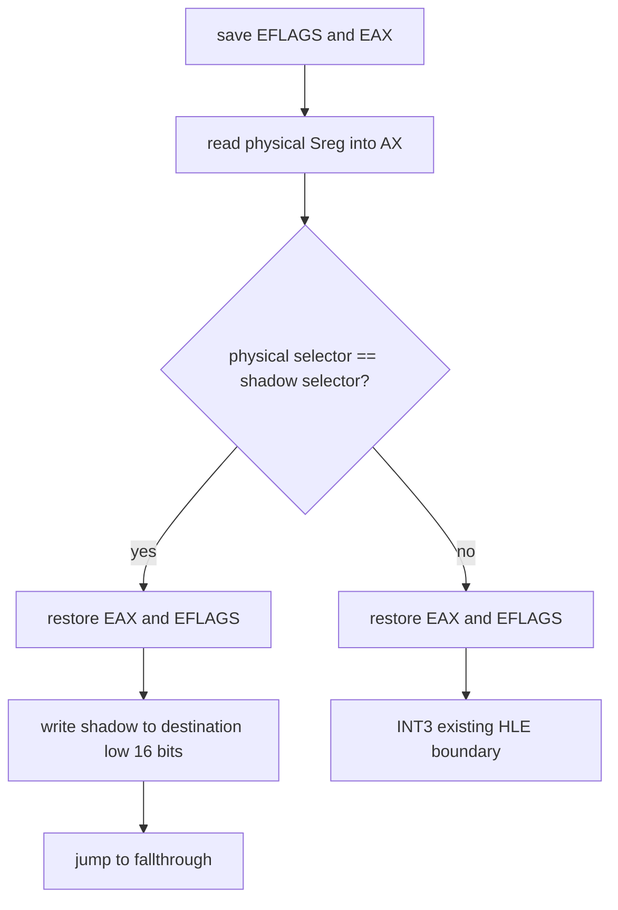

# 20260801-383 Guarded Segment Read Fast-Path / Guarded Segment Read Fast-Path

## 한국어

### 우선순위

반복 DOS `AH=3Bh` chdir 최적화는 후순위로 둡니다. Music Select에서 더 큰 HLE 비용을 차지하는 segment register read를 먼저 줄입니다.

### 대상과 의미 보존

대상은 register form `mov r32, Sreg` (`8C /r`) 중 ES/SS/DS/FS/GS 읽기입니다. 기존 HLE의 `ReadGuestSegmentSelector`는 shadow selector만 반환하지 않습니다. 실제 CPU segment selector와 shadow가 같으면 그 값을 사용하지만, 둘이 다르면 host entry selector와 software descriptor 상태를 고려해 어느 쪽이 authoritative한지 결정합니다. 따라서 shadow를 무조건 읽는 native slot은 안전하지 않습니다.

fast path는 다음의 충분조건만 직접 처리합니다.

성공 경로는 기존 HLE와 동일하게 대상 GPR의 상위 16비트를 보존하고 하위 16비트만 갱신하며, EFLAGS와 임시 EAX를 보존합니다. 실제 selector와 shadow가 다르면 복구 규칙을 cache slot에 복제하지 않고 기존 HLE로 fail closed 합니다. shadow 주소가 없거나 지원하지 않는 형태도 기존 INT3 boundary를 유지합니다.

### 활성화 정책

`REPIU_AOT_GUARDED_SEGMENT_READ=1`일 때만 `aot-dbt`에 활성화합니다. 기본값은 off로 유지하여 Music Select A/B 측정과 회귀 격리가 가능하게 합니다. segment load/pop, DOS, Port I/O 동작은 변경하지 않습니다.

### 검증

planner/code-cache probe에서 분류, 31-byte guarded slot 구조, 두 shadow 주소 patch, fallback INT3, 기본 비활성화를 검증합니다. 동일 EEPROM 복사본으로 5초 x86 A/B 스모크를 수행하고, 최종 성능 판단은 Music Select 수동 capture에서 내립니다.

## English

### Priority

Keep repeated DOS `AH=3Bh` chdir optimization as a later task. First reduce segment-register reads, which account for a larger part of Music Select HLE cost.

### Scope and semantic preservation

The target is register-form `mov r32, Sreg` (`8C /r`) for ES/SS/DS/FS/GS. Existing HLE `ReadGuestSegmentSelector` does not blindly return the shadow selector. It uses the value directly when the physical CPU segment selector matches the shadow; on divergence it decides which value is authoritative using the host-entry selector and software descriptor state. An unconditional native shadow load is therefore unsafe.

The fast path handles only the sufficient condition shown above. It saves EFLAGS and EAX, reads the physical selector, and compares it with the shadow. On equality it restores scratch state, writes only the destination GPR's low 16 bits, and jumps to the fallthrough. On mismatch it restores the exact entry state and reaches the existing INT3 HLE boundary instead of duplicating recovery policy in generated code. Missing shadow addresses and unsupported forms also fail closed.

### Enablement policy

Enable the path for `aot-dbt` only when `REPIU_AOT_GUARDED_SEGMENT_READ=1`. Keep the default off for controlled Music Select A/B measurement and regression isolation. Segment loads/pops, DOS, and Port-I/O behavior are unchanged.

### Verification

The planner/code-cache probe verifies classification, the 31-byte guarded slot, both shadow-address patches, the fallback INT3, and default disablement. Run a five-second x86 A/B smoke with identical EEPROM copies; reserve the performance conclusion for a manual Music Select capture.