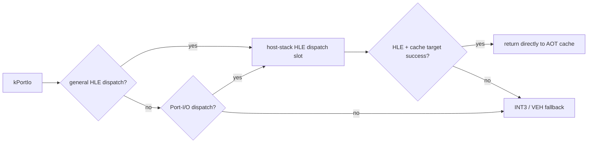

# 20260801-385 Port-I/O 전용 DBT Dispatch / Port-I/O-Specific DBT Dispatch

## 한국어

### 배경과 목표

Task 384 이후 frame 반복 HLE cycle hotspot 상위 8곳은 모두 `in ax, dx` 쌍입니다. Music Select capture는 Port I/O 28,713회를 기록했고 전부 기존 HLE에서 처리되었습니다. device body 자체는 wall의 0.45%이지만 INT3/VEH와 HLE 후 AOT 복귀 비용은 이 bucket 밖에 있습니다.

기존 `REPIU_AOT_DBT_SUPERBLOCK`은 모든 일반 HLE boundary를 host-stack dispatch slot으로 바꾸며 과거 렌더링 중단이 있어 기본 OFF입니다. 이 옵션의 범위를 넓히지 않고, planner가 이미 `kPortIo`로 분류한 명령에만 동일한 검증된 slot 형식을 허용합니다.

### 설계

`enable_dbt_port_io_dispatch`를 code-cache image와 Win32 placement에 독립적으로 전달합니다. `kPortIo`는 전체 HLE dispatch가 켜졌거나 Port-I/O 전용 dispatch가 켜졌을 때만 `AotDbtHleDispatchSite`를 방출합니다. 그 외에는 기존 INT3 boundary입니다.

guest instruction semantics와 Port-I/O emulator는 변경하지 않습니다. thunk가 실패하거나 cache target을 찾지 못하면 slot의 기존 provenance-aware INT3로 fail closed 합니다. static placement와 dynamic append는 같은 옵션을 유지합니다.

### 활성화와 검증

초기 정책은 `REPIU_AOT_DBT_PORT_IO_DISPATCH=1|on|true` opt-in입니다. synthetic probe에서 Port-I/O만 dispatch slot이 되고 일반 HLE boundary는 INT3로 남는지 검증합니다. Release Win32 빌드와 짧은 런타임 스모크를 통과한 뒤 Music Select capture로 기본 승격 여부를 결정합니다.

## English

### Background and goal

After Task 384, the top eight frame-repeating HLE cycle hotspots are pairs of `in ax, dx`. The Music Select capture recorded 28,713 Port-I/O operations, all handled by existing HLE. Device-body time is only 0.45% of wall, but INT3/VEH and post-HLE AOT re-entry are outside that bucket.

Existing `REPIU_AOT_DBT_SUPERBLOCK` converts every ordinary HLE boundary to a host-stack dispatch slot and remains off because an earlier run stopped rendering. This task does not broaden it. It permits the same already-validated slot format only for instructions the planner classifies as `kPortIo`.

### Design

Carry an independent `enable_dbt_port_io_dispatch` option through the code-cache image and Win32 placement. Emit an `AotDbtHleDispatchSite` for `kPortIo` when either general HLE dispatch or Port-I/O-specific dispatch is enabled; otherwise retain the existing INT3 boundary.

Do not change guest instruction semantics or the Port-I/O emulator. Thunk failure or a missing cache target fails closed through the slot's existing provenance-aware INT3. Static placement and dynamic append retain the same option.

### Enablement and verification

Initially opt in with `REPIU_AOT_DBT_PORT_IO_DISPATCH=1|on|true`. A synthetic probe must verify that Port-I/O receives a dispatch slot while an ordinary HLE boundary remains INT3. After Release Win32 build and a short runtime smoke pass, use a Music Select capture to decide default promotion.
