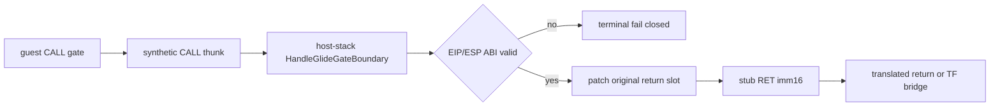
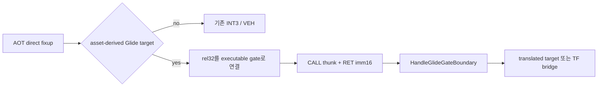

# 20260801-387 Glide Gate 전용 직접 Dispatch 설계 / Direct Dispatch Design

## 한국어

### 근거와 실제 실행 경로

Task 386 캡처에서 AOT boundary 476,388건 중 합성 Glide gate UD2가 420,803건(88.33%)입니다. 이는 1,307 frame에 비례하는 반복 경계입니다. Task 368은 다른 장면의 낮은 호출 밀도에서 예외 제거 상한이 3.25%라 구현하지 않았지만, 현재 Music Select에서는 gate prologue만 445,990회입니다.

초기 조사에서 gate를 AOT 동적 번역 entry로 승격하려 했으나 실측 `targets/candidates/promotions=172/0/0`으로 반증됐습니다. Glide gate의 실제 바이트는 code cache에 번역되지 않고 LINEXE arena의 8바이트 합성 stub에 남지만, AOT는 해당 주소에 1바이트 boundary mapping을 만들 수 있습니다. 따라서 변경 지점은 합성 stub과 그 mapping을 가리키는 cache target 연결입니다.

### ABI와 stub

`REPIU_AOT_DBT_GLIDE_GATE_DISPATCH=1|on|true` opt-in일 때만, 자산 유래 gate의 주소·ordinal·`argument_byte_count`와 기존 `UD2 + ordinal + RET` 바이트를 모두 검증합니다. 검증된 각 8바이트 stub을 다음과 같이 바꿉니다.

| offset | opt-out | opt-in |
|---:|---|---|
| +0 | `UD2` | `CALL rel32` to Win32 host-stack thunk |
| +2 | ordinal | CALL displacement |
| +5 | padding | `RET imm16` |

`CALL`이 push한 `gate+5`는 gate 신원과 성공 continuation을 동시에 제공합니다. thunk는 기존 guest register/EFLAGS 및 host-stack 전환 계약을 사용해 `HandleGlideGateBoundary`를 직접 호출합니다. handler가 만든 EIP와 `ESP += 4 + argument_byte_count`를 검증하고, 원 guest return slot을 번역된 cache target 또는 TF one-step target으로 바꿉니다. 복귀하면 stub의 `RET imm16`이 stdcall ABI와 동일하게 return address와 인자를 제거합니다.

일반 HLE, Port-I/O 및 원본 실행 파일은 변경하지 않습니다. 환경변수 미설정과 잘못된 gate/ABI/바이트는 기존 UD2/VEH 경로를 그대로 유지합니다. host context가 준비되지 않은 비정상 직접 진입은 terminal failure로 처리하며, 정상 실행에서는 gate image가 기록된 뒤 guest thread가 시작되므로 해당 상태가 발생하지 않습니다.

### 검증

Synthetic probe는 원 stub의 주소/바이트/ABI 검증, `CALL rel32 + RET imm16` layout, 잘못된 바이트의 비변경을 검사합니다. Release Win32 probe/loader 빌드 후 동일 EEPROM 5초 baseline/opt-in에서 buffer swap, Glide entry/handled, direct dispatch 성공/fallback, 예외를 비교합니다. 기본값은 수동 Music Select 캡처 전까지 OFF입니다.

## English

### Evidence and actual execution path

In the Task 386 capture, synthetic Glide-gate UD2 accounts for 420,803 of 476,388 AOT boundaries (88.33%), a frame-scaling boundary across 1,307 frames. Task 368 did not implement removal because a lower-density scene bounded gain at 3.25%, while the current Music Select run has 445,990 gate-prologue samples.

An initial attempt to promote gates as dynamic AOT entries was disproved by `targets/candidates/promotions=172/0/0`. The actual Glide bytes are not translated into the code cache and remain in project-generated eight-byte LINEXE-arena stubs, although AOT can create a one-byte boundary mapping for those addresses. The change point is therefore the synthetic stub plus cache targets that refer to its boundary mapping.

### ABI and stub

Only under `REPIU_AOT_DBT_GLIDE_GATE_DISPATCH=1|on|true`, validate each asset-derived gate address, ordinal, `argument_byte_count`, and original `UD2 + ordinal + RET` bytes. Replace each validated eight-byte stub with `CALL rel32` to a Win32 host-stack thunk followed by `RET imm16`.

The `gate+5` pushed by CALL identifies both the gate and its success continuation. The thunk preserves guest registers/EFLAGS, switches to the host stack, calls `HandleGlideGateBoundary`, validates its EIP and `ESP += 4 + argument_byte_count`, and replaces the original guest return slot with either a translated cache target or TF one-step target. The stub's `RET imm16` then removes the return address and arguments exactly as the stdcall ABI requires.

General HLE, Port-I/O, and original executable bytes remain unchanged. Unset configuration or invalid gate/address/ABI bytes retains the existing UD2/VEH path. An abnormal direct entry without prepared host context becomes a terminal failure; normal execution writes the gate image before starting the guest thread, so that state is unreachable.

### Verification

A synthetic probe checks source address/byte/ABI validation, `CALL rel32 + RET imm16` layout, and no mutation on invalid bytes. After Release Win32 probe/loader builds, compare identical-EEPROM five-second baseline/opt-in runs for buffer swaps, Glide entry/handled, direct-dispatch success/fallback, and exceptions. Default remains OFF pending a manual Music Select capture.
## 2026-08-01 실행 경로 정정

직접 스텁을 기록하고 페이지를 `PAGE_EXECUTE_READ`로 바꾼 뒤에도 진입 수가 0인 원인은 DEP가 아니었습니다. 실행 시 관측한 게이트 바이트는 `E8`, 페이지 보호는 `0x20`, 예외 코드는 `0x80000003`이었습니다. 초기 AOT 계획의 Glide direct-call target이 relocated image 밖의 주소라 외부 미해결 fixup으로 남고, 캐시의 `INT3`가 먼저 VEH를 호출한 뒤 EIP만 게이트 주소로 전달하고 있었습니다.

따라서 opt-in 경로는 자산에서 검증한 Glide gate 주소에 해당하는 미해결 `kDirectCall`/`kDirectJump` fixup만 캐시 배치 후 실제 게이트 주소로 연결합니다. 일반 외부 target과 opt-out은 기존 `INT3`/VEH 경로를 유지합니다. 게이트 페이지는 직접 실행 경로에서만 `PAGE_EXECUTE_READ`로 바꾸고 instruction cache를 flush합니다.

## 2026-08-01 Execution-path correction

The zero direct-entry count was not caused by DEP after the stub was written and the page became `PAGE_EXECUTE_READ`. The observed gate byte was `E8`, protection was `0x20`, and the exception was breakpoint `0x80000003`. Because the initial AOT Glide direct-call target lies outside the relocated image, its fixup remained external and unresolved. The cache `INT3` invoked VEH first, which then presented the gate address as EIP.

The opt-in path therefore resolves only unresolved `kDirectCall`/`kDirectJump` fixups whose targets exactly match asset-derived Glide gates after cache placement. General external targets and opt-out retain the existing `INT3`/VEH path. The gate page becomes `PAGE_EXECUTE_READ` only for direct dispatch and its instruction cache is flushed.
### RET immediate ABI 정정 / RET immediate ABI correction

`RET imm16`은 return address를 자체적으로 pop하므로 immediate에는 `argument_byte_count`만 기록합니다. handler context의 예상 ESP 증가는 return address를 포함한 `4 + argument_byte_count`이지만, 이를 RET immediate에도 그대로 넣으면 호출마다 ESP가 4바이트씩 과다 증가합니다.

`RET imm16` pops the return address itself, so the immediate contains only `argument_byte_count`. The handler-context ESP delta remains `4 + argument_byte_count`; using that full delta as the RET immediate would over-advance ESP by four bytes per call.
### 최종 AOT 연결 방식 / Final AOT connection method

실제 반복 경로는 정적 외부 fixup 하나가 아니라, AOT cache boundary mapping과 이를 가리키는 direct fixup/indirect inline-cache target의 조합입니다. 첫 Glide boundary가 자산 검증을 통과하면 해당 호출은 executable gate에서 계속하고, 같은 gate boundary를 가리키는 direct rel32 및 inline-cache absolute target을 executable gate로 재연결합니다. 이후 transfer resolution도 excluded-range 거부 전에 검증된 Glide gate를 직접 반환합니다. 일반 excluded range는 그대로 fail closed입니다.

The repeated path combines an AOT cache boundary mapping with direct fixups and indirect inline-cache targets that point to it. Once the first Glide boundary passes asset validation, that call continues at the executable gate and matching direct rel32 and inline-cache absolute targets are relinked to the gate. Later transfer resolution also returns a validated Glide gate before the general excluded-range rejection. All other excluded ranges remain fail closed.