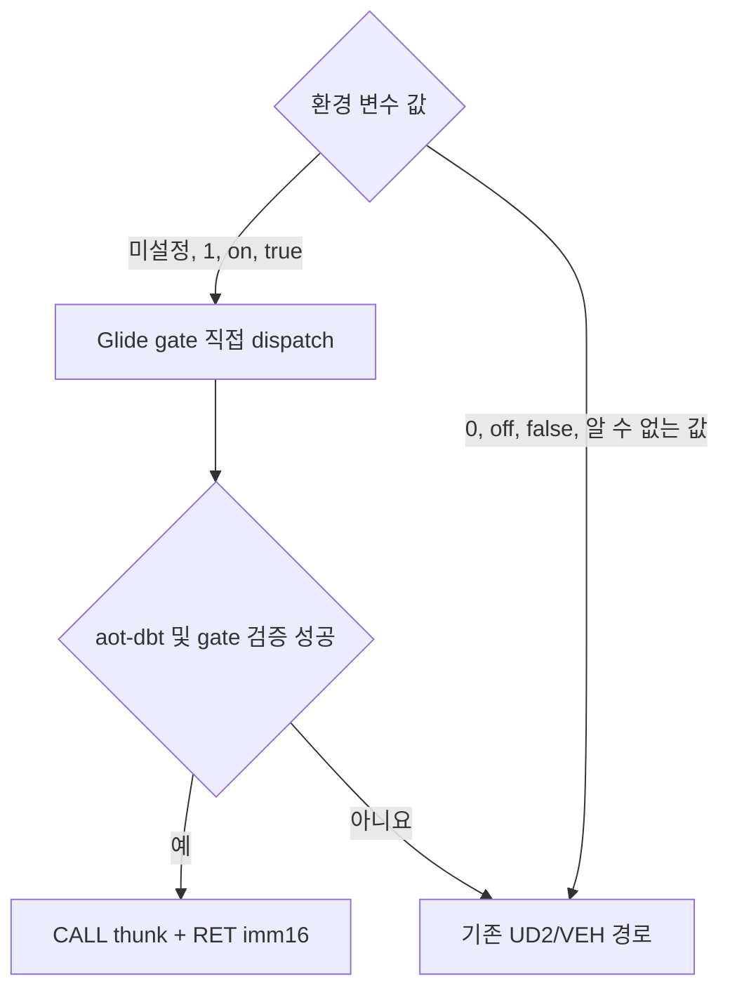

# 20260801-388 Glide Gate 직접 Dispatch 기본 활성화 설계 / Default Direct Dispatch Design

## 한국어

### 근거

Task 387 수동 Music Select 캡처는 49.187초 동안 Glide direct entry/success/target-miss/terminal `734,293/734,292/0/0`을 기록했습니다. 마지막 한 건은 종료 스냅샷 시점에 처리 중이었고 final exception은 없었습니다. `_GRBUFFERSWAP@4`는 3,957회, backend 상태는 `Glide buffer swapped`였으므로 메뉴의 장시간 렌더링 경로가 실제로 통과했습니다.

직전 짧은 캡처와 실행 구간 길이는 달라 절대 합계를 직접 비교하지 않습니다. 실행시간으로 정규화하면 총 예외율은 약 `17,633/s -> 3,776/s`로 78.6% 감소했습니다. Task 387의 동일 5초 비교에서도 총 예외가 63.22% 감소했으므로, 안전성과 반복 경계 제거 효과가 함께 확인되었습니다.

### 정책

Win32 `aot-dbt`에서 `REPIU_AOT_DBT_GLIDE_GATE_DISPATCH` 미설정은 활성화로 해석합니다. `0|off|false`, 빈 문자열 및 알 수 없는 값은 fail-closed opt-out으로 해석합니다. 다른 backend, 자산/ABI 검증 실패, 일반 excluded range는 기존 UD2/INT3/VEH 경로를 유지합니다.

### 검증

정책 probe에서 미설정/활성 값과 명시적 opt-out/알 수 없는 값을 검사합니다. Release probe와 loader를 빌드하고, 환경 변수 미설정 및 `0`의 짧은 smoke로 기본 경로와 복구 경로를 각각 확인합니다.

## English

### Evidence

The Task 387 manual Music Select capture recorded direct entry/success/target-miss/terminal `734,293/734,292/0/0` over 49.187 seconds. The final call was in flight at the shutdown snapshot and there was no final exception. `_GRBUFFERSWAP@4` reached 3,957 and the backend state was `Glide buffer swapped`, confirming sustained execution through the real menu rendering path.

Absolute totals are not compared because the preceding short capture covered a different duration. Normalized by runtime, the total exception rate fell approximately `17,633/s -> 3,776/s`, a 78.6% reduction. Together with Task 387's matched five-second 63.22% exception reduction, this confirms both safety and repeated-boundary removal.

### Policy

On Win32 `aot-dbt`, an unset `REPIU_AOT_DBT_GLIDE_GATE_DISPATCH` enables direct dispatch. `0|off|false`, an empty string, and unknown values are fail-closed opt-outs. Other backends, asset/ABI validation failures, and general excluded ranges preserve the existing UD2/INT3/VEH path.

### Verification

The policy probe checks unset and enabled values as well as explicit opt-outs and unknown values. Build the Release probe and loader, then run short smokes with the variable unset and set to `0` to verify both the default path and recovery path.
