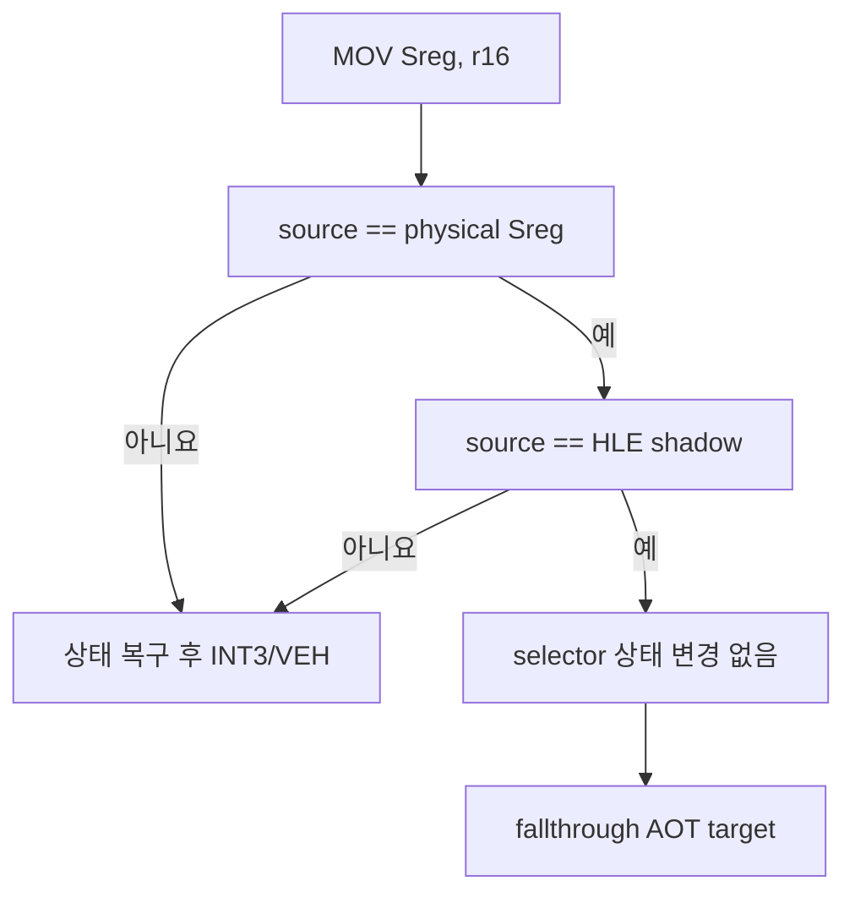

# 20260801-389 Guarded Segment Load Fast Path 설계 / Design

## 한국어

### 근거와 범위

Task 388 이후 Music Select 캡처의 AOT other boundary 64,938건 중 effective opcode `8E`(`MOV Sreg, r/m16`)가 29,699건입니다. `_GRBUFFERSWAP@4` 3,957회 기준 프레임당 약 7.5회이며, 최신 trace의 반복 주소 `0x030F6CD7`, `0x030F6E8A`, `0x030F694D`는 모두 register-source `MOV ES, r16`입니다. 최근 16개 관측 selector도 전부 `0x002B`였습니다.

이번 단계는 register-source `MOV Sreg, r16` 중 ES/DS/FS/GS만 다룹니다. SS는 interrupt-shadow 의미가 있고, memory source는 주소 변환이 필요하므로 제외합니다.

### 충분조건과 의미 보존

fast path는 source selector가 실제 CPU segment selector와 같고 HLE shadow selector와도 같은 경우만 성공합니다. 이때 명령은 visible selector와 hidden descriptor cache를 바꾸지 않는 의미상 no-op이므로 EFLAGS/GPR을 보존한 채 fallthrough cache target으로 이동합니다. 하나라도 다르면 원래 상태를 복구하고 기존 INT3/VEH HLE를 실행합니다.

EAX source는 저장된 원본 EAX의 하위 16비트와 비교합니다. ESP source와 SS destination은 지원하지 않습니다. 자산 코드나 guest selector 정책을 수정하지 않습니다.

### 활성화와 검증

`REPIU_AOT_GUARDED_SEGMENT_LOAD=1|on|true`인 Win32 `aot-dbt`에서만 활성화하며 기본값은 OFF입니다. synthetic probe는 분류, slot layout, shadow/counter patch, disabled fallback, 거부 형식을 검사합니다. Release build/probe와 짧은 opt-out/opt-in smoke 후 실제 Music Select 캡처에서 성공/복구 계수와 예외 감소를 판단합니다.

## English

### Evidence and scope

After Task 388, effective opcode `8E` (`MOV Sreg, r/m16`) accounts for 29,699 of 64,938 AOT other boundaries in the Music Select capture. That is about 7.5 per frame across 3,957 `_GRBUFFERSWAP@4` calls. Repeated sites `0x030F6CD7`, `0x030F6E8A`, and `0x030F694D` are register-source `MOV ES, r16`; all 16 latest observed selectors were `0x002B`.

This slice handles only register-source `MOV Sreg, r16` targeting ES/DS/FS/GS. SS is excluded because of interrupt-shadow semantics, and memory sources are excluded because they require address translation.

### Sufficient condition and semantic preservation

The fast path succeeds only when the source selector equals both the physical CPU segment selector and the HLE shadow selector. The instruction is then a semantic no-op for the visible selector and hidden descriptor cache, so it preserves EFLAGS/GPRs and jumps to the fallthrough cache target. Any mismatch restores the original state and uses the existing INT3/VEH HLE path.

EAX source is compared against the saved original EAX low word. ESP source and SS destination are unsupported. No asset code or guest-selector policy is changed.

### Enablement and verification

Enable only for Win32 `aot-dbt` under `REPIU_AOT_GUARDED_SEGMENT_LOAD=1|on|true`; default remains OFF. Synthetic probes cover classification, slot layout, shadow/counter patching, disabled fallback, and rejected forms. After Release build/probe and short opt-out/opt-in smokes, use a real Music Select capture to evaluate success/fallback counts and exception reduction.
