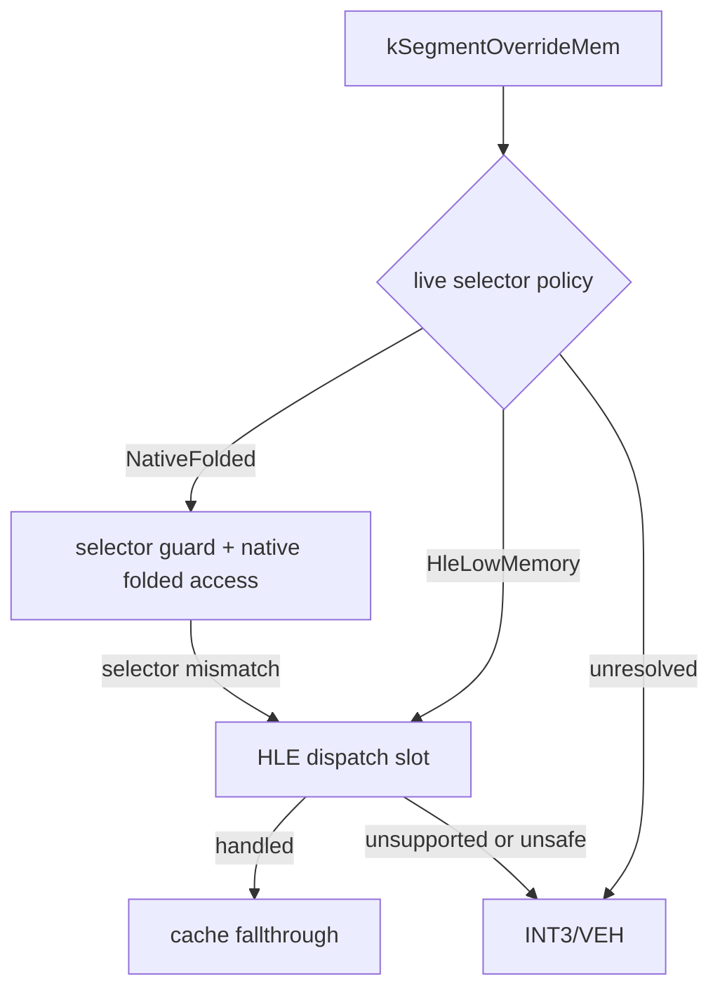

# 20260801-392 Hybrid Segment-Override Dispatch

## 한국어

### Task 391 장시간 결론

Task 391 broad dispatch 캡처는 기준 Task 390과 같은 고정 초기화 지표를 거쳤지만 `_GRBUFFERSWAP@4`가 `3,914 -> 2,116`으로 감소했습니다. frame당 전체 예외는 +59.82%, guest-run cycles는 +62.04%, VEH cycles는 +76.38%였습니다. HLE dispatch fallback `21,060`건 중 `21,059`건이 unhandled라서 모든 segment override를 dispatcher로 보내는 정책은 기각합니다.

### 설계

기존 selector-guard native slot 뒤에 fail-closed HLE dispatch slot을 함께 둡니다.

emitter는 native slot과 21-byte HLE slot을 모두 만들고 두 metadata를 보존합니다. live re-resolution에서 `kNativeFolded`는 기존 native 시작을 복원하고, `kHleLowMemory`만 시작점을 HLE slot으로 점프시킵니다. unresolved는 INT3를 유지합니다. native guard가 실행 중 selector 변경을 발견해도 HLE slot으로 fail closed합니다.

환경 변수 이름은 Task 391의 `REPIU_AOT_DBT_SEGMENT_OVERRIDE_DISPATCH`를 유지하되 의미를 broad replacement에서 hybrid routing으로 바꿉니다. 기본값은 장시간 재검증 전까지 OFF입니다.

## English

### Task 391 long-run conclusion

The Task 391 broad-dispatch capture followed the same fixed initialization markers as the Task 390 baseline, but `_GRBUFFERSWAP@4` fell `3,914 -> 2,116`. Per frame, total exceptions rose 59.82%, guest-run cycles 62.04%, and VEH cycles 76.38%. Of 21,060 HLE-dispatch fallbacks, 21,059 were unhandled, so routing every segment override through the dispatcher is rejected.

### Design

Emit a fail-closed HLE-dispatch slot alongside the existing selector-guard native slot, as shown above. The emitter preserves metadata for both. Live re-resolution restores the native entry for `kNativeFolded`, redirects only `kHleLowMemory` entries to the HLE slot, and keeps unresolved entries on INT3. A runtime selector mismatch from a native guard also routes to the HLE slot and fails closed there when unsupported.

Keep Task 391's `REPIU_AOT_DBT_SEGMENT_OVERRIDE_DISPATCH` name but change its meaning from broad replacement to hybrid routing. Default remains OFF pending another long validation.

## 장시간 검증 결론

`pumpit1` hybrid 캡처는 Task 390 기준과 거의 같은 실행 시간에 3,087/3,914 frame만 처리했습니다. frame당 전체 예외 +18.47%, guest-run cycles +25.49%, VEH cycles +47.50%, Glide gate cycles +49.60%로 회귀했습니다. access violation은 21.13% 감소했지만 다른 비용 증가를 상쇄하지 못하므로 hybrid를 기본 승격 후보에서 제외합니다. 구현은 기본 OFF인 진단 경로로만 유지합니다.

별도의 `piu_1st` 캡처에서 보고된 무음은 hybrid 회귀가 아닙니다. 실행 명령에서 `pumpit1` 인자가 누락되어 CHD/MSCDEX가 마운트되지 않았고 로그가 `MSCDEX available/audio=false/false`를 기록했습니다. 올바른 `pumpit1` 캡처는 `true/true`, 51 tracks, 41 requests를 기록했습니다.

## Long-run validation conclusion

The `pumpit1` hybrid capture processed only 3,087 versus 3,914 frames in nearly the same runtime as the Task 390 baseline. Per-frame total exceptions regressed 18.47%, guest-run cycles 25.49%, VEH cycles 47.50%, and Glide-gate cycles 49.60%. A 21.13% access-violation reduction did not offset the other costs, so hybrid routing is rejected for default promotion and retained only as a default-OFF diagnostic path.

The separately reported silent `piu_1st` capture is not a hybrid regression. The command omitted the `pumpit1` argument, so CHD/MSCDEX was not mounted and the log reported `MSCDEX available/audio=false/false`. The correct `pumpit1` capture reported `true/true`, 51 tracks, and 41 requests.
