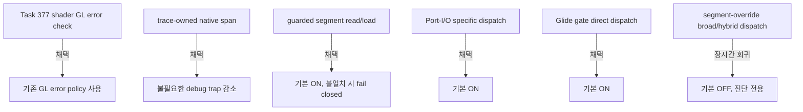

# 20260802-393 성능 조사 인계 및 병합 설계 / Performance Investigation Handoff and Merge Design

## 한국어

### 목적

Task 377부터 Task 392까지의 Music Select 성능 조사를 하나의 현재 상태로 정리하고, 채택된 기본 정책과 기각된 실험을 구분한 뒤 `main`에 병합합니다. 원본 guest 로직은 변경하지 않으며, 최적화는 HLE 경계와 host adapter에만 둡니다.

### 최종 상태

- shader 모듈의 반복 `glGetError`를 기존 `REPIU_GLIDE_GL_ERROR_CHECK` 정책에 연결했습니다.
- trace-owned native span, guarded segment read/load, Port-I/O 전용 dispatch, 검증된 Glide gate direct dispatch를 채택했습니다.
- guarded segment-load 장시간 캡처는 frame당 전체 예외 24.85%, breakpoint 44.74%, AOT boundary 50.80%, effective `8E` 93.53% 감소를 확인했습니다.
- segment-override broad dispatch는 frame당 전체 예외 59.82%, guest cycles 62.04%, VEH cycles 76.38% 증가로 기각했습니다.
- hybrid도 frame 처리량 21.13% 감소, frame당 전체 예외 18.47%, guest cycles 25.49%, VEH cycles 47.50% 증가로 기본 승격을 기각했습니다.
- 무음 보고는 `pumpit1` 인자 누락으로 CHD/MSCDEX가 없는 `piu_1st`를 실행한 것이 원인이며 hybrid 오디오 회귀가 아닙니다.

### 특화 범위

guarded segment와 Port-I/O 경로는 명령 형식과 live selector/device policy에 기반하며 PIU 주소를 하드코딩하지 않습니다. Glide direct dispatch도 공용 검증·patch 구조를 사용하지만, 실제 적용 대상은 지원 profile이 제공하는 synthetic Glide gate metadata가 있는 guest로 제한됩니다. 즉 게임 로직을 재구현한 코드는 없고, profile 자산이 적용 범위를 결정합니다.

### 추가 확인 항목

1. effective `8A`, `88`, `89`, `8C`와 안전 fallback `8E`를 개별 명령 형식으로 다시 분류합니다. segment-override 전체 명령군 dispatch는 재시도하지 않습니다.
2. 다른 guest에서 guarded segment selector 일치율과 fallback 안전성을 측정합니다.
3. 성능 비교는 반드시 `pumpit1`, swap interval 0, 비슷한 장면·시간, frame 정규화 조건을 사용합니다.
4. 남은 guest-run/VEH/Glide 비용을 동일한 작업량 기준으로 다시 나눕니다. 현재 Music Select 지연은 하나의 원인으로 확정되지 않았습니다.
5. DOS `chdir`와 고정 초기화 hotspot은 사용자 지시에 따라 후순위로 유지합니다.

### 병합 정책

Release 빌드와 두 PIU 실행 파일 구성의 전체 AOT probe를 통과한 뒤 patch 버전을 0.0.122로 올립니다. 작업 브랜치의 커밋을 하나로 squash하여 `main`에 병합하고 `v0.0.122` annotated tag를 로컬에 생성한 뒤 작업 브랜치를 삭제합니다.

## English

### Purpose

Consolidate the Music Select performance investigation from Tasks 377 through 392, distinguish adopted defaults from rejected experiments, and merge the result into `main`. Original guest logic remains unchanged; optimizations stay at HLE boundaries and host adapters.

### Final state

- Routed repeated shader-module `glGetError` calls through the existing `REPIU_GLIDE_GL_ERROR_CHECK` policy.
- Adopted trace-owned native spans, guarded segment read/load, Port-I/O-specific dispatch, and validated Glide-gate direct dispatch.
- The long guarded segment-load capture reduced per-frame total exceptions 24.85%, breakpoints 44.74%, AOT boundaries 50.80%, and effective `8E` 93.53%.
- Rejected broad segment-override dispatch after per-frame total exceptions rose 59.82%, guest cycles 62.04%, and VEH cycles 76.38%.
- Rejected hybrid default promotion after throughput fell 21.13% and per-frame total exceptions, guest cycles, and VEH cycles rose 18.47%, 25.49%, and 47.50%.
- The silent-audio report came from omitting the `pumpit1` argument and launching `piu_1st` without CHD/MSCDEX; it was not a hybrid audio regression.

### Specialization boundary

Guarded-segment and Port-I/O paths depend on instruction forms and live selector/device policy rather than hard-coded PIU addresses. Glide direct dispatch also uses shared validation and patching, but applies only when a supported profile supplies synthetic Glide-gate metadata. No game logic is reimplemented; profile assets determine applicability.

### Additional verification

1. Reclassify effective `8A`, `88`, `89`, `8C`, and safely falling-back `8E` as individual instruction forms. Do not retry whole-family segment-override dispatch.
2. Measure guarded-segment selector match rates and safe fallback behavior on other guests.
3. Use `pumpit1`, swap interval zero, comparable scenes and durations, and frame normalization for performance comparisons.
4. Re-attribute remaining guest-run, VEH, and Glide costs under matched work. Music Select latency is not yet attributable to one root cause.
5. Keep DOS `chdir` and fixed initialization hotspots lower priority per user direction.

### Merge policy

After the Release build and full AOT probes for both PIU layouts pass, bump the patch version to 0.0.122. Squash the task branch into one `main` commit, create local annotated tag `v0.0.122`, and delete the task branch.
