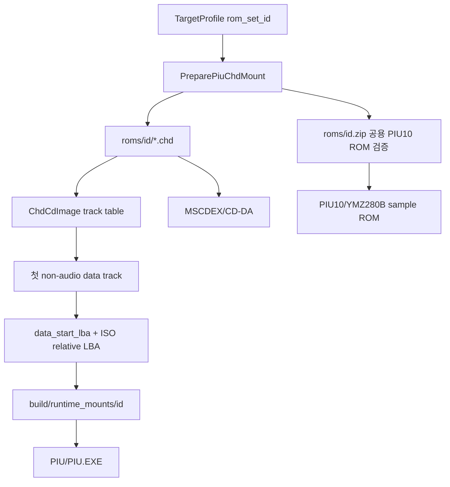

# 20260802-394 pumpit2 ZIP+CHD 프로필 설계 / pumpit2 ZIP+CHD Profile Design

## 한국어

### 확인된 자산 구조

- `pumpit2.zip`은 `pumpit1.zip`과 SHA-256 `B73A9549...A6EF380`으로 동일하며 PIU10 BIOS/프로그램/샘플 ROM 네 항목을 포함합니다.
- `roms/pumpit2/19921229.chd`는 기존 CHD reader가 열 수 있고 63트랙을 가집니다.
- 트랙 1~62는 audio이고 트랙 63이 `MODE2_RAW` data입니다. data track의 logical/data-start LBA는 280,832이고 physical CHD frame은 280,924입니다.
- 따라서 기존 `pumpit1` mount의 “disc LBA 16이 ISO PVD” 가정은 `pumpit2`에 적용할 수 없습니다.

### 공용 구조

`TargetProfile`에 비어 있을 수 있는 `rom_set_id`를 추가합니다. loader와 analyzer는 특정 게임 ID를 비교하지 않고 이 필드가 있는 profile만 공용 mount를 수행합니다. `pumpit1`과 `pumpit2`는 각각 자기 ID를 사용하고, 직접 실행과 기존 profile은 빈 값을 유지합니다.

mount reader는 공용 `ChdCdImage`의 track table에서 첫 non-audio track을 찾고 그 `data_start_lba`를 ISO 상대 LBA 0으로 사용합니다. CHD header identity는 공용 reader가 제공하여 기존 cache marker 의미를 유지합니다. 데이터 트랙이 없거나 여러 개이면 fail closed합니다.

PIU10 ZIP sample ROM 이름과 CRC는 두 세트가 공유하므로 sound loader 이름을 `pumpit1` 전용에서 PIU10 board 공용 이름으로 바꿉니다. 게임 로직이나 실행 파일 주소는 추가하지 않습니다.

### 검증

1. `pumpit1` 기존 mount cache 재사용과 analyzer 성공을 확인합니다.
2. `pumpit2` CHD를 새 cache에 materialize하고 `PIU/PIU.EXE` 존재와 analyzer 성공을 확인합니다.
3. Release loader/probe를 빌드합니다.
4. `pumpit2` 짧은 loader smoke에서 target, CHD, MSCDEX/audio, sample ROM, 진행 또는 안전한 진단 결과를 확인합니다.
5. `pumpit1` smoke로 기존 ZIP/CHD/audio 경로 회귀가 없는지 확인합니다.

## English

### Confirmed asset layout

- `pumpit2.zip` is byte-identical to `pumpit1.zip` at SHA-256 `B73A9549...A6EF380` and contains the same four PIU10 BIOS/program/sample ROM members.
- `roms/pumpit2/19921229.chd` opens with the shared CHD reader and has 63 tracks.
- Tracks 1-62 are audio and track 63 is `MODE2_RAW` data. Its logical/data-start LBA is 280,832 while its physical CHD frame is 280,924.
- The existing pumpit1 assumption that disc LBA 16 contains the ISO PVD therefore cannot support pumpit2.

### Shared structure

Add an optional `rom_set_id` to `TargetProfile`. Loader and analyzer mount any profile carrying this field without comparing game IDs. Pumpit1 and pumpit2 use their own IDs; direct and existing non-ROM profiles leave it empty.

The mount reader uses the shared `ChdCdImage` track table, selects the first non-audio track, and treats its `data_start_lba` as ISO-relative LBA zero. The shared reader exposes the CHD header identity so cache-marker semantics remain stable. Missing or multiple data tracks fail closed.

Both sets share the PIU10 ZIP sample member and CRC, so rename the sound-ROM API from pumpit1-specific to PIU10-board terminology. Add no game logic or executable addresses.

### Verification

1. Confirm pumpit1 cache reuse and analyzer success.
2. Materialize pumpit2 into a separate cache and confirm `PIU/PIU.EXE` plus analyzer success.
3. Build the Release loader and probe.
4. In a short pumpit2 loader smoke, verify target, CHD, MSCDEX/audio, sample ROM, and progress or a safe diagnostic outcome.
5. Run a pumpit1 smoke to exclude ZIP/CHD/audio regressions.

## 구현 확인에 따른 보정 / Implementation amendment

`pumpit2`의 ISO extent는 데이터 트랙 상대값이 아니라 원본 멀티세션 디스크의
절대 LBA입니다. mount는 PVD를 `data_start_lba + 16`에서 읽은 뒤 데이터 트랙을
스캔하여 루트 디렉터리 자기 참조 레코드를 찾고, 그 실제 CHD LBA와 PVD의 root
extent 차이로 signed bias를 계산합니다. 이후 directory/file extent에 이 bias를
적용합니다. 변환 결과가 데이터 트랙 밖인 일반 파일 레코드는 추출하지 않으며,
오디오 트랙은 기존 MSCDEX/CD-DA 경로에서 제공합니다. 이 정책은 특정 ROM-set
주소나 파일명을 하드코딩하지 않습니다.

Pumpit2 ISO extents are absolute LBAs from the original multisession disc, not
values relative to the data track. The mount reads the PVD at
`data_start_lba + 16`, scans the data track for the root directory self-record,
and derives a signed bias between its actual CHD LBA and the root extent stored
in the PVD. Directory and file extents use that bias. Ordinary file records that
map outside the data track are not materialized; audio remains available through
the existing MSCDEX/CD-DA track path. No ROM-set address or filename is hardcoded.