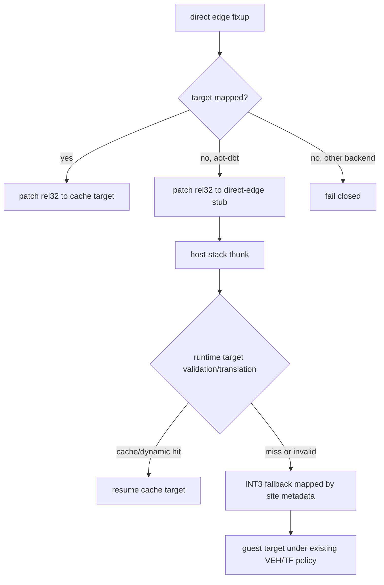

# 20260802-395 AOT-DBT unresolved direct-edge dispatch 설계

## 한국어

### 문제

정적 CFG는 direct call의 fall-through도 보수적으로 reachable로 간주합니다.
`pumpit2`의 `0x010FB9D1` call은 return address를 소비하는 thunk를 호출하고 그 뒤는
data지만, planner는 `0x010FB9D6` 이후를 코드로 걷다가 `0x010FB9E6`에서 decode를
멈춥니다. code-cache builder에는 `0x010FB9E5 -> 0x010FB9E6`
`kBlockFallthrough` fixup만 남아 전체 image 생성을 거부합니다.

### 결정

특정 thunk나 주소를 인식하지 않습니다. `aot-dbt`에서만 정적 cache에 없는 direct
call/jump/conditional/fall-through target을 전용 dispatch stub으로 연결합니다.
stub은 기존 host-stack thunk 규약으로 `ResolveAotTransferTarget`을 호출합니다.

### 자료 구조와 ABI

- `AotCodeCacheBuildOptions::enable_dbt_direct_edge_dispatch`가 emission을 제어합니다.
- `AotDbtDirectEdgeDispatchSite`는 guest source/target, dispatch address patch,
  thunk rel32, fallback INT3, success continuation offset을 보관합니다.
- unresolved edge마다 image 끝에 stub을 붙이고 원래 rel32를 그 stub으로 연결합니다.
  기존 instruction/address-map offset은 이동하지 않습니다.
- Win32 placement와 dynamic append는 stub의 절대 dispatch address와 thunk 주소를
  patch하고 metadata offset을 함께 이동합니다.
- runtime resolver는 site/source/target을 검증한 뒤 기존
  `ResolveAotTransferTarget`만 사용합니다. 실패 시 target을 건너뛰지 않고 fallback
  INT3가 원본 guest target으로 복귀시킵니다.

### 안전 정책

- 이 기능은 dynamic translation을 가진 `aot-dbt`에서만 기본 활성화합니다.
- site metadata 불일치, host stack 부재, target 해석 실패는 모두 INT3 fallback입니다.
- fallback target은 일반 address map에 가짜 코드로 등록하지 않습니다. 전용 site
  조회로만 복원하여 동적 resolver의 cache lookup을 오염시키지 않습니다.
- 실제 invalid opcode가 실행되면 기존 guest 예외 경로가 처리하며 임의 skip이나
  NOP 변환을 하지 않습니다.

### 검증

1. synthetic plan에서 mapped edge는 기존 rel32, unmapped edge는 stub이 되는지 봅니다.
2. site metadata, placement patch, fallback target 복원을 검증합니다.
3. Release 전체 AOT probe와 `pumpit1 aot-dbt` 회귀를 통과시킵니다.
4. `pumpit2 aot-dbt`가 cache build를 통과하고 guest 실행 timeout까지 진행하는지
   확인합니다.

### 구현 및 검증 결과

- 합성 probe의 비활성 거부, stub 방출, mapped-edge 직결, placement patch, fallback
  복원 다섯 조건과 전체 AOT probe가 모두 통과했습니다.
- pumpit2 Release `aot-dbt` 3초 smoke는 direct-edge dispatch site 1개를 만들고
  요청한 timeout까지 실행했습니다.
- pumpit1의 같은 smoke는 site 0개를 기록해 기존 직결 실행 경로를 유지했습니다.
- pumpit2의 일반 `aot`는 이전과 같이 `direct control-flow target is outside the cache`로
  종료해 backend 경계를 보존했습니다.
## English

### Problem and decision

The conservative CFG treats a direct call fall-through as reachable. Pumpit2 has
a return-address-consuming thunk followed by data, leaving one unmapped block
fall-through fixup after decode stops. Do not recognize that title-specific
pattern. Under AOT-DBT only, route any unresolved direct call, jump, conditional,
or fall-through edge through a dedicated runtime-dispatch stub.

The stub uses the established host-stack thunk ABI and
`ResolveAotTransferTarget`. A cache or dynamic-translation hit resumes in the
cache. Failure reaches an INT3 whose guest target is recovered from dedicated
site metadata, then uses the existing VEH/TF policy. The target is not inserted
as a fake address-map entry, so runtime cache lookup remains truthful.

Validation passed all five dedicated probe conditions and the complete AOT probe suite.
A three-second pumpit2 AOT-DBT smoke emitted one site and ran until timeout; pumpit1 emitted
zero sites. Plain AOT still rejected the unresolved edge, preserving the backend boundary.
Placement and dynamic append patch and relocate the same site metadata. Other
AOT backends retain the current fail-closed behavior. Tests cover emission,
placement, fallback recovery, the full probe suite, pumpit1 regression, and a
pumpit2 AOT-DBT smoke.
