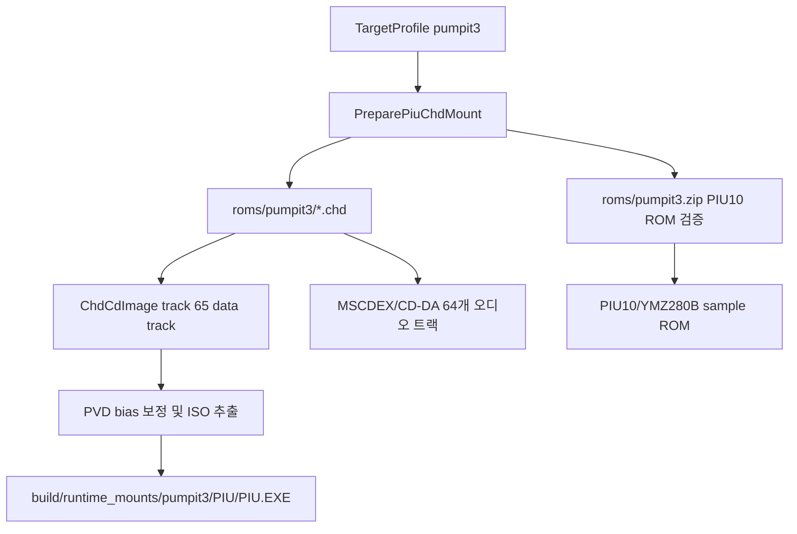

# 20260802-396 pumpit3 ZIP+CHD 프로필 설계 / pumpit3 ZIP+CHD Profile Design

## 한국어

### 확인된 자산 구조

- `roms/pumpit3.zip` (SHA-256: `302500356337F66F3AF380966B02942ACE07812830677993CF64AC79EE529D01`)은 `mk3_1.0_bios.u22`, `mk3_1.1_bios.u22`, `piu10.u8`, `piu10.u9`, `pumpit3.cat702` 항목을 포함합니다.
- PIU10 사운드 ROM 멤버인 `piu10.u8`과 `piu10.u9`는 기존 `pumpit1` / `pumpit2` ZIP과 동일한 4MB 세트입니다.
- `roms/pumpit3/20000508 the o-b-g.chd`는 총 65개 트랙으로 이루어진 멀티세션 CHD 디스크입니다.
- 트랙 1~64는 Audio 트랙이며, 트랙 65가 `MODE2_RAW` Data 트랙입니다.
- 기존 Task 394에서 완성된 공용 `piu_chd_mount` 구조(첫 non-audio data track 스캔, PVD offset bias 보정, ISO 9660 디렉토리/파일 추출)를 그대로 활용할 수 있습니다.

### 공용 구조 및 타겟 프로필 추가

`TargetProfile`에 `pumpit3` 타겟 프로필을 추가합니다:
- `id`: `"pumpit3"`
- `name`: `"Pump It Up The O.B.G: The 3rd Dance Floor (MAME CHD)"`
- `executable_path`: `"build/runtime_mounts/pumpit3/PIU/PIU.EXE"`
- `working_directory`: `"build/runtime_mounts/pumpit3/PIU"`
- `root_directory`: `"build/runtime_mounts/pumpit3"`
- `executable_format_hint`: `ExecutableFormatHint::kDos4gwLe`
- `hle_profile_id`: `"piu_common"`
- `rom_set_id`: `"pumpit3"`
- `runtime_reservation_hint`: `{ true, 0x00010000, 0x005D7000 }`

`PreparePiuChdMount`는 `rom_set_id`가 `"pumpit3"`인 경우 `roms/pumpit3.zip` 및 `roms/pumpit3/*.chd`를 탐색하여 `build/runtime_mounts/pumpit3` 디렉터리에 타겟 런타임 환경을 구축합니다.

### 검증

1. `exe_analyzer --target pumpit3` 실행 시 CHD mount 및 `PIU/PIU.EXE` 분석이 정상 성공하는지 확인합니다.
2. `repiu_host --target pumpit3` 실행 시 런타임 호스트 초기화, 오디오/샘플 ROM 매핑 및 MSCDEX 진입이 정상 동작하는지 확인합니다.
3. 기존 `pumpit1` 및 `pumpit2` 타겟에 대한 회귀가 없는지 확인합니다.

---

## English

### Confirmed Asset Layout

- `roms/pumpit3.zip` (SHA-256: `302500356337F66F3AF380966B02942ACE07812830677993CF64AC79EE529D01`) contains `mk3_1.0_bios.u22`, `mk3_1.1_bios.u22`, `piu10.u8`, `piu10.u9`, and `pumpit3.cat702`.
- The PIU10 sound ROM members `piu10.u8` and `piu10.u9` form the exact same 4MB set as in `pumpit1` and `pumpit2`.
- `roms/pumpit3/20000508 the o-b-g.chd` is a multisession CHD disc containing 65 tracks.
- Tracks 1-64 are Audio tracks, while Track 65 is the `MODE2_RAW` Data track.
- The shared `piu_chd_mount` pipeline built in Task 394 (first non-audio data track scan, PVD offset bias calibration, ISO 9660 extraction) can be directly reused.

### Shared Structure and Target Profile Addition

Add `pumpit3` target profile to `TargetProfile`:
- `id`: `"pumpit3"`
- `name`: `"Pump It Up The O.B.G: The 3rd Dance Floor (MAME CHD)"`
- `executable_path`: `"build/runtime_mounts/pumpit3/PIU/PIU.EXE"`
- `working_directory`: `"build/runtime_mounts/pumpit3/PIU"`
- `root_directory`: `"build/runtime_mounts/pumpit3"`
- `executable_format_hint`: `ExecutableFormatHint::kDos4gwLe`
- `hle_profile_id`: `"piu_common"`
- `rom_set_id`: `"pumpit3"`
- `runtime_reservation_hint`: `{ true, 0x00010000, 0x005D7000 }`

When `rom_set_id` is `"pumpit3"`, `PreparePiuChdMount` locates `roms/pumpit3.zip` and `roms/pumpit3/*.chd` to materialize the runtime environment under `build/runtime_mounts/pumpit3`.

### Verification

1. Verify `exe_analyzer --target pumpit3` successfully mounts CHD and analyzes `PIU/PIU.EXE`.
2. Verify `repiu_host --target pumpit3` initializes host runtime, maps audio/sample ROMs, and enters MSCDEX cleanly.
3. Verify no regressions on existing `pumpit1` and `pumpit2` targets.
