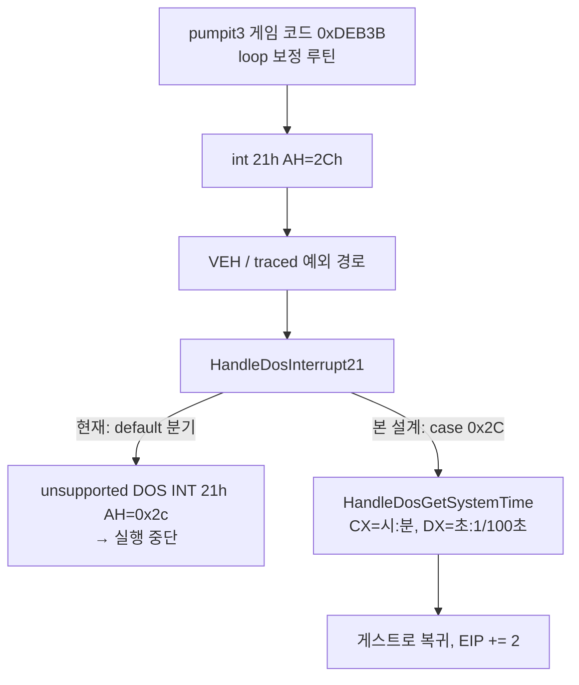

# 20260802-397 DOS INT 21h AH=2Ch 시스템 시각 서비스 설계 / DOS INT 21h AH=2Ch System Time Service Design

## 한국어

### 배경: pumpit3 실행 중단

Task 396에서 `pumpit3` 프로필을 추가한 뒤 실행하면 게스트가 다음 로그를 남기고 멈춥니다.

```
[loader] Win32 minimal execution message: original entry raised a caught exception
[loader] Relocated exception byte base: 0x030D3931
[loader] Relocated exception bytes: 00 00 00 5E 5A 5B C3 31 C0 C3 53 51 52 56 B4 2C [CD] 21 ...
[loader] Privileged instruction mnemonic: INT imm8
[loader] Current execution blocker: unhandled HLE trap candidate
```

Glide direct dispatch가 172/172 패치된 뒤이므로 초기화 후반부에서 발생한 중단입니다.

### 확인된 사실

로그의 32바이트 window는 `build/runtime_mounts/pumpit3/PIU/PIU.EXE` 파일 offset
`0xDEB31`과 바이트 단위로 일치합니다. 따라서 faulting EIP `0x030D3941`은 파일 offset
`0xDEB41`의 `int 21h`입니다.

해당 루틴을 복원하면 다음과 같습니다.

```
0xDEB3B  53 51 52 56        push ebx / ecx / edx / esi
0xDEB3F  B4 2C              mov  ah, 2Ch
0xDEB41  CD 21              int  21h            ; <-- 중단 지점
0xDEB43  31 C0 88 F0        xor  eax, eax / mov al, dh   ; DH = 초
0xDEB47  89 C3              mov  ebx, eax
0xDEB49  B4 2C CD 21        mov  ah, 2Ch / int 21h
0xDEB4D  31 C0 88 F0        xor  eax, eax / mov al, dh
0xDEB51  39 C3 74 F4        cmp  ebx, eax / je 0xDEB49   ; 초가 바뀔 때까지 대기
0xDEB55  31 F6 88 C3        xor  esi, esi / mov bl, al
0xDEB59  B4 2C CD 21        mov  ah, 2Ch / int 21h
0xDEB5D  46                 inc  esi
0xDEB5E  38 F3 74 F7        cmp  bl, dh / je 0xDEB59     ; 1초 동안 반복 횟수 계수
0xDEB62  89 35 2C CD 41 00  mov  [0x0041CD2C], esi       ; 보정 계수 저장
```

즉 **1초 동안 `INT 21h AH=2Ch` 호출 횟수를 세는 loop 보정 루틴**이며, `0xDEB86`부터
이어지는 함수는 이 보정 계수를 나누어 초 단위 delay를 구현합니다.

`INT 21h AH=2Ch`(Get System Time)는 현재 `HandleDosInterrupt21`의 `switch (ah)`에
없기 때문에 `default` 분기에서 `unsupported DOS INT 21h AH=0x2c`로 실패하고, HLE가
처리하지 못한 trap이 되어 실행이 중단됩니다.

### 이것이 pumpit3에서만 나타나는 이유

세 타겟 실행 파일에서 `B4 2C CD 21` 패턴을 세면 다음과 같습니다.

| 타겟 | AH=2Ch 호출 지점 | 위치 |
|---|---|---|
| pumpit1 | 1 | `0x10BD83` (Watcom `_dos_gettime` 라이브러리) |
| pumpit2 | 1 | `0x107A95` (동일 라이브러리) |
| pumpit3 | 5 | `0xDDED9` (동일 라이브러리) + **게임 코드 4곳** `0xDEB41` `0xDEB4B` `0xDEB5B` `0xDEB97` |

pumpit1/pumpit2에도 라이브러리 루틴은 링크되어 있으나 호출되지 않으므로 지금까지
드러나지 않았습니다. pumpit3는 게임 코드가 직접 이 보정/지연 루틴을 실행합니다.



### 설계

`INT 21h AH=2Ch`를 DOS 사양대로 구현합니다.

* 반환: `CH` = 시(0-23), `CL` = 분(0-59), `DH` = 초(0-59), `DL` = 1/100초(0-99)
* `ECX`, `EDX`의 상위 16비트는 보존합니다. 실제 DOS는 16비트 레지스터만 기록하며,
  게스트의 Watcom 라이브러리도 `shl ecx,16` 후 `mov cx,dx`로 하위 16비트만 사용합니다.
* `EAX`는 변경하지 않습니다. AH=2Ch는 반환값을 AX에 두지 않습니다.
* Carry flag를 clear합니다. 다른 성공 경로 handler와 동일한 규약입니다.

시각 원본은 **호스트 local time(`GetLocalTime`)** 을 사용합니다. HLE는 DOS 서비스를
호스트 등가물로 대체하는 계층이고, AH=2Ch는 정의상 시스템 시계를 읽는 서비스이므로
가장 충실한 대응입니다. 게스트 보정 루틴이 "초 값이 실제로 증가"하는 것을 전제로
busy-wait하므로, 정지된 가상 시계를 반환하면 무한 루프가 됩니다.

### 배치

* 구현은 `src/platform/win32/dos/dos_int21_services.cpp`의 `HandleDosGetSystemTime`으로
  두고 `dos_int21_services.h`에 선언합니다. 기존 `HandleDosGetCurrentDrive`와 같은 층입니다.
* INT 21h dispatch는 두 곳에 있으므로 **양쪽 모두**에 `case 0x2C`를 추가합니다.
  * `dos_int21_services.cpp`의 `HandleDosInterrupt21` (예외 trap 경로)
  * `src/platform/win32/cpu_emul/instruction_emulation.cpp`의
    `HandleTracedDosInterrupt21` (traced/single-step 경로)
  한쪽만 추가하면 실행 backend에 따라 같은 중단이 재현됩니다.

### 정정: AH=2Ah도 범위에 포함 (2차 실행 로그)

초판에서는 "`AH=2Ah`(Get Date)는 Watcom 라이브러리 영역에만 있고 호출되지 않으므로
범위 밖"이라고 적었습니다. **이 판단은 틀렸습니다.** AH=2Ch 구현 후 실행 로그는
AH=2Ch를 160,022회 처리한 뒤 `0x030D2CA8`에서 `AH=2Ah`로 다시 멈췄습니다.

정적 호출 관계로 확인한 실제 구조는 다음과 같습니다.

```
0xDB20A  time()
  └─ call 0xDDE9D   __getdt
       ├─ mov ah,2Ah / int 21h    ; 날짜
       ├─ mov ah,2Ch / int 21h    ; 시각
       └─ mov ah,2Ah / int 21h    ; 자정 넘김 확인용 재조회
  └─ call 0xDDF60   mktime 계열 (INT 21h 없음)
```

`0xDDE9D`의 유일한 호출자는 `0xDB20A`이며, 이 함수는 반환값을 `0x1F4`와 비교해 보정한 뒤
`0xDDF60`으로 넘깁니다. Watcom `time()`의 표준 형태입니다. 따라서 **AH=2Ah와 AH=2Ch는
하나의 루틴이 함께 쓰는 짝**이고, 둘 다 있어야 이 경로가 완성됩니다.

`AH=2Ah` 반환 규약:

* `CX` = 연도(1980-2099, 전체 연도), `DH` = 월(1-12), `DL` = 일(1-31),
  `AL` = 요일(0=일요일)
* 게스트는 `sub cx,0x76C`(1900)로 `tm_year`를 만들고 `mov ch,al`로 요일을 덮어쓴 뒤
  `shl ecx,16 / mov cx,dx`로 묶습니다. 따라서 `AL`의 요일이 실제로 필요합니다.

**교훈:** "라이브러리 영역에 있으니 호출되지 않는다"는 pumpit1/pumpit2 기준의 추론이었고,
pumpit3에는 적용되지 않았습니다. 호출 여부는 호출 그래프로 확인해야 합니다.

### 진단 공백 정정

1차와 2차 모두 로그에는 함수 번호가 나오지 않고 `unhandled HLE trap candidate`만 있었고,
어떤 함수인지는 바이트 window를 원본 실행 파일과 대조해야 알 수 있었습니다.

원인은 dispatch 표가 둘이라는 점입니다. `HandleDosInterrupt21`의 `default` 분기는
`hle_message`에 `unsupported DOS INT 21h AH=0xNN`을 기록하지만, `aot-dbt` backend는
`enable_dos_hle`가 꺼져 있어 그 분기에 도달하지 않고 `HandleTracedDosInterrupt21`의
조용한 `default: return false;`로 끝납니다.

traced 경로의 `default`에도 같은 메시지를 기록하게 하여, 다음 미구현 서비스는 로그가
스스로 이름을 말하도록 했습니다.

### 범위에 넣지 않는 것

`AH=01h/08h/0Bh/3Ch/41h/48h/49h`는 아직 도달이 관측되지 않았으므로 추가하지 않습니다.
근거 없이 추측으로 서비스를 늘리지 않는다는 원칙은 유지하되, 위 진단 개선으로 다음
도달 지점은 로그에서 즉시 식별됩니다.

### 남는 위험 (미확정)

보정 루틴은 1초 동안 `INT 21h` 왕복 횟수를 셉니다. 이 프로젝트에서 한 번의 왕복은
호스트 예외 처리 비용을 포함하므로, 원본 DOS 대비 계수 자체가 다릅니다. 보정과 지연이
같은 비용 구조를 공유하는 한 지연 시간은 자기 정합적이지만, **보정 시점과 지연 시점의
실행 backend가 다르면(interpret ↔ AOT/DBT) 계수가 어긋날 수 있습니다.** 실제 지연이
어긋나는지는 실행 관측으로 확인해야 하며, 이번 작업에서는 확정하지 않습니다.

### 검증

1. 빌드: `cmake --build build/win32_x86_debug`
2. `repiu_host --target pumpit3` 실행 시 `unhandled HLE trap candidate`가 사라지고
   `0x030D3941`을 넘어 진행하는지 확인
3. `pumpit1`, `pumpit2` 회귀 없음 확인

---

## English

### Background: pumpit3 stops executing

After Task 396 added the `pumpit3` profile, the guest halts with:

```
[loader] Win32 minimal execution message: original entry raised a caught exception
[loader] Relocated exception byte base: 0x030D3931
[loader] Relocated exception bytes: 00 00 00 5E 5A 5B C3 31 C0 C3 53 51 52 56 B4 2C [CD] 21 ...
[loader] Privileged instruction mnemonic: INT imm8
[loader] Current execution blocker: unhandled HLE trap candidate
```

Glide direct dispatch had already patched 172/172, so this is a late-initialization stop.

### Confirmed facts

The 32-byte window in the log matches file offset `0xDEB31` of
`build/runtime_mounts/pumpit3/PIU/PIU.EXE` byte for byte. The faulting EIP
`0x030D3941` is therefore the `int 21h` at file offset `0xDEB41`.

The routine reconstructs as a **loop-calibration routine that counts
`INT 21h AH=2Ch` calls for one second** and stores the count at `0x0041CD2C`;
the function that follows at `0xDEB86` divides that count to implement a delay.

`INT 21h AH=2Ch` (Get System Time) is absent from the `switch (ah)` in
`HandleDosInterrupt21`, so the `default` branch fails with
`unsupported DOS INT 21h AH=0x2c` and execution stops on an unhandled trap.

### Why only pumpit3 hits this

| Target | AH=2Ch sites | Location |
|---|---|---|
| pumpit1 | 1 | `0x10BD83` (Watcom `_dos_gettime` library) |
| pumpit2 | 1 | `0x107A95` (same library) |
| pumpit3 | 5 | `0xDDED9` (same library) + **4 game-code sites** `0xDEB41` `0xDEB4B` `0xDEB5B` `0xDEB97` |

pumpit1/pumpit2 link the library routine but never call it. pumpit3 runs the
calibration/delay routine from game code directly.

### Design

Implement `INT 21h AH=2Ch` per the DOS contract:

* Returns `CH` = hour, `CL` = minute, `DH` = second, `DL` = hundredths.
* Preserve the upper 16 bits of `ECX`/`EDX`; real DOS writes only the 16-bit
  registers, and the guest's Watcom library consumes only the low halves
  (`shl ecx,16` then `mov cx,dx`).
* Leave `EAX` untouched; AH=2Ch returns nothing in AX.
* Clear the carry flag, matching the other success-path handlers.

The clock source is **host local time (`GetLocalTime`)**. The HLE replaces DOS
services with host equivalents, and AH=2Ch is by definition a system-clock read.
The guest busy-waits for the seconds field to actually advance, so a frozen
virtual clock would loop forever.

### Placement

* Implement `HandleDosGetSystemTime` in
  `src/platform/win32/dos/dos_int21_services.cpp`, declared in
  `dos_int21_services.h`, at the same layer as `HandleDosGetCurrentDrive`.
* INT 21h dispatch exists in two places, so add `case 0x2C` to **both**:
  * `HandleDosInterrupt21` (exception trap path)
  * `HandleTracedDosInterrupt21` in
    `src/platform/win32/cpu_emul/instruction_emulation.cpp` (traced/single-step path)

  Adding only one reproduces the same stop depending on the execution backend.

### Correction: AH=2Ah is in scope after all (second run log)

The first revision claimed `AH=2Ah` (Get Date) lived only in an uncalled Watcom
library region and was therefore out of scope. **That was wrong.** With AH=2Ch
implemented, the run serviced 160,022 AH=2Ch calls and then stopped again at
`0x030D2CA8` on `AH=2Ah`.

The static call graph shows one routine using both:

```
0xDB20A  time()
  |- call 0xDDE9D   __getdt
  |    |- mov ah,2Ah / int 21h    ; date
  |    |- mov ah,2Ch / int 21h    ; time
  |    \- mov ah,2Ah / int 21h    ; re-read to detect midnight rollover
  \- call 0xDDF60   mktime family (no INT 21h)
```

`0xDDE9D` has exactly one caller, `0xDB20A`, which compares the result against
`0x1F4` and forwards to `0xDDF60` — the standard Watcom `time()` shape. AH=2Ah and
AH=2Ch are a pair used by one routine, and both are needed to complete this path.

`AH=2Ah` contract: `CX` = full year (1980-2099), `DH` = month (1-12), `DL` = day
(1-31), `AL` = day of week (0 = Sunday). The guest builds `tm_year` with
`sub cx,0x76C` (1900), overwrites `ch` with `al`, then packs via
`shl ecx,16 / mov cx,dx`, so the weekday in `AL` is genuinely consumed.

**Lesson:** "it is in the library region, so it is not called" was an inference from
pumpit1/pumpit2 that did not transfer to pumpit3. Reachability has to come from the
call graph.

### Diagnostic gap, corrected

In both rounds the log reported only `unhandled HLE trap candidate` with no function
number, so identifying the service required matching the logged byte window against
the original executable.

The cause is the two dispatch tables. `HandleDosInterrupt21`'s `default` branch
records `unsupported DOS INT 21h AH=0xNN` in `hle_message`, but the `aot-dbt` backend
runs with `enable_dos_hle` off and never reaches it, ending instead at the silent
`default: return false;` in `HandleTracedDosInterrupt21`.

The traced `default` now records the same message, so the next unimplemented service
names itself in the log.

### Out of scope

`AH=01h/08h/0Bh/3Ch/41h/48h/49h` have not been observed as reached and are not added.
Services are still not added on speculation, but the diagnostic change above means the
next one to be reached is identified directly from the log.

### Remaining risk (unresolved)

The calibration loop counts `INT 21h` round trips per second, and each round trip
here includes host exception-handling cost, so the constant differs from original
DOS. Delay timing stays self-consistent as long as calibration and delay share the
same cost structure, but **the count can be wrong if the execution backend differs
between calibration time and delay time (interpret vs AOT/DBT).** Whether actual
delays drift must be confirmed by runtime observation; this task does not settle it.

### Verification

1. Build: `cmake --build build/win32_x86_debug`
2. Run `repiu_host --target pumpit3` and confirm `unhandled HLE trap candidate`
   is gone and execution advances past `0x030D3941`.
3. Confirm no regression on `pumpit1` and `pumpit2`.
