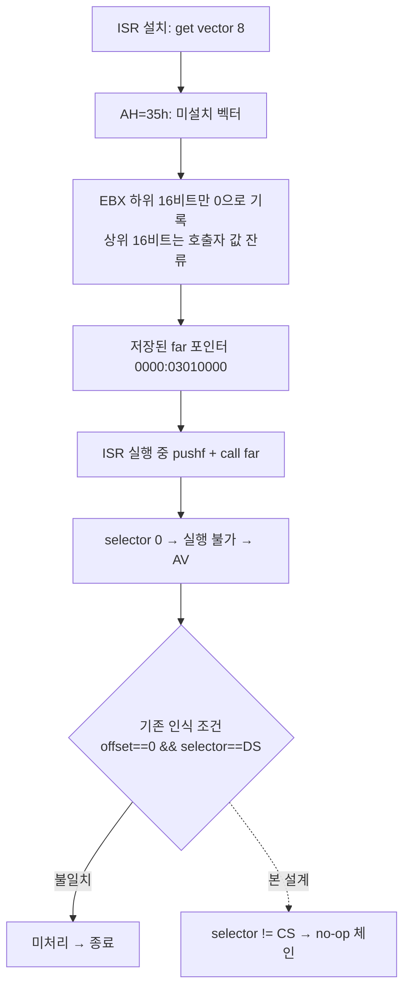

# 20260802-398 INT 8 체인의 비실행 이전 핸들러 인식 / Recognizing a Non-Executable Previous INT 8 Handler

## 한국어

### 배경

Task 397로 `INT 21h AH=2Ah/2Ch`를 구현한 뒤 pumpit3는 크게 전진했습니다. 파일 5개 열기,
읽기 12회, `STAGE.CFG` 파싱, 메모리 resize 59회, Glide 게이트 51회 진입, 640x480 창 생성
(`_GRSSTWINOPEN@28: opened=1`)까지 도달했습니다. 그 뒤 `0x0301F827`에서
`EXCEPTION_ACCESS_VIOLATION`(`0xC0000005`)으로 종료했습니다.

### 확인된 사실: 정지 지점은 INT 8 ISR의 체인 far call

로그 byte window는 `PIU.EXE` 파일 offset `0x2AA27`과 일치합니다. 주변 코드는 다음과 같습니다.

```
0x0301F826  9C                 pushf
0x0301F827  FF 1D 08 ED 43 03  call far [0x0343ED08]   <-- 정지
0x0301F82D  81 2D ...          sub dword [0x030F9034], 0x10000
...
0x0301F84x  EE                 out dx, al      ; PIC EOI (0x20)
            FB FC              sti / cld
            0F A9 0F A1 07 1F  pop gs/fs/es/ds
            61 CF              popad / iretd
```

`out 0x20` + `iretd`로 끝나므로 이 함수는 **IRQ 핸들러**이고, 로그의
`DOS INT 21h AH=25h vector 0x08 set to 0023:0301F7BC`가 이것이 게임의 INT 8 ISR임을
확정합니다. `pushf` + `call far`는 이전 핸들러로 체인하는 표준 관용구입니다.

### 확인된 사실: 왜 기존 처리기가 걸리지 않았나

`HandleTimerInterruptChainBoundary`는 이미 이 관용구를 처리합니다. 그러나 인식 조건이
`target_offset == 0 && target_selector != 0 && target_selector == DS`였고, pumpit3가
저장한 값은 그 형태가 아닙니다.

게스트의 설치 루틴을 복원하면 다음과 같습니다.

```
0x0301F887  mov  eax, 8
0x0301F88C  mov  ebx, 0x0301F7BC        ; 새 ISR
0x0301F891  call 0x030D0963             ; get-vector wrapper
0x0301F896  mov  cx, cs
0x0301F898  mov  [0x0343ED08], eax      ; 이전 offset 저장
0x0301F8A2  mov  [0x0343ED0C], dx       ; 이전 selector 저장
0x0301F8A9  call 0x030D0995             ; set-vector wrapper
```

wrapper `0x030D0963`의 실체는 다음과 같습니다.

```
or   ah, 0x35
int  21h            ; AH=35h get vector
mov  dx, es
pop  es
mov  eax, ebx       ; <-- EBX 전체 32비트를 offset으로 사용
```

호출 시점 `EBX = 0x0301F7BC`였고, 우리 `HandleDosGetInterruptVector`는

```cpp
win32_context->Ebx = (win32_context->Ebx & 0xFFFF0000U) | offset;
```

로 **하위 16비트만** 기록합니다. 따라서 반환 `EBX = 0x03010000`, `ES = 0`이 되어
저장된 far 포인터는 `0000:03010000`입니다. `target_offset != 0`이고
`target_selector != DS`이므로 조건이 두 군데서 어긋납니다.



### 설계

이전 핸들러 포인터가 **실행 가능한 게스트 코드를 가리키는지**만 판정합니다.

```cpp
if (target_selector == static_cast<std::uint16_t>(win32_context->SegCs))
{
    return false;
}
```

* 게스트 코드 selector는 `CS`(`0x0023`)뿐입니다. `0`, `DS`(`0x002B`), `FS`(`0x0053`)
  어느 것도 far call 대상이 될 수 없습니다.
* pumpit1이 저장한 `002B:00000000`과 pumpit3가 저장한 `0000:03010000`이 모두 이 규칙
  하나로 덮이며, 타이틀별 offset 값에 의존하지 않습니다.
* selector가 `CS`인 진짜 체인은 계속 인식하지 않고 fail-closed로 남깁니다. 실제로
  등장하면 로그로 드러납니다.

기존 동작(`pushf`가 밀어 넣은 EFLAGS만 제거하고 far call 다음으로 진행)은 그대로입니다.
체인 대상이 없으므로 즉시 복귀하는 것이 올바른 의미입니다.

### 함께 확인된 별개 결함 (이번 범위 밖)

`HandleDosGetInterruptVector`가 `EBX`의 하위 16비트만 기록하는 것은 그 자체로 결함입니다.
같은 파일의 `HandleDosSetInterruptVector`는 `dpmi_entry.offset = win32_context->Edx`로
**32비트 전체**를 저장하므로 get/set이 비대칭이고, 32비트 DPMI 클라이언트에게 상위 16비트
쓰레기 값이 그대로 전달됩니다. 이번 로그의 `0x03010000`이 그 직접 증거입니다.

이 수정은 pumpit1/pumpit2가 공유하는 경로를 바꾸므로 별도 Task로 분리하고, 세 타이틀
회귀 검증과 함께 진행합니다. 본 Task의 selector 규칙은 그 수정이 적용된 뒤에도 그대로
성립합니다(수정 후 미설치 벡터는 `0000:00000000`이 되고, selector는 여전히 `CS`가 아님).

### 검증

1. 빌드: `cmake --build build --config Release`
2. pumpit3 로그에서 `Win32 INT 8 chain HLE count`가 0에서 증가하고 `0x0301F827`을
   통과하는지 확인
3. pumpit1/pumpit2에서 `INT 8 chain HLE count`가 기존과 같이 증가하는지 확인

---

## English

### Background

After Task 397 implemented `INT 21h AH=2Ah/2Ch`, pumpit3 advanced substantially: five
file opens, twelve reads, `STAGE.CFG` parsing, 59 memory resizes, 51 Glide gate entries,
and a 640x480 window (`_GRSSTWINOPEN@28: opened=1`). It then terminated at `0x0301F827`
with `EXCEPTION_ACCESS_VIOLATION` (`0xC0000005`).

### Confirmed: the stop is the INT 8 ISR chaining to its predecessor

The logged byte window matches `PIU.EXE` file offset `0x2AA27`. The surrounding code is
`pushf` / `call far [0x0343ED08]`, and the function ends with `out 0x20, al` (PIC EOI),
`sti`, `pop gs/fs/es/ds`, `popad`, `iretd`. That makes it an IRQ handler, and the log line
`DOS INT 21h AH=25h vector 0x08 set to 0023:0301F7BC` identifies it as the game's INT 8
ISR. `pushf` followed by `call far` is the standard chain-to-previous-handler idiom.

### Confirmed: why the existing handler did not match

`HandleTimerInterruptChainBoundary` already handles this idiom, but required
`target_offset == 0 && target_selector != 0 && target_selector == DS`, and pumpit3 saved a
different shape.

The guest install routine calls a get-vector wrapper at `0x030D0963` whose body is
`or ah,0x35` / `int 21h` / `mov dx,es` / `pop es` / `mov eax,ebx` — it takes the **full
32-bit EBX** as the previous offset. EBX held `0x0301F7BC` on entry, and our
`HandleDosGetInterruptVector` writes only the low 16 bits:

```cpp
win32_context->Ebx = (win32_context->Ebx & 0xFFFF0000U) | offset;
```

so the wrapper returns `EBX = 0x03010000` with `ES = 0`, and the saved far pointer becomes
`0000:03010000`. Both the offset and the selector conditions fail.

### Design

Test only whether the saved pointer designates **executable guest code**:

```cpp
if (target_selector == static_cast<std::uint16_t>(win32_context->SegCs))
{
    return false;
}
```

`CS` (`0x0023`) is the only guest code selector; `0`, `DS` (`0x002B`), and `FS` (`0x0053`)
can none of them be far-call targets. One rule covers both pumpit1's saved
`002B:00000000` and pumpit3's `0000:03010000` without depending on per-title offsets, and a
genuine chain through `CS` stays fail-closed so it would appear in a log.

The existing action is unchanged: discard only the EFLAGS that `pushf` pushed and resume
after the far call, which is the correct meaning when there is no predecessor to chain to.

### A separate defect found along the way (out of scope here)

`HandleDosGetInterruptVector` writing only the low 16 bits of `EBX` is itself a defect. The
neighbouring `HandleDosSetInterruptVector` stores the **full 32 bits**
(`dpmi_entry.offset = win32_context->Edx`), so get and set are asymmetric and a 32-bit DPMI
client receives a stale high half. The `0x03010000` in this log is direct evidence.

Fixing it changes a path shared with pumpit1 and pumpit2, so it belongs in its own task with
three-title regression verification. The selector rule above still holds afterwards: an
uninstalled vector would then read `0000:00000000`, whose selector is still not `CS`.

### Verification

1. Build: `cmake --build build --config Release`
2. In a pumpit3 log, confirm `Win32 INT 8 chain HLE count` rises above zero and execution
   passes `0x0301F827`.
3. Confirm pumpit1/pumpit2 still advance their `INT 8 chain HLE count` as before.
