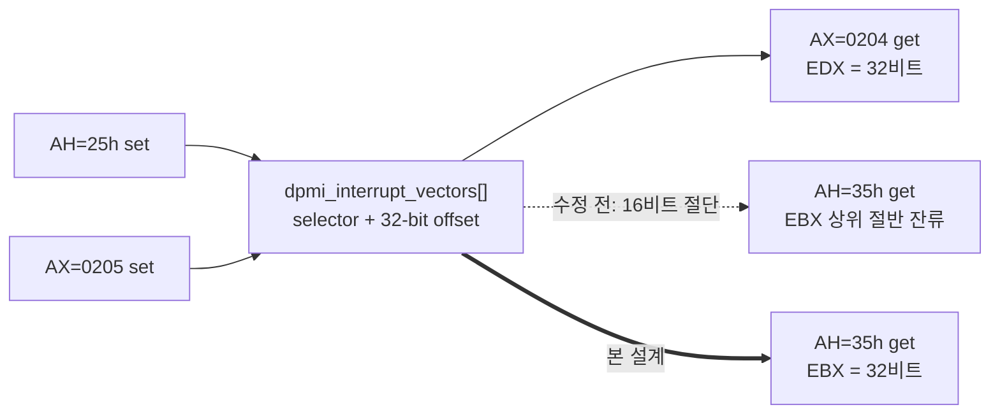

# 20260802-399 INT 21h AH=35h 32비트 벡터 offset 설계 / INT 21h AH=35h 32-bit Vector Offset Design

## 한국어

### 배경

Task 398에서 pumpit3의 INT 8 체인 far call을 조사하다가, 게스트가 저장한 "이전 핸들러"
포인터가 `0000:03010000`이라는 것을 확인했습니다. 이 값은 게임 버그가 아니라 우리
`HandleDosGetInterruptVector`가 만들어 낸 것입니다.

### 확인된 결함

게스트 get-vector wrapper `0x030D0963`:

```
or   ah, 0x35
int  21h            ; AH=35h
mov  dx, es
pop  es
mov  eax, ebx       ; EBX 전체 32비트를 offset으로 사용
```

수정 전 `HandleDosGetInterruptVector`:

```cpp
win32_context->Ebx = (win32_context->Ebx & 0xFFFF0000U) | offset;
```

`offset`은 `DosInterruptVectorShadow::offset`(`std::uint16_t`)이며, **EBX 하위 16비트만**
기록하고 상위 절반은 호출자 값을 그대로 남깁니다. 진입 시 `EBX = 0x0301F7BC`였으므로
반환값은 `0x03010000`이 되었고, 게스트는 그것을 이전 INT 8 핸들러 주소로 저장했습니다.

같은 파일과 인접 서비스는 이미 32비트를 다룹니다.

| 서비스 | offset 취급 |
|---|---|
| `INT 21h AH=25h` (`HandleDosSetInterruptVector`) | `dpmi_entry.offset = win32_context->Edx` — 32비트 전체 |
| `INT 31h AX=0205` | `shadow.offset = win32_context->Edx` — 32비트 전체 |
| `INT 31h AX=0204` | `win32_context->Edx = shadow.offset` — 32비트 전체 |
| `INT 21h AH=35h` (수정 전) | `Ebx` 하위 16비트만 — **비대칭** |

즉 set 계열과 DPMI get은 모두 32비트인데 `AH=35h`만 16비트였습니다.



### 설계

`AH=35h`를 `AH=25h`/`AX=0204`의 정확한 짝으로 만듭니다.

* 값 출처는 `dpmi_interrupt_vectors[vector]`를 우선하고, 없으면
  `dos_interrupt_vectors[vector]`로 되돌립니다. DOS extender는 32비트 클라이언트의
  `AH=35h`를 protected mode 벡터 조회로 처리하며, 이는 `AH=25h`가 기록하고 `AX=0204`가
  읽는 바로 그 표입니다.
* `EBX`에 32비트 offset 전체를 기록합니다. 미설치 벡터는 `0`입니다.
* `ES`/`guest_es` 처리와 carry clear는 기존과 같습니다.

### Task 398 규칙과의 관계

수정 후 pumpit3가 저장하는 이전 핸들러는 offset이 `0`이 됩니다. selector는 여전히
`CS`가 아니므로 Task 398의 `target_selector != CS` 규칙은 그대로 성립합니다. 두 수정은
독립적이며 서로를 무효화하지 않습니다.

### 회귀 관점

pumpit1/pumpit2와 공유하는 경로입니다. 변화는 두 가지뿐입니다.

1. 16비트만 읽던 게스트(`BX` 사용)는 영향이 없습니다. 하위 16비트 값이 같습니다.
2. 32비트를 읽던 게스트는 이제 쓰레기 상위 절반 대신 실제 offset을 받습니다. 이는
   정정이며, 이전 값이 의미 있게 쓰이던 경로는 없습니다.

추가로 `dpmi_entry`를 우선하므로, `AX=0205`로만 설정된 벡터를 `AH=35h`로 조회할 때도
일관된 값이 나옵니다. 수정 전에는 `dos_interrupt_vectors`에만 의존해 `AX=0205` 설정이
보이지 않았습니다.

### 검증

1. 빌드: `cmake --build build --config Release`
2. pumpit3 로그: `Win32 INT 8 chain HLE count/.../target`의 offset이
   `0x03010000`에서 `0x00000000`으로 바뀌고 체인 인식이 유지되는지 확인
3. pumpit1/pumpit2 로그: `INT 8 chain HLE count` 회귀 없음 확인

---

## English

### Background

While investigating pumpit3's INT 8 chain far call in Task 398, the saved "previous
handler" pointer turned out to be `0000:03010000`. That value was produced by our own
`HandleDosGetInterruptVector`, not by a game bug.

### The confirmed defect

The guest get-vector wrapper at `0x030D0963` runs `or ah,0x35` / `int 21h` /
`mov dx,es` / `pop es` / `mov eax,ebx`, taking the **full 32-bit EBX** as the offset.
Before this change the handler wrote

```cpp
win32_context->Ebx = (win32_context->Ebx & 0xFFFF0000U) | offset;
```

with `offset` a `std::uint16_t`, so only the low half was written and the caller's high
half survived. EBX held `0x0301F7BC` on entry, so the wrapper read back `0x03010000` and
stored it as the previous INT 8 handler address.

Neighbouring services already work in 32 bits:

| Service | Offset handling |
|---|---|
| `INT 21h AH=25h` (`HandleDosSetInterruptVector`) | `dpmi_entry.offset = win32_context->Edx` — full 32 bits |
| `INT 31h AX=0205` | `shadow.offset = win32_context->Edx` — full 32 bits |
| `INT 31h AX=0204` | `win32_context->Edx = shadow.offset` — full 32 bits |
| `INT 21h AH=35h` (before) | low 16 bits of `Ebx` only — **asymmetric** |

### Design

Make `AH=35h` the exact counterpart of `AH=25h` and `AX=0204`:

* Read from `dpmi_interrupt_vectors[vector]` first, falling back to
  `dos_interrupt_vectors[vector]`. A DOS extender serves `AH=35h` from a 32-bit client out
  of the protected-mode vector — the table `AH=25h` writes and `AX=0204` reads.
* Write the full 32-bit offset to `EBX`; an uninstalled vector yields `0`.
* `ES`/`guest_es` handling and the carry clear are unchanged.

### Relationship to the Task 398 rule

After this change pumpit3's saved previous handler has offset `0`, and its selector is still
not `CS`, so Task 398's `target_selector != CS` rule continues to hold. The two changes are
independent and neither invalidates the other.

### Regression view

This path is shared with pumpit1 and pumpit2. Only two things change:

1. Guests reading 16 bits (`BX`) see no difference — the low half is identical.
2. Guests reading 32 bits now receive the real offset instead of a stale high half. That is
   a correction, and no path meaningfully consumed the previous value.

Preferring `dpmi_entry` additionally makes `AH=35h` consistent for vectors installed only
through `AX=0205`, which the old code could not see.

### Verification

1. Build: `cmake --build build --config Release`
2. pumpit3 log: the offset in `Win32 INT 8 chain HLE count/.../target` changes from
   `0x03010000` to `0x00000000` while chain recognition still holds.
3. pumpit1/pumpit2 logs: no regression in `INT 8 chain HLE count`.
