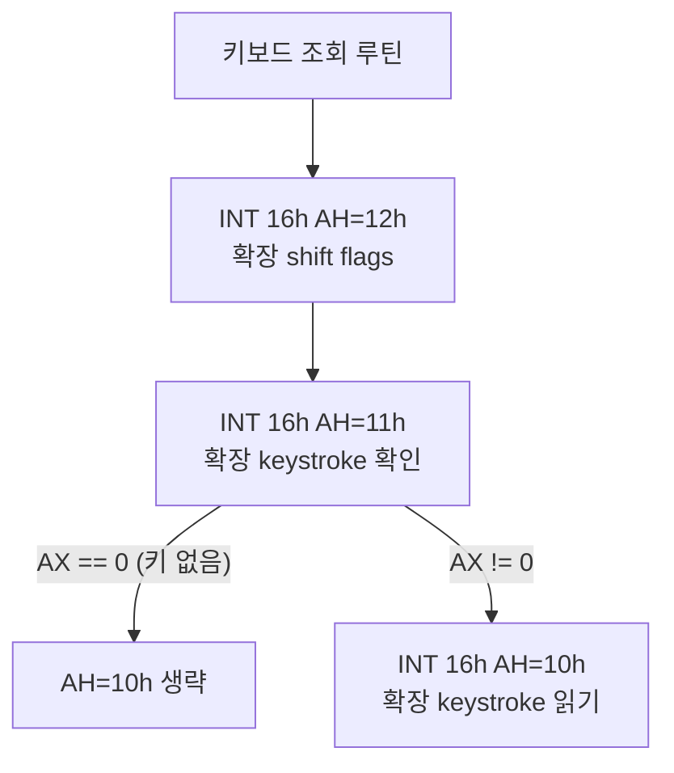

# 20260802-401 BIOS INT 16h 키보드 서비스 설계 / BIOS INT 16h Keyboard Services Design

## 한국어

### 배경: Task 399가 정지를 해소하고 새 지점이 드러남

사용자가 13:37에 관측한 pumpit3 진행 정지는 Task 399(`AH=35h` 32비트 offset 수정)로
해소됐습니다. 직접 실행 두 번으로 분리 확인했습니다.

| 실행 | hotspot profile | 결과 |
|---|---|---|
| 사용자 13:37 (Task 399 이전) | off | 폴링 루프에서 60초 이상 정지 |
| 15:07 census (Task 399 이후) | **on** | 폴링 통과, `0x03011537`에서 종료 |
| 15:09 대조 (Task 399 이후) | **off** | 폴링 통과, `0x03011537`에서 종료 |

프로파일러를 끈 대조 실행이 같은 지점에 도달했으므로, 정지 해소의 원인은 계측
오버헤드가 아니라 Task 399 수정입니다. 두 실행 모두
`INT 8 chain HLE ... target: 0x0000002B:0x00000000`을 기록해 수정이 실제로 반영됐음을
보여 줍니다(이전 값 `0x03010000`).

### 확인된 사실: 새 정지 지점은 INT 16h

`0x03011537`, `0xC0000005`. byte window
`... 31 DB B4 12 89 35 18 3A 09 00 88 E6 [CD] 16 75 09 ...`를 복원하면 다음과 같습니다.

```
0x0301152B  xor  ebx, ebx
0x0301152D  mov  ah, 0x12
0x0301152F  mov  [0x03183A18], esi
0x03011535  mov  dh, ah          ; 함수 번호 보존
0x03011537  int  16h             ; <-- 정지. AH=12h 확장 shift flags
0x03011539  jnz  +9              ; ZF=0이면 fixup 생략
0x0301153B  and  dh, 0x0F        ; fixup: 미지원 BIOS 대비
0x0301153E  dec  dh
0x03011540  jnz  +2
0x03011542  sub  eax, eax
0x03011544  mov  bx, ax
0x03011547  mov  ah, 0x11        ; AH=11h 확장 keystroke 확인
            ... int 16h ...
            test ax, ax
            jz   +0x18           ; 키 없으면 AH=10h 생략
            mov  ah, 0x10        ; AH=10h 확장 keystroke 읽기
            ... int 16h ...
```

즉 하나의 조회 루틴이 `AH=12h` → `AH=11h` → (키가 있을 때만) `AH=10h` 순으로
호출합니다. `mov dh, ah`로 함수 번호를 보존한 뒤 ZF에 따라 `dh`의 하위 니블을 검사하는
fixup은 확장 함수를 지원하지 않는 BIOS 대비 코드입니다.

바이너리 전체의 `CD 16` 지점은 8곳이며, 그중 `0x030112xx`와 `0x030114xx` 두 군집이 같은
형태의 조회 루틴입니다.



### 설계

`INT 16h`를 구현합니다. 캐비닛의 플레이 입력은 `0x02A0` 계열 포트로 들어오므로
**게스트 키보드는 실제로 유휴 상태**이며, "키 없음 / shift 없음"은 stub이 아니라
정확한 상태 보고입니다.

| AH | 반환 | 근거 |
|---|---|---|
| `10h`, `00h` | `AX = 0`, ZF set | keystroke 대기. 실기 BIOS는 블로킹하지만 보고할 입력이 없으므로 즉시 빈 결과가 유일한 비정지 답입니다. 게스트는 `11h`/`01h`가 키를 보고한 뒤에만 호출하므로 실제로는 도달하지 않습니다 |
| `11h`, `01h` | `AX = 0`, ZF set | ZF set이 "버퍼 비어 있음"입니다 |
| `02h` | `AL = 0`, ZF clear | shift flags 없음 |
| `12h` | `AX = 0`, ZF clear | 확장 shift flags 없음 |
| 그 외 | 미처리 + `hle_message` 기록 | 관찰되지 않은 subfunction을 성공으로 위장하지 않습니다 |

ZF는 `EFLAGS` 비트 `0x40`으로 직접 설정합니다. 게스트의 fixup 경로는 ZF set일 때
`AH=11h`에 대해 `sub eax,eax`를 실행하므로 우리 반환값 `AX=0`과 일치하고, `AH=12h`에
대해서는 `dec dh`가 0이 아니어서 `EAX`를 건드리지 않습니다. 따라서 어느 쪽 ZF로도
`AX=0`이 보존되지만, 사양에 맞춰 12h/02h는 ZF를 clear합니다.

### 배치

`src/platform/win32/bios/bios_keyboard_services.{h,cpp}`를 새로 둡니다. `INT 16h`는
DOS도 DPMI도 아닌 BIOS 서비스이므로 `dos/`에 섞지 않고 전용 디렉터리로 분리합니다.
dispatch는 기존 소프트웨어 인터럽트와 같이 두 경로 모두에 등록합니다.

* `HandleDosHleInstruction` (예외 trap 경로)
* `HandleTracedBiosInterrupt16` (traced/single-step 경로)

### 함께 고친 진단 공백

pumpit3의 정지 세 건(`INT 21h AH=2Ch`, `AH=2Ah`, `INT 16h`) 모두 로그가 어떤 서비스인지
말하지 않아 byte window를 원본 실행 파일과 대조해야 했습니다. Task 397이 traced 경로의
`INT 21h` 미지원 `AH`를 이름 붙이도록 고쳤지만, **미지원 인터럽트 벡터 자체**는 여전히
익명이었습니다. `aot-dbt`는 `enable_dos_hle`가 꺼져 있어 벡터 이름을 남기는
`HandleDosHleInstruction`에 도달하지 않기 때문입니다.

VEH에서 소프트웨어 인터럽트를 처리할 수 있는 handler를 모두 지난 뒤
`RecordUnsupportedTracedSoftwareInterrupt`가 `unsupported software interrupt 0xNN`을
기록합니다. 이 지점 이후의 handler는 `CD` 명령을 처리하지 않으므로 오탐이 없고,
`hle_message`가 이미 있으면 덮어쓰지 않습니다.

### 검증

1. 빌드: `cmake --build build --config Release`
2. pumpit3 실행에서 `0x03011537` 종료가 사라지고 timeout까지 진행하는지 확인
3. `Win32 DOS AH hotspots`에 vector 0x16 처리가 계수되는지 확인
4. pumpit1/pumpit2 회귀 없음 확인

---

## English

### Background: Task 399 cleared the stall and exposed a new stop

The pumpit3 stall the user observed at 13:37 was cleared by Task 399 (the 32-bit `AH=35h`
offset fix). Two direct runs isolate the cause:

| Run | hotspot profile | Result |
|---|---|---|
| User 13:37 (pre-399) | off | Stalled in the polling loop for 60+ seconds |
| 15:07 census (post-399) | **on** | Passed the poll, terminated at `0x03011537` |
| 15:09 control (post-399) | **off** | Passed the poll, terminated at `0x03011537` |

The control run with profiling disabled reached the same point, so instrumentation overhead
is not what cleared the stall — the Task 399 fix is. Both runs logged
`INT 8 chain HLE ... target: 0x0000002B:0x00000000`, confirming the fix took effect (the
value was `0x03010000` before).

### Confirmed: the new stop is INT 16h

At `0x03011537` with `0xC0000005`. The byte window resolves to a query routine that calls
`AH=12h` (extended shift flags), then `AH=11h` (check for an extended keystroke), and
`AH=10h` (read the extended keystroke) only when the check reported one. It preserves the
function number with `mov dh, ah` and, when ZF comes back set, inspects the low nibble of
`dh` — a fixup for BIOSes without the extended functions.

The binary has eight `CD 16` sites; the clusters at `0x030112xx` and `0x030114xx` are the
same query routine.

### Design

Implement `INT 16h`. The cabinet's play inputs arrive over the `0x02A0` port family, so the
guest keyboard is genuinely idle and "no key, no shift" is an accurate report rather than a
stub.

| AH | Return | Reason |
|---|---|---|
| `10h`, `00h` | `AX = 0`, ZF set | Wait for a keystroke. A real BIOS blocks, but with no input to report an empty keystroke is the only non-hanging answer; the guest reaches it only after `11h`/`01h` reports a key, so it stays unreached |
| `11h`, `01h` | `AX = 0`, ZF set | ZF set means the buffer is empty |
| `02h` | `AL = 0`, ZF clear | No shift flags |
| `12h` | `AX = 0`, ZF clear | No extended shift flags |
| Anything else | Unhandled, records `hle_message` | Unobserved subfunctions are not faked as successful |

ZF is set directly through `EFLAGS` bit `0x40`. The guest's fixup path runs `sub eax,eax`
for `AH=11h` when ZF is set, which agrees with our `AX=0`, and leaves `EAX` alone for
`AH=12h` because `dec dh` is non-zero. Either ZF therefore preserves `AX=0`, but `12h` and
`02h` clear it to match the specification.

### Placement

New files `src/platform/win32/bios/bios_keyboard_services.{h,cpp}`. `INT 16h` is a BIOS
service rather than a DOS or DPMI one, so it gets its own directory instead of joining
`dos/`. Dispatch is registered on both paths, as with the other software interrupts:
`HandleDosHleInstruction` (exception trap) and `HandleTracedBiosInterrupt16` (traced).

### The diagnostic gap fixed alongside

All three pumpit3 stops so far (`INT 21h AH=2Ch`, `AH=2Ah`, `INT 16h`) had to be identified
by matching the logged byte window against the original executable. Task 397 made the traced
path name an unsupported `INT 21h` `AH`, but an **unsupported interrupt vector** itself was
still anonymous, because `aot-dbt` runs with `enable_dos_hle` off and never reaches
`HandleDosHleInstruction`, the only place that named it.

After every VEH handler that can service a software interrupt has declined,
`RecordUnsupportedTracedSoftwareInterrupt` records `unsupported software interrupt 0xNN`.
No handler past that point services a `CD` instruction, so there are no false positives, and
it never overwrites an existing `hle_message`.

### Verification

1. Build: `cmake --build build --config Release`
2. Confirm the `0x03011537` termination is gone and the run continues to timeout.
3. Confirm vector `0x16` appears in the handled-interrupt counters.
4. Confirm no regression on pumpit1 and pumpit2.
