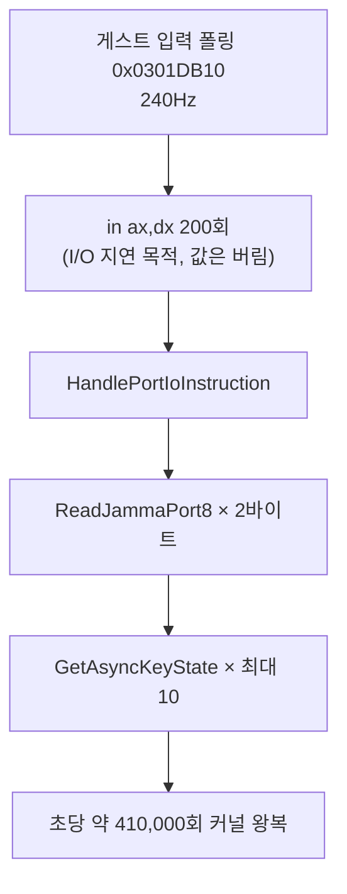

# 20260802-402 INT 21h AH=2Ch 비용 측정 / Measuring the INT 21h AH=2Ch Cost

## 한국어

### 측정 목적

Task 401은 single-step census 표본의 약 95%가 게임의 `INT 21h AH=2Ch` 지연 루틴 세
주소라는 이유로, 그것이 약 25 FPS의 주된 비용일 **가능성이 높다**고 기록했습니다.
이 Task는 그 가설을 wall clock 대비로 확정하거나 기각합니다. 코드는 바꾸지 않고 기존
`REPIU_EXECUTION_TIME_PROFILE` 계측만 사용합니다.

### 측정 설계

`ExecutionTimeBucket::kGuestRunTotal`이 게스트 실행 전체의 wall clock이고,
`kDosService`가 INT 21h 서비스 본체입니다. 핸들러 본체만으로는 한 호출의 전체 비용이
아니므로, 커널 예외 왕복(`VEH gap`)을 호출 수로 배분해 더합니다.

```
AH=2Ch 총비용 ≈ kDosService + (DOS 호출 수 × VEH gap "other" 평균)
```

`AH=2Ch`는 처리된 DOS 인터럽트의 99.9%(263,832 / 264,022)이므로 `kDosService` 버킷은
사실상 `AH=2Ch`입니다.

45초 실행 2회(`aot-dbt`, timeout 45,000ms)로 재현성을 확인합니다.

### 결과

| 항목 | base1 | base2 |
|---|---:|---:|
| wall cycles | 177,711,788,710 | 166,469,707,454 |
| 프레임 (`grBufferSwap`) | 1,026 (22.8 FPS) | 867 (19.3 FPS) |
| `AH=2Ch` 호출 | 263,832 | 208,740 |
| **DOS 서비스 본체** | **0.146%** | **0.047%** |
| **DOS 본체 + 커널 왕복 추정** | **3.84%** | **3.19%** |
| port I/O 본체 | 30.53% | 24.16% |
| **port I/O + 커널 왕복 추정** | **56.39%** | **46.06%** |
| Glide gate | 12.64% | 11.38% |
| VEH gap 합계 | 58.00% | 68.29% |

### 결론: 가설 기각

**`INT 21h AH=2Ch`는 wall clock의 약 3.2~3.8%입니다.** 완전히 제거해도 상한
`1 / (1 - 0.038) = 1.04배`이며, Task 368이 예외 축을 종결할 때 쓴 것과 같은 크기입니다.
**이 축은 종결합니다.**

기각을 뒷받침하는 두 번째 근거가 있습니다. 이 지연 루틴은 **자기 보정형**입니다.
`0xDEB3B`가 1초 동안 `AH=2Ch` 호출 횟수를 세어 보정 상수로 저장하고, `0xDEB86`의 지연
함수는 그 상수로 나눈 횟수만큼 반복합니다.

```
지연 wall time = 반복 횟수 × 호출당 비용
               = (T × 초당 호출 수) × (1 / 초당 호출 수)
               = T
```

호출당 비용이 약분되므로, `AH=2Ch`를 더 싸게 만들어도 루프가 더 많이 돌 뿐 지연 시간은
같습니다. 즉 이 3~4%는 게임이 **의도한 대기**이지 제거 가능한 오버헤드가 아닙니다.

### 이전 기록의 오류 정정

Task 401이 "census 표본의 95%"를 비용 근거로 삼은 것은 **범주 오류**였습니다. census의
`total_cycles`는 single-step 핸들러 scope만 측정하며, 그 자체가 wall clock의 **2.04%**
(3,620,910,343 / 177,711,788,710)에 불과합니다. "single-step 핸들러 시간의 95%"는
"전체 비용의 95%"가 아닙니다. 세 주소의 census cycle을 wall 대비로 환산하면 1.30%입니다.

### 확인된 실제 비용 중심: 포트 `0x02A8` 폴링

측정이 지목한 곳은 다른 데였습니다. **port I/O가 wall의 약 46~56%** 입니다.

* 관측 수 1,846,040회 / 45초 = 초당 약 41,000회
* 핸들러 본체 호출당 약 29,400 cycle(약 7.4µs) — Glide gate 호출당 78,000 cycle의 1/3

원인은 `src/platform/win32/io/port_io_emulator.cpp`의 `ReadJammaPort8`입니다.
포트 1바이트를 읽을 때마다 `GetAsyncKeyState`를 최대 5회 호출하고,
`0x02A8`의 16비트 읽기는 2바이트이므로 `in ax,dx` 한 번에 최대 **10회**입니다.



게스트는 이 200회 읽기를 **값이 아니라 시간을 쓰기 위해** 실행합니다(매 반복 `eax`를
0으로 지워 결과를 버립니다). 실기에서는 ISA 버스 사이클 한 번이므로 싼 지연이지만,
여기서는 읽기마다 Windows 키보드 상태를 전수 조회합니다.

이 루프는 `AH=2Ch` 지연과 달리 **반복 횟수가 200으로 고정**이라 자기 보정되지 않습니다.
따라서 호출당 비용을 줄이면 wall time이 실제로 줄어듭니다.

### 다음 대상 (이 Task 범위 밖)

`ReadJammaPort8`이 포트 읽기마다 키보드를 전수 조회하지 않도록, 입력 스냅샷을 프레임
또는 타이머 틱 단위로 갱신하고 포트 읽기는 그 스냅샷을 보게 하는 방향. 정확성 조건은
Task 327이 확인한 "매 폴링마다 EIP를 전진시켜 재트랩하고 press/release 전이를 놓치지
않을 것"이며, 스냅샷 주기가 게스트 폴링 주기보다 촘촘하면 유지됩니다.

### 검증

측정 전용 Task로 코드를 바꾸지 않았습니다. 재현 절차:

```
set REPIU_EXECUTION_BACKEND=aot-dbt
set REPIU_EXECUTION_TIMEOUT_MS=45000
set REPIU_EXECUTION_TIME_PROFILE=1
build\Release\repiu_loader_win32.exe pumpit3 > repiu_cost.log 2>&1
```

`Win32 execution time cycles guest-run/veh/glide-gate/port-io/dos`와
`Win32 VEH gap cycles/counts`를 읽습니다.

---

## English

### Purpose

Task 401 recorded that the game's `INT 21h AH=2Ch` delay routine accounted for about 95% of
single-step census samples and was therefore **likely** the dominant cost behind ~25 FPS.
This task settles that hypothesis against wall clock. No code changed; it uses the existing
`REPIU_EXECUTION_TIME_PROFILE` instrumentation.

### Method

`ExecutionTimeBucket::kGuestRunTotal` is the wall clock of the guest run and `kDosService`
is the INT 21h service body. The body alone is not a call's full cost, so the kernel
exception round trip (`VEH gap`) is apportioned by call count:

```
AH=2Ch total cost ≈ kDosService + (DOS call count × VEH gap "other" mean)
```

`AH=2Ch` is 99.9% of handled DOS interrupts (263,832 / 264,022), so the `kDosService` bucket
is effectively `AH=2Ch`. Two 45-second `aot-dbt` runs check reproducibility.

### Results

| Metric | base1 | base2 |
|---|---:|---:|
| Wall cycles | 177,711,788,710 | 166,469,707,454 |
| Frames (`grBufferSwap`) | 1,026 (22.8 FPS) | 867 (19.3 FPS) |
| `AH=2Ch` calls | 263,832 | 208,740 |
| **DOS service body** | **0.146%** | **0.047%** |
| **DOS body + kernel round trip** | **3.84%** | **3.19%** |
| Port I/O body | 30.53% | 24.16% |
| **Port I/O + kernel round trip** | **56.39%** | **46.06%** |
| Glide gate | 12.64% | 11.38% |
| VEH gap total | 58.00% | 68.29% |

### Conclusion: hypothesis rejected

**`INT 21h AH=2Ch` is about 3.2-3.8% of wall clock.** Removing it entirely caps the gain at
`1 / (1 - 0.038) = 1.04x`, the same magnitude Task 368 used to close the exception axis.
**This axis is closed.**

A second, independent reason supports the rejection: the delay routine is
**self-calibrating**. `0xDEB3B` counts `AH=2Ch` calls for one second and stores the constant;
the delay function at `0xDEB86` iterates a count derived by dividing by it. Cost per call
cancels:

```
delay wall time = iterations x cost-per-call
                = (T x calls-per-second) x (1 / calls-per-second)
                = T
```

Making `AH=2Ch` cheaper would only make the loop spin more times in the same wall time. The
3-4% is time the game **intends** to wait, not removable overhead.

### Correcting the earlier record

Task 401 treating "95% of census samples" as a cost claim was a **category error**. The
census `total_cycles` measures only the single-step handler scope, which is itself **2.04%**
of wall clock (3,620,910,343 / 177,711,788,710). "95% of single-step handler time" is not
"95% of cost". Converted to wall clock, the three addresses are 1.30%.

### Confirmed real cost centre: the port `0x02A8` poll

The measurement pointed elsewhere. **Port I/O is about 46-56% of wall clock**: 1,846,040
observations in 45 seconds (~41,000/s) at roughly 29,400 cycles (~7.4 µs) of handler body
per call — a third of the 78,000 cycles a Glide gate call costs.

The cause is `ReadJammaPort8` in `src/platform/win32/io/port_io_emulator.cpp`, which calls
`GetAsyncKeyState` up to five times per port byte. A 16-bit read at `0x02A8` covers two
bytes, so a single `in ax,dx` performs up to **ten** of them, and the guest issues about
41,000 such reads per second — roughly 410,000 `GetAsyncKeyState` calls per second.

The guest runs those 200 reads **for time, not for data** (it zeroes `eax` each iteration and
discards the result). On real hardware that is one cheap ISA bus cycle per read; here it is a
full keyboard scan. Unlike the `AH=2Ch` delay, this loop has a **fixed 200 iterations** and is
not self-calibrating, so reducing per-call cost does reduce wall time.

### Next target (outside this task)

Stop `ReadJammaPort8` from scanning the whole keyboard on every port read: refresh an input
snapshot per frame or per timer tick and have port reads consume the snapshot. The accuracy
constraint is the one Task 327 established — advance EIP and re-trap on every poll so
press/release transitions are not latched away — and it holds as long as the snapshot
cadence is finer than the guest's polling cadence.

### Verification

Measurement-only; no code changed. Reproduce with `REPIU_EXECUTION_TIME_PROFILE=1` on a
45-second `aot-dbt` pumpit3 run and read
`Win32 execution time cycles guest-run/veh/glide-gate/port-io/dos` together with
`Win32 VEH gap cycles/counts`.
