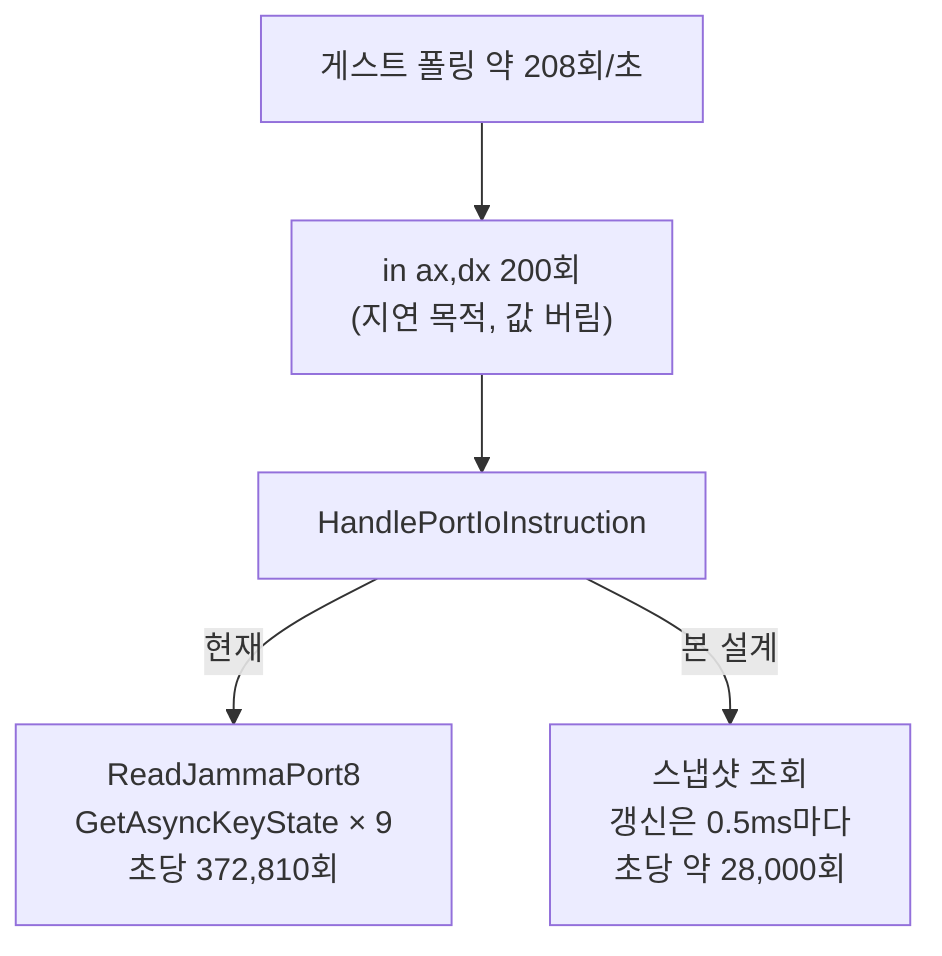

# 20260802-403 JAMMA 입력 스냅샷 설계 / JAMMA Input Snapshot Design

## 한국어

### 배경과 측정

Task 402가 pumpit3의 지배 비용으로 port I/O(wall의 30.9%)를 지목했고, 그 안에서
`GetAsyncKeyState`가 차지하는 비중은 미확정으로 남겼습니다. 이 Task에서 먼저 분해했습니다.

| 항목 | 값 |
|---|---:|
| port I/O 핸들러 본체 | wall의 30.90% |
| └ JAMMA scan 루프 | port-io 본체의 **99.21%** |
| scan당 key query | 8.98 |
| key query당 cycle | 3,044 (약 0.82µs) |
| `9 × 3,044` vs 실측 scan 27,337 | **100.2%** |

**근인은 `GetAsyncKeyState` 하나입니다.** scan 비용을 0으로 만들 때의 상한은
`1 / (1 - 0.3065) = 1.44배`입니다.

### 왜 이렇게 자주 호출되는가

게스트는 포트 `0x02A8`을 **200회 연속으로 읽고 값을 전부 버립니다**(`sub eax,eax`).
멀티플렉서 strobe 사이의 settle 지연이 목적이며, 실기에서는 ISA 버스 사이클 한 번이
곧 지연이므로 자연스러운 관용구입니다. 우리는 그 200회 각각에 대해 호스트 키보드를
전수 조회하고 있었습니다.

### 설계

**스냅샷 1개를 두고, 갱신 주기를 시간으로 제한합니다.**

* `RefreshJammaSnapshot()`이 JAMMA 창(`0x02A0`~`0x02AF`) 전체 바이트를 한 번에 만듭니다.
* `ReadJammaPort8(port)`는 마지막 갱신 이후 경과가 임계값 이상일 때만 갱신하고, 그 외에는
  스냅샷 바이트를 돌려줍니다.
* 시간 원본은 `QueryPerformanceCounter`이며 주기는 최초 1회 캐시합니다.
* 기본 임계값 **500µs**. `REPIU_JAMMA_SNAPSHOT_US`로 조정하고 `0`이면 매 읽기 갱신
  (기존 동작)입니다. `REPIU_JAMMA_SNAPSHOT=0`으로도 완전히 끌 수 있어 A/B가 같은
  바이너리로 가능합니다.

### 정확도 논증

**게스트가 관측할 수 있는 주기가 상한입니다.**

| | 값 |
|---|---:|
| 게스트 포트 읽기 | 초당 41,514회 |
| 그중 실제 폴링 | 초당 약 208회 (약 4.8ms) |
| 한 폴링의 200회 읽기가 걸치는 시간 | 약 1.5ms |
| 스냅샷 갱신 주기 | 0.5ms |

한 폴링이 소비하는 값은 strobe 이후의 읽기 하나이고, 그 폴링 전체가 1.5ms 안에 끝납니다.
갱신 주기 0.5ms는 게스트 폴링 주기(4.8ms)의 **1/10**이므로, 게스트가 볼 수 있었던 전이는
하나도 잃지 않습니다. 최악의 추가 입력 지연은 0.5ms입니다.

**Task 327 제약은 그대로입니다.** 이 설계는 트랩을 제거하지 않습니다. 게스트 `IN`은 매번
실행되고 EIP는 매번 전진하며 NOP 패치도 하지 않습니다. 바뀌는 것은 트랩 **안에서** 호스트
키보드를 전수 조회하는지 여부뿐입니다.

**`GetAsyncKeyState`의 상태 소비 비트를 쓰지 않습니다.** 현재 코드는 반환의 `0x8000`
(현재 물리 눌림)만 사용하고 `0x0001`("마지막 호출 이후 눌린 적 있음")은 쓰지 않습니다.
후자는 호출이 소비하는 상태라 캐시하면 의미가 달라지지만, 쓰지 않으므로 호출 횟수를
줄여도 관측 의미가 바뀌지 않습니다.

### 범위 제한

**캐시 대상은 JAMMA 키 스캔뿐입니다.** EEPROM 포트(`0x02AC` 계열)와 PIU10 사운드 포트는
읽기마다 부작용이 있는 상태 장치이므로 스냅샷 경로를 타지 않습니다. 코드상 이들은
`ReadJammaPort8`보다 앞에서 분기하므로 구조적으로 분리되어 있습니다.

### 스레딩

`HandlePortIoInstruction`은 게스트 스레드에서만 실행됩니다(VEH 경로와 Task 311 AOT
fast-path thunk 모두 게스트 스레드). 따라서 스냅샷은 잠금 없는 단순 static으로 둡니다.
같은 파일의 `g_eeprom`이 이미 같은 가정을 씁니다.

### 검증

측정 편차가 크므로(Task 402에서 프레임 수 실행 간 18% 차이) **각 3회 실행 후 중앙값**으로
판정합니다.

1. `REPIU_JAMMA_SNAPSHOT=0` 3회 (기존 동작)
2. 기본값 3회 (스냅샷)
3. 비교 지표: `_GRBUFFERSWAP@4` 프레임 수, port-io wall 비중,
   `Win32 JAMMA scan cycles/scans/key-queries`
4. pumpit1/pumpit2 회귀 확인

---

## English

### Background and measurement

Task 402 identified port I/O as pumpit3's dominant cost (30.9% of wall) but left the
`GetAsyncKeyState` share unresolved. This task decomposed it first: the JAMMA scan loop is
**99.21%** of the port I/O handler body, at 8.98 key queries per scan and 3,044 cycles per
query. `9 × 3,044 = 27,396` against a measured 27,337 per scan — **100.2%**, so
`GetAsyncKeyState` is the entire cost. Driving the scan to zero caps the gain at
`1 / (1 - 0.3065) = 1.44x`.

### Why it is called so often

The guest reads port `0x02A8` **200 times in a row and discards every value**
(`sub eax,eax`), buying settle time between multiplexer strobes. On real hardware one ISA bus
cycle is the delay, so this is a natural idiom — but we were scanning the whole host keyboard
on each of those 200 reads.

### Design

Keep one snapshot and bound how often it refreshes:

* `RefreshJammaSnapshot()` builds every byte of the JAMMA window (`0x02A0`-`0x02AF`) at once.
* `ReadJammaPort8(port)` refreshes only when the elapsed time since the last refresh reaches
  the threshold, and otherwise returns the snapshot byte.
* Time comes from `QueryPerformanceCounter` with the frequency cached once.
* Default threshold **500 µs**, tunable with `REPIU_JAMMA_SNAPSHOT_US` (`0` refreshes every
  read, the old behaviour). `REPIU_JAMMA_SNAPSHOT=0` disables it entirely so A/B runs use the
  same binary.

### Accuracy argument

**The guest's own observation period is the ceiling.** It issues 41,514 reads per second, but
only about 208 of those are actual polls (~4.8 ms apart), and one poll's 200 reads span about
1.5 ms. A 0.5 ms refresh is **a tenth** of the guest's poll period, so no transition the guest
could have observed is lost; worst-case added input latency is 0.5 ms.

**The Task 327 constraint is untouched.** This does not remove the trap: the guest `IN` still
executes, EIP still advances, and nothing is NOP-patched. Only the host keyboard rescan
*inside* the trap changes.

**The state-consuming bit is unused.** The code reads only `0x8000` (current physical state)
and never `0x0001` ("pressed since last call"). That latter bit is state a call consumes, so
caching would change its meaning — but it is unused, so call frequency does not affect what is
observed.

### Scope limit

**Only the JAMMA key scan is cached.** The EEPROM ports and the PIU10 sound ports are stateful
devices with per-read side effects and never reach the snapshot path; the code already
branches to them before `ReadJammaPort8`.

### Threading

`HandlePortIoInstruction` runs only on the guest thread — both the VEH path and the Task 311
AOT fast-path thunk — so the snapshot is a plain lock-free static, the same assumption
`g_eeprom` already makes in this file.

### Verification

Run-to-run variance is large (Task 402 saw 18% frame-count spread), so judge on the **median
of three runs each**: three with `REPIU_JAMMA_SNAPSHOT=0` and three with the default, comparing
`_GRBUFFERSWAP@4` frames, the port-io wall share, and the JAMMA scan counters. Then check
pumpit1 and pumpit2 for regressions.
