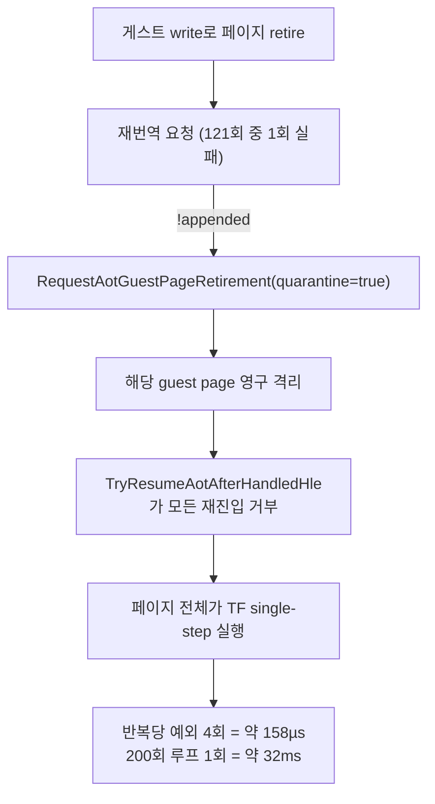

# 20260803-404 AOT 세대 실패 원인 계측 설계 / AOT Generation Failure Attribution Design

## 한국어

### 배경과 측정

`pumpit3`의 성능을 재측정하다가, 이 타이틀이 **실행마다 두 갈래로 갈린다**는 것을
확인했습니다. 같은 빌드(HEAD `cc21627` Release), 같은 장비, 같은 세션에서 45초씩
pumpit3 10회, pumpit1 4회를 EEPROM 격리로 실행한 결과입니다.

| 대상 | 프레임 | wall(Gcyc) | VEH | Glide | port-io | JAMMA scan | single-step | SS 커널 왕복 |
|---|---:|---:|---:|---:|---:|---:|---:|---:|
| pumpit1 (4회) | 700~749 | 122 | 13~15% | 24~25% | 1.1% | ~0.9% | 9,200 | 0.5~0.8% |
| **pumpit3 격리 발생 (6회)** | 0 | 122~130 | 25~27% | 1% | 6.7~8.6% | 6.3~8.2% | **510,000~578,000** | **35~40%** |
| pumpit3 격리 없음 (4회) | 0~1 | 62~70 | 24~25% | 2% | 1.7~2.8% | 1.2~2.2% | **265** | 0.04% |

**single-step 횟수가 두 갈래 사이에서 약 2,000배 차이납니다.** 그리고 그 차이는
`AOT generation publishes/quarantines`가 `.../1`인지 `.../0`인지와 정확히 함께
움직입니다.

### 확인됨: 격리된 페이지 위의 200회 지연 루프

격리가 발생한 실행에서 single-step의 93%가 네 주소에 몰려 있습니다.
`0x0301DB1F`~`0x0301DB2A`(pumpit3 파일 offset `0x28D1F`)이며, Task 402가 지목했던
200회 I/O 지연 루프 그 자체입니다.

```
0x0301DB1F  43              inc  ebx
0x0301DB20  29 c0           sub  eax,eax
0x0301DB22  66 ed           in   ax,dx      ; port 0x02A8
0x0301DB24  81 fb c8 00 ..  cmp  ebx,200
0x0301DB2A  7c f3           jl   0x0301DB1F
```

hotspot census는 이 네 주소에서 122,636 / 121,725 / 120,859 / 120,860 표본을 기록했고,
`IN`을 제외한 셋의 outcome은 전부 `TF`(순수 trace-flag)입니다. 즉 **명령 하나마다
예외 하나**입니다.

### 확인됨: 인과 사슬



로그 근거입니다.

* `Win32 AOT generation failures/relinked/retired traps: 1/3752/4065`
* `Win32 AOT generation publishes/quarantines: 74/1`
* `Win32 AOT dynamic attempt/success/bytes: 121/120/1608800`
* `hle reentry funnel ... quarantined/success: 120859/53339` — 거부 수 **120,859가
  `0x0301DB22`의 port-I/O HLE 횟수와 정확히 일치**합니다.
* pumpit1은 4회 실행 모두 quarantine 0, 재진입 성공률 100%입니다.

비용 환산은 반복당 예외 4회 × 82,635 cycle(single-step gap 실측) + 핸들러 본체 약
97,500 cycle ≈ **158µs/반복**, 200회 루프 1회에 약 **32ms**입니다. 실기 ISA 버스 기준
0.2ms의 약 150배입니다.

### 문제: 왜 실패했는지 기록이 없다

`AppendWin32DynamicAotTranslation`은 실패 사유를 `result->message`에 담지만, 그 값은
**어디에도 기록되지 않고 버려집니다.** 실패 가능 경로는 여섯 가지입니다.

| message | 성격 |
|---|---|
| `dynamic AOT target is outside the guest arena` | 대상 범위 |
| `failed to translate dynamic guest target` | 번역기 |
| `dynamic AOT CFG lacks complete HLE/selector-guard coverage` | coverage 규칙 |
| `dynamic AOT cache capacity is exhausted` | 용량 |
| `dynamic AOT mapping crosses address space` | 배치 |
| `dynamic AOT entry was not active in the new image` | 배치 |

여섯 가지는 **고쳐야 할 곳이 전부 다릅니다.** 용량 고갈이면 캐시 크기 정책이고,
coverage 부족이면 번역기 규칙이며, 배치 문제면 append 경로입니다. 사유를 모르는 채
격리 정책만 바꾸면 Task 322(동적 번역 지목)나 Task 401(census 범주 오류)처럼 틀린
곳을 고치게 됩니다.

### 관찰: 두 격리 경로의 정책이 비대칭입니다

격리에 이르는 길은 둘인데 정책 강도가 다릅니다.

| 경로 | 조건 | 완화 장치 |
|---|---|---|
| 게스트 write (Task 341/342/344) | 같은 주소를 반복해서 다시 쓸 때 | **있음** — 1회성 self-patch는 유예(`quarantine_deferred_count`) |
| 세대 실패 (본 Task) | 재번역 **1회** 실패 | **없음** — 즉시 영구 격리 |

Task 342는 "격리는 정확성 장치가 아니라 churn 방어"라고 정리하고 반복을 기다리도록
바꿨습니다. 세대 실패 경로에는 같은 완화가 적용된 적이 없습니다. 다만 **완화가 옳은지는
사유에 달려 있습니다** — 용량 고갈이면 재시도가 무의미하고, 일시적 배치 실패라면
재시도가 정답입니다. 그래서 이 Task는 사유부터 확보합니다.

### 설계: 계측만 한다, 동작은 바꾸지 않는다

`ThreadContext`에 세대 실패 trace를 추가하고, 실패 시점에 이미 손에 있는 값을 그대로
복사합니다. 새로 계산하는 것은 없습니다.

```
static constexpr std::uint32_t kGenerationFailureTraceCapacity = 8U;
struct GenerationFailureTraceEntry
{
    std::uint32_t target = 0;          // 재번역을 요구한 guest 주소
    std::uint32_t page = 0;            // 격리 대상 페이지
    bool quarantined = false;          // 격리까지 갔는가
    bool terminal = false;             // aot_terminal_failure로 갔는가
    char message[96] = {};             // append 결과 message 사본
};
```

* 기록 위치는 `ResolveAotTransferTarget`의 `dynamic_translation_failed && retired_target`
  분기 한 곳입니다. 이미 `context->aot_translation_result.message`를 들고 있습니다.
* 용량 8을 넘으면 개수만 셉니다. 관측된 인구는 실행당 1건입니다.
* guest 스레드 전용입니다. 이 분기는 VEH 경로에서만 실행되므로 잠금이 필요 없습니다.
* 로그 한 줄과 항목별 한 줄을 요약에 추가합니다.

**상시 ON입니다.** 실패는 실행당 0~1건이므로 비용이 없고, 꺼져 있으면 재현되지 않는
실행에서 자료를 잃습니다.

### 검증

* Debug/Release 빌드와 `repiu_aot_probe` 전체 항목 통과.
* pumpit3를 격리가 재현될 때까지 45초씩 실행해 사유 문자열을 확보합니다. 오늘 측정에서
  10회 중 6회 재현되었으므로 표본은 충분히 얻힙니다.
* 동작 불변 확인: 같은 실행에서 `AOT generation publishes/quarantines`,
  `hle reentry funnel`, 프레임, 종료 사유가 계측 전과 같은 분포인지 봅니다.

### 이 Task가 하지 않는 것

격리 정책 자체는 바꾸지 않습니다. 재시도, 격리 유예, 격리된 페이지의 대체 dispatch는
사유가 확정된 뒤 별도 Task입니다.

---

## English

### Background and measurement

While re-measuring `pumpit3` performance, its runs turned out to be **bimodal**. Over
ten 45-second pumpit3 runs and four pumpit1 runs on one build (HEAD `cc21627`, Release),
one machine, one session, with the EEPROM isolated per run:

| Target | Frames | Wall (Gcyc) | VEH | Glide | port-io | JAMMA scan | single-step | SS kernel round trip |
|---|---:|---:|---:|---:|---:|---:|---:|---:|
| pumpit1 (4) | 700-749 | 122 | 13-15% | 24-25% | 1.1% | ~0.9% | 9,200 | 0.5-0.8% |
| **pumpit3, quarantine fired (6)** | 0 | 122-130 | 25-27% | 1% | 6.7-8.6% | 6.3-8.2% | **510,000-578,000** | **35-40%** |
| pumpit3, no quarantine (4) | 0-1 | 62-70 | 24-25% | 2% | 1.7-2.8% | 1.2-2.2% | **265** | 0.04% |

Single-step counts differ about 2,000-fold between the two modes, and the split tracks
`AOT generation publishes/quarantines` reading `.../1` against `.../0` exactly.

### Confirmed: the 200-iteration delay loop sits on the quarantined page

In the quarantined runs, 93% of single steps land on four addresses,
`0x0301DB1F`-`0x0301DB2A` (pumpit3 file offset `0x28D1F`) — the 200-iteration I/O delay
loop Task 402 identified. The hotspot census recorded 122,636 / 121,725 / 120,859 /
120,860 samples there, and every outcome except the `IN` is a pure trace-flag step: one
exception per instruction.

### Confirmed: the causal chain

A guest write retires the page; the re-translation that should publish the next
generation fails once (one of 121 dynamic attempts); the failure path calls
`RequestAotGuestPageRetirement(..., quarantine=true)`, which marks the page permanently
quarantined; from then on `TryResumeAotAfterHandledHle` refuses every re-entry, so the
whole page executes under single step. The evidence is
`AOT generation failures/relinked/retired traps: 1/3752/4065`,
`AOT generation publishes/quarantines: 74/1`,
`AOT dynamic attempt/success: 121/120`, and a rejected-re-entry count of **120,859 that
equals the port-I/O HLE count at `0x0301DB22` exactly**. pumpit1 quarantined nothing in
any run and re-entered successfully 100% of the time.

The cost is four exceptions per iteration at a measured 82,635-cycle single-step gap plus
about 97,500 cycles of handler body — roughly **158 µs per iteration**, so about **32 ms**
for one 200-iteration delay call, against 0.2 ms of ISA bus time on real hardware.

### The problem: nothing records why it failed

`AppendWin32DynamicAotTranslation` puts its reason in `result->message`, and that string
is **discarded**. Six distinct paths can produce it — target outside the arena, translator
failure, incomplete HLE/selector-guard coverage, cache capacity exhausted, a mapping that
crosses the address space, and an entry that was not active in the new image — and each
one is fixed somewhere different. Changing the quarantine policy without knowing which
would repeat the error mode of Task 322 (blaming dynamic translation on an opt-in path
that was off) and Task 401 (reading a census share as a cost share).

### Observation: the two quarantine paths have asymmetric policies

Two paths reach quarantine and they are not equally strict. The guest-write path
(Tasks 341, 342, 344) waits for the *same address* to be rewritten and defers one-shot
self-patches, counted in `quarantine_deferred_count`, after Task 342 established that
quarantine is a churn defence rather than a correctness one. The generation-failure path
fires on a **single** failure with no deferral at all. Whether the same softening is
correct here depends on the reason: retrying is pointless if the cache is out of capacity
and is exactly right if the placement failure was transient. Hence the reason comes first.

### Design: instrumentation only, no behaviour change

Add a generation-failure trace to `ThreadContext` and copy values already in hand at the
failure site — target, page, whether it quarantined, whether it went terminal, and a copy
of the append message. Recording happens at the single
`dynamic_translation_failed && retired_target` branch in `ResolveAotTransferTarget`. The
capacity is eight entries with a counter beyond that; the observed population is one per
run. It is guest-thread only, because that branch runs on the VEH path, so no locking is
needed. Two summary log lines are added.

It is **always on**: zero to one event per run costs nothing, and gating it would lose the
evidence in the runs where the failure does not reproduce.

### Verification

Debug and Release builds plus the full `repiu_aot_probe`; then 45-second pumpit3 runs
until the quarantine reproduces (six of ten runs today) to capture the reason string; and
a check that quarantine counts, the re-entry funnel, frames, and the exit reason keep the
same distribution as before the change.

### Out of scope

The quarantine policy itself. Retry, deferred quarantine, and alternative dispatch for a
quarantined page all wait until the reason is known.
