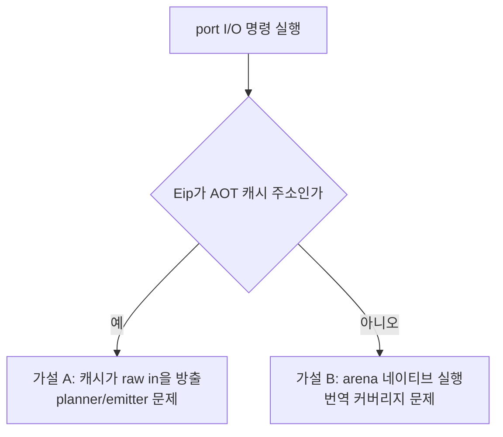

# 20260803-405 Port I/O 주소 census 설계 / Port I/O Address Census Design

## 한국어

### 배경

Task 404가 pumpit3의 지배 비용을 port I/O 예외로 지목했습니다. 렌더까지 간 3회 실행에서
`0xC0000096`(privileged instruction)이 전체 예외의 90.4~92.9%이고 VEH gap이 wall의
41.9~49.3%입니다.

기존 계측만으로 경로 배분은 이미 확정됐습니다.

| 항목 | run-02 | run-04 | run-05 |
|---|---:|---:|---:|
| port I/O 호출 | 857,750 | 1,074,586 | 990,793 |
| └ VEH 예외 경로 (inside-veh) | 842,637 | 1,059,611 | 975,661 |
| └ 예외 없는 thunk (outside-veh) | 15,113 | 14,975 | 15,132 |
| `0xC0000096` | 840,701 | 1,059,807 | 975,034 |
| dispatch thunk 진입 | 15,113 | 14,975 | 15,132 |

**outside-veh 수와 dispatch thunk 진입 수가 정확히 일치**하므로 배분은 확정입니다.
**port I/O의 98.6%가 예외를 냅니다.**

### 남은 질문

planner는 `in`/`out`을 `ReadGuardedPortIoInstruction`으로 잡아 `kPortIo`로 분류하고,
emitter는 `enable_dbt_port_io_dispatch`가 켜져 있으면 `EmitHleDispatchSlot`을 부르며 그
함수는 **항상 true를 반환**합니다. 즉 계획된 블록 안의 port I/O 명령은 raw `in`으로
방출될 수 없습니다. 그런데 실측은 98.6%가 raw 명령으로 fault를 냅니다.

가능한 설명은 둘이고, 고칠 곳이 완전히 다릅니다.

| 가설 | 뜻 | 고칠 곳 |
|---|---|---|
| A. 캐시 안의 raw `in` | 계획/방출 경로에 구멍이 있다 | planner/emitter |
| B. arena에서 네이티브 실행 | 그 코드가 애초에 번역되지 않았다 | 번역 커버리지 |

`HandlePortIoInstruction`은 이미 `IsAotCacheAddress(context, Eip)`로 두 경우를
구분해 decode 주소를 정하고 있습니다. **그 분기 결과를 세기만 하면 A와 B가 갈립니다.**



### 설계

`ThreadContext`에 주소별 census를 둡니다.

```
static constexpr std::uint32_t kPortIoAddressCensusCapacity = 32U;
struct PortIoAddressCensusEntry
{
    std::uint32_t guest_address = 0;
    std::uint32_t count = 0;        // 이 주소에서 처리된 port I/O 총 횟수
    std::uint32_t cache_count = 0;  // 그중 Eip가 AOT 캐시 주소였던 횟수
};
```

* 기록 위치는 `HandlePortIoInstruction`에서 `decode_eip`가 정해진 직후 한 곳입니다.
  분기 결과는 이미 계산되어 있으므로 새 판정은 없습니다.
* 선형 표 32칸이며 넘치면 `overflow`만 셉니다. 예상 인구는 20개 미만입니다.
* 비용: 호출당 최대 32회 비교이며 관측 빈도(초당 약 24,000회) 기준 wall의 0.03% 미만
  추정입니다. 핸들러 본체가 이미 호출당 약 6,800 cycle이므로 측정 오차 안입니다.
* guest 스레드 전용입니다. `HandlePortIoInstruction`은 VEH 경로와 Task 311 thunk
  양쪽에서 불리지만 둘 다 guest 스레드입니다(기존 `g_jamma_snapshot` 주석과 같은 근거).
* 요약 로그 2종을 추가합니다. 정렬은 `count` 내림차순입니다.

**상시 ON입니다.** 동작을 바꾸지 않고 비용이 측정 오차 안이며, 꺼두면 재현이 까다로운
실행에서 자료를 잃습니다.

### 판정 기준

| 관측 | 결론 | 다음 작업 |
|---|---|---|
| `cache_count`가 `count`의 대부분 | 가설 A | planner/emitter가 왜 slot을 안 냈는지 |
| `cache_count`가 거의 0 | 가설 B | 그 주소가 왜 번역되지 않았는지 |
| 최다 주소가 `0x0301DB22` | 지연 루프가 원인 | Task 404의 격리 축과 같은 코드 |
| 최다 주소가 다른 곳 | 지연 루프 가설 기각 | 그 주소부터 다시 |

마지막 행이 중요합니다. Task 404는 **격리 실행에서** 지연 루프를 확인했을 뿐,
격리 없는 실행의 100만 회가 같은 루프라는 것은 **아직 확인되지 않았습니다.**
`last port I/O address`가 `0x0301F851`(PIC EOI)로 찍힌 실행도 있어 반증 가능성이
열려 있습니다.

### 검증

* Debug/Release 빌드와 `repiu_aot_probe` 전 항목 통과.
* pumpit3 45초 실행에서 census 합계가 `execution time count`의 port-io 값과 일치하는지
  확인합니다(overflow 포함). 불일치는 기록 누락을 뜻합니다.
* pumpit1 45초 1회로 회귀 확인.

### 이 Task가 하지 않는 것

planner, emitter, 번역 커버리지를 바꾸지 않습니다. 어느 쪽을 고칠지는 census 결과가
정합니다.

---

## English

### Background

Task 404 identified port I/O exceptions as pumpit3's dominant cost: `0xC0000096`
privileged-instruction faults are 90.4-92.9% of all exceptions and their VEH gap is
41.9-49.3% of wall in the runs that reach rendering.

Existing counters already settle the path split. Port I/O calls were 857,750 / 1,074,586 /
990,793 across three runs, of which 842,637 / 1,059,611 / 975,661 came through the VEH and
15,113 / 14,975 / 15,132 through the exception-free thunk — and **the outside-VEH count
equals the dispatch-thunk entry count exactly**. So **98.6% of port I/O takes an exception**.

### The open question

The planner classifies `in`/`out` as `kPortIo` through `ReadGuardedPortIoInstruction`, and
the emitter calls `EmitHleDispatchSlot` whenever `enable_dbt_port_io_dispatch` is on — and
that function **always returns true**. A port I/O instruction inside a planned block
therefore cannot be emitted as a raw `in`. Yet 98.6% of them fault as raw instructions.

Two explanations remain and they are fixed in completely different places: either the cache
contains a raw `in`, meaning a hole in the plan/emit path, or the code runs natively in the
guest arena, meaning it was never translated at all. `HandlePortIoInstruction` already
distinguishes the two with `IsAotCacheAddress(context, Eip)` when it chooses the decode
address — **counting that existing branch separates the hypotheses**.

### Design

Add a per-address census to `ThreadContext`: a 32-entry linear table of
`{guest_address, count, cache_count}` plus an overflow counter, filled at the single point
in `HandlePortIoInstruction` right after `decode_eip` is resolved, where the branch result
is already computed. Expected population is under twenty addresses. Cost is at most 32
comparisons per call at roughly 24,000 calls per second, under an estimated 0.03% of wall
and inside the noise of a handler body that already costs about 6,800 cycles per call. It is
guest-thread only, for the same reason the JAMMA snapshot is: both callers — the VEH path
and the Task 311 thunk — run on the guest thread. Two summary lines print the table sorted
by count. **Always on**, because it changes no behaviour, costs nothing measurable, and the
runs that matter are awkward to reproduce.

### Decision rule

If `cache_count` is most of `count`, the cache emits raw `in` and the plan/emit path is at
fault; if it is near zero, the code was never translated and coverage is at fault. If the
top address is `0x0301DB22`, this is the same delay loop Task 404 found under quarantine; if
it is somewhere else, **the delay-loop explanation is rejected for the non-quarantine path**
and the new address is the starting point. That last row matters: Task 404 confirmed the
delay loop only in the *quarantined* runs, and one run reported `last port I/O address` as
`0x0301F851`, a PIC EOI, so the attribution is genuinely open.

### Verification

Debug and Release builds with the full probe; a pumpit3 run where the census total plus
overflow equals the profiled port-io count, since a mismatch would mean dropped records; and
one pumpit1 run for regression.

### Out of scope

The planner, the emitter, and translation coverage. Which one to change is what the census
decides.
