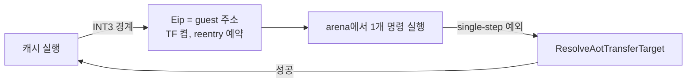

# 20260803-407 Arena 실행 진입 추적 설계 / Arena Execution Entry Trace Design

## 한국어

### 배경

Task 406이 확정한 것은 **번역이 존재하는데도 실행이 arena에 머문다**는 사실입니다.
111 프레임 실행에서 `0x0301DB22`의 992,156회 전부 캐시 매핑이 있었고, 전부 arena에서
실행됐으며, `aot_reentry_pending`은 **한 번도 세워지지 않았습니다.**

### 코드 읽기로 좁힌 것

`aot_reentry_pending`을 세우는 곳은 여섯 군데뿐이고, 그중 일반 경로는
`aot_runtime_dispatch.cpp:1794`의 AOT 경계 처리입니다. 그 경로는 **항상 TF도 함께
켭니다**(`EFlags |= 0x100`). 즉 정상 흐름은 이렇습니다.



그런데 이 루프는 single-step이 실행당 약 280회뿐이므로 **TF 없이 arena에서 자유
실행** 중입니다. 예외는 `IN`의 `0xC0000096` 하나뿐이고, 처리 후 EIP만 전진하며 TF는
꺼진 채라 그대로 arena에서 계속됩니다. **이 상태는 자기 유지적**이라 한 번 들어가면
나오지 않습니다.

따라서 질문은 "왜 머무는가"가 아니라 **"어떻게 처음 들어갔는가"** 입니다.

### 설계

**모드 진입 순간만 기록합니다.** 정상 상태에서는 arena port I/O fault 직전 예외가
언제나 같은 `0xC0000096`입니다. 진입할 때만 직전 예외가 다른 종류입니다. 이 한 가지
비교로 정상 상태를 걸러냅니다.

1. VEH의 단일 관문(`execution_trampoline.cpp`의 `RecordVehExceptionCensus` 호출 지점)에서
   직전 예외의 code/EIP/캐시여부를 한 칸 밀어 보관합니다. 비교 두 번짜리
   `IsAotCacheAddress` 외에는 계산이 없습니다.
2. `HandlePortIoInstruction`에서 **arena fault이고 직전 예외 code가 `0xC0000096`이 아닐 때만**
   한 항목을 남깁니다.

```
struct ArenaPortIoEntryTraceEntry
{
    std::uint32_t guest_address;     // fault 지점
    std::uint32_t previous_code;     // 직전 예외 종류
    std::uint32_t previous_eip;      // 직전 예외 위치
    bool previous_in_cache;          // 직전 예외가 캐시 안이었는가
    bool trap_flag;                  // 지금 TF가 켜져 있는가
    bool reentry_pending;
    bool legacy_fallback;
    bool single_step_trace;
};
```

용량 16, 초과분은 개수만 셉니다. **상시 ON**입니다 — 진입은 실행당 소수이고 관문의
추가 작업은 대입 여섯 번뿐입니다. Task 406의 `mapped` 조회처럼 비싼 것이 아니므로
스위치를 두지 않습니다.

### 판정 기준

| `previous_code` | 뜻 | 다음 작업 |
|---|---|---|
| `EXCEPTION_SINGLE_STEP` + `previous_in_cache=false` | 경계 후 재진입이 실패했거나 건너뛰었다 | 그 single-step 처리 분기 |
| `EXCEPTION_BREAKPOINT` + `previous_in_cache=true` | 캐시 경계에서 나온 직후 | 경계 처리의 예약 누락 |
| `EXCEPTION_ACCESS_VIOLATION` | 다른 HLE가 arena로 되돌렸다 | 그 HLE의 복귀 경로 |
| `trap_flag=false` | 자유 실행 확정 | 위 분기와 함께 읽는다 |

### 검증

* Release 빌드와 `repiu_aot_probe` 통과.
* pumpit3 45초 3회에서 trace를 읽습니다. 진입 항목이 0이면 이 정의가 틀린 것이므로
  그 사실을 기록하고 정의를 고칩니다.
* Task 405/406의 census 값이 그대로인지 확인합니다(동작 불변).
* pumpit1 회귀 1회.

### 이 Task가 하지 않는 것

진입을 막거나 복귀를 추가하지 않습니다.

---

## English

### Background

Task 406 established that **a translation exists and execution stays in the arena anyway**:
in the 111-frame run all 992,156 executions of `0x0301DB22` had a cache mapping, all ran in
the arena, and `aot_reentry_pending` was never once set.

### Narrowed by reading the code

Only six sites set `aot_reentry_pending`, and the general one is the AOT boundary path at
`aot_runtime_dispatch.cpp:1794`, which **always sets the trap flag with it**. The normal flow
is therefore: leave the cache at an INT3 boundary, set EIP to the guest address with TF on and
re-entry scheduled, execute one arena instruction, take the single-step exception, resolve the
target, and return to the cache.

This loop single-steps only about 280 times per run, so it is **free-running in the arena with
no trap flag**. Its only exception is the `IN` fault; the handler advances EIP, TF stays clear,
and execution simply continues in the arena. **The state is self-sustaining**, so the question
is not why it stays but **how it was first entered**.

### Design

**Record only the moment of entry.** In steady state the exception before an arena port I/O
fault is always another `0xC0000096`; on entry it is something else. That single comparison
filters the steady state out.

At the VEH's single choke point — the `RecordVehExceptionCensus` call site — shift the previous
exception's code, EIP, and cache-membership by one slot. Nothing is computed there beyond a
two-comparison `IsAotCacheAddress`. Then, in `HandlePortIoInstruction`, record one entry **only
when the fault is in the arena and the previous exception code was not `0xC0000096`**, capturing
the fault address, the previous exception's code, EIP, and cache membership, and the current
trap flag, `aot_reentry_pending`, `aot_legacy_fallback`, and `enable_single_step_trace`.

Capacity is sixteen with an overflow counter. It is **always on**: entries are rare per run and
the choke point gains six assignments, unlike Task 406's `mapped` lookup, so no switch is needed.

### Decision rule

A previous `EXCEPTION_SINGLE_STEP` outside the cache means re-entry after a boundary failed or
was skipped, pointing at that single-step branch; a previous `EXCEPTION_BREAKPOINT` inside the
cache means entry happened immediately on leaving a boundary, pointing at a missed scheduling;
a previous access violation means some other HLE returned execution to the arena. A clear trap
flag confirms free-running and is read alongside whichever branch applies.

### Verification

Release build and probe; three 45-second pumpit3 runs to read the trace — **if it records zero
entries the definition is wrong, which is then recorded and fixed rather than explained away**;
Task 405 and 406 census values unchanged, proving no behaviour change; and one pumpit1
regression run.

### Out of scope

Nothing blocks the entry or adds a return path.
