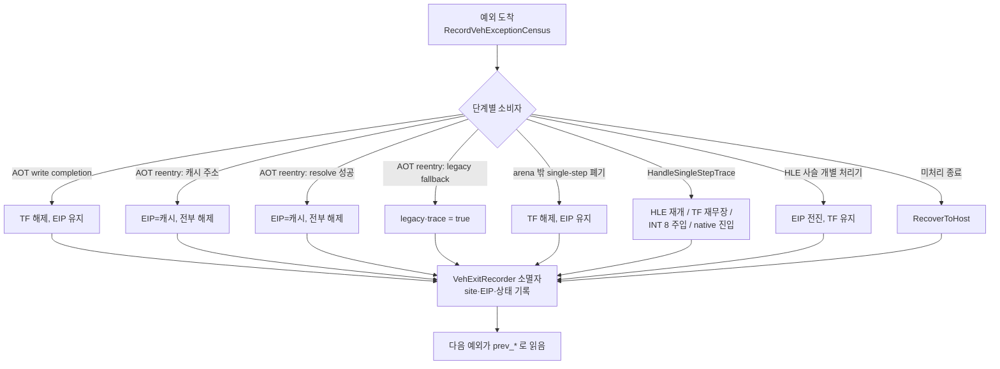

# 20260803-410 VEH 종료 지점 귀속 설계 / VEH Exit Site Attribution Design

선행: [Task 408 설계](20260803-408-per-address-arena-entry-sample.md),
[Task 409 작업 로그](../work-logs/20260803-409-arena-entry-predecessor-histogram.md),
[pumpit3 bring-up](../analysis/pumpit3-bring-up.md).

## 한국어

### 1. 목표

[현재 실행 frontier](../analysis/current-execution-frontier.md) 항목 2입니다.

> `0x0301F7CE`의 single-step 예외를 **소비하면서 TF를 끄고 arena에 남기는 곳**이
> 어디인가.

Task 407·408·409는 "직전 예외가 무엇인가"를 세 단계로 확정했습니다. 이번 작업은
그 다음 질문 — **그 예외를 누가 처리했는가** — 를 측정 대상으로 바꿉니다.

### 2. 코드 읽기로 좁힌 것 (이번 작업의 사전 분석)

Task 409가 배제한 세 가지(`HandleTimerInterruptChainBoundary`,
`execution_trampoline.cpp`의 TF 해제 10곳, `aot_runtime_dispatch.cpp:1866~1913`)에
더해, 이번에 다음을 확인했습니다.

**(a) `CLI` HLE는 TF를 건드리지 않습니다.**
`HandlePrivilegedTrapInstruction`(`execution_trampoline.cpp:1483~1489`)은 `0xFA`에서
IF만 지우고 `Eip`를 1 전진시킵니다. 따라서 `0x0301F7CC`(`xor edx,edx`)가 TF가 켜진
채 실행되어 `0x0301F7CE`에서 트랩이 났다면, **TF는 `CLI` 예외를 처리하고 재개할 때
이미 켜져 있었습니다.**

**(b) 그 시점에 TF를 켤 수 있는 곳은 전부 `enable_single_step_trace`를 켠 채
둡니다.**

| TF를 켜는 곳 | 함께 세우는 상태 |
|---|---|
| `execution_trampoline.cpp:3251` | `enable_single_step_trace`가 이미 true여야 진입 |
| `aot_runtime_dispatch.cpp:1793` (경계) | `aot_reentry_pending`·trace = true |
| `aot_runtime_dispatch.cpp:1886/1907` (격리) | `aot_reentry_pending`·trace = true |
| `aot_dbt_hle_dispatch.cpp:227` (slot target-miss) | `aot_reentry_pending`·trace = true |
| `aot_dbt_glide_gate_dispatch.cpp:118` (gate target-miss) | `aot_reentry_pending`·trace = true |
| `aot_runtime_dispatch.cpp:723` (guest code write fault) | 상태 변화 없음, 단 **직전 명령이 메모리 store여야 함** |

`0x0301F7CC`는 `31 d2`(`xor edx,edx`)라 store가 아니므로 마지막 줄은 성립하지
않습니다. 즉 `0x0301F7CE`의 single-step이 도착한 시점에 **`enable_single_step_trace`는
켜져 있었어야 합니다.**

**(c) 그런데 관측된 flags는 `0x00`입니다.**
`port_io_emulator.cpp:499~504`의 flags는 bit 4가 `enable_single_step_trace`입니다.
Task 408의 4회 실행과 Task 409의 3회 실행 모두 `0x00`이므로, 다음 예외(port I/O)
시점에는 trace·reentry·legacy·TF가 **전부 꺼져** 있었습니다.

**(d) trace를 끄면서 arena에 남기는 경로는 코드에 없습니다.**
`enable_single_step_trace = false`를 쓰는 곳은 6군데인데
(`aot_runtime_dispatch.cpp:1103/1297/1486/1778/1879/1899`, `aot_dbt_dispatch.cpp:262`,
`aot_dbt_hle_dispatch.cpp:214`, `aot_dbt_glide_gate_dispatch.cpp:108`), **전부 같은
문단에서 `Eip`를 캐시 주소로 옮깁니다.**

**(e) 그리고 `0x0301F7CE`의 명령에는 HLE 처리기가 없습니다.**
`83 ba 98 ec 34 00 00`은 ModRM `0xBA` → reg 필드 `7` → `cmp dword ptr [edx+disp32], imm8`
입니다. `0x83`을 받는 처리기는 `HandleTracedMemoryAddInstruction`(`/0`)과
`HandleTracedMemoryOrInstruction`(`/1`)뿐이고 `/7`은 없습니다. 따라서 trace가 꺼진 채
이 주소에서 single-step이 나면 HLE 사슬을 전부 통과해
`execution_trampoline.cpp:3652`의 종료 경로(= `RecoverToHost`, 실행 종료)에
도달해야 하는데, **실행은 계속됩니다.**

### 3. 따라서 이것은 "아직 못 찾았다"가 아니라 모순입니다

(b)는 trace가 켜져 있었어야 한다고 하고, (c)는 꺼져 있었다고 하며, (d)는 그 사이를
잇는 경로가 없다고 하고, (e)는 꺼진 채로는 실행이 죽어야 한다고 합니다. **네 진술이
동시에 참일 수 없습니다.** 그러므로 다음 중 하나입니다.

1. 코드 읽기가 놓친 종료 경로가 있다.
2. flags가 내가 읽은 시점의 상태가 아니다.
3. 직전 예외가 실제로는 `0x0301F7CE`의 single-step이 아니다(기록 슬롯 문제).

**세 가지 모두 "누가 그 예외를 처리했는가"를 기록하면 한 번에 갈립니다.** 추측을
더 쌓지 않고 계측으로 넘기는 이유입니다.

### 4. 계측 설계

**원칙:** 관측만 하고 동작은 바꾸지 않습니다. 예외 경로에서만 돌고, 새 syscall과
새 clock read를 만들지 않습니다.

**4.1 `VehExitSite` 열거형** — `include/repiu/platform/win32/veh_exit_site.h`

VEH가 예외를 넘겨줄 수 있는 지점마다 이름을 붙입니다. 독립적으로 이름 붙는 하위
개념이므로 전용 헤더로 분리합니다(AGENTS.md 구현 규칙). 호스트 보고가 이름을
출력하므로 `out_of_arena_step_census.h`와 같은 자리인 공개 헤더에 둡니다.

**4.2 `VehExitRecorder`** — VEH 안의 RAII 객체

* `RecordVehExceptionCensus` 직후에 생성합니다. `AotHleTranslationScope`보다 **먼저**
  생성되므로 소멸은 **나중**이고, 그 결과 EIP 재작성까지 끝난 **최종 재개 상태**를
  봅니다.
* 소멸자가 `last_veh_exit_site`, `last_veh_exit_eip`, `last_veh_exit_flags`를 씁니다.
* 각 종료 지점은 `NoteVehExitSite(context, VehExitSite::kX)` 한 줄만 추가합니다.
  기록되지 않은 경로는 `kUnknown`으로 남아 **누락 자체가 관측**됩니다.

**4.3 전이 슬롯** — 기존 `last_veh_*`/`prev_veh_*` 쌍과 같은 자리에 추가합니다.
직전 예외를 읽는 쪽이 이미 그 규약을 쓰고 있습니다.

**4.4 arena single-step 종료 지점 히스토그램**

Task 409의 교훈("첫 표본은 모집단이 아니다")을 그대로 적용합니다. **arena EIP에서
난 single-step 예외 전체**에 대해 종료 지점별 카운터를 둡니다.

* `veh_arena_single_step_count` — 모집단 크기
* `veh_arena_single_step_exit_site_counts[kVehExitSiteCount]`
* **검산:** 두 값의 합이 같아야 합니다. 어긋나면 기록 자체를 신뢰하지 않습니다.

**4.5 port I/O 진입 표본 확장**

주소별 첫 진입 표본에 `entry_previous_exit_site`와 `entry_previous_exit_eip`를
더합니다. 이러면 `0x0301DB22`의 진입 1건에 대해 **직전 예외를 누가 어떤 EIP로
재개시켰는지**가 같은 줄에 남습니다.

### 5. 판정 기준 (사전 등록)

| 관측 | 결론 |
|---|---|
| arena single-step의 지배 종료 지점이 하나 | 그 지점이 사슬의 시작점. 항목 3(복귀 설계)으로 이동 |
| `kUnknown`이 지배 | 코드 읽기가 놓친 경로가 있다. 그 지점부터 다시 |
| 진입 표본의 `exit_eip`가 `0x0301F7CE` | 소비자가 EIP를 전진시키지 않았다 → 폐기 계열 |
| `exit_eip`가 `0x0301F7D5` | 무언가 `cmp`를 emulate했다 → §2(e) 반증 |
| `exit_eip`가 캐시 주소 | 캐시로 돌아갔다 → arena 도착은 다른 경로 → §2 전제 반증 |
| 합계 검산 불일치 | 이 계측으로는 판정 불가라고 기록하고 원인부터 |

**어느 쪽이든 결론이 나옵니다.** 반증도 결과로 받습니다 — Task 408이 첫 표본
하나로 모집단을 말해서 정정한 전례가 있으므로, 이번에는 분포와 검산을 먼저 봅니다.

### 6. 비용

종료 지점 태그는 `std::uint8_t` 대입 한 번, 소멸자는 3~4회 store입니다. 예외당
고정 비용이며 예외 경로 밖에서는 실행되지 않습니다. `REPIU_PORT_IO_CENSUS_MAPPING`과
달리 lookup을 추가하지 않으므로 **이 빌드의 wall·프레임은 인용 가능합니다.** 다만
같은 세션 안의 대비로만 씁니다.

### 7. 미확정으로 남기는 것

* 진입 횟수의 실행 간 3자릿수 편차(frontier 항목 1). 이번 계측은 두 모드가 다시
  나오면 **종료 지점 분포까지** 비교할 수 있게 하지만, 재현 자체는 실행이 필요합니다.
* 재번역이 요청 진입 주소를 address map에 남기지 못하는 조건(Task 404 이월).
* 격리 발생 조건.

---

## English

### 1. Goal

Item 2 of the [current execution frontier](../analysis/current-execution-frontier.md):
**which site consumes the single step at `0x0301F7CE`, clears the trap flag, and leaves
execution in the arena.** Tasks 407, 408, and 409 settled *what the previous exception
is* in three steps. This task turns the next question — *who handled it* — into a
measurement.

### 2. What reading the code established

Beyond Task 409's three exclusions (`HandleTimerInterruptChainBoundary`, the ten
trap-flag-clearing sites in `execution_trampoline.cpp`, and the three branches at
`aot_runtime_dispatch.cpp:1866-1913`), this task confirmed the following.

**(a) The `CLI` HLE never touches the trap flag.**
`HandlePrivilegedTrapInstruction` (`execution_trampoline.cpp:1483-1489`) clears IF and
advances `Eip` by one. So if `xor edx,edx` at `0x0301F7CC` executed under the trap flag
and trapped at `0x0301F7CE`, **the flag was already set when the `CLI` exception
resumed.**

**(b) Every site that can set it there also leaves `enable_single_step_trace` on** —
the boundary path, both quarantine branches, the AOT-DBT HLE slot target-miss bridge,
the Glide gate target-miss bridge, and line 3251, which requires trace to be on
already. The one exception, the guest-code write fault at
`aot_runtime_dispatch.cpp:723`, requires the preceding instruction to be a memory
store, and `31 d2` is not one.

**(c) Yet the recorded flags are `0x00`**, whose bit 4 is `enable_single_step_trace`
(`port_io_emulator.cpp:499-504`), in all four Task 408 runs and all three Task 409 runs.

**(d) No path clears trace while leaving execution in the arena.** All nine sites that
write `enable_single_step_trace = false` move `Eip` to a cache address in the same
paragraph.

**(e) And nothing in the HLE chain handles the instruction at `0x0301F7CE`.**
`83 ba 98 ec 34 00 00` is `cmp dword ptr [edx+disp32], imm8` — ModRM `0xBA`, reg field
7 — while the only handlers for `0x83` cover `/0` (add) and `/1` (or). With trace off,
that single step would fall through the whole chain into the terminal recover path at
`execution_trampoline.cpp:3652`, and the runs do not end there.

### 3. This is a contradiction, not a gap

(b) says trace must have been on, (c) says it was off, (d) says nothing bridges the
two, and (e) says the run should have died if it were off. **The four cannot hold at
once**, so either reading missed an exit path, the flags do not describe the moment
assumed, or the recorded predecessor is not what the slot says. **Recording who
consumed each exception separates all three at once**, which is why this stops at
measurement rather than adding another hypothesis.

### 4. The instrument

Observation only; no behavioural change; nothing new outside the exception path.

A `VehExitSite` enumeration in its own header names every point at which the VEH hands
an exception back. A `VehExitRecorder` RAII object, constructed immediately after
`RecordVehExceptionCensus` and therefore destroyed *after* `AotHleTranslationScope`
rewrites `Eip`, records the final resume site, EIP, and state. Each exit adds one
`NoteVehExitSite` call; anything unlabelled stays `kUnknown`, so an omission is itself
observable. The transition slots follow the existing `last_veh_*`/`prev_veh_*`
convention.

Task 409's lesson is applied directly: alongside the per-address first sample, a
**histogram over every single step taken at an arena EIP** counts exit sites, with the
population total kept beside it so `sum(sites) == total` can be checked. The
per-address entry sample gains the predecessor's exit site and exit EIP, so one line
says who resumed the run and where.

### 5. Pre-registered decision rules

A single dominant exit site names the head of the chain and unblocks frontier item 3.
A dominant `kUnknown` means reading missed a path, and that path is the next target.
An entry sample whose exit EIP is `0x0301F7CE` means the consumer did not advance EIP,
so it is a discard-family site; `0x0301F7D5` would mean something emulated the `cmp`,
refuting §2(e); a cache address would mean execution returned to the cache, refuting
§2's premise. If the sum check fails, the finding is that this instrument cannot
decide — recorded as such rather than reported as a result.

### 6. Cost

One `std::uint8_t` store per exit and three or four in the destructor, on the exception
path only. Unlike `REPIU_PORT_IO_CENSUS_MAPPING` it adds no lookup, so **wall time and
frames from this build remain quotable**, within a session.

### 7. Left unresolved

The three-orders-of-magnitude variation in entry counts (frontier item 1) — this build
lets the two modes be compared by exit-site distribution once both reappear, but
reproducing them needs runs; the condition under which a re-translation omits its
requested entry from the address map (carried from Task 404); and what decides whether
quarantine fires.
