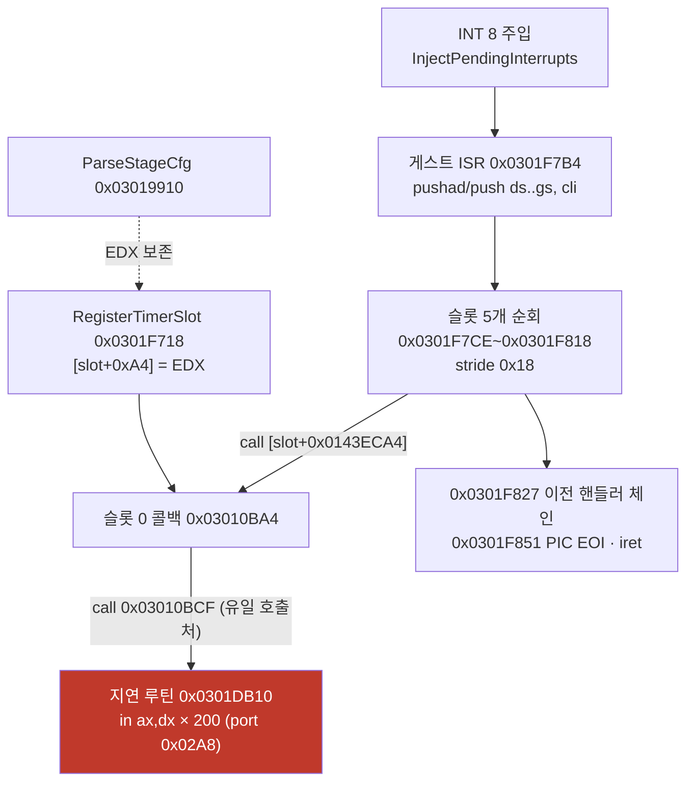

# Task 411 설계 — 멈춘 실행의 게스트 위치 census

**목표:** pumpit3 기동 중 멈춤([분석 문서](../analysis/pumpit3-startup-stall.md))에서
게스트 주 실행 흐름이 **어디에 있는지** 이름 붙입니다.

이 문서는 두 부분입니다. §1~§2는 **코드 변경 없이 정적 분석으로 끝난 부분**이고,
§3부터가 **구현 대상**입니다.

## 1. 배경 — 기존 "다음 대상"의 전제

분석 문서의 다음 대상 1번은 "격리 페이지 진입 시 복귀 주소를 기록해 지연 루틴을
13,173회 부르는 **캐시 측 호출자**를 이름 붙인다"였습니다. 전제는 **그 호출자가 멈춤의
대기 루프**라는 것이었습니다.

이 전제는 `repiu_aot_probe --xref` / `--dump`만으로 **실행 없이 확정 가능**했고, 그
결과 **전제가 반증**됐습니다. 아래 §2가 그 근거이며, 계측 대상은 §3으로 바뀝니다.

## 2. 정적으로 확인된 호출 사슬 (실행 0회)

주소는 실행 기준(arena base `0x03000000`)이고 프로브 인자는 `-0x02000000`입니다.



**확인됨 A — 지연 루틴의 호출처는 정확히 하나입니다.**
`--xref 0x0101DB10`이 `xref_call=0x1010bcf` **한 건**만 돌려줍니다. 절대 주소 참조
(`xref_abs`)는 **0건**이므로 포인터 테이블을 통한 간접 호출도 없습니다.

**확인됨 B — 지연 루틴은 200회 포트 폴링입니다.**

```
0301DB10  53 51 52 56 57 55     push ebx,ecx,edx,esi,edi,ebp
0301DB16  31 db                 xor  ebx,ebx
0301DB18  b9 a8 02 00 00        mov  ecx,0x02A8
0301DB1D  89 ca                 mov  edx,ecx
0301DB1F  43                    inc  ebx
0301DB20  29 c0                 sub  eax,eax
0301DB22  66 ed                 in   ax,dx          ← port I/O의 85.9~97.2%
0301DB24  81 fb c8 00 00 00     cmp  ebx,0xC8       ← 200회
0301DB2A  7c f3                 jl   0x0301DB1F
```

Task 405가 지목한 `0x0301DB22`와 핫스팟 덤프의 `0x0301DB1F`~`0x0301DB2A`가 이
루프이고, prologue `0x0301DB10`~`0x0301DB1D`의 13,173은 **호출 횟수**입니다.

**확인됨 C — 그 호출자는 타이머 슬롯 콜백입니다.**
`0x03010BA4`의 주소는 이미지 안에서 **두 곳**에서만 만들어지며(`--xref 0x01010BA4` →
`xref_abs` 2건) 둘 다 같은 형태입니다.

```
03011292  ba a4 0b 01 03        mov  edx, 0x03010BA4     ; 콜백
03011297  e8 ...                call 0x03019910          ; ParseStageCfg("stage.cfg")
0301129C  e8 ...                call 0x0301F85C          ; 타이머 슬롯 초기화
030112A1  31 c0                 xor  eax,eax             ; 슬롯 0
030112A3  e8 ...                call 0x0301F718          ; RegisterTimerSlot
```

`ParseStageCfg`(`push ebx,ecx,edx,edi` … `pop edi,edx,ecx,ebx`)와 슬롯 초기화
(`push ebx,ecx,edx`)가 **EDX를 보존**하므로 콜백은 두 호출을 건너 `RegisterTimerSlot`에
도달하고, 그 함수가 `mov [eax*0x18 + 0x0143ECA4], edx`로 슬롯 0의 콜백 포인터에
씁니다. ISR은 `call dword [eax+0x0143ECA4]`(`0x0301F7EE`)로 그것을 부릅니다.

**따라서 13,173은 대기 횟수가 아니라 타이머 tick 수입니다.** hs4는 60초 실행이므로
약 220 Hz이고, 슬롯 rate(`[slot+0x94] = 0xB6`)와 ISR 누산기(`+= [slot+0x9C]`,
`>= 0x10000`이면 발화)의 구조와 맞습니다. **멈춘 동안 타이머 인터럽트와 그 핸들러는
정상 동작하고 있습니다.**

**확인됨 D — `stage.cfg` 파서는 유한합니다.** `0x03019910`은
`fopen(name,"rt")` → `fgets(buf,250)` → `strtok(" \n\r\t")` → `"SONG"`/`"TRACK"`/
`"OFFSET"` 비교 → EOF에서 `fclose` 후 1을 돌려주는 평범한 줄 단위 파서입니다.
멈춤이 이 함수 **안**일 가능성은 낮습니다(파일은 EOF까지 읽힌 것이 관측됐습니다).

**따라서 남은 질문은 그대로입니다 — 멈춘 동안 주 실행 흐름은 어디에 있는가.**
지연 루틴은 ISR이 만드는 **배경 잡음**이고, 대기 루프가 아닙니다.

## 3. 왜 기존 계측으로는 답이 안 나오는가

| 계측 | 한계 |
|---|---|
| single-step 핫스팟 census | `HandleSingleStepTrace`가 도는 구간만 표본. 캐시 실행은 **실행돼도 기록되지 않음**([가이드 §5](../guides/execution-stall-eip-census.md)) |
| `native phase sampler` | **예외 dispatch가 1초간 조용해야** 표본을 뜹니다(`live_telemetry_snapshot.cpp:472~476`). 멈춘 실행은 port I/O fault가 계속 나므로 **한 번도 발화하지 않습니다** |
| `last_eip` 라이브 텔레메트리 | 1초에 1개 단일 표본. 가장 뜨거운 루프만 보이고 누적이 없음 |
| 예외 census / port I/O census | 예외를 일으키는 코드만 봅니다. 예외 없이 캐시에서 도는 대기 루프는 안 보임 |

**공통 결함은 표본 추출이 "예외가 났을 때"에 묶여 있다는 것**입니다. 멈춤을 만드는
코드가 예외 없이 캐시에서 돌면 현재 계측 전부의 사각지대에 있습니다.

## 4. 설계 — 시간 기준 게스트 위치 census

**게스트 스레드를 주기적으로 정지시켜 EIP를 표본하고 누적**합니다. 표본 시점이
예외와 무관하므로 위 사각지대가 사라집니다.

### 4.1 재사용

`CaptureWin32NativePhaseSample`(`src/platform/win32/native_phase_sampler.cpp`)이 이미
`SuspendThread` → `GetThreadContext` → 캐시 범위면 `FindAotGuestAddress`로 역매핑 →
`ResumeThread`를 하고 있습니다. **캡처는 그대로 쓰고**, 없는 것(누적 표)만 더합니다.

역매핑 안전성 근거는 기존 주석 그대로입니다 — 번역 worker는 게스트 스레드가 자신을
기다리며 블록된 동안에만 placement를 바꾸므로, EIP가 캐시 안이면 address map은
안정입니다. 캐시 밖 EIP에는 역매핑을 시도하지 않습니다.

### 4.2 새 구성요소

`Win32GuestPositionCensus` — 고정 용량 open-addressing 표(4,096) + 총계.

| 항목 | 의미 |
|---|---|
| `entries[].address` | 게스트 주소(arena) 또는 역매핑된 게스트 주소(cache) 또는 호스트 EIP |
| `entries[].sample_count` | 표본 수 |
| `entries[].origin` | `arena` / `cache` / `cache-unmapped` / `host` |
| `total_sample_count` | 성공 표본 수 |
| `arena/cache/cache_unmapped/host_sample_count` | 분류별 합. **`합 == total` 검산용** |
| `distinct_address_count`, `overflow_count` | 표 용량 초과 감지 |
| `capture_failure_count` | suspend/context 실패 |

주소 공간이 겹치지 않으므로 표 하나로 충분하고, 캐시 표본은 **게스트 주소로 접혀**
arena 표본과 같은 축에서 합산됩니다(어느 쪽에서 실행됐는지는 `origin`이 보존).

### 4.3 구동

`PollThreadUntilExit`의 기존 폴링 루프(약 1 ms 주기)에서, **dispatch-quiet 게이트 없이**
간격마다 표본합니다.

| 환경 변수 | 기본값 | 의미 |
|---|---|---|
| `REPIU_GUEST_POSITION_CENSUS` | **OFF** | 켜면 census 수집 |
| `REPIU_GUEST_POSITION_CENSUS_MS` | 10 | 표본 간격(ms). 1~1000으로 clamp |
| `REPIU_GUEST_POSITION_CENSUS_DUMP` | 없음 | `1`이면 `build/guest_position_census.txt`, 그 외 값은 경로 |

기존 `REPIU_NATIVE_SAMPLING` 경로는 **건드리지 않습니다**(다른 질문에 답하는 계측).

### 4.4 보고

* 로그: `enabled/total/distinct/overflow`, 분류별 수와 비율, 상위 16개 주소.
* 덤프: 표본 수 내림차순 전체 표(핫스팟 덤프와 같은 서식 원칙). 게스트 스레드가 멈춘
  직후, Glide close보다 먼저 기록합니다(Task 401과 같은 이유).

### 4.5 비용과 인용 규칙

기본 10 ms면 초당 100회 suspend/resume이고 회당 수십 µs이므로 wall의 1% 미만이 예상
값이지만 **측정 전에는 확정하지 않습니다.** 규칙은 census mapping과 같습니다 —
**census를 켠 실행의 wall·프레임은 인용하지 않습니다.**

## 5. 판정 기준

측정 전에 등록합니다.

| 관측 | 결론 |
|---|---|
| `arena+cache+cache_unmapped+host == total`이 성립하지 않음 | 계측 결함. 다른 결론을 내지 않음 |
| `overflow != 0` | census 불완전. 용량을 올려 재측정 |
| 멈춘 실행 상위 주소가 **한 함수 범위**에 모임 | 그 함수가 대기 루프. `--dump`로 탈출 조건 확정 |
| 상위가 `0x0301DB1F`~`0x0301DB2A`(지연 루프)뿐이고 그 밖이 평평 | ISR만 보고 있는 것. **간격을 tick 주기(4.5 ms)와 서로소로 바꿔** 재측정 |
| `host` 비중이 지배적 | 게스트가 아니라 호스트에서 대기 중. 다음 축은 HLE·Glide·CD 경로 |

**정상 실행과의 대비가 본체입니다.** 같은 세션에서 멈춤 1회 이상, 정상 1회 이상을
같은 설정으로 얻어 상위 표를 비교합니다.

## 6. 함께 확인된 것 — 타이머 주입은 항상 arena로 들어갑니다 (추정, 별도 과제)

`InjectPendingInterrupts`(`execution_trampoline.cpp:2695~2710`)는 프레임을 쌓은 뒤
`Eip = shadow.offset`, 즉 **DPMI 벡터의 게스트 주소**를 그대로 씁니다. 캐시 번역본을
찾는 시도가 없고, 호출한 두 경로(`HandleSingleStepTrace`, timer safe point)도 주입
직후 그대로 복귀합니다. 즉 **tick마다 ISR은 arena에서 시작**합니다.

이것이 Tasks 405~410이 측정한 arena 체류(port I/O가 wall의 41.9~49.7%)의 **후보
원인**입니다. 다만 Task 410이 ISR 내부 주소 `0x0301F7CE`의 캐시 번역본
(`0x0C403877`)으로 복귀하는 것을 관측했으므로 ISR 일부는 캐시에서도 돕니다.
**따라서 이것은 추정이며**, 확정과 수정은 이 과제의 범위 밖입니다(frontier 항목 2'/3).

---

# Task 411 Design — A census of where the guest is during the stall

**Goal:** name **where the guest's main execution actually is** during the pumpit3
startup stall ([analysis](../analysis/pumpit3-startup-stall.md)).

Sections 1-2 were settled by **static analysis with no code change and no runs**;
section 3 onward is what gets implemented.

## 1. Background — the premise of the previous "next target"

The analysis document's next target was to record a return address so the **cache-side
caller** that invokes the delay routine 13,173 times could be named, on the premise that
this caller is the stall's wait loop. `repiu_aot_probe --xref` and `--dump` settled it
without running anything, and **the premise is refuted**.

## 2. The call chain, confirmed statically

**A — the delay routine has exactly one caller.** `--xref 0x0101DB10` returns
`xref_call=0x1010bcf` and **no** absolute references, so no pointer table reaches it
either.

**B — the delay routine is a 200-iteration port poll** at `0x0301DB10`: six pushes,
`mov ecx,0x02A8`, then `inc ebx` / `sub eax,eax` / `in ax,dx` / `cmp ebx,0xC8` / `jl`.
Task 405's `0x0301DB22` is that `in`, and the prologue's 13,173 samples are the **call
count**.

**C — that caller is a timer slot callback.** The address `0x03010BA4` is materialised in
only two places, both as `mov edx, 0x03010BA4` immediately before
`ParseStageCfg("stage.cfg")`; both that parser and the slot initialiser **preserve EDX**
(push/pop around their bodies), so the value survives to `RegisterTimerSlot`
(`0x0301F718`), which stores it at `[slot*0x18 + 0x0143ECA4]`. The ISR calls exactly that
slot through `call dword [eax+0x0143ECA4]` at `0x0301F7EE`.

**So 13,173 is a tick count, not a wait count** — about 220 Hz over the 60-second hs4 run,
consistent with the slot rate at `[slot+0x94] = 0xB6` and the ISR accumulator that fires
at `0x10000`. **The timer interrupt and its handler are working normally during the
stall.**

**D — the `stage.cfg` parser is finite:** `fopen(name,"rt")`, `fgets`, `strtok` on
`" \n\r\t"`, compares against `SONG`/`TRACK`/`OFFSET`, and returns 1 after `fclose` at
EOF.

**The open question is therefore unchanged:** where is the main flow during the stall? The
delay routine is background noise the ISR generates, not a wait loop.

## 3. Why existing instruments cannot answer it

Every current sampler is tied to an exception: the single-step hotspot census records only
while `HandleSingleStepTrace` runs, so cache execution is invisible; the native phase
sampler requires **one full second with no exception dispatch**
(`live_telemetry_snapshot.cpp:472-476`) and therefore never fires in a stalled run, whose
port I/O faults never stop; `last_eip` is a single sample per second with no accumulation;
and the exception and port I/O censuses only see code that faults. A wait loop running in
the cache without exceptions is in the blind spot of all of them.

## 4. Design — a time-based guest position census

Suspend the guest thread on a fixed interval, sample EIP, and accumulate it. Because the
sampling instant is independent of exceptions, the blind spot disappears.

**Reuse:** `CaptureWin32NativePhaseSample` already suspends, reads the context,
reverse-maps a cache EIP through `FindAotGuestAddress`, and resumes. Only the accumulator
is missing. The reverse-map safety argument is the existing one: the translation worker
mutates the placement only while the guest thread waits on it, so an EIP inside the cache
implies a stable address map, and an EIP outside it is never reverse-mapped.

**New component:** `Win32GuestPositionCensus`, a fixed 4,096-entry open-addressed table of
`{address, sample_count, origin}` plus totals — overall samples, per-origin samples
(`arena`, `cache`, `cache-unmapped`, `host`) so `sum == total` can be **checked**, distinct
addresses, overflow, and capture failures. Cache samples are folded onto their guest
address so both origins aggregate on one axis while `origin` keeps the distinction.

**Driving:** the existing ~1 ms poll loop in `PollThreadUntilExit`, **without** the
dispatch-quiet gate, under `REPIU_GUEST_POSITION_CENSUS` (off by default),
`REPIU_GUEST_POSITION_CENSUS_MS` (default 10, clamped to 1-1000), and
`REPIU_GUEST_POSITION_CENSUS_DUMP` (`1` selects `build/guest_position_census.txt`). The
existing `REPIU_NATIVE_SAMPLING` path is left alone; it answers a different question.

**Reporting:** log lines for enabled/total/distinct/overflow, the per-origin split, and the
top sixteen addresses; a full descending dump written right after the guest thread stops
and before Glide close, for the Task 401 reason.

**Cost and quoting rule:** 100 suspend/resume pairs per second at the default interval,
tens of microseconds each, so under 1% of wall is the expectation — but that is not claimed
before it is measured, and as with census mapping, **runs with this census enabled are not
quotable for wall time or frames.**

## 5. Pre-registered reading rules

If `arena + cache + cache_unmapped + host != total`, the instrument is broken and no other
conclusion is drawn. A non-zero `overflow` means the census is incomplete. If the stalled
run's top addresses cluster inside one function, that function is the wait loop and
`--dump` settles its exit condition. If the top is nothing but the delay loop with a flat
tail, the sampler is only seeing the ISR, and the interval must be changed to something
coprime with the ~4.5 ms tick before reading anything into it. If `host` dominates, the
wait is on our side rather than the guest's. **The contrast against a healthy run in the
same session is the deliverable**, not the stalled table alone.

## 6. Also found — timer injection always lands in the arena (inferred, separate task)

`InjectPendingInterrupts` (`execution_trampoline.cpp:2695-2710`) builds the frame and then
sets `Eip = shadow.offset`, the **guest** address of the DPMI vector, with no attempt to
find a cache translation; neither caller changes that afterwards. So the ISR starts in the
arena on every tick, which is a **candidate** cause of the arena residency measured in
Tasks 405-410 (port I/O at 41.9-49.7% of wall). It stays **inferred** because Task 410
observed a resume into `0x0C403877`, the cache translation of the in-ISR address
`0x0301F7CE`, so part of the ISR does run from the cache. Confirming and fixing this is
outside this task (frontier items 2' and 3).
