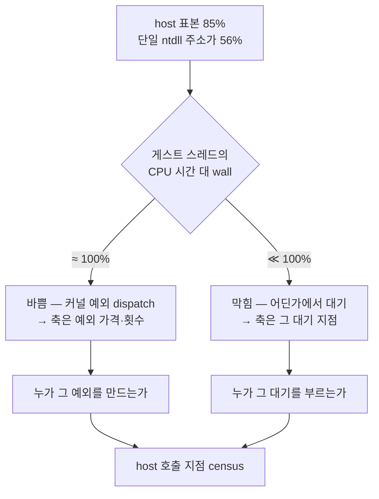

# Task 412 설계 — 멈춤의 host 시간 귀속

**목표:** Task 411이 남긴 **이름 없는 최대 인구**를 이름 붙입니다 — breakpoint 예외 뒤
gap이 guest-run의 **62%**(1건당 2.28 M cycle)인데, census는 그 시간에 게스트 스레드가
`ntdll`에 있다고 말합니다. 게스트 캐시 실행이 아니라면 그것은 **우리 쪽 시간**입니다.

근거와 수치는 [Task 411 로그](../work-logs/20260804-411-stall-guest-position-census.md),
증상은 [pumpit3 기동 중 멈춤](../analysis/pumpit3-startup-stall.md)에 있습니다.

## 1. 지금 갈라야 하는 것 — 스레드는 **바쁜가 막혀 있는가**

Task 411의 host 표본 85%는 두 가지로 읽힙니다.



**두 갈래는 API 한 번으로 갈립니다** — `GetThreadTimes`. 이것을 먼저 넣습니다.
어느 쪽이든 다음 질문은 같으므로("우리 코드의 어느 지점이 그리로 들어갔는가")
호출 지점 census도 같은 빌드에 넣습니다. **빌드 1회에 40분 이상 걸리므로 필요한
계측을 한 번에 담는 것이 이 설계의 제약입니다.**

## 2. 설계 — 세 가지를 한 빌드에

### 2.1 게스트 스레드 CPU 시간 (바쁨/막힘 판정)

poll 루프가 census 표본마다 `GetThreadTimes`를 읽어 마지막 값을 census에 보관합니다.
보고는 kernel/user 100 ns 단위와 wall 대비 비율입니다.

| 관측 | 판정 |
|---|---|
| (kernel+user) / wall ≥ 90% | **바쁨.** host 시간은 커널 예외 dispatch. 축은 예외 가격·횟수 |
| ≤ 50% | **막힘.** 축은 대기 지점 |
| 그 사이 | 둘 다 있음. 호출 지점 census 분포로 나눔 |

### 2.2 host 표본의 모듈 귀속

표본 EIP가 어느 모듈인지 **실행 종료 후** `GetModuleHandleExA(FROM_ADDRESS)` +
`GetModuleFileNameA`로 확인합니다. 게스트 스레드가 멈춘 뒤 한 번만 하므로 비용은
무시할 수 있고, 32비트 `ntdll`·`KERNELBASE`·우리 로더·드라이버가 갈립니다.

### 2.3 host 호출 지점 census (얕은 스택 훑기)

표본이 host일 때, **정지 상태에서** `ESP`부터 최대 64 dword를 훑어 **로더 모듈 범위
안의 첫 값**을 호출 지점으로 기록합니다. 두 번째 표(1,024 slot)에 주소별로 누적합니다.

* 프레임 포인터를 신뢰하지 않습니다. 최적화된 코드에서 `EBP` 체인은 없을 수 있으므로
  범위 검사로 후보를 찾는 방식입니다. **정확한 스택 워크가 아니며, 첫 후보가 실제
  호출자가 아닐 수 있습니다.** 그래서 상위 몇 개를 함께 보고 분포로 읽습니다.
* 스택 읽기는 C++ 객체 없는 함수에서 SEH로 감쌉니다. 실패는 표본을 버리고
  `scan_failure`를 셉니다.
* 게스트 코드 실행 중 예외가 나면 `ESP`가 arena를 가리킬 수 있습니다. 그 경우 로더
  범위 값이 없어 `no-site`로 셉니다. **`no-site` 비중 자체가 판정 자료**입니다.

### 2.4 심볼

Release에 **`/Zi` + `/DEBUG`** 를 켜서 PDB를 만듭니다(코드 생성은 바뀌지 않습니다).
로더가 종료 시 `dbghelp`의 `SymInitialize`/`SymFromAddr`로 상위 호출 지점을 함수명으로
찍습니다. 심볼화 실패 시 `모듈+offset`으로 물러섭니다.

## 3. 보고

```
Win32 guest position thread time kernel/user/wall-ms/cpu-share: ...
Win32 guest position host module #N name/base/samples/share: ...
Win32 guest position host site #N address/module/offset/count/share/symbol: ...
Win32 guest position host scan samples/sited/no-site/failed: ...
```

## 4. 판정 기준 (측정 전 등록)

1. **검산 우선.** `sited + no_site + failed == host 표본 수`가 아니면 분포로 읽지
   않습니다. Task 411의 `sum == total`과 같은 규칙입니다.
2. CPU 비율이 90% 이상이면 **대기 가설을 폐기**하고, 축을 예외 가격으로 옮깁니다.
   그때 상위 호출 지점은 "예외를 만드는 지점"으로 읽습니다.
3. 상위 호출 지점이 한 함수에 모이면 그 함수가 대상입니다. 흩어지면 **얕은 훑기의
   한계**이므로 결론을 내지 않고 정식 스택 워크나 사이트별 scope 계측으로 넘어갑니다.
4. census를 켠 실행의 wall·프레임은 인용하지 않습니다(Task 411과 같음).

## 5. 범위 밖

멈춤의 수정, 예외 없는 port I/O dispatch 설계(frontier 2'/3), 타이머 주입 경로 변경.
이 과제는 **62%의 이름을 확정하는 것까지**입니다.

---

# Task 412 Design — attributing the stall's host time

**Goal:** name the **largest unnamed population** Task 411 left: the gap after breakpoint
exceptions is **62% of guest-run** (2.28 M cycles each), and the census places the guest
thread in `ntdll` during it. If that is not guest cache execution, it is **our** time.

## 1. The split that matters now — busy or blocked

Task 411's 85% host share reads two ways: the thread is **busy** in kernel exception
dispatch, or it is **blocked** waiting on something. **One API call separates them** —
`GetThreadTimes` — so that goes in first. Either way the next question is the same ("which
of our call sites went there"), so the call-site census ships in the same build. **A full
build costs over forty minutes here, which is the binding constraint on this design.**

## 2. Three instruments, one build

**2.1 Guest thread CPU time.** The poll loop reads `GetThreadTimes` on each census sample
and keeps the latest value. A CPU share of 90% or more means busy — the host time is kernel
exception dispatch and the axis is exception price and count; 50% or less means blocked and
the axis is the wait site.

**2.2 Module attribution.** After the run, resolve each reported host address through
`GetModuleHandleExA(FROM_ADDRESS)` and `GetModuleFileNameA`, separating 32-bit `ntdll`,
`KERNELBASE`, our loader, and drivers at no runtime cost.

**2.3 Host call-site census.** While the thread is suspended, scan up to 64 dwords from
`ESP` for the first value inside the loader's module range and accumulate it in a second
1,024-slot table. This is deliberately **not** a stack walk: optimised code has no reliable
frame chain, so the first in-range value is a candidate rather than a proof, and the top
several are read as a distribution. The read is wrapped in SEH inside a function with no
C++ objects; failures count as `scan_failure`. When the guest faults while running guest
code, `ESP` can point into the arena and no candidate is found — that is counted as
`no-site`, and **the size of `no-site` is itself evidence**.

**2.4 Symbols.** Release gains `/Zi` and `/DEBUG`, which produce a PDB without changing
code generation, and the loader symbolises the top call sites through `dbghelp`
(`SymInitialize`/`SymFromAddr`), falling back to `module+offset`.

## 3. Reading rules, registered before measuring

The check comes first: unless `sited + no_site + failed` equals the host sample count, the
distribution is not read at all, exactly as Task 411's `sum == total` rule. A CPU share at
or above 90% **retires the blocked hypothesis** and moves the axis to exception price, with
the top call sites read as the sites that *raise* exceptions. Top sites clustered in one
function name the target; scattered sites mean the shallow scan has reached its limit, and
the next step is a real stack walk or per-site scopes rather than a conclusion. Runs with
the census enabled remain unquotable for wall time and frames.

## 4. Out of scope

Fixing the stall, designing exception-free port I/O dispatch (frontier items 2' and 3), and
changing the timer injection path. This task ends when the 62% has a name.
