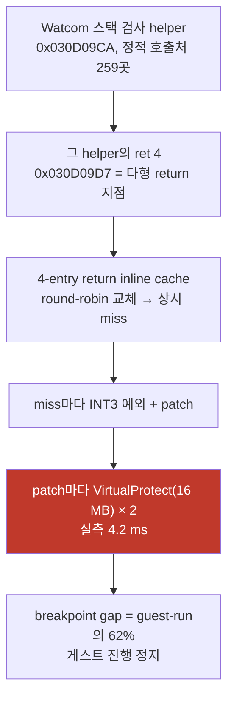

# Task 413 설계 — AOT patch 보호 구간을 쓰는 페이지로 좁히기

**한 줄:** inline cache 한 번을 patch하려고 **16 MB 캐시 전체의 보호 속성을 두 번**
바꾸고 있으며, 이 호스트에서 그 쌍의 실측 비용은 **약 4.2 ms(11.5 M cycle)** 입니다.
멈춘 pumpit3 실행은 patch를 **12,288회 이상** 합니다.

## 1. 증거 사슬

| 근거 | 값 | 출처 |
|---|---|---|
| 캐시 용량 | `kDynamicCacheCapacity` = **16 MB** | `aot_code_cache_win32.cpp:646` |
| patch 1회의 보호 변경 | **전체 캐시 × 2회**(RW → 쓰기 → RX) | 같은 파일 inline-cache patch 경로 |
| 그 쌍의 실측 비용 | **4,225 µs / 11.5 M cycle** (16 MB, 2,000회 평균, 같은 호스트·32비트) | Task 412 부수 측정 |
| 실행당 patch 수 | **≥ 12,288**(진단 줄이 4,096회마다 찍힘) | 2026-08-04 실행 로그 |
| breakpoint gap | guest-run의 **62%**, 1건당 2.28 M cycle | Task 411 §5e |
| 다형 return 지점 | `0x030D09D7`(`ret 4`)이 속한 helper의 **정적 호출처 259곳**, IC는 4-entry | `--xref 0x010D09CA`, `aot_code_cache_win32.cpp:1611~` |

**patch가 쓰는 바이트는 14개**입니다 — 선택된 entry의 target immediate 4, jump
displacement 4, guard 6. 그 14바이트를 위해 4,096 페이지의 속성을 두 번 바꿉니다.

## 2. 변경

inline-cache patch 경로의 `VirtualProtect` 3곳(진입 RW, rel32 초과 조기 복귀 RX,
정상 복귀 RX)을 **쓰는 범위를 덮는 페이지 창**으로 바꿉니다.

* 창 = `[floor_page(min(offset)), ceil_page(max(offset+size)))`, 캐시 용량으로 clamp.
* 범위가 이상하면(역전·초과) **전체 캐시로 물러섭니다.** 좁게 잘못 잡히는 경우가
  없어야 하므로, 실패는 항상 예전 동작으로 수렴합니다.
* `REPIU_AOT_PATCH_WIDE_PROTECT=1`이면 예전 동작(전체 캐시) 그대로입니다. **한
  바이너리에서 A/B가 가능**해야 인과를 주장할 수 있기 때문입니다.

**쓰는 바이트, 쓰는 순서, 결과 코드는 하나도 바뀌지 않습니다.** 바뀌는 것은 그동안
RW로 열리는 페이지 수뿐입니다.

## 3. 부수 효과 — 오히려 안전해집니다

지금은 patch 동안 **캐시 전체가 RW**이므로, 그 순간 다른 스레드가 캐시의 임의 위치를
실행하면 실행 권한이 없습니다. 창을 좁히면 관련 없는 페이지는 계속 RX로 남습니다.
(현재 구조에서 guest thread는 VEH 안에서 대기하므로 실제 충돌은 관측되지 않았습니다.
이 변경은 그 가정에 의존하는 면적을 줄입니다.)

## 4. 범위 밖 (다음 후보)

* **dynamic append 경로**의 전체 캐시 보호 변경(실행당 약 150회 = 1.7 G cycle 추정).
  같은 방식으로 좁힐 수 있으나 이번에는 건드리지 않습니다 — 지배 항목이 아닙니다.
* **segment patch 경로**도 같습니다.
* **inline cache thrash 자체**(4-entry로는 259 호출처를 담을 수 없음). 보호 창을
  좁히면 miss 1회 가격이 내려가지만 **miss 횟수는 그대로**입니다. 횟수를 줄이는 것은
  별도 설계(해시 기반 return dispatch 또는 site별 entry 수 확대)입니다.

## 5. 검증과 사전 등록 기준

같은 빌드·같은 세션에서 A/B를 돌립니다.

| 실행 | 설정 |
|---|---|
| wide | `REPIU_AOT_PATCH_WIDE_PROTECT=1` (예전 동작) |
| narrow | 기본값 |

1. **정확성 우선.** 두 조건 모두에서 `icache patch #` 진단이 이어지고 예외 분류에 새
   코드가 나오지 않아야 합니다. EEPROM은 실행별로 격리합니다.
2. **가설이 맞다면** narrow 실행은 프레임을 그립니다(멈춤 판정 기준 frames ≥ 100).
   wide 실행은 이 세션에서 11/11 멈췄으므로 대비가 명확합니다.
3. **가설이 틀렸다면** narrow도 멈춥니다. 그때는 patch 비용이 아니라 **miss 횟수**가
   원인이므로 축을 4번 항목으로 옮깁니다.
4. census를 켠 실행의 wall·프레임은 인용하지 않습니다. A/B는 **census를 끄고** 합니다.

---

# Task 413 Design — narrow the AOT patch protection to the pages it writes

**One line:** patching one inline cache flips the protection of the **entire 16 MB cache
twice**, measured at **about 4.2 ms (11.5 M cycles)** per pair on this host, and a stalled
pumpit3 run performs **more than 12,288 patches**.

## 1. The evidence chain

The Watcom stack-check helper at `0x030D09CA` has **259 static call sites**, so the `ret 4`
at `0x030D09D7` is a maximally polymorphic return; the return inline cache holds **four**
entries and replaces round-robin, so it misses continuously; each miss raises an `INT3` and
patches; and each patch flips 4,096 pages twice to write **fourteen bytes** — the chosen
entry's four-byte target immediate, its four-byte jump displacement, and its six-byte
guard. The capacity is `kDynamicCacheCapacity` = 16 MB (`aot_code_cache_win32.cpp:646`), the
pair costs 4,225 µs over 2,000 iterations on this host in a 32-bit process, the run logs
show the patch counter passing 12,288, and Task 411 measured the breakpoint gap at 62% of
guest-run with 2.28 M cycles each.

## 2. The change

The three `VirtualProtect` calls on the inline-cache patch path — the RW entry, the
early return when the target exceeds rel32, and the RX restore — take a **page window
covering the written range**, clamped to the capacity, falling back to the whole cache
whenever the range is unusable so a mistake can only be as wide as the old behaviour, never
narrower than what is written. `REPIU_AOT_PATCH_WIDE_PROTECT=1` keeps the old behaviour so
**A/B lives in one binary**, which is what makes a causal claim possible. **The bytes
written, their order, and every result code are unchanged**; only the number of pages
opened for writing differs.

## 3. A safety side effect

Today the whole cache is RW during a patch, so any thread executing cache code at that
moment has no execute permission there; narrowing keeps unrelated pages RX. The guest
thread waits inside the VEH under the current structure, so no such conflict has been
observed — this change shrinks the surface that relies on that assumption.

## 4. Out of scope (next candidates)

The dynamic-append and segment-patch paths flip the whole cache the same way but run about
150 times per run (an estimated 1.7 G cycles), so they are not the dominant term and are
left alone. And **the thrash itself** remains: a narrower window lowers the price of a miss
but not the **number** of misses, since four entries cannot cover 259 call sites. Reducing
that count is a separate design — hash-based return dispatch, or per-site entry counts.

## 5. Verification, registered before measuring

Run A/B in one build and one session: `REPIU_AOT_PATCH_WIDE_PROTECT=1` against the default,
census off (its runs are not quotable for wall or frames), EEPROM isolated per run.
Correctness first: both conditions must keep issuing `icache patch #` diagnostics with no
new exception class. **If the hypothesis holds**, the narrow runs render frames (the
stall test is frames ≥ 100) against eleven of eleven stalls for the wide behaviour this
session. **If it fails**, narrow stalls too, the cost is the miss *count* rather than the
patch price, and the axis moves to section 4.
