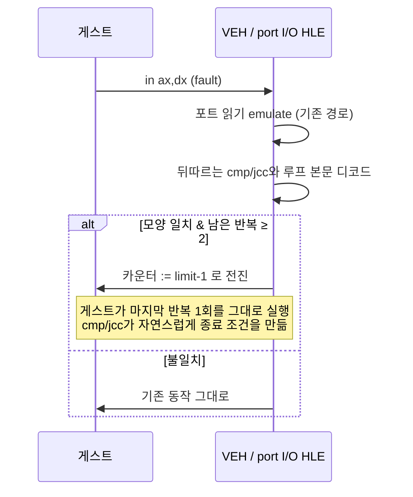

# Task 414 설계 — 포트 I/O 지연 루프를 한 번에 처리하기

**한 줄:** 게스트는 tick마다 **결과를 버리는 포트 읽기를 200번** 합니다. 우리는 그
200번마다 CPU fault를 한 번씩 냅니다. 이 설계는 그 200번을 **2번**으로 줄입니다.

## 1. 왜 이것인가 — 계측이 한 점으로 좁혔습니다

| 사실 | 값 | 출처 |
|---|---|---|
| port I/O 예외 ÷ INT 8 주입 | **202.2 / 195.6** | Task 411 §5c |
| 그 주소 하나의 비중 | `0x0301DB22`가 port I/O의 **85.9~97.2%** | Task 405 |
| 정상 실행에서 port I/O VEH gap | wall의 **41.9~49.7%** | Task 404 |
| 호출자 | 240 Hz 타이머 슬롯 콜백 | Task 411 §2 |

**루프 본문은 이렇습니다.**

```
0301DB1F  43              inc  ebx
0301DB20  29 c0           sub  eax,eax      ← 매 반복 EAX를 죽입니다
0301DB22  66 ed           in   ax,dx        ← 우리에겐 fault 1회
0301DB24  81 fb c8 000000 cmp  ebx,0xC8
0301DB2A  7c f3           jl   0x0301DB1F
0301DB2C  a1 28 90 0f 01  mov  eax,[0x030F9028]   ← 루프 직후 EAX를 덮어씁니다
```

**따라서 읽은 값은 마지막 반복 것조차 쓰이지 않습니다**(루프 종료 직후 EAX가
덮어써짐). 이것은 데이터를 얻는 루프가 아니라 **ISA 포트 접근 1회 ≈ 1 µs를 이용한
순수 지연 루프**입니다. 하드웨어 타이밍이므로 HLE가 대체하는 것이 원칙에 맞습니다
(`AGENTS.md` 아키텍처 규칙: OS·하드웨어 인터페이스만 대체).

## 2. 설계 — 레지스터 하나만 바꿉니다

`IN`을 평소대로 emulate한 **뒤**, 루프 모양이 맞으면 **카운터 레지스터를 마지막
반복 직전 값으로 전진**시킵니다. EIP·플래그·EAX에는 손대지 않습니다.



**왜 EIP·플래그를 만들지 않는가.** 카운터만 앞당기면 게스트가 **마지막 한 번을 직접
실행**하므로, 종료 시 EAX·플래그·카운터·EIP가 전부 원래 실행과 **비트 단위로 같습니다.**
플래그를 우리가 합성하면 그 등가성을 증명해야 하지만, 이 방식은 증명할 것이 없습니다.

`inc r` + `cmp r, imm` + `jl` 기준으로 카운터를 `imm - 1`로 둡니다. 그러면
`cmp` 통과 → 마지막 반복(fault 1회) → `inc`로 `imm` 도달 → `cmp` 실패 → 종료입니다.

## 3. 일치 조건 (전부 만족해야 함)

1. `IN` 바로 뒤가 `cmp r32, imm8|imm32`(`83 /7`, `81 /7`)이고 그 뒤가 **뒤로 가는
   조건 분기**(`7C` jl, `72` jb, `7E` jle, `76` jbe)이며 목적지가 `IN` **앞**입니다.
2. 분기 목적지부터 `IN`까지의 본문이 **화이트리스트뿐**입니다 — `inc r32`/`dec r32`,
   `sub r,r`/`xor r,r`(자기 0화). 메모리 접근·다른 포트 I/O·호출이 있으면 불일치.
3. 본문이 `IN`의 목적지(EAX)를 **`IN` 앞에서 0으로 만듭니다.** 이것이 건너뛰는
   반복의 읽기 값이 **죽은 값**이라는 증명입니다.
4. 카운터 레지스터가 **EAX도 EDX도 아닙니다**(포트 번호와 결과를 건드리지 않기 위해).
5. 카운터 증감이 반복당 정확히 1이고, 남은 반복이 **2회 이상**입니다.
6. 디코드할 게스트 바이트가 **읽기 가능**합니다(`IsGuestRangeReadable`).

하나라도 어긋나면 **아무것도 하지 않고 기존 경로 그대로**입니다. 즉 실패는 언제나
"예전과 같음"으로 수렴합니다.

## 4. 부작용을 검사한 항목

* **포트 읽기의 부수 효과.** JAMMA 입력 포트 읽기는 스냅샷 조회이며 장치 상태를
  바꾸지 않습니다. EEPROM(`0x02AE`)과 YMZ280B 창은 **이 경로에 들어오기 전에** 별도
  분기에서 처리되므로 대상이 아닙니다. 그래도 안전을 위해 **JAMMA 입력 경로에서만**
  batching을 시도합니다.
* **게스트 타이밍.** 이 루프는 지연입니다. 즉시 끝내면 게스트의 하드웨어 스캔 간격이
  실제 기판보다 짧아집니다. 우리 장치 모델에는 settling 시간이 없으므로 무해하다고
  보지만, **미확정**으로 두고 A/B에서 프레임·입력 동작을 함께 봅니다.
* **다른 타이틀.** 조건이 pumpit1/2에서 맞지 않으면 시도 자체가 없습니다. 회귀
  측정으로 확인합니다.

## 5. 계측과 스위치

| 이름 | 기본값 | 의미 |
|---|---|---|
| `REPIU_PORT_IO_DELAY_LOOP` | **ON** | `0`이면 예전 동작. A/B가 한 바이너리에서 가능해야 인과를 주장할 수 있습니다 |

counter: 시도, 일치, batch 수행, **건너뛴 반복 수**, 불일치 사유별(패턴·레지스터·
읽기 불가·남은 반복 부족). 로그 한 줄로 냅니다.

**`ThreadContext`에 넣지 않습니다.** 그 헤더는 거의 모든 번역 단위가 포함하므로 40분
전체 재빌드를 부릅니다. guest thread 전용이므로 새 파일의 파일 지역 상태로 둡니다.

## 6. 사전 등록 판정 기준

| 관측 | 결론 |
|---|---|
| `0x0301DB22`의 port I/O가 **약 200배** 감소 | 기계가 의도대로 동작 |
| 그리고 **프레임 ≥ 100** | **멈춤의 원인은 포화였습니다.** 회수분은 pumpit1/2에도 적용 |
| 감소했는데 여전히 6개 파일에서 멈춤 | **포화는 원인이 아닙니다.** 남는 축은 tick 전달 붕괴 하나(비격리 모드 due 9,951 대 injected 2,275). 0b·0c는 폐기 |
| pumpit1 프레임이 같은 세션 대조에서 하락 | 회귀. 되돌리고 원인 분석 |

**이 세션의 기준선:** 오늘 pumpit1은 60초에 **410 프레임**(08-03 기록 700~980의 약
절반)이고 pumpit3는 **11/11 멈춤**입니다. 세션 간 절대 비교는 하지 않고 오늘 안에서만
대비합니다.

---

# Task 414 Design — batching the port I/O delay loop

**One line:** the guest performs **200 port reads whose results it discards** on every
tick, and we raise one CPU fault for each. This reduces those 200 faults to **two**.

## 1. Why this, now

The measurements narrowed to one point: port I/O divided by INT 8 injections is **202.2 and
195.6** (Task 411), one address `0x0301DB22` is **85.9-97.2%** of all port I/O (Task 405),
that traffic is **41.9-49.7% of wall** in healthy runs (Task 404), and its caller is the
240 Hz timer slot callback (Task 411). The loop is `inc ebx; sub eax,eax; in ax,dx;
cmp ebx,0xC8; jl`, and the instruction right after the loop is `mov eax,[0x030F9028]` — so
**even the last read is discarded**. This is not a loop that fetches data; it is a **pure
delay** built from ISA port accesses costing about a microsecond each on real hardware,
which makes it exactly the kind of hardware timing the HLE layer is supposed to replace.

## 2. Design — one register write

After the `IN` is emulated as usual, if the loop shape matches, **advance the counter
register to one iteration before the end** and touch nothing else. The guest then executes
its **final iteration itself**, so EAX, the flags, the counter, and EIP all end up
bit-identical to an unbatched run — there is nothing to prove about synthesised flags,
because none are synthesised. For `inc r` with `cmp r, imm` and `jl`, the counter is set to
`imm - 1`.

## 3. Match conditions (all required)

The bytes after the `IN` must be `cmp r32, imm8|imm32` followed by a **backward**
conditional branch (`jl`, `jb`, `jle`, `jbe`) landing before the `IN`; the body from that
target to the `IN` must contain **only** `inc r32`, `dec r32`, or a self-zeroing `sub r,r` /
`xor r,r`; the body must **zero the `IN`'s destination before the `IN`**, which is the proof
that the skipped reads are dead; the counter must be neither EAX nor EDX; the step must be
exactly one per iteration with **at least two** iterations remaining; and the bytes must be
readable. Any mismatch does nothing at all, so failure always resolves to the old
behaviour.

## 4. Side effects examined

JAMMA input reads are snapshot lookups with no device state change, and the EEPROM
(`0x02AE`) and YMZ280B windows are handled by earlier branches, so batching is attempted
**only on the JAMMA input path**. The loop is a delay, so finishing it instantly shortens
the guest's hardware scan interval relative to a real board; our device model has no
settling time, so this is expected to be harmless but is left **unconfirmed** and watched in
the A/B. Other titles simply will not match the pattern, which the regression run checks.

## 5. Instrumentation and switch

`REPIU_PORT_IO_DELAY_LOOP` defaults **on** and `0` restores the old behaviour, so the A/B
lives in one binary. Counters record attempts, matches, batches, **iterations skipped**, and
each mismatch reason. They live in the new file rather than `ThreadContext`, because that
header is included nearly everywhere and touching it costs a forty-minute rebuild.

## 6. Pre-registered reading

A roughly **200-fold** drop in `0x0301DB22` port I/O means the mechanism works. If frames
also reach **100 or more**, the stall was saturation and the recovered time applies to
pumpit1 and pumpit2 as well. If the drop happens and the run still stops at six files, then
**saturation was not the cause**, the remaining axis is the tick-delivery collapse (9,951
due against 2,275 injected), and frontier items 0b and 0c are dropped. A drop in pumpit1's
frames against a same-session control is a regression to be reverted. **Today's baseline:**
pumpit1 renders **410 frames** in 60 s (about half the 700-980 recorded on 08-03) and
pumpit3 stalls in **eleven of eleven** runs; only within-session contrasts are used.
