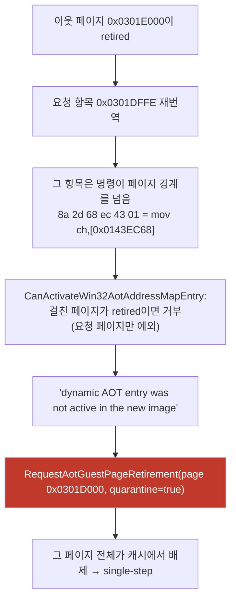

# Task 415 설계 — 세대 실패의 벌칙을 페이지에서 **주소**로 좁히기

**한 줄:** 한 항목의 재번역 실패가 **페이지 전체를 영구 격리**시켜, 같은 페이지의 뜨거운
코드까지 전부 single-step으로 떨어뜨립니다. 벌칙을 실패한 **그 주소 하나**로 좁힙니다.

Task 414가 멈춤의 지배 원인을 없앤 뒤 남은 **7회 중 1회**가 이 기전입니다
([Task 414 로그](../work-logs/20260804-414-port-io-delay-loop-batching.md) §5).

## 1. 사슬 (코드와 실측으로 확인)

| 근거 | 값 |
|---|---|
| 실패 이벤트 | 실행당 **정확히 1회**, 항상 `0x0301DFFE` / page `0x0301D000` / quarantined=true |
| 그 주소의 명령 | `8a 2d 68 ec 43 01`(6바이트)로 **`0x0301E000` 페이지로 4바이트 넘어감** |
| 활성 판정 | 걸친 페이지가 quarantined이거나 (retired이고 요청 페이지가 아님)이면 거부 |
| 결과(멈춘 실행) | 재진입 거부 **74.25%**, single-step **473,674** |
| 결과(정상 실행) | 재진입 거부 **1.44%**, single-step **16,550** |

**즉 격리 자체는 두 실행 모두에 있고**, 갈림은 그 페이지의 코드에 게스트가 얼마나
자주 들어가느냐입니다. 그러나 벌칙의 범위가 페이지인 한, 한 번 걸리면 그 페이지의
모든 항목이 캐시에서 배제됩니다.

## 2. 왜 지금 방식이 과한가

실패한 것은 **항목 하나**입니다. 그 항목이 활성화되지 못하는 이유도 그 항목이 페이지
경계를 넘기 때문이지, 페이지에 문제가 있어서가 아닙니다. 그런데 벌칙은 페이지 전체에
적용되고 **영구**입니다.

격리의 원래 목적은 **재시도 폭주 방지**입니다(재번역 1회가 최대 1.02 G cycle). 그
목적은 "이 주소는 다시 시도하지 않는다"만으로 충분히 달성됩니다.

## 3. 설계

`aot_runtime_dispatch.cpp` 안에서:

* 세대 실패가 나면 **그 주소를 실패 집합에 넣고 페이지는 격리하지 않습니다.**
* retired target의 번역을 시도하기 **전에** 실패 집합을 조회해, 이미 실패한 주소면
  **시도 자체를 건너뜁니다**(재번역 비용 0, arena fallback).
* 집합이 상한(256)을 넘으면 예전처럼 페이지를 격리합니다. 실패가 넓게 퍼지는 상황은
  이 설계가 겨냥한 것이 아니므로, 그때는 기존 안전판으로 물러섭니다.

**헤더를 바꾸지 않습니다.** 집합은 guest thread 전용 파일 지역 상태입니다
(`thread_context.h`·`aot_code_cache_win32.h`를 건드리면 40분 전체 재빌드).

| 스위치 | 기본값 | 의미 |
|---|---|---|
| `REPIU_AOT_QUARANTINE_ON_GENERATION_FAILURE` | OFF | `1`이면 예전처럼 즉시 페이지 격리. A/B용 |

계측: 실패 주소 수, 건너뛴 시도 수, 격리로 물러선 횟수.

## 4. 안전성

* **정확성은 그대로입니다.** 실패한 주소는 여전히 번역되지 않고 arena에서 실행됩니다.
  바뀌는 것은 **같은 페이지의 다른 항목들이 캐시를 계속 쓸 수 있다**는 점뿐입니다.
* **재시도 폭주 없음.** 실패 주소는 두 번 다시 시도하지 않습니다(집합 조회 1회).
* **기존 안전판 유지.** `aot_terminal_failure` 경로와 상한 초과 시 격리는 그대로입니다.

## 5. 사전 등록 판정

| 관측 | 결론 |
|---|---|
| `quarantines`가 0이 되고 재진입 거부가 74% → 수 %로 | 기계가 의도대로 동작 |
| pumpit3 정상 실행 비율이 개선(현재 7회 중 6회) | 목적 달성 |
| single-step이 정상 실행 수준(수만)으로 유지 | storm 해소 |
| 새 예외 코드·크래시·프레임 하락 | 회귀. 되돌립니다 |

pumpit1 회귀 확인을 함께 합니다. **census를 켠 실행의 wall·프레임은 인용하지 않습니다.**

## 6. 범위 밖

* 페이지 경계를 넘는 블록을 애초에 만들지 않도록 planner에서 **자르는 것**이 근본
  수정입니다. 그쪽이 맞지만 planner 변경은 이 과제 범위 밖입니다.
* 걸친 항목이 **첫 페이지에만 등록**되는 것(두 번째 페이지 쓰기가 무효화하지 못함)은
  기존 성질이며 이 과제에서 바꾸지 않습니다. 다만 **미확정 위험으로 기록**합니다.

---

# Task 415 Design — narrow the generation-failure penalty from a page to an **address**

**One line:** one entry's failed re-translation **quarantines its whole page permanently**,
dropping every hot routine on that page to single-stepping. This narrows the penalty to the
**one address that failed**.

After Task 414 removed the dominant cause, this is the mechanism behind the remaining
**one stall in seven**.

## 1. The chain, from code and measurement

The failure event is **exactly one per run**, always `0x0301DFFE` on page `0x0301D000`,
quarantined. The instruction there is `8a 2d 68 ec 43 01` — `mov ch,[0x0143EC68]`, six
bytes starting two bytes before the page boundary, so the entry **spans into
`0x0301E000`**. `CanActivateWin32AotAddressMapEntry` refuses any entry spanning a page that
is quarantined, or retired and not the requested page — so once the neighbour is retired the
requested entry cannot activate, the append reports "dynamic AOT entry was not active in the
new image", and the dispatch path quarantines the **whole requested page**. In the stalled
run that leaves 74.25% of re-entries rejected and 473,674 single steps, against 1.44% and
16,550 in a healthy one.

## 2. Why the current penalty is too broad

What failed is **one entry**, and it failed because it straddles a page boundary, not
because anything is wrong with the page. The penalty is nevertheless the whole page, and
permanent. Quarantine exists to stop a **retry storm** (one re-translation costs up to
1.02 G cycles), and "never retry this address" achieves that on its own.

## 3. Design

Inside `aot_runtime_dispatch.cpp`: a generation failure records the **address** in a failure
set and no longer quarantines the page; before attempting translation for a retired target,
a hit in that set **skips the attempt entirely**, costing nothing and falling back to the
arena; and if the set exceeds 256 entries the old page quarantine returns, because failures
spreading that widely are not what this design targets. No headers change — the set is
guest-thread-only file-local state, since touching `thread_context.h` or
`aot_code_cache_win32.h` costs a forty-minute rebuild.
`REPIU_AOT_QUARANTINE_ON_GENERATION_FAILURE=1` restores the old behaviour for the A/B, and
the failed-address count, skipped attempts, and quarantine fallbacks are logged.

## 4. Safety

Accuracy is unchanged: the failed address is still never translated and still runs in the
arena. The only difference is that **other entries on the same page keep using the cache**.
There is no retry storm, because a failed address is never attempted twice, and the existing
`aot_terminal_failure` path and the over-limit quarantine remain.

## 5. Pre-registered reading

Quarantines falling to zero with re-entry rejection dropping from 74% to a few percent means
the mechanism works; an improved healthy-run rate for pumpit3 (currently six of seven) is
the goal; single steps should stay at the healthy level of tens of thousands. A new
exception class, a crash, or a frame drop is a regression to revert, and pumpit1 is checked
alongside.

## 6. Out of scope

The principled fix is to stop the planner emitting a block that straddles a page boundary
into a retired page; that change belongs in the planner. And the fact that a spanning entry
registers **only under its first page**, so a write to the second page does not invalidate
it, is a pre-existing property left untouched here but **recorded as an open risk**.
