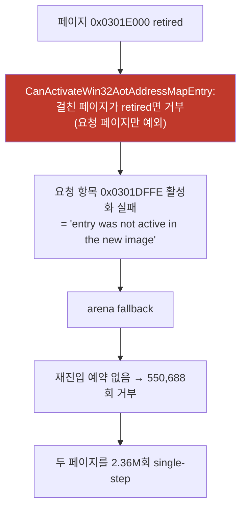

# Task 417 설계 — 페이지 경계를 걸친 요청 항목을 활성화하기

**한 줄:** 요청한 항목이 **retired 이웃 페이지로 몇 바이트 넘어간다는 이유만으로**
재번역이 실패하고, 그 실패가 실행을 arena에 떨어뜨려 멈춤을 만듭니다. 그 항목은
방금 만든 이미지이므로 **활성화해도 안전**합니다.

## 1. 근인 (Task 416이 확정)

`0x0301DFFE`의 명령은 `8a 2d 68 ec 43 01`(6바이트)이라 **4바이트가 `0x0301E000`에
걸칩니다.** 요청 페이지(`0x0301D000`)는 규칙의 예외지만 이웃은 아니므로 거부됩니다.

## 2. 왜 활성화해도 되는가

| 우려 | 확인 |
|---|---|
| 이웃 페이지의 바이트가 낡았을 수 있다 | 이 이미지는 **지금 막 현재 게스트 바이트로 번역**됐습니다. retirement는 이미 일어난 쓰기의 결과이고, 새 번역은 그 이후 상태를 반영합니다 |
| 나중에 이웃 페이지에 쓰면 무효화되지 않는다 | **`RegisterAddressMapPages`가 걸친 모든 페이지에 등록**합니다(`state->map_indices`). 어느 쪽에 써도 이 항목이 retire됩니다 |
| 이웃 페이지의 다른 항목까지 되살아난다 | 완화는 **요청 항목 하나에만** 적용됩니다. 나머지는 규칙 그대로입니다 |
| quarantined 페이지까지 허용되나 | 아닙니다. quarantined가 걸리면 **여전히 거부**합니다 |

## 3. 변경

`aot_code_cache_win32.cpp`의 append 루프에서, `entry.guest_address == guest_entry`인
항목이 기존 규칙에 거부되면 **quarantined 페이지를 걸치지 않는 한** 활성으로 둡니다.
`REPIU_AOT_STRICT_SPANNING_ENTRY=1`이면 예전 규칙입니다(한 바이너리 A/B).

counter `spanning-activations`를 기존 정책 로그 줄에 더합니다.

## 4. 사전 등록 판정

| 관측 | 결론 |
|---|---|
| `generation failure addresses`가 0이 됨 | 근인 제거 확인 |
| relaxed에서 멈춤이 사라지고 strict에서는 재현 | 인과 확인 |
| single-step이 정상 수준 유지 | storm 해소 |
| pumpit1 프레임 회귀 | 되돌림 |

---

# Task 417 Design — activate a requested entry that straddles a page boundary

**One line:** a requested entry fails to re-translate **only because it reaches a few bytes
into a retired neighbouring page**, and that failure drops execution into the arena and
produces the stall. That entry was just built from current bytes, so activating it is safe.

## 1. Root cause (settled by Task 416)

The instruction at `0x0301DFFE` is `8a 2d 68 ec 43 01`, six bytes of which **four fall in
`0x0301E000`**. `CanActivateWin32AotAddressMapEntry` exempts the requested page from the
retired test but not the neighbour, so the entry cannot activate, the append reports "entry
was not active in the new image", execution falls back to the arena, re-entry is refused
550,688 times for nothing pending, and the guest is stepped 2.36 M times.

## 2. Why activating it is safe

The image **was just translated from the guest's current bytes**, and retirement reflects a
write that already happened. `RegisterAddressMapPages` records the entry under **every page
it spans**, so a later write to either page still retires it. The relaxation applies to the
**requested entry alone**, and a **quarantined** page still blocks it.

## 3. Change

In the append loop, a requested entry refused by the original rule stays active unless it
spans a quarantined page. `REPIU_AOT_STRICT_SPANNING_ENTRY=1` restores the old rule so the
A/B lives in one binary, and a `spanning-activations` counter joins the existing policy log
line.

## 4. Pre-registered reading

Generation-failure addresses falling to zero confirms the root cause is gone; stalls
disappearing under relaxed while still reproducing under strict confirms causation;
single steps must stay at healthy levels; and a pumpit1 frame regression means revert.
