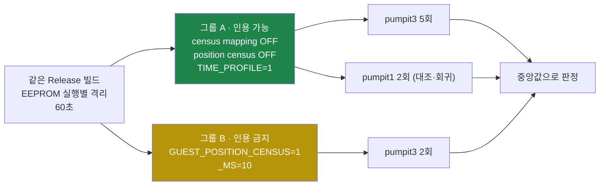
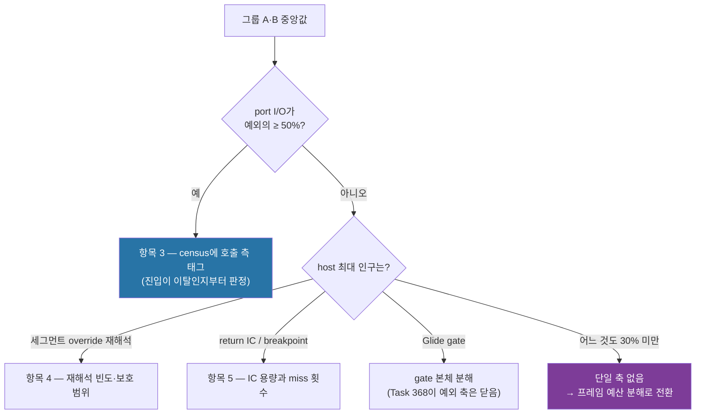

# Task 418 설계 — 비용 프로파일 재기준선

**한 줄:** 지금 우선순위를 정하는 데 쓰는 비율은 **전부 무효**입니다. 하나는 Task 414
이전 분포이고, 다른 하나는 **멈춘 실행**의 분해입니다. 정상 실행이 8회 중 8회가 된
지금, 같은 세션 안에서 비용 구조를 처음부터 다시 잡습니다.

## 1. 왜 지금인가

두 가지가 동시에 근거를 무너뜨렸습니다.

| 무효가 된 것 | 왜 | 원래 값 |
|---|---|---|
| port I/O 축 (frontier 항목 3) | [Task 414](../work-logs/20260804-414-port-io-delay-loop-batching.md)가 240 Hz tick당 포트 읽기를 **200 → 2**로 줄였습니다. 예외를 만들던 인구 자체가 사라졌습니다 | 예외의 90.4~92.9%, wall의 41.9~49.7% |
| host 시간 순위 (항목 4·5) | [Task 412](../work-logs/20260804-412-stall-host-time-attribution.md)의 분해는 `publishes/quarantines` 69/1 · single-step 523,362 · **프레임 0~1**인 실행이고, [Task 413](../work-logs/20260804-413-aot-patch-protection-window.md) A/B도 6회 전부 멈춤이었습니다 | 세그먼트 override 15.1%, JAMMA 10.4% 등 |

**멈춤의 비용 구조는 정상 실행의 비용 구조가 아닙니다.** 멈춘 실행은 프레임을 그리지
않고 타이머 ISR 뒷일만 반복하므로, 그 표본에서 큰 항목이 정상 실행에서도 큰지는
**측정된 적이 없습니다.**

동시에 **세션 간 절대 비교가 성립하지 않는다**는 이 프로젝트의 규칙 때문에, 과거
로그를 다시 읽는 것으로는 대체할 수 없습니다. 같은 빌드·같은 세션에서 다시 잡아야
합니다.

## 2. 목표와 비목표

**목표.** 정상 pumpit3 실행의 비용 분포를 한 세션에서 확정하고, **측정 전에 등록한**
기준으로 다음 최적화 축 하나를 고릅니다.

**비목표.** 최적화 구현. 이 작업은 측정만 합니다. 코드 변경은 **계측 공백이 판정을
막을 때만** 하고, 그때도 동작을 바꾸지 않는 계측에 한정합니다.

## 3. 무엇을 잡는가 — 네 층

| 층 | 지표 | 읽을 줄 |
|---|---|---|
| 실행 | wall, 프레임, 완주 여부 | `Win32 Glide call trace: ... _GRBUFFERSWAP@4 count=`, DOS AH hotspots의 `11`/`12` |
| 예외 | 종류별 분포와 VEH gap 비중 | `exception census single-step/breakpoint/access-violation/other/total` |
| 게스트 | 어느 게스트 명령이 예외를 내는가 | port I/O 주소 census, boundary opcode census |
| 호스트 | 그 예외를 처리하며 **우리 코드**가 어디에 있는가 | guest position census의 호출 지점(심볼) |

네 층을 함께 읽어야 하는 이유는 Task 412가 보였습니다 — 게스트 층만 보면 "port I/O가
절반"이고, 호스트 층을 보면 그 절반의 내부가 다시 여러 경로로 갈립니다.

## 4. 실행 계획 — 두 그룹

그룹을 나누는 이유는 **관측이 대상을 바꾸기 때문**입니다. position census는 표본마다
스택을 훑고, census mapping은 호출마다 `FindAotCacheAddress`를 붙여 약 5.8% 느려집니다.
따라서 **시간·프레임은 그룹 A에서만, 호스트 분해는 그룹 B에서만** 인용합니다.

pumpit1 2회는 두 가지를 겸합니다 — Tasks 414~417의 회귀 확인(기준 2,735~2,865), 그리고
"이 비용 구조가 pumpit3 고유인가"의 대조입니다.

## 5. 검산 — 하나라도 깨지면 판정하지 않습니다

| 검산 | 통과 조건 | 왜 |
|---|---|---|
| 정상 모드 확인 | `publishes/quarantines`의 격리 **0**, `generation failure addresses` **0** | 격리·정상은 재진입 거동이 정반대라 섞으면 무효 |
| 멈춤 아님 | 프레임 **≥ 800**, DOS path trace **≥ 8** | 멈춘 실행이 섞이면 §1의 오류를 반복 |
| 종료 지점 히스토그램 | `arena single-step exit` **총수 == 합** | Task 410이 세운 규칙 |
| 진입 분류 | 분류 수 **≤** 해당 예외 총수 | Task 408이 이 검산을 빠뜨려 결론이 과했음 |
| host 표본 | `sited + no-site + failed == 총 표본`, `overflow` 0 | Task 412가 세운 규칙 |

## 6. 사전 등록 결정 트리 — **측정 전에 고정합니다**

**30% 미달 분기를 미리 두는 이유:** Task 368이 최대 예외 인구(55.21%)를 지워도 1.034배
라는 것을 측정으로 확정했습니다. 분포가 평평하면 개별 항목을 깎는 작업은 같은 결론을
반복할 뿐이므로, 그때는 축을 바꾸는 것이 맞습니다.

## 7. 위험과 대응

* **실행 간 편차가 큽니다.** pumpit3 프레임은 같은 조건에서 1,018~1,497입니다.
  최소 5회를 돌리고 **중앙값**으로 판정하며, 단일 실행으로는 결정하지 않습니다.
* **pumpit1은 port census 32항목을 넘겨 `overflow`가 납니다.** port census 판정은
  pumpit3만 하고, pumpit1은 프레임·예외 총수만 씁니다.
* **arena base가 항상 `0x03000000`은 아닙니다.** 주소를 실행 간 비교하기 전에
  `Runtime memory arena base`를 확인하고, 부팅 크래시 실행(frontier 항목 8)은
  표본에서 제외하되 **발생 횟수는 기록**합니다.
* **빌드가 최신이 아닙니다.** 현재 `build/win32_x86_debug/Release`의 로더에는 Task 414
  이후의 스위치 문자열이 없어 **414~417 이전 바이너리**입니다. 재기준선 전에 Release를
  다시 빌드해야 하며, 이것을 빠뜨리면 측정 자체가 무의미합니다.

---

# Task 418 Design — re-baselining the cost profile

**One line:** every share now used to set priorities is **invalid** — one set predates
Task 414's change to the distribution, the other decomposes a **stalled** run. With healthy
runs at eight of eight, the cost structure is retaken from scratch within one session.

## 1. Why now

Two things invalidated the evidence at once. Task 414 cut port reads from **200 to two** per
240 Hz tick, removing the population that produced the exceptions behind "port I/O is
90.4-92.9% of exceptions and 41.9-49.7% of wall". And the host-time ranking behind items 4
and 5 comes from Task 412's run of `publishes/quarantines` 69/1, 523,362 single steps and
**0-1 frames**, plus Task 413's six A/B runs that all stalled. **A stall's cost structure is
not a healthy run's**: a stalled run draws nothing and repeats timer-ISR aftermath, so
whether its largest populations are also largest when frames are being drawn **has never
been measured**. Re-reading old logs cannot substitute, because this project's rule is that
cross-session absolute comparison does not hold.

## 2. Goal and non-goal

**Goal:** settle the cost distribution of a healthy pumpit3 run within one session, and pick
the next optimization axis by a criterion **registered before measuring**. **Non-goal:**
implementing an optimization. This task only measures; code changes happen only if an
instrumentation gap blocks a verdict, and then only for instrumentation that does not change
behaviour.

## 3. What is captured — four layers

The run layer (wall, frames from `_GRBUFFERSWAP@4`, and the DOS `AH=11h`/`12h` per-frame
calls), the exception layer (`exception census` by class and the VEH gap share), the guest
layer (which guest instruction faults, from the port I/O address census and the boundary
opcode census), and the host layer (where **our own code** sits while handling it, from the
guest position census call sites). Task 412 showed why all four are needed: the guest layer
alone says "port I/O is half", while the host layer splits that half again.

## 4. Plan — two groups

One Release build, one session, EEPROM isolated per run, 60 seconds each. **Group A**
(quotable) runs with census mapping and the position census off and
`REPIU_EXECUTION_TIME_PROFILE=1`: five pumpit3 runs plus two pumpit1 runs as control and
regression check (against 2,735-2,865 frames). **Group B** (not quotable for time) runs two
pumpit3 with `REPIU_GUEST_POSITION_CENSUS=1` at 10 ms. The split exists because observation
changes the subject — the position census walks a stack per sample and census mapping adds
about 5.8% — so **timing comes only from A and host decomposition only from B**.

## 5. Cross-checks — no verdict if any fails

Quarantines and `generation failure addresses` must be zero (healthy mode); frames must be at
least 800 with eight or more DOS path traces (not a stall); the `arena single-step exit`
histogram must satisfy sum equals total; no entry class may exceed its exception's total
(Task 408's omission); and host samples must satisfy `sited + no-site + failed == total` with
zero overflow (Task 412's rule).

## 6. Pre-registered decision tree — fixed before measuring

If port I/O is at least 50% of exceptions, take item 3 and settle whether the entry is even a
departure. Otherwise pick by the largest host population: segment-override re-resolution
leads to item 4, return-IC and breakpoint traffic to item 5, and the Glide gate back to
decomposing the gate body, since Task 368 already closed the exception axis there. **If
nothing reaches 30%, there is no single axis** and the right move is to switch to a
frame-budget decomposition — Task 368 measured that erasing a 55.21% population bought only
1.034x, so shaving items out of a flat distribution would only repeat that result.

## 7. Risks

Run-to-run variance is large (1,018-1,497 frames under identical conditions), so at least
five runs and the **median** decide, never a single run. pumpit1 overflows the 32-entry port
census, so port-census verdicts come from pumpit3 alone. The arena base is not always
`0x03000000`, so check `Runtime memory arena base` before comparing addresses across runs and
exclude — but count — any boot crash (frontier item 8). And **the current build is stale**:
the loader in `build/win32_x86_debug/Release` lacks the post-414 switch strings, so it is a
pre-414-through-417 binary; re-baselining without rebuilding Release first would measure
nothing of interest.
