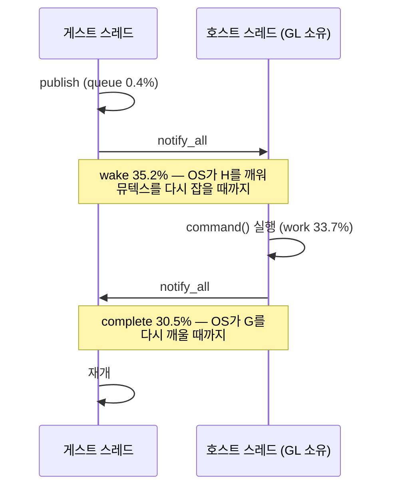

# Task 419 설계 — Glide rendezvous 왕복 지연 제거

**한 줄:** pumpit3에서 Glide gate 시간의 **65.9%가 GL 작업이 아니라 스레드 왕복
지연**입니다(wake 35.2% + complete 30.5%, work 33.7%). 호출당 왕복 고정비가 약
70,000 cycle인데 **호출당 실제 작업은 34,745 cycle**이라, 일보다 깨우는 비용이 큽니다.

## 1. 측정 — 이미 확보돼 있습니다 (Task 418 로그)

계측을 새로 켤 필요가 없었습니다. `REPIU_EXECUTION_TIME_PROFILE=1`이 gate 집계
타이밍도 켜므로, Task 418의 그룹 A 실행에 이미 분해가 들어 있습니다. (Task 418이
"꺼져 있다"고 본 `rendezvous/direct: 0/0`은 **ordinal별** 계측의 줄이었습니다.)

| 구간 | pumpit3 a3-2 | pumpit3 a3-5 | pumpit1 a1-2 |
|---|---:|---:|---:|
| rendezvous 횟수 | 1,082,446 | 1,108,259 | 142,932 |
| `direct` 경로 | **0** | **0** | 0 |
| queue | 0.39% | 0.37% | 0.05% |
| **wake** | **35.19%** | **35.39%** | 3.05% |
| work (host GL) | 33.72% | 33.74% | **94.24%** |
| **complete** | **30.71%** | **30.50%** | 2.66% |
| 호출당 총 | 103,054 cy | 102,766 cy | 1,136,756 cy |
| 호출당 work | 34,745 cy | 34,670 cy | 1,071,280 cy |

**타이틀이 정반대입니다.** pumpit1은 gate 시간의 94%가 진짜 GL 작업이므로 이 과제의
대상이 아닙니다. pumpit3는 호출이 **7.6배 많고 하나하나가 31배 작아서**, 고정 왕복비가
드러납니다. 즉 이것은 **pumpit3 고유 문제**이며 Task 402가 port `0x02A8`에서 관찰했던
구도(호출 수가 문제)와 같은 형태입니다.

## 2. 왕복이 비싼 이유 — 펌프는 이미 고쳐져 있습니다

`wake`는 **호스트 폴링 지연이 아닙니다.** Task 333이 `Sleep(1)`을 같은 조건변수
대기로 바꿔 publish가 호스트를 즉시 깨우도록 이미 고쳤고, 호스트 루프 본체는 tick
간격으로 가드돼 평시에는 비교 몇 줄입니다. 남은 것은 **OS 스레드 깨우기 자체**이며,
호출마다 컨텍스트 스위치 **두 번**(호스트 깨우기 + 게스트 깨우기)이 듭니다. 평균
wake 36,262 cycle ≈ 9.8 µs, complete ≈ 9.4 µs로 두 값이 비슷한 것이 그 해석과
일치합니다. 이전 gameplay 캡처의 "rendezvous 왕복 11.8~12.2 µs"와도 같은 크기입니다.

## 3. 후보 세 갈래와 선택

| 후보 | 내용 | 판단 |
|---|---|---|
| **(a) spin-then-wait** | 양쪽 대기를 **짧은 스핀 후 조건변수 폴백**으로 바꿔 컨텍스트 스위치를 피함 | **채택.** 지연을 지연으로 갚는 최소 변경이고, 한 바이너리 A/B가 가능하며, 실패해도 되돌림이 한 줄 |
| (b) command batching | 반환값 없는 호출을 모아 한 번에 flush | 상한은 더 크지만 **호출 순서·가시성 규약**을 바꿔야 하고, LFB/read-back 계열과 상호작용이 큼. (a)의 결과를 보고 판단 |
| (c) GL 컨텍스트를 게스트 스레드로 | `IsHostThread()`를 참으로 만들어 `direct` 경로 사용 | 창 메시지 펌프 소유 문제로 위험이 가장 큼. **마지막 수단** |

**(a)를 먼저 하는 이유는 측정이 그렇게 말하기 때문입니다.** 65.9%가 *작업이 아니라
대기*이므로, 작업을 줄이는 (b)·(c)보다 대기를 없애는 (a)가 같은 돈을 더 싸게 노립니다.

## 4. 상한과 사전 등록 판정

**제거 상한:** 왕복이 공짜면 gate 총계가 111.55G → work만 37.6G가 되어 **73.9G**가
빠지고, 이는 guest-run 222.1G의 **33.3%**입니다.

**다만 비용 감소가 프레임으로 바뀐다고 가정하지 않습니다.** Task 365(-5.13%p, 프레임
불변)와 Task 368(상한 1.034배)의 선례가 있습니다. 이번에는 게스트 스레드가 **실제로
막혀 있다**는 점(CPU share 50.4~54.0%)이 다르지만, 그것도 관측이지 보장이 아니므로
프레임을 1차 종점으로 **미리** 못박습니다.

| 종점 | 기준 | 처리 |
|---|---|---|
| **1차 — 프레임** | pumpit3 중앙값이 기준(2,477~2,515) 대비 **+5% 이상**(≥ 2,620) | 미달이면 **기본값 OFF로 두고 기록만** |
| 2차 — 구간 | gate share에서 `wake + complete`가 65.9% → **30% 미만** | 기전 확인 |
| 정확성 | ordinal 호출 수·순서 불변, `frame-errors=0`, Glide 실패 0 | 하나라도 깨지면 **되돌림** |
| 회귀 | pumpit1 프레임이 대조 범위 안 | 벗어나면 되돌림 |
| CPU | spin은 CPU를 태우므로 CPU share 상승은 **허용**. 단 프레임이 안 늘면 이득 없음으로 기각 | — |

## 5. 구현 범위

`glide_opengl_backend.cpp`의 대기 **세 곳**입니다.

| 위치 | 무엇을 기다리나 | 스핀 대상 |
|---|---|---|
| `InvokeOnHostThread` 282 | 앞 명령이 끝나기(pending 해제) | 경합 시에만 |
| `InvokeOnHostThread` 295 | **complete** (30.5%) | 예 |
| `WaitAndPumpHostCommands` 374 | **pending** (wake의 게스트→호스트 절반) | 예 |

`host_command_pending_` / `host_command_complete_`는 지금 뮤텍스로만 보호되므로,
스핀이 **락 없이 읽을 수 있도록** `std::atomic<bool>` 미러를 둡니다. 기존 뮤텍스
규약과 조건변수 술어는 **그대로** 두고, 원자 플래그는 **힌트로만** 씁니다 — 스핀이
성공해도 마지막에는 반드시 락을 잡고 기존 술어로 재확인합니다. 이 규칙이 정확성을
지킵니다.

스핀은 `YieldProcessor`(PAUSE)로 하고 예산은 마이크로초 단위 상한으로 둡니다.
`REPIU_GLIDE_RENDEZVOUS_SPIN_US`가 예산이며 **0이면 예전 동작**입니다. 기본값은
왕복 절반(약 9.8 µs)을 덮는 **20 µs**로 시작하되, 이 값 자체를 A/B 대상으로 둡니다.

**계측 추가:** 스핀으로 해결된 횟수와 폴백 횟수를 셉니다(`spin-hit/spin-miss`).
둘의 비가 예산이 맞는지를 말해 줍니다 — miss가 지배적이면 예산이 부족하거나 지연이
스케줄러 밖의 원인입니다.

## 6. 위험

* **스레드 굶김.** 게스트·호스트·AOT worker 세 스레드가 도는데 두 곳에서 스핀하면
  코어를 더 씁니다. 예산 상한과 `YieldProcessor`로 완화하고, CPU share를 함께
  기록합니다. 코어가 부족한 환경에서는 예산 0이 정답일 수 있으므로 **환경 변수로
  남깁니다.**
* **정확성.** 위의 "원자 플래그는 힌트, 최종 확인은 락"을 지키지 않으면 lost wakeup이
  생깁니다. 구현에서 이 규칙을 주석으로 고정합니다.
* **측정 오염.** 프레임 인용은 Task 418이 배운 대로 **창을 정상으로 띄우고** pumpit1을
  대조로 함께 돌립니다.

---

# Task 419 Design — removing the Glide rendezvous round-trip latency

**One line:** in pumpit3, **65.9% of Glide gate time is thread round-trip latency, not GL
work** (wake 35.2% plus complete 30.5% against work 33.7%). The fixed round trip costs about
70,000 cycles per call while the call's actual work is 34,745 — waking costs more than working.

## 1. The measurement already exists (Task 418's logs)

No instrumentation had to be enabled: `REPIU_EXECUTION_TIME_PROFILE=1` also enables the
aggregate gate timing, so Task 418's group A runs already carry the decomposition. (The
`rendezvous/direct: 0/0` line Task 418 read as "off" belongs to the **per-ordinal** profile.)
Across two pumpit3 runs the split is queue 0.4%, **wake 35.2-35.4%**, work 33.7%, **complete
30.5-30.7%** over 1.08-1.11 M rendezvous with the `direct` path never used; pumpit1 is the
opposite at **94.24% work** over 142,932 rendezvous. The titles differ because pumpit3 makes
**7.6x more calls that are each 31x smaller** (34,745 cycles of work against 1,071,280), which
exposes the fixed cost — the same shape as the port `0x02A8` finding, where call count was the
problem.

## 2. Why the round trip is expensive — the pump is already fixed

`wake` is **not** host polling latency: Task 333 replaced the `Sleep(1)` with a wait on the
same condition variable, so publication wakes the host immediately, and the host loop body is
tick-gated to a few comparisons in the common case. What remains is **OS thread wake-up
itself**, two context switches per call — one to wake the host, one to wake the guest back.
Mean wake of 36,262 cycles (~9.8 µs) against complete at ~9.4 µs fits that reading, and both
match the 11.8-12.2 µs round trip measured in the earlier gameplay captures.

## 3. Three candidates, and the choice

**(a) Spin-then-wait** replaces each blocking wait with a short spin before falling back to the
condition variable — **chosen**, because it answers latency with latency, A/Bs inside one
binary, and reverts in one line. **(b) Command batching** has a larger ceiling but changes the
ordering and visibility contract and interacts with LFB and read-back paths, so it waits on
(a)'s result. **(c) Moving the GL context to the guest thread** would make the `direct` path
usable but carries the window message-pump ownership problem, so it is the last resort. The
measurement is what picks (a): 65.9% is **waiting, not work**, so removing the wait is the
cheaper way to the same money.

## 4. Ceiling and pre-registered readings

If the round trip were free, the gate total falls from 111.55 G to work alone at 37.6 G,
removing **73.9 G** — **33.3%** of guest-run's 222.1 G. **Cost reduction is not assumed to
become frames**, given Task 365 (-5.13 points, no frame change) and Task 368 (a 1.034x
ceiling); what differs here is that the guest thread is genuinely blocked (CPU share
50.4-54.0%), but that is an observation, not a guarantee. So the **primary endpoint is frames**,
fixed in advance: the pumpit3 median must rise **at least 5%** over the 2,477-2,515 baseline
(≥ 2,620), or the switch stays **off by default** and the result is recorded as a negative.
Secondary: `wake + complete` must fall from 65.9% to **under 30%**. Correctness: ordinal call
counts and order unchanged, `frame-errors=0`, no Glide failures — any break reverts the change.
Regression: pumpit1 stays in its control range. CPU share is **allowed** to rise since spinning
burns CPU, but a rise without frames is a rejection.

## 5. Scope

Three waits in `glide_opengl_backend.cpp`: the pending wait at line 282 (only under
contention), the **complete** wait at 295, and the **pending** wait in
`WaitAndPumpHostCommands` at 374. Since `host_command_pending_` and `host_command_complete_`
are mutex-guarded today, the spin needs `std::atomic<bool>` mirrors it can read without the
lock. **The mutex protocol and the condition-variable predicates stay exactly as they are, and
the atomics are hints only** — a successful spin still takes the lock and re-checks the
original predicate, which is what keeps the change correct. Spinning uses `YieldProcessor`
(PAUSE) with a microsecond budget in `REPIU_GLIDE_RENDEZVOUS_SPIN_US`, where **0 restores the
old behaviour**; the default starts at **20 µs**, enough to cover one ~9.8 µs half, and that
value is itself an A/B subject. Counters for spin hits and misses go alongside: a
miss-dominated ratio means either the budget is short or the latency is not the scheduler's.

## 6. Risks

**Thread starvation** — three threads run (guest, host, AOT worker) and two spin sites use more
core; the budget cap and `YieldProcessor` mitigate it, CPU share is recorded, and the
environment variable stays so that a core-poor machine can set the budget to zero.
**Correctness** — violating "atomics are hints, the lock is the decision" produces lost
wakeups, so that rule is pinned in a comment at the implementation. **Measurement hygiene** —
quote frames only from runs with a normal window and with pumpit1 as the control, per Task 418.
