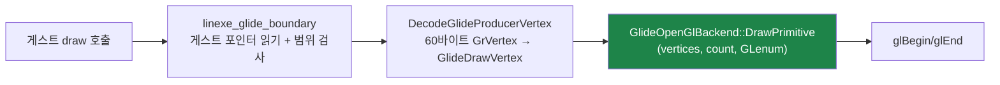

# Task 420 설계 — 남은 Glide draw 진입점 구현

**한 줄:** `grDrawTriangle`과 `grDrawLine`만 실제로 그리고 있고, **나머지 draw 진입점
일곱 개는 요청을 받아 삼키고 있습니다.** pumpit2 로그가 그중 하나(`grDrawPoint`)를
실제로 호출하고 있음을 보여 줍니다.

## 1. 증거 — 사용자 제공 로그(`repiu_log.txt`, pumpit2)

```
FATAL GLIDE_UNIMPLEMENTED_FUNCTION action=continue ordinal=71
  name=_GRDRAWPOINT@4 reason=draw-point-noop
  detail="draw request accepted without rendering"

Win32 Glide implementation issues unimplemented/unsupported/backend/abi/unique/overflow: 2/0/0/0/1/0
Win32 Glide call trace: ordinal=71 name=_GRDRAWPOINT@4 count=2
```

**이 실행에서 미구현으로 호출된 API는 `grDrawPoint` 하나뿐입니다**(2회, unique 1).
호출된 나머지 40개 ordinal은 전부 구현돼 있습니다. 즉 로그가 지목하는 즉시 필요한
항목은 하나이고, 나머지는 **같은 계열의 잠재적 공백**입니다.

## 2. 현재 상태 — draw 계열 아홉 개 중 둘만 그립니다

| 진입점 | 서명 | 현재 |
|---|---|---|
| `_GRDRAWTRIANGLE@12` | 3 vertex ptr | **구현됨** |
| `_GRDRAWLINE@8` | 2 vertex ptr | **구현됨** |
| `_GRDRAWPOINT@4` | 1 vertex ptr | `draw-point-noop` |
| `_GRAADRAWPOINT@4` | 1 vertex ptr | catalog-default(무동작) |
| `_GRAADRAWLINE@8` | 2 vertex ptr | catalog-default(무동작) |
| `_GRAADRAWTRIANGLE@24` | 3 vertex ptr + 3 AA flag | catalog-default(무동작) |
| `_GRDRAWPOLYGON@12` · `_GRDRAWPLANARPOLYGON@12` | nverts, ilist, vlist | `draw-polygon-noop` |
| `_GRDRAWPOLYGONVERTEXLIST@8` | nverts, vlist | catalog-default(무동작) |
| `_GRDRAWPLANARPOLYGONVERTEXLIST@8` | nverts, vlist | `draw-polygon-vertex-list-noop` |

**무동작은 화면에서 조용히 사라지는 실패입니다.** Task 229가 남긴 교훈("크래시 없음
≠ 정확 동작")이 그대로 적용되는 형태이므로, 계열 전체를 닫는 것이 맞습니다.

## 3. 설계 — 기존 기계를 그대로 씁니다

새 렌더링 경로를 만들지 않습니다. 세 가지가 이미 있습니다.



`DrawPrimitive`는 이미 **정점 개수와 GL primitive에 대해 일반적**입니다
(`DrawLine` = 2·`GL_LINES`, `DrawTriangle` = 3·`GL_TRIANGLES`). 따라서 추가할 것은
backend 두 함수와 boundary의 case들뿐입니다.

| 추가 | 매핑 |
|---|---|
| `DrawPoint(v)` | 1 정점 · `GL_POINTS` |
| `DrawPolygon(v[], n)` | n 정점 · `GL_TRIANGLE_FAN` |

**AA 변종은 기하가 같습니다.** `grAADrawPoint`/`grAADrawLine`/`grAADrawTriangle`은
같은 정점을 안티에일리어싱만 켜서 그리므로, **AA 플래그를 무시하고 같은 기하를
그립니다.** 이것은 무동작보다 명백히 정확하며, "정확성 우선" 원칙에 따라 근사임을
로그가 아니라 문서와 주석에 남깁니다.

**폴리곤은 convex 가정으로 `GL_TRIANGLE_FAN`입니다.** Glide 사양의
`grDrawPolygon`은 볼록 다각형을 요구하므로 fan이 정확합니다. `ilist`가 있는 형태는
인덱스를 거쳐 정점을 모으고, vertex-list 형태는 연속 배열을 60바이트 stride로 읽습니다.

## 4. 안전 규칙

* **게스트 메모리는 반드시 `IsGuestRangeReadable`로 검사**한 뒤 읽습니다. 기존
  `draw-line-unreadable-vertex`와 같은 사유 이름 규칙을 씁니다.
* **정점 수 상한 64.** 초과하면 그리지 않고 `draw-polygon-vertex-count`로 declines에
  기록합니다. 게스트가 준 개수로 스택 배열을 잡지 않기 위한 것이며, 상한을 넘는
  호출이 관측되면 그때 올립니다.
* **`nverts < 3`인 폴리곤은 그리지 않습니다**(fan이 성립하지 않음). declines에
  기록합니다.
* **ABI는 건드리지 않습니다.** 각 case의 `Esp` 증가량은 지금 값 그대로이며,
  서명표(`glide_hle.cpp`)의 `argument_byte_count`와 일치합니다.

## 5. 검증

| 항목 | 방법 |
|---|---|
| 컴파일·ABI | Release 빌드, `glide_render_probe` 통과 |
| 회귀 | pumpit3 60초 A/B — 프레임이 Task 419 수준(약 3,063)을 유지 |
| 기능 | pumpit2 실행에서 `GLIDE_UNIMPLEMENTED_FUNCTION`의 `_GRDRAWPOINT@4`가 **사라짐**, `unimplemented` 카운터가 2 → 0 |
| 정확성 | Glide 실패·decline 0, `frame-errors=0` |

**프레임이 늘 것으로 기대하지 않습니다.** 이것은 성능 과제가 아니라 **누락된 그리기
복원**이며, 호출 수가 2회이므로 성능 영향은 측정 잡음 이하입니다. 판정은 "그려지는가"
이지 "빨라지는가"가 아닙니다.

---

# Task 420 Design — the remaining Glide draw entry points

**One line:** only `grDrawTriangle` and `grDrawLine` actually draw; **the other seven draw
entry points accept the request and swallow it**, and the pumpit2 log shows one of them
(`grDrawPoint`) really being called.

## 1. Evidence — the user's `repiu_log.txt` (pumpit2)

The run reports `GLIDE_UNIMPLEMENTED_FUNCTION ordinal=71 name=_GRDRAWPOINT@4
reason=draw-point-noop`, an implementation-issue line of `2/0/0/0/1/0`, and a call trace of
`_GRDRAWPOINT@4 count=2`. **`grDrawPoint` is the only unimplemented API this run calls**; the
other forty ordinals it touches are implemented. So the log names exactly one immediate gap,
and the rest of the family is latent.

## 2. Current state — two of nine draw entry points draw

`grDrawTriangle` and `grDrawLine` are implemented. `grDrawPoint`, the polygon pair, and the
planar vertex list report a noop reason, while `grAADrawPoint`, `grAADrawLine`,
`grAADrawTriangle` and `grDrawPolygonVertexList` fall through to the catalog default and do
nothing at all. **A silent noop is a failure that disappears from the screen** — the shape
Task 229 warned about with "no crash is not correct behaviour" — so the family should be
closed together.

## 3. Design — reuse the machinery that exists

No new rendering path. `DrawPrimitive` is already generic over vertex count and GL primitive
(`DrawLine` is 2 with `GL_LINES`, `DrawTriangle` is 3 with `GL_TRIANGLES`), the boundary
already reads and range-checks guest vertex pointers, and `DecodeGlideProducerVertex` already
converts the 60-byte producer `GrVertex`. What is added is two backend calls — `DrawPoint` as
one vertex with `GL_POINTS` and `DrawPolygon` as n vertices with `GL_TRIANGLE_FAN` — plus the
boundary cases.

**The AA variants have identical geometry**: they draw the same vertices with antialiasing, so
they render the same geometry with the AA flags ignored, which is plainly closer than drawing
nothing; the approximation is recorded here and in the code rather than as a runtime issue.
**Polygons use a triangle fan** because Glide's `grDrawPolygon` requires a convex polygon, with
the indexed form gathering through `ilist` and the vertex-list form reading a contiguous array
at the 60-byte stride.

## 4. Safety rules

Guest memory is read only after `IsGuestRangeReadable`, following the existing
`draw-line-unreadable-vertex` naming. A **64-vertex cap** bounds the stack array, declining as
`draw-polygon-vertex-count` beyond it — to be raised if a larger call is ever observed — and a
polygon with fewer than three vertices is declined rather than drawn. **The ABI is untouched**:
every case keeps its current `Esp` adjustment, matching `argument_byte_count` in the signature
table.

## 5. Verification

A Release build with the `glide_render_probe` passing; a pumpit3 60-second A/B holding the
Task 419 frame level (about 3,063); a pumpit2 run where `_GRDRAWPOINT@4` no longer raises
`GLIDE_UNIMPLEMENTED_FUNCTION` and the unimplemented counter falls from 2 to 0; and zero Glide
failures, declines, or frame errors. **No frame gain is expected** — this restores missing
drawing rather than removing cost, and at two calls per run the performance effect is below
measurement noise. The question is whether it draws, not whether it is faster.
